# 语言基础与 STL

## C++ 竞赛模板骨架

```c++
#include<bits/stdc++.h>
#define int long long
#define endl '\n'
using namespace std;
const int N = -1;
const int MOD = 1;
#define MOD debug;

void solve() {
}

signed main() {
    ios::sync_with_stdio(false);
    cin.tie(nullptr);
    cout.tie(nullptr);
    int _ = 1;
    //	cin>>_;
    //	cout<<fixed<<setprecision(1);
    while (_--) {
        solve();
    }
    return 0;
}
```

注意开数组时，小数组放前面，大数组放后面，不然容易T

---

## 比赛直接查询使用

### 头文件

> **解决问题**：快速查找常用头文件及其用途
> **时间复杂度**：不涉及运行时复杂度
> **适用场景**：忘记某个 STL 容器对应哪个头文件时查阅

```c++
#include<bits/stdc++.h>//万能头，但是耗时高
#include<iostream>//适用：cin>> cout<<
#include<cstdio>//正常编译所需要的头文件，适用：scanf printf
#include<cmath>//适用：abs(),sin(),cos();
#include<algorithm>//适用：min(),max()，sort()；
#include<vector>//stl的动态数组
#include<deque>//stl的双端队列
#include<list>//stl的链表
#include<queue>//stl的队列
#include<stack>//stl的栈
#include<set>//stl的集合
#include<map>//stl二元集合,可以当成数组来使用
#include<iterator>//迭代器的头文件
```

---

## 交互题使用函数

> **解决问题**：在交互题中及时刷新输出缓冲区，使询问真正发送给交互器
> **时间复杂度**：刷新操作与当前缓冲区待输出长度有关
> **适用场景**：所有需要“输出询问—读入回答”循环进行的交互题

```c++
//注意,做交互题的时候不能关闭同步流
cout<<endl;//endl会刷新缓存区,使得缓存区里面的东西都输出出来
cout.flush();//手动刷新缓存区
fflush(stdout);//手动刷新缓存区
```

---

## I/O 技巧

### 切断同步流

> **解决问题**：关闭 C、C++ 标准流同步并解除 `cin`、`cout` 绑定，加快输入输出
> **时间复杂度**：设置操作 $O(1)$
> **适用场景**：只使用 `cin/cout` 的大输入输出普通题；交互题不要照搬

```c++
ios::sync_with_stdio(false);
cin.tie(0);
cout.tie(0);
```

### cout 小数点输出

> **解决问题**：控制浮点数输出精度
> **时间复杂度**：O(1)
> **适用场景**：需要输出固定小数位数时

```c++
cout<<fixed<<setprecision(1);
```

### 整行读入

> **解决问题**：读入包含空格的整行字符串
> **时间复杂度**：O(n)，n 为行长度
> **适用场景**：需要读入带空格的字符串时

```c++
//注意，scanf和cin不会读入\n，但是getline是读入到\n截止，所以在前面有scanf或者cin的时候，我们需要添加一个getchar()来把回车读掉
getline(cin,name);//使用当前读入整行
```

### scanf 读入技巧

> **解决问题**：使用 scanf 进行更灵活的数据读入
> **时间复杂度**：O(1) 到 O(n)
> **适用场景**：需要精确控制读入格式时，如限制长度、跳过某些输入、自定义字符集读入

| 格式控制符     | 说明                                                         |
| -------------- | ------------------------------------------------------------ |
| %c             | 读取一个单一的字符                                           |
| %hd、%d、%ld   | 读取一个十进制整数，并分别赋值给 short、int、long 类型       |
| %ho、%o、%lo   | 读取一个八进制整数（可带前缀也可不带），并分别赋值给 short、int、long 类型 |
| %hx、%x、%lx   | 读取一个十六进制整数（可带前缀也可不带），并分别赋值给 short、int、long 类型 |
| %hu、%u、%lu   | 读取一个无符号整数，并分别赋值给 unsigned short、unsigned int、unsigned long 类型 |
| %f、%lf        | 读取一个十进制形式的小数，并分别赋值给 float、double 类型    |
| %e、%le        | 读取一个指数形式的小数，并分别赋值给 float、double 类型      |
| %g、%lg        | 既可以读取一个十进制形式的小数，也可以读取一个指数形式的小数，并分别赋值给 float、double 类型 |
| %s             | 读取一个字符串（以空白符为结束）                             |
| %[ 字符-字符 ] | 读取自定义的字符,满足条件就一直读入,不满足条件就停止         |

```c++
//在%号后面加上数字,代表只能读取这么长长度
scanf("%5d",&a);//代表最多读入五位整数
//在%号后面加上*,代表读入后进行舍弃
scanf("%*d %d",&a);//第一个带有*号的,会讲读入的东西舍弃,本质上第二个%d读入数据传递给a
//%[]内加上^代表取反,not条件；buf 必须是足够大的 char 数组
scanf("%[^\n]", buf);//表示一直读入,直到遇到换行符为止
```

### `__int128` 开方

> **解决问题**：`__int128` 类型的数据开方问题，`__int128` 由于范围过大可能因为溢出导致无法正确开方
> **时间复杂度**：O(√x)
> **适用场景**：需要使用 `__int128` 并且进行开方操作时

```c++
__int128 sqrt128(__int128 x) { // 返回 floor(sqrt(x))，要求 x >= 0
    __int128 y = sqrtl((long double)x);
    while (y + 1 <= x / (y + 1)) ++y; // 不能直接比较 (y+1)^2，可能溢出
    while (y && y > x / y) --y;
    return y;
}
```

### long double

> **解决问题**：注意有些题及其傻逼，注意判断 long double 的范围
> **时间复杂度**：基本运算 $O(1)$，常数通常大于 `double`
> **适用场景**：需要使用比 double 更高精度的浮点数时

```c++
long double a;
scanf("%Lf", &a);
printf("%Lf", &a);//注意这里是大写L
cin >> a;
cout << a;
```

### 在函数内定义函数

> **解决问题**：用 Lambda 在局部定义普通函数或递归函数，减少全局辅助函数
> **时间复杂度**：定义 $O(1)$，调用复杂度取决于函数内容
> **适用场景**：局部 DFS、分治、判定函数及只在当前函数使用的小逻辑

```c++
function</*返回值类型*/(/*参数类型*/, /*参数类型*/.....)> /*函数名字*/ = [&](/*参数类型*/ /*参数名*/,/*参数类型*/ /*参数名*/.....) {

    };//定义可递归函数
auto /*函数名字*/ = [&](/*参数类型*/ /*参数名*/,/*参数类型*/ /*参数名*/.....) {

    };//定义不可递归函数
```

### 取整

> **解决问题**：对浮点数执行向上取整、向下取整或四舍五入
> **时间复杂度**：$O(1)$
> **适用场景**：浮点计算后需要转换为相邻整数的题目

```c++
ceil();//表示为向上取整，英语意思为天花板
floor();//表示为向下取整，英语意思为地板
round();//表示为四舍五入，
```

### 顺序赋值 (iota)

> **解决问题**：给连续区间依次赋值为 `x,x+1,x+2...`
> **时间复杂度**：$O(n)$
> **适用场景**：初始化下标数组、排列、并查集父亲或排序索引

```c++
iota(/*数组起始地址*/,/*数组终止地址*/,/*第一个赋值*/);//这个函数为第一个数赋值，之后每一个赋值的数字都会加一
```

### 全排列

> **解决问题**：按字典序生成当前排列的下一个或上一个排列
> **时间复杂度**：单次 $O(n)$，枚举全部排列为 $O(n\cdot n!)$
> **适用场景**：数据规模很小时暴力枚举排列，或求某排列的字典序相邻状态

```c++
next_permutation(/*起始地址*/，/*终止地址的后一位*/);//是用来将数组转变为下一个全排列方案的函数
prev_permutation(/*起始地址，终止地址的后一位*/);//是用来将数组转变为上一个全排列的方案的函数
int main() {
    int a[10];
    for(int i = 1; i <= 5; ++i) {
        a[i] = i;
    }
    do {
        for(int i = 1; i <= 5; ++i) {
            cout << a[i] << " ";
        }
        cout << endl;
    } while(next_permutation(a + 1, a + 6));//想要用该函数生成全排列，那么数组原始必须处于从小到大的有序转态。
    return 0;
}
```

### 内置数据存储极值

> **解决问题**：查询某个内置数值类型能够表示的最大值和最小值
> **时间复杂度**：$O(1)$
> **适用场景**：初始化无穷大、无穷小或检查类型值域

```c++
numeric_limits</*内置数据类型*/>::max();//返回最大值
numeric_limits</*内置数据类型*/>::min();//返回最小值
```

---

## STL 工具附带函数解析

### 元素迭代器

```c++
 /*容器定义类型*/::iterator it;
```

### tuple

```c++
#include <tuple>//需要加上的头文件
//初始化
tuple<类型列表> tup; //每个元素执行值初始化
tuple<类型列表> tup(val1,val2,...); //直接提供所有元素的值进行初始化
auto tup = make_tuple(val1,val2,...); //自动推导类型创建元组，会去除引用与const（数组退化为指针）
auto tup = forward_as_tuple(val1,val2,...); //创建引用元组，左值推导为左值引用，右值推导为右值引用，常用于完美转发
auto tup = tie(var1,var2,...); //创建左值引用元组，将已有变量绑定到元组中，可通过元组修改原变量
tuple<...> tup(another_tuple); //从另一个元组拷贝或移动构造
auto tup = tuple_cat(tup1,tup2,...); //将多个元组拼接成一个新元组

//访问元素，这里以tup为例子
get<索引>(tup); //返回第索引个元素的引用（索引从0开始，必须是编译期常量），可用于读写
get<类型>(tup); //按类型获取元素(C++14起)，要求该类型在元组中仅出现一次，否则编译错误
//结构化绑定解包(C++17)
auto [v1,v2,...] = tup; //将元组元素复制到独立变量
auto& [r1,r2,...] = tup; //以引用方式绑定到元组元素，修改引用会影响原元组

//修改操作，这里以tup为例子
get<索引>(tup) = 新值; //通过索引赋值修改元素
tup.swap(tup2); //交换两个同类型元组的内容
swap(tup1,tup2); //非成员函数版本交换
tup = another_tuple; //拷贝或移动赋值

//大小与类型查询(编译期)
tuple_size<decltype(tup)>::value; //获取元组中元素个数
tuple_element<索引, decltype(tup)>::type; //获取元组中第索引个元素的类型

//比较操作
//支持 ==, !=, <, <=, >, >= ，要求两个元组元素个数相同且所有元素类型支持对应比较
//比较按字典序进行，由第一个不相等的元素决定结果

//辅助函数与技巧，这里以tup为例子
tie(var1,ignore,var2) = tup; //解包时用ignore忽略不想接收的元素（ignore定义于<tuple>）
apply(可调用对象, tup); //将元组元素展开作为参数调用函数(C++17)
make_from_tuple<类名>(tup); //将元组元素展开传给类的构造函数并返回对象(C++17)

//注意事项
//- 元组不是容器，没有迭代器，无法直接遍历。需要遍历时可配合integer_sequence等编译期技巧
//- get的索引必须为编译期常量（字面量或constexpr变量），越界会导致编译错误
//- make_tuple会丢失顶层引用和const，且数组会退化为指针；若需保留引用或数组用tie或forward_as_tuple
//- tie创建的元组元素为左值引用，必须绑定到已存在的变量，且不会延长临时对象生命周期
//- forward_as_tuple常用于需要完美转发参数包的场景，避免不必要拷贝
//- 按类型获取元素(get<类型>)时，若该类型在元组中出现多次，会引发编译错误
//- tuple_cat拼接不同类型元组时，返回类型为所有元素类型的合并，拼接时可混合不同大小和类型的元组
```

### array

```c++
#include<array>//使用array的时候需要加上的头文件
array</*类型*/,/*数组长度*/> 名字
```

### vector

```c++
#include <vector>//在使用vector时应当加上这一个头文件
//初始化
vector</*类型*/> 名字[/*个数*/](/*每一个vector内有多少个元素*/,/*每一个元素的值*/);
vector</*类型*/> 名字(/*另一个vector的起点*/,/*另一个vector的终点*/);

//函数的适用，这里以a为例子
a.assign();//将a重新初始化，方式类似上述
a.back();//返回a的末尾元素
a.front();//返回a的第一个元素
a.clear();//清空a的元素
a.empty();//返回a是否为空
a.pop_back();//弹出队尾元素，没有元素是执行这一步会报错
a.push_back();//将元素加入队尾
a.emplace_back();//将元素加入队尾，这个可以自动识别变量类型
a.erase(/*起始地址*/,/*终止地址*/);//删除从起始地址到终止地址前一个元素
a.insert(/*插入地址*/,/*插入个数*/,/*插入元素*/)；//注意，原本在插入位置的元素，会往右边移动。
a.insert(/*插入地址*/,/*另一个vector的起始地址*/，/*另一个vector的终止地址*/)；//将另一个vector的元素插入，注意，终止地址对应的元素不会插入
a.size();//返回a内有多少元素
a.capacity();//返回a这个动态数组目前空间开的大小
a.resize(/*个数*/);//将a的空间调整至个数个，多则删，少则补
a.resize(/*个数*/，/*用来补的数字*/);//将a的空间调整至个数个，多则删，少则补
a.reserve(/*个数*/)；//将a的空间扩充到个数个
a.swap(b);//交换a，b内部的元素

//迭代器的使用
vector</*类型*/>::iterator 名字;

//常用算法
reverse(a.begin(),a.end());//倒置a内部的元素
```

### string

```c++
#include <string>//需要加上的头文件
//初始化
string zfc(/*字符串*/);
string zfc(/*字符串*/，/*开始下标*/，/*读入个数*/);//从字符串给予的下标开始，读入个数个
string zfc(/*字符串*/，/*读入个数*/);//截取字符串前个数个
string zfc(/*个数*/，/*单个字符*/);//赋予初值为个数个该字符
string zfc(/*字符串*/，/*开始下标*/);//注意，这里和上面的开始下标都是从位置0开始读入的

//函数的适用，这里以zfc为例子
zfc.size();//返回内部字符个数
zfc.length();//返回内部字符个数
zfc.data();//将字符串转换成printf中%s可以打印的字符串类型
zfc.c_str();//将字符串转换成printf中%s可以打印的字符串类型
zfc.max_size();//返回string对象最多能够包含的字符的个数
zfc.capacity();//返回重新分配内存前，string对象能包含的最大字符数
zfc.push_back();//在结尾处插入一个字符
zfc.insert(/*插入地址*/,/*字符串*/);// 在插入地址后插入字符串,原本处于该位置的字符串右移
zfc.append(/*字符串*/);//在结尾处插入一个字符串
/*符号运算符+，+=，=在string的操作中皆可使用*/
zfc.erase(/*迭代器*/);//删除zfc中迭代器指向的字符
zfc.erase(/*起始迭代器*/，/*终止迭代器*/);//删除[起始迭代器，终止迭代器)上的所有字符
zfc.erase(/*起始索引*/,/*长度*/);//删除字符串包括起始索引往后长度个字符；
zfc.clear()//删除字符串中所有字符
zfc.replace(/*起始索引*/,/*长度*/，/*字符或者字符串*/);//将包括起始索引往后长度个字符替换
zfc.replace(/*起始迭代器*/,/*终止迭代器*/,/*字符串*/);//将[起始迭代器，终止迭代器)内部的字符替换
zfc.find(/*字符串*/);//查找zfc的字串，如果找到，则返回找到的首索引，如果没找到，返回-1
zfc.find(/*字符串*/，/*数字*/);//从数字索引对应的位置开始查找zfc的字串，其余同上
zfc.rfind(/*字符串*/)；//这个同上，不过是从右侧开始进行查找
zfc.substr(/*起始索引*/,/*分割长度*/);//返回字符串的分割结果，注意这里是0(n)的时间复杂度
zfc.substr(/*起始索引*/);//代表从哪个位置开始分割
分割字符串还可以使用的函数：strtok();
头文件:#include<string.h>
    strtok(/*被分割的字符串*/,/*用来分割的字符的集合*/);//返回分割的结果
如果需要将整个字符串进行分割，那么则通常需要使用到while循环。
    在多次分割时,则需要变成如下的形式：strtok(NULL,/*用来分割的字符的集合*/);//将会一直分割字符串，如果已经分割完了，则返回NULL;

//string的大小写转换以及转换成数字
大小写转换方法一：利用tolower()和toupper();
	tolower(/*字符*/);//tolower是将内部字符转换成小写的形式，但是因为一次只能够转换一个字符，所以需要适用循环来进行复制
	toupper(/*字符*/);//同理

大小写转换方法二：利用transform函数
    transform是一个将操作用于给定范围的所有元素的函数。
    transform(/*起始地址*/,/*终止地址*/,/*存放结果的迭代器*/，::tolower);//将指定范围的字符串转换成小写
    transform(/*起始地址*/,/*终止地址*/,/*存放结果的迭代器*/，::toupper);//将指定范围的字符串转换成大写

字符串转换数字方法：利用atoi()和stoi()来进行转换;
	头文件：include<cstdlib>
	atoi(/*字符串*/)；//找到第一个非空格字符进行转换为int类型，直到遇到非数字时停止，返回读入的数字
	stoi(/*字符串*/);//转化同上，唯一区别为stoi会对数字进行检查，如果超过int范围就报错，atoi不会检查，超过上界输出上界，超过下界，输出下界。
	stod(/*字符串*/);////找到第一个非空格字符进行转换为double类型，直到遇到非数字时停止，返回读入的数字
将数字转化为字符串方法：利用to_string()函数来进行达成；
   	头文件：#include <string>
	to_string(/*数字*/)；//将数字转换为字符串。里面各种类型都可以传
```

### map

```c++
#include <map>//需要加上的头文件
//初始化
map</*key键值类型*/,/*value键值类型*/> mp;
map</*key键值类型*/,/*value键值类型*/> mp={{/*key键值类型*/,/*value键值类型*/};//赋值构造
map</*key键值类型*/,/*value键值类型*/> mp(mp1);
map</*key键值类型*/,/*value键值类型*/> mp(mp1.begin(),mp1.end());//赋值构造
map</*key键值类型*/,/*value键值类型*/,greater</*key键值类型*/>> mp;//指定数据按key降序存储
map</*key键值类型*/,/*value键值类型*/,less</*key键值类型*/>> mp;//指定数据按ke升序存储
//map中常见函数
插入数据:
mp.insert(pair</*key键值类型*/,/*value键值类型*/>(/*key*/,/*value*/));
mp.insert(make_pair(/*key*/,/*value*/));
mp[/*key*/]=/*value*/；

mp.begin();//返回排序后第一个键值对的迭代器
mp.end();//返回排序后最后一个键值对下一个的迭代器
map</*key键值类型*/,/*value键值类型*/>::iterator it;//创建迭代器
mp.size();//返回内部元素个数
mp.empty();//返回是否为空
mp.find(/*key*/);//在mp中查找key这一个键值的元素是否存在，如果存在，则返回迭代器，如果没有，返回end()这个迭代器
mp.count(/*key*/);//查找这个键的出现次数，但是mp中键是唯一的，所以值要不是0，要不就是1
mp.erase(/*key*/);//删除mp中key对应的键值对
mp.erase(/*迭代器*/);//删除mp中这一个迭代器所指向的键值对
mp.erase(/*起始迭代器*/，/*终止迭代器*/);//删除范围内[)区间的键值对，配合begin，end适用可以做到删除所有元素
mp.lower_bound(key);//按照小到大从左至右排序的数组中，找到第一个大于等于key的位置，并且返回地址
mp.upper_bound(key);//按照小到大从左至右排序的数组中，找到第一个大于key的位置，并且返回地址
```

### unordered_map

> **解决问题**：基于哈希表实现的键值对容器，无序但均摊 O(1) 访问
> **时间复杂度**：均摊 O(1)
> **适用场景**：需要快速查找键值对且不需要有序遍历时

```c++
其使用方法与map类似，只不过unordered_map底层是采用哈希表实现的，而map的底层是采用红黑树来实现的
```

### queue

```c++
#include<queue>//需要包含的头文件
//初始化
queue</*变量类型*/> dl;
queue</*变量类型*/,/*底层实现容器*/> dl;//这里的底层实现容器可以为链表，也可以为双端队列;既list</*变量类型*/>,deque</*变量类型*/>

//queue中常见函数
dl.push(/*元素*/);//将元素加入队尾
dl.pop(/*元素*/)；//删除队头元素
dl.front();//返回队列队头元素
dl.empty();//返回队列是否为空
dl.size();//返回内部元素个数
dl.back();//返回队尾元素
```

### priority_queue

```c++
#include<queue>//需要加上的头文件
//初始化
priority_queue</*变量类型*/> dl;//实现原理为内部排序，然后取最右侧的元素,默认适用<来进行排序
priority_queue</*变量类型*/,/*底层实现容器*/,/*调用的排序符号*/> dl;
/*如果第三个参数传入的是less<>,则变量类型会按照 < 来进行排序，如果传入的是greater<>,则会按照 > 来进行排序，对于自定义的结构体来说，使用的什么，就需要适用operator来重载相对应的符号*/
/*如果需要对已经存在的元素设置判断方法，则需要新开一个结构体，并且在这一个结构体内重载()号即可：
*/
```

```c++
struct type {//对已经存在元素的判断条件设置方法
    bool operator()(const pair<int,int> a,const pair<int,int> b) {
        return a.second > b.second; // 示例：second 更小的 pair 优先
    }
};
priority_queue<pair<int,int >,vector<pair<int,int> >,type> dl;
struct type {//对自定义元素的条件设置方法
	friend bool operator<(const type& x,const type& y) {//需要定义友元
		return ;
	}
};//注意，priority_queue是先进行排序，然后将排序后最右边的元素进行输出
priority_queue<type> dl;
```

```c++
//priority_queue常用函数
dl.push(/*元素*/);//将元素加入到优先队列中去
dl.pop();//弹出队顶端元素
dl.top();//返回队顶端元素
dl.size();//返回队列中元素的个数
dl.empty()；//返回队列是否非空
dl.emplace();//原地构造一个元素并且插入序列
```

### deque

```c++
#include<deque>//需要加上这一个函数头
//初始化
deque</*元素类型*/> dl;
deque</*元素类型*/> dl(n,value);//创建含有n个权值为value的双端队列
deque</*元素类型*/> dl={x1,x2,x3.....};//创建包含这些元素的双端队列

//deque中常见函数
dl.begin();//返回首元素的迭代器
dl.end();//返回队列尾元素下一个位置的迭代器
dl.size();//返回内部存放的元素的个数
dl.empty();//返回deque内部是否为空
dl.resize();//改变deque的大小为n，如果有则保留，没有就补零
dl.at(/*索引*/);//访问索引位置所对应的元素
dl[/*索引*/];//同样是可以访问索引位置对应的元素

dl.front();//返回队列队头元素
dl.back();//返回队列尾部元素
dl.push_front(/*元素*/);//将元素加入队列队首
dl.push_back(/*元素*/);//将元素加入队列队尾
dl.pop_front(/*元素*/);//删除队首元素
dl.pop_back(/*元素*/);//删除队尾元素

dl.assign()；//重新初始化，初始化的操作与一开始初始化的方式相同

dl.insert(/*迭代器*/,/*元素*/);//将元素插入到迭代器所指向的位置，并且返回新插入元素的迭代器
dl.insert(/*迭代器*/，/*个数*/,/*权值*/);//在迭代器指向位置插入若干个元素，并且返回第一个元素的迭代器
dl.insert(/*迭代器*/,/*起始迭代器*/,/*终止迭代器*/);//将[起始，终止)之内的元素插入到迭代器指向位置之前

dl.erase(/*迭代器*/);//删除迭代器指向元素
dl.erase(/*起始迭代器*/,/*终止迭代器*/);//删除[起始迭代器，终止迭代器)之间的元素

dl.clear();//清空dl内部的所有元素
dl.swap(/*另一个deque*/);//交换两个迭代器之间的元素，这样子是指针交换，时间复杂度为O1
dl.emplace(/*迭代器*/,/*元素*/);//在迭代器的位置插入元素，c11特有
dl.emplace_back(/*元素*/);//创建一个元素并且插入尾部,该函数直接在容器尾部构造元素，省去了复制移动元素的过程
dl.emplace_front(/*元素*/);//创建一个元素并且插入头部,该函数直接在容器头部构造元素，省去了复制移动元素的过程
```

### stack

```c++
#include<stack>//需要加入的头文件
//初始化
stack</*元素类型*/> zhan;
stack</*元素类型*/> zhan[/*个数*/];//创建个数个栈

//stack中常见函数
stack.empty();//判断栈是否为空
stack.pop();//删除栈顶元素
stack.size();//返回栈内元素个数
stack.top();//返回堆栈顶部的元素
stack.push(/*元素*/);//将元素压入栈顶
```

### set

```c++
#include<set>//需要加入的头文件
//初始化
set</*元素类型*/> st;//默认升序排列
set</*元素类型*/,/*排序方式*/> st;//这里的排序方式可以填入仿函数，greater<>,less<>什么的

//set常用函数解析
st.insert(/*元素*/);	//插入元素
st.erase(/*元素*/);	//删除q中的x元素,返回0或1,0表示set中不存在x
st.clear();//清空set表
st.empty();//判断set表是否为空，若是返回1，否则返回0
st.size();//返回set表中元素的个数
st.find(/*元素*/);//在set表中查找该元素，返回该元素的迭代器，若元素不存在，则返回指向元素尾部的迭代器即 q.end()
st.lower_bound(/*元素*/); //返回一个迭代器，指向第一个键值大于等于该元素的元素,若元素不存在，则返回指向元素尾部的迭代器即 q.end()
st.upper_bound(/*元素*/); //返回一个迭代器，指向第一个键值大于该元素的元素,若元素不存在，则返回指向元素尾部的迭代器即 q.end()

st.rend();		  //返回第一个元素的的前一个元素迭代器
st.begin();		  //返回指向q中第一个元素的迭代器

q.end();		 //返回指向q最后一个元素下一个位置的迭代器
q.rbegin();		 //返回最后一个元素
```

### bitset

```c++
#include<bitset>//需要加入的头文件
//初始化
bitset</*数字*/> bt;
bitset</*数字*/> bt(/*字符串*/);//这个字符串需要由1和0组成
bitset</*数字*/> bt(/*数字*/);//将数字转换陈二进制形式，存储到bitset中，多的位置补0，不够的舍弃大位置上的
bitset</*数字*/> bt[/*个数*/];//创建多个bitset表。类似于数组

//bitset常用工具
位运算的工具都可以使用
&//与符号，同时为1才是1，其余情况都是0，按照每一位数进行
|//或符号，有1就是1，两个都没1才是0，按照每一位数进行
~//非符号，这是单目运算符，1变成0，0变成1
^//异或符号，相同为0，不同为1
>>//所有数字整体往右边移动一格，相当于除二
<<//所有数字整体往左边移动一格，相当于乘二

bt.size();//返回位数
bt.count();//返回1的个数
bt.any();//返回是否有1；
bt.none();//返回是不是全是0
bt.set()；//将每一个位置上的数字改成1
bt.set(/*位置*/)；//将位置对应的数变成1，注意这里的位是从0开始
bt.set(/*位置*/,/*数字*/)；//将位置对应的数字变成传进来的数字,1或者0
bt.reset();//全部变成0
bt.reset(/*位置*/);//将位置对应的数字变成0
bt.flip()；//全部取反
bt.flip(/*位置*/)；//将位置上的数字取反
bt.to_ulong();//将bitset转化成unsigned long类型的的数字，超出范围就报错
bt.to_ullong();//将bitset转化成unsigned long long 类型的数字，超出范围就报错
bt.to_string();//将bitset转化为string类型的结果
bt.test(/*索引*/);//返回索引对应位置的数字是1还是0*
bitset可以通过下标来访问对应元素位置的数字
```

### multiset

multiset是一个按照升序排列的，内部元素可以重复的容器。

```c++
#include<set>//需要加入的头文件
//初始化
multiset</*元素类型*/> mtst;
multiset</*元素类型*/> mtst={/*元素*/,/*元素*/,/*元素*/,/*元素*/,/*元素*/};//进行初始化并且往里面加入若干元素

//multiset常用工具
mtst.insert(/*元素*/);//将元素插入到must中插入元素
mtst.find(/*元素的值*/);//查找第一个元素值为这个的，并且返回该元素的迭代器，如果没有则返回末尾迭代器
mtst.erase(/*元素*/);//删除mtst中的这个元素，这里是删除所有值为这个元素的元素
mtst.erase(/*迭代器*/);//删除这一个迭代器所指向的元素
mtst.begin();//返回mtst开头迭代器
mtst.end();//返回mtst末尾迭代器
mtst.equal_range(/*元素*/);//返回值为这个的元素的范围，返回值是一个pair，first是开头迭代器，second是末尾迭代器
```

### list

```c++
#include <list>//需要加入的头文件
//初始化
list</*元素类型*/> lb={/*元素*/,/*元素*/,/*元素*/,/*元素*/,/*元素*/};//进行初始化并且往里面加入若干元素
list</*元素类型*/> lb(la);//拷贝构造
list</*元素类型*/> lb(/*元素个数*/,/*元素值*/);
list</*元素类型*/> lb(/*迭代器起始坐标*/,/*迭代器终止地址的下一个*/);//赋值迭代器这一段区间内的值创建链表
//常用工具
lb.size();//返回有效元素个数
lb.resize(/*元素个数*/,/*元素值*/);//调整容器有效元素大小,如果变小,则阶段,如果变大,则在末尾填上元素值,元素值默认为0
lb.empty();//返回容器是否为空
lb.clear();//清空容器
lb.front();//返回起始元素
lb.back();//返回末尾元素
lb.push_front();//头部插入元素
lb.pop_front();//删除头部元素
lb.push_back();//尾部插入元素
lb.pop_back();//尾部删除元素
lb.insert(/*迭代器*/,/*元素值*/);//在迭代器指向元素的前面添加一个元素,返回指向添加元素的迭代器
lb.insert(/*迭代器*/,/*元素个数*/,/*元素值*/);//跟上面同理,只不过时同时插入多个
lb.insert(/*a迭代器*/,/*起始迭代器*/,/*终止迭代器*/);//在a迭代器前面的元素添加其实迭代器到终止迭代器之间的元素
lb.erase();
```

---

## 编译器使用

### dev 更改满足 c++11/c++14 的使用

dev打开工具(按T之后按C)进入编译器选项，勾选编译时加入以下命令，并且在下方输入

```c++
-std=c++11
-std=c++14
```

---

## pb_ds

> **解决问题**：pb_ds 是 GCC 提供的扩展库，包含哈希表、堆、平衡树等高效实现
> **时间复杂度**：取决于具体容器
> **适用场景**：需要比 STL 更高效或更特殊的容器时（如可并堆、Policy-Based 数据结构）

---

### 万能头：

```c++
#include <bits/extc++.h>
using namespace __gnu_cxx;
using namespace __gnu_pbds;
下面为具体的pb_ds使用头
#include <ext/pb_ds/assoc_container.hpp> //关联容器，必加
#include <ext/pb_ds/hash_policy.hpp>     //哈希表
#include <ext/pb_ds/tree_policy.hpp>     //平衡树
#include <ext/pb_ds/trie_policy.hpp>     //字典树
#include <ext/pb_ds/priority_queue.hpp>  //优先队列
```

### hash_table

> **解决问题**：使用 `gp_hash_table` 维护键值映射，并通过自定义哈希降低被卡哈希风险
> **时间复杂度**：插入、删除、查询均摊 $O(1)$，最坏 $O(n)$
> **适用场景**：不要求键有序且 `unordered_map` 常数或抗卡性不足时

注意，这个可以当map用，但是相比map，key是无序的，不可以顺序遍历，但是平常的插入和修改更快

pb_ds 提供了两种哈希表，`cc_hash_table` 和 `gp_hash_table`。gp_hash_table更常用

```c++
#include <ext/pb_ds/assoc_container.hpp>   // 需要加入的头文件
using namespace __gnu_pbds;
// ==================== 初始化 ====================
gp_hash_table</*key类型*/, /*value类型*/> ht;                     // 默认构造（空表）
gp_hash_table</*key类型*/, /*value类型*/> ht={{k1,v1},{k2,v2}};   // 初始化列表构造（C++11）
gp_hash_table</*key类型*/, /*value类型*/> ht(ht2);                // 拷贝构造
gp_hash_table</*key类型*/, /*value类型*/> ht(begin_it, end_it);   // 用一对迭代器所表示的区间初始化

// ---------- 以 pair 作为 key（必须自定义哈希） ----------
下面是包含pair的自定义hash。赛事敲这个能够防止卡hash
#include <chrono>//随机种子需要加上的头文件
struct custom_hash {
    static uint64_t splitmix64(uint64_t x) {
        x += 0x9e3779b97f4a7c15;
        x = (x ^ (x >> 30)) * 0xbf58476d1ce4e5b9;
        x = (x ^ (x >> 27)) * 0x94d049bb133111eb;
        return x ^ (x >> 31);
    }
    size_t operator()(uint64_t x) const {
        static const uint64_t RAND = chrono::steady_clock::now().time_since_epoch().count();
        return splitmix64(x + RAND);
    }
    size_t operator()(long long x) const { return (*this)((uint64_t)x); }
    size_t operator()(unsigned long long x) const { return (*this)((uint64_t)x); }
    size_t operator()(pair<long long, long long> p) const {
        uint64_t h1 = (*this)((uint64_t)p.first);
        uint64_t h2 = (*this)((uint64_t)p.second);
        return h1 ^ (h2 << 1);
    }
    size_t operator()(const string &s) const {
        uint64_t h = 0;
        for (char c : s) h = (h * 131) + c;
        return (*this)(h);
    }
};
gp_hash_table</*key类型*/, /*value类型*/, custom_hash> safe_ht;//custom_hash自定义哈希函数

// ==================== 常用工具 ====================
ht.insert({key, value});          // o(1)插入键值对，如果已经存在值了会插入失败，返回pair<iterator, bool>，bool表示是否成功
ht[key] = value;                  // o(1)修改,若 key 存在则修改 value，否则插入并返回 value 的引用
ht.find(key);                     // o(1)查找 key，返回迭代器；未找到返回 ht.end()
ht.erase(key);                    // O(1)删除 key 对应的键值对，返回删除个数（0 或 1）
ht.erase(iterator);               // O(1)删除迭代器所指向的键值对
ht.size();                        // O(1)返回当前元素个数
ht.empty();                       // O(1)判空，空则返回 true
ht.clear();                       // O(n)清空容器（删除所有元素）
ht.begin();                       // O(1)返回指向第一个桶中第一个元素的迭代器（顺序任意）
ht.end();                         // O(1)返回尾后迭代器

// 迭代器声明
gp_hash_table<int, int>::iterator it;
gp_hash_table<pair<int, int>, int, custom_hash>::iterator pit;

// 对于 pair 键的访问操作完全一致，例如：
safe_ht[{1, 2}] = 100;
if (safe_ht.find({1, 2}) != safe_ht.end()) { /* 存在 */ }
safe_ht.erase({1, 2});
```

### 平衡树 

> **解决问题**：动态维护有序集合，支持插入删除、排名和第 $k$ 小查询
> **时间复杂度**：单次操作 $O(\log n)$
> **适用场景**：需要 `order_of_key`、`find_by_order` 或集合分裂合并时

```c++
#include <ext/pb_ds/assoc_container.hpp>  // 因为 tree 定义在这里 所以需要包含这个头文件
#include <ext/pb_ds/tree_policy.hpp>
using namespace __gnu_pbds;

tree</*元素类型*/,/*另一个元素，没有则写null_type */,/*排序方式，greater<元素类型>或者less<元素类型>*/, rb_tree_tag,tree_order_statistics_node_update> t;
//用这个pair<value, 递增id>当作key，可以模拟multiset

//如果传入另一个元素，则类似于map，如果不传入另一个元素，则类似于set

// ==================== 插入 ====================
t.insert(x);                          // O(log n)  插入元素 x (set 模式)
mp.insert({key, value});              // O(log n)  插入键值对 (map 模式)，已存在则失败
mp[key] = value;                      // O(log n)  若 key 存在修改 value，否则插入新元素

// ==================== 删除 ====================
t.erase(x);                           // O(log n)  删除所有key为x的元素
t.erase(iterator);                    // O(log n)  删除迭代器指向的元素 (推荐用于精确删除)
t.erase(first, last);                 // O(k log n) 删除 [first, last) 区间内元素
t.clear();                            // O(n)      清空所有元素

// ==================== 查找 ====================
auto it = t.find(x);                  // O(log n)  查找 x，成功返回迭代器，否则返回 end()
t.lower_bound(x);                     // O(log n)  返回第一个 >= x 的迭代器
t.upper_bound(x);                     // O(log n)  返回第一个 >  x 的迭代器

// ==================== 排名与第 k 小 (需 tree_order_statistics_node_update) ====================
t.order_of_key(x);                    // O(log n)  返回严格小于 x 的元素个数 (排名 0-based)
t.find_by_order(k);                   // O(log n)  返回排名为 k 的元素的迭代器 (k 从 0 开始)，若 k>=size 返回 end()

// ==================== 容量 ====================
t.size();                             // O(1)      返回元素个数
t.empty();                            // O(1)      判空

// ==================== 迭代器 (按排序顺序遍历) ====================
t.begin();                            // O(1)      返回最小元素的迭代器
t.end();                              // O(1)      返回尾后迭代器
t.rbegin();                           // O(1)      返回最大元素的反向迭代器
t.rend();                             // O(1)      返回反向尾后迭代器
// 迭代器声明
tree<int, null_type, less<int>, rb_tree_tag, tree_order_statistics_node_update>::iterator it;
// 遍历
for (auto it = t.begin(); it != t.end(); ++it) { /* *it 为元素，map 则 it->first, it->second */ }
// ==================== 合并与分裂 ====================
t.join(t2);                           // O(log n)  将 t2 合并到 t，要求 t 中所有元素 < t2 中所有元素，t2 被清空
t.split(v, t2);                       // O(log n)  将 > v 的元素分裂到 t2 中，t 保留 <= v 的元素
```

### 配对堆

> **解决问题**：维护支持修改、删除指定元素以及快速合并的优先队列
> **时间复杂度**：插入、合并均摊 $O(1)$，删除堆顶和修改均摊 $O(\log n)$
> **适用场景**：可并堆、需要保存元素迭代器进行修改或删除的图论与贪心问题

```c++
#include <ext/pb_ds/priority_queue.hpp>   // 需要加入的头文件
using namespace __gnu_pbds;

// ==================== 初始化 ====================
// 小顶堆
__gnu_pbds::priority_queue</*元素类型*/, greater</*元素类型*/>, pairing_heap_tag> pq;
// 大顶堆 (默认 less<int>)
__gnu_pbds::priority_queue</*元素类型*/> pq_max;  // 等价于 <int, less<int>, pairing_heap_tag>

// ==================== 迭代器 ====================
//注意point_iterator是始终指向元素的,随着堆的变化，实际上的值是不变的，除非被删除
using Heap = __gnu_pbds::priority_queue<int, greater<int>, pairing_heap_tag>;
Heap::point_iterator it;

// ==================== 插入与堆顶 ====================
pq.push(x);                			   // 均摊 O(1)  插入元素 x，返回 point_iterator，这个迭代器始终指向x，不会变
pq.top();                              // O(1)       返回堆顶元素
pq.pop();                              // O(log n)   弹出堆顶

// ==================== 修改与删除 (需 point_iterator) ====================
pq.modify(it, new_val);                // 均摊 O(log n)  修改迭代器指向元素的值，并调整堆
pq.erase(it);                          // 均摊 O(log n)  删除迭代器指向的元素

// ==================== 合并堆 ====================
pq.join(pq2);                          // O(1)  将 pq2 合并到 pq，pq2 被清空
//这个操作算核心，能够直接合并，不需要考虑两个堆的大小关系
// ==================== 容量 ====================
pq.size();                             // O(1)  返回元素个数
pq.empty();                            // O(1)  判空

// ==================== 迭代器 (遍历顺序任意，不保证有序) ====================
pq.begin();                            // O(1)  返回指向堆中某元素的迭代器
pq.end();                              // O(1)  尾后迭代器
// 迭代器声明
__gnu_pbds::priority_queue<int, greater<int>, pairing_heap_tag>::iterator it;
// 遍历（仅用于调试，顺序无关）
for (auto it = pq.begin(); it != pq.end(); ++it) { /* *it 为元素 */ }
```

## 高精度模板

> **解决问题**：维护超出 `__int128` 范围的有符号整数，支持比较、四则运算、进制转换和 GCD/LCM
> **时间复杂度**：设十进制位数为 $n,m$，加减 $O(\max(n,m))$，乘除 $O(nm)$
> **适用场景**：结果位数很大且不能取模，或需要精确的大整数运算

```c++
class bigint {
public:
    bool sign;         // 0 正 / 1 负, 零的符号固定为 0
    vector<int> d;     // 十进制低位在前

    // ---------- 构造 ----------
    bigint() : sign(0), d(1, 0) {}
    bigint(int v) {
        sign = (v < 0);
        unsigned long long uv;
        if (v < 0) uv = (unsigned long long)(-(v + 1)) + 1;
        else uv = v;
        do { d.push_back(uv % 10); uv /= 10; } while (uv);
    }
    bigint(const string &s, int base = 10) {
        *this = from_string(s, base);
    }

    // 从字符串（指定进制）构造
    static bigint from_string(const string &s, int base = 10) {
        if (s.empty()) return bigint();
        bool neg = false;
        int i = 0;
        if (s[0] == '-') { neg = true; i++; }
        bigint res(0);
        for (; i < (int)s.size(); ++i) {
            int val = digit_val(s[i]);
            res = res * base + val;
        }
        res.sign = neg;
        res.clean();
        return res;
    }

    // 转换为指定进制的字符串
    string to_string(int base = 10) const {
        if (d.size() == 1 && d[0] == 0) return "0";
        string s;
        bigint tmp = this->abs();
        while (!(tmp.d.size() == 1 && tmp.d[0] == 0)) {
            auto qr = tmp.div_mod_int(base);
            s.push_back(digit_char(qr.second));
            tmp = qr.first;
        }
        if (sign) s.push_back('-');
        reverse(s.begin(), s.end());
        return s;
    }

    // ---------- 常用工具 ----------
    void clean() {
        while (d.size() > 1 && d.back() == 0) d.pop_back();
        if (d.size() == 1 && d[0] == 0) sign = 0;
    }
    bigint abs() const {
        bigint res = *this;
        res.sign = 0;
        return res;
    }
    bigint operator-() const {
        bigint res = *this;
        if (!(d.size() == 1 && d[0] == 0)) res.sign = !res.sign;
        res.clean();
        return res;
    }
    bool is_zero() const {
        return d.size() == 1 && d[0] == 0;
    }

    // ---------- 比较 ----------
    bool operator<(const bigint &b) const {
        if (sign != b.sign) return sign > b.sign;
        if (d.size() != b.d.size())
            return sign ? (d.size() > b.d.size()) : (d.size() < b.d.size());
        for (int i = d.size() - 1; i >= 0; --i)
            if (d[i] != b.d[i])
                return sign ? (d[i] > b.d[i]) : (d[i] < b.d[i]);
        return false;
    }
    bool operator==(const bigint &b) const { return sign == b.sign && d == b.d; }
    bool operator<=(const bigint &b) const { return *this < b || *this == b; }
    bool operator>(const bigint &b) const { return b < *this; }
    bool operator>=(const bigint &b) const { return b <= *this; }
    bool operator!=(const bigint &b) const { return !(*this == b); }

    // ---------- 加减 ----------
    bigint operator+(const bigint &b) const {
        if (sign == b.sign) {
            bigint res = add_abs(*this, b);
            res.sign = sign;
            res.clean();
            return res;
        }
        if (abs_less(*this, b)) {
            bigint res = sub_abs(b, *this);
            res.sign = b.sign;
            res.clean();
            return res;
        } else {
            bigint res = sub_abs(*this, b);
            res.sign = sign;
            res.clean();
            return res;
        }
    }
    bigint operator-(const bigint &b) const {
        bigint res = *this + (-b);
        return res;
    }

    // ---------- 乘法 ----------
    bigint operator*(const bigint &b) const {
        if (is_zero() || b.is_zero()) return bigint(0);
        bigint res;
        res.sign = sign ^ b.sign;
        res.d.assign(d.size() + b.d.size(), 0);
        for (int i = 0; i < (int)d.size(); ++i) {
            int carry = 0;
            for (int j = 0; j < (int)b.d.size() || carry; ++j) {
                int cur = res.d[i + j] + carry;
                if (j < (int)b.d.size()) cur += d[i] * b.d[j];
                res.d[i + j] = cur % 10;
                carry = cur / 10;
            }
        }
        res.clean();
        return res;
    }

    // ---------- 除法与取模 ----------
    pair<bigint, bigint> div_mod(const bigint &rhs) const {
        if (rhs.is_zero()) throw runtime_error("division by zero");
        bigint a = abs(), b = rhs.abs();
        if (a < b) {
            bigint q(0), r = *this;
            return {q, r};
        }
        bigint q, r;
        q.d.clear();
        r = 0;
        for (int i = a.d.size() - 1; i >= 0; --i) {
            r = r * 10 + a.d[i];
            int c = 0;
            for (int try_c = 9; try_c >= 0; --try_c) {
                bigint prod = b * try_c;
                if (prod <= r) { c = try_c; break; }
            }
            q.d.push_back(c);
            r = r - b * c;
        }
        reverse(q.d.begin(), q.d.end());
        q.clean(); r.clean();
        q.sign = sign ^ rhs.sign;
        r.sign = sign;
        q.clean(); r.clean();
        return {q, r};
    }
    bigint operator/(const bigint &b) const { return div_mod(b).first; }
    bigint operator%(const bigint &b) const { return div_mod(b).second; }

    // ---------- 复合赋值 ----------
    bigint& operator+=(const bigint &b) { *this = *this + b; return *this; }
    bigint& operator-=(const bigint &b) { *this = *this - b; return *this; }
    bigint& operator*=(const bigint &b) { *this = *this * b; return *this; }
    bigint& operator/=(const bigint &b) { *this = *this / b; return *this; }
    bigint& operator%=(const bigint &b) { *this = *this % b; return *this; }

    // ---------- 自增自减 ----------
    bigint& operator++() { *this += 1; return *this; }
    bigint operator++(signed) { bigint tmp = *this; ++*this; return tmp; }
    bigint& operator--() { *this -= 1; return *this; }
    bigint operator--(signed) { bigint tmp = *this; --*this; return tmp; }

    // ---------- 低精度混合运算 ----------
    bigint operator*(int v) const { return *this * bigint(v); }
    bigint operator+(int v) const { return *this + bigint(v); }
    bigint operator-(int v) const { return *this - bigint(v); }
    friend bigint operator+(int v, const bigint &b) { return b + v; }
    friend bigint operator-(int v, const bigint &b) { return bigint(v) - b; }
    friend bigint operator*(int v, const bigint &b) { return b * v; }

    // ---------- 流输入输出（十进制）----------
    friend istream& operator>>(istream &is, bigint &b) {
        string s; is >> s;
        b = bigint(s);
        return is;
    }
    friend ostream& operator<<(ostream &os, const bigint &b) {
        os << b.to_string();
        return os;
    }

    // 除以正的低精度整数，商向零截断，余数符号与被除数一致
    pair<bigint, int> div_mod_int(int v) const {
        if (v <= 0) throw runtime_error("divisor must be positive");
        bigint q;
        q.d.resize(d.size());
        __int128 r = 0;
        for (int i = d.size() - 1; i >= 0; --i) {
            __int128 cur = r * 10 + d[i];
            q.d[i] = cur / v;
            r = cur % v;
        }
        q.sign = sign;
        q.clean();
        int rem = r;
        if (sign) rem = -rem;
        return {q, rem};
    }
    bigint operator/(int v) const { return div_mod_int(v).first; }
    int operator%(int v) const { return div_mod_int(v).second; }

private:
    static int digit_val(char c) {
        if ('0' <= c && c <= '9') return c - '0';
        if ('A' <= c && c <= 'Z') return c - 'A' + 10;
        if ('a' <= c && c <= 'z') return c - 'a' + 10;
        return 0;
    }
    static char digit_char(int v) {
        if (v < 10) return char('0' + v);
        return char('A' + v - 10);
    }
    static bigint add_abs(const bigint &a, const bigint &b) {
        bigint res;
        res.d.clear();
        int carry = 0;
        for (int i = 0; i < max(a.d.size(), b.d.size()) || carry; ++i) {
            int sum = carry;
            if (i < (int)a.d.size()) sum += a.d[i];
            if (i < (int)b.d.size()) sum += b.d[i];
            res.d.push_back(sum % 10);
            carry = sum / 10;
        }
        res.clean();
        return res;
    }
    static bigint sub_abs(const bigint &a, const bigint &b) { // a >= b
        bigint res;
        res.d = a.d;
        int borrow = 0;
        for (int i = 0; i < (int)res.d.size(); ++i) {
            int sub = res.d[i] - borrow;
            if (i < (int)b.d.size()) sub -= b.d[i];
            if (sub < 0) { sub += 10; borrow = 1; }
            else borrow = 0;
            res.d[i] = sub;
        }
        res.clean();
        return res;
    }
    static bool abs_less(const bigint &a, const bigint &b) {
        if (a.d.size() != b.d.size()) return a.d.size() < b.d.size();
        for (int i = a.d.size() - 1; i >= 0; --i)
            if (a.d[i] != b.d[i]) return a.d[i] < b.d[i];
        return false;
    }
    bigint mul_int(int v) const {
        if (v == 0 || is_zero()) return bigint(0);
        bigint res;
        res.d.clear();
        int carry = 0;
        for (int i = 0; i < (int)d.size() || carry; ++i) {
            int cur = carry;
            if (i < (int)d.size()) cur += d[i] * v;
            res.d.push_back(cur % 10);
            carry = cur / 10;
        }
        res.clean();
        return res;
    }
};

// 常用全局函数
bigint pow(bigint a, int b) {
    bigint res = 1;
    while (b > 0) {
        if (b & 1) res *= a;
        a *= a;
        b >>= 1;
    }
    return res;
}
bigint gcd(bigint a, bigint b) {
    while (!b.is_zero()) {
        bigint tmp = a % b;
        a = b;
        b = tmp;
    }
    return a.abs();
}
bigint lcm(bigint a, bigint b) {
    if (a.is_zero() || b.is_zero()) return 0; // 避免 lcm(0, 0) 除零
    return (a / gcd(a, b) * b).abs();         // 最小公倍数恒为非负数
}
```

**使用说明:**

创建对象

```cpp
bigint a;                 // 默认值 0
bigint b(123);            // 从 int 构造（支持负数）
bigint c("-456");         // 从十进制字符串构造
bigint d("1A3F", 16);     // 从 16 进制字符串构造
bigint e = bigint::from_string("1010", 2);  // 静态方法，等价于上
```

输入输出（十进制）

```cpp
cin >> a;                 // 读入十进制字符串（可含负号）
cout << a;                // 输出十进制字符串
```

转换为字符串（任意进制）

```cpp
string s = a.to_string(8);   // 转为八进制字符串，字母大写
```

基本操作

```cpp
-a                        // 取相反数
a.abs()                   // 返回绝对值
a.is_zero()               // 判零
```

比较运算符

`==` `!=` `<` `<=` `>` `>=`  都可用，例如：
```cpp
if (a >= b) ...
```

四则运算与取模

`+` `-` `*` `/` `%` 及对应的复合赋值 `+=` `-=` `*=` `/=` `%=`  
除法和取模遵循**向零截断**，余数符号与被除数一致。

```cpp
bigint sum = a + b;
a += b;
bigint q = a / b;
bigint r = a % b;
```

支持与 `int` 的混合运算（低精度）：

```cpp
a + 1;  5 * a;  a - 3;  a * 2;
```
低精度除数要求为正数，支持 `a / 2`、`a % 2`，也可以同时取得商和余数：`auto [q,r]=a.div_mod_int(2);`。

自增自减

`++a` `a++` `--a` `a--`（前后缀均支持）

常用全局函数

```cpp
bigint p = pow(a, 10);    // a 的 10 次方（指数为 int）
bigint g = gcd(a, b);     // 最大公约数（返回非负值）
bigint l = lcm(a, b);     // 最小公倍数
```

## 快读模板

> **解决问题**：绕过格式化输入开销，快速读入有符号整数
> **时间复杂度**：$O(总输入字符数)$
> **适用场景**：整数输入量极大且普通 `cin` 仍无法满足时限时

```c++
inline int read() {
    int x = 0, f = 1;
    char ch = getchar();
    while (ch < '0' || ch > '9') {
        if (ch == '-')
            f = -1;
        ch = getchar();
    }
    while (ch >= '0' && ch <= '9')
        x = x * 10 + ch - '0', ch = getchar();
    return x * f;
}

inline string sread() {
    string str = "";
    char ch = getchar();
    //处理空格、换行或回车 
    while (ch == ' ' || ch == '\n' || ch == '\r') {
        ch = getchar();
    }
    //读入
    while (ch != ' ' && ch != '\n' && ch != '\r') {
        str += ch;
        ch = getchar();
    }
    return str;
}

void write(int x) {
    if (x < 0)
        putchar('-'), x = -x;
    if (x > 9)
        write(x / 10);
    putchar(x % 10 + '0');
    return;
}
```

# 贪心

## 按位贪心（异或/位运算代价问题）

> **解决问题**：有 $B$ 个独立的二进制位，每个位可“购买”以获得对该位的任意修改权（如异或翻转），购买代价为 $2^{bit}$，总代价为购买位对应的掩码 $M$ 的值。要求寻找满足全局约束的最小掩码 $M$。  
> **时间复杂度**：$O(B \cdot T(n))$，$B$ 为最大位数（通常 $30$ 或 $60$），$T(n)$ 为单次判定可行性的复杂度。  
> **适用场景**：通过购买位权限调整数组（或序列）满足单调性、最值限制等约束；典型题目如最小化异或代价使数组不降。

**高位统治性质**  
对非负整数权值恒有 $2^k > \sum_{i=0}^{k-1} 2^i$，因此贪心顺序必须从高到低，高位能省则省。

**通用框架**

外层按位决定是否购买：假设当前位不买（置 0），同时将**所有更低位置 1** 作为最宽松的补救条件，调用 `check(M_try)` 判断可行性。若不可行，则该位必须购买。

`check(M)` 的实现依赖具体问题，通常需要扫描序列，对每个元素根据其固定部分和自由部分，贪心地构造一个满足约束且尽可能“优”（如最小或最大）的值，并维护一个边界。

```c++
const int MAX_BIT = 29; // 根据数据范围调整，1e9 以内用 29，1e18 用 59

// 判定掩码 M 是否可行，需根据题目实现
bool check(int M) {
    // 维护前一个元素的状态（如已选值 pre），初始化为题目下界
    // 遍历每个元素，根据固定部分 (x & ~M) 和自由部分 (可任意填 M 中的位)
    // 构造满足约束的最优值，例如：
    //   - 若要求单调不降，则构造 ≥ pre 的最小可达值
    //   - 若要求单调不增，则构造 ≤ pre 的最大可达值
    // 若某个元素无法满足约束，返回 false
    // 具体构造方法：从高位到低位，对自由位优先尝试最有利的填充，并用剩余位极值判断可行性
    return true; // 占位
}

// 主过程：求最小代价掩码
int M = 0;
for (int bit = MAX_BIT; bit >= 0; --bit) {
    int M_try = M | ((1ll << bit) - 1); // 当前位为 0，所有更低位置 1
    if (!check(M_try)) {
        M |= (1ll << bit);              // 必须购买该位
    }
}
return M; // 最小代价即 M 的值
```

**构造可行值的通用子过程**（常用于 `check` 内部）  
给定前驱边界 `pre`，当前元素固定部分 `fixed` 和自由位掩码 `M`，从高位到低位逐位确定：

- 若该位自由：优先尝试使当前数更优的选择（如想最小化当前数则尝试填 0），计算“若该位取此尝试值，且剩余更低位全部取最有利的极值”时的整体值，判断是否能满足对 `pre` 的约束；若不能则必须取另一种选择。
- 若该位固定：直接取 `fixed` 的对应位。

此构造可封装为函数，根据题目定义“最优方向”即可。

------

**变种提示**  
- 若操作不是异或而是 **OR/AND 设置权限**，只需修改固定部分和自由部分的计算方式，框架依然适用。  
- 若约束条件变为“数组非递增”，则构造时改为优先尝试让当前数尽可能**大**。  
- 若问题求的是**最大代价**下的可行解，可将贪心方向改为从高到低尽可能购买高位，并用类似方法验证。

# 动态规划

## 树形 DP

> **解决问题**：在树上进行的动态规划，通常以子树为状态
> **时间复杂度**：O(n) 到 $O(n^2)$，取决于具体题目
> **适用场景**：树结构上的最优化问题，如最大独立集、最小点覆盖

---

## 换根 DP

> **解决问题**：树形 DP 中需要以每个节点为根计算答案时，通过两次 DFS 将 $O(n^2)$ 降为 $O(n)$
> **时间复杂度**：$O(n)$
> **适用场景**：需要求出以每个节点为根时的最优解

---

## 状压 DP

> **解决问题**：当状态维度可以用一个二进制数（或小范围整数集合）表示时的 DP
> **时间复杂度**：通常 $O(n·2^n)$ 或 $O(n^2*2^n)$
> **适用场景**：TSP 旅行商问题、集合覆盖、排列与匹配问题的状态压缩

---

### 位运算基础

#### 子集的枚举

> **解决问题**：枚举一个二进制集合的所有子集
> **时间复杂度**：$O(3^n)$ 枚举所有子集的子集， $O(2^n)$ 枚举单个集合的子集
> **适用场景**：状压 DP 中需要枚举子集进行转移时

```c++
for (int str = i; str; str = (str - 1) & i) {
    //这样是枚举i的所有子集,str代表i的所有子集。

}
```

#### 二进制下 1 的个数

> **解决问题**：快速统计一个整数的二进制表示中 1 的个数
> **时间复杂度**：O(1)（编译器内置指令）
> **适用场景**：状压 DP 中统计状态中选取了多少个元素

```c++
__builtin_popcount(/*整数*/);
```

#### 位运算骚操作

> **解决问题**：位运算的常用技巧
> **时间复杂度**：O(1)
> **适用场景**：状压 DP、树状数组等需要位运算的场景

```c++
x&-x//返回最小的1对应二进制下面的数字
(~x)&(x+1)//返回最小的0改成当成1，二进制下的数字
```

---

### SOS DP

> **解决问题**：在二进制掩码集合上，快速计算出每个掩码的所有子集（或超集）的累积值（求和、求最值等），避免显式枚举所有子集导致的 $O(3^n)$ 复杂度。  
> **时间复杂度**：$O(m \cdot 2^m)$，其中 $m$ 是状态的总位数。  
> **适用场景**：当需要多次查询“某个集合的子集/超集之和”时进行预处理；常见于组合优化问题（如本题的批量贡献计算）、图上路径的集合约束、多维度容斥原理、以及各类需要子集聚合的状压 DP 中。

**子集**

```c++
//计算子集
for (int i = 0; i < n; ++i) {//n为位数范围
        for (int zt = 0; zt < (1 << n); zt++) {
            if ((zt >> i) & 1) {
                //dp[zt] += dp[zt ^ (1 << i)];
            }
        }
    }
```

**超集**

```c++
//计算超集
for (int i = 0; i < n; ++i) {//n为位数范围
        for (int zt = (1 << n) - 1; zt >= 0; zt--) {
            if (!(zt >> i & 1)) {
                //dp[zt] += dp[zt ^ (1 << i)];
            }
        }
    }
```

**其余**

```c++
// 子集和逆变换
for(int i=0;i<n;++i) for(int m=0;m<(1<<n);++m) if(m>>i&1) f[m]-=f[m^(1<<i)];
// 超集和逆变换
for(int i=0;i<n;++i) for(int m=(1<<n)-1;m>=0;--m) if(!(m>>i&1)) f[m]-=f[m|(1<<i)];
// ===== 子集最大 =====
for(int i=0;i<n;++i) for(int m=0;m<(1<<n);++m) if(m>>i&1) f[m]=max(f[m],f[m^(1<<i)]);
// ===== 超集最大 =====
for(int i=0;i<n;++i) for(int m=(1<<n)-1;m>=0;--m) if(!(m>>i&1)) f[m]=max(f[m],f[m|(1<<i)]);
```

---

### 子集卷积【待补充】

> **解决问题**：$h[S]=\sum_{T\subseteq S}f[T]\cdot g[S\setminus T]$，按集合大小分层后每层做 FMT（SOS DP 的子集和变换），逐层点乘后逆变换
> **时间复杂度**：$O(n^2\cdot 2^n)$
> **适用场景**：集合幂级数、SOS DP 的进阶应用、与 FWT 配合使用

---

## 数位 DP【待补充】

> **解决问题**：统计满足某些数位条件的数字个数，如「1 到 N 中不含 4 的数字个数」
> **时间复杂度**：O(状态数 × 数位长度)
> **适用场景**：数位上的统计问题、数字计数、数位限制下的方案数

```c++
int digit[20]; // 拆分上限，digit[0]是个位，高位在最后
int dp[20][STATE]; // 记忆化数组，STATE 根据题目定义
int nex(int state,int d) {
    //核心计算条件再此修改
    return 1;
}

int dfs(int pos, int state, bool limit, bool zero) {
    if (pos == -1) {
        //核心计算条件再此修改
        return /* 出口：通常 1 或 state */;
    }
    if (!limit && !zero && dp[pos][state] != -1)
        return dp[pos][state];

    int up = limit ? digit[pos] : 9;
    int res = 0;
    for (int d = 0; d <= up; ++d) {
        if (zero && d == 0) {
            res += dfs(pos - 1, state, limit && d == up, true);
        } else {
            int nxt = nex(state, d); // 状态转移，非法返回 -1
            if (nxt != -1)
                res += dfs(pos - 1, nxt, limit && d == up, false);
        }
    }
    if (!limit && !zero) dp[pos][state] = res;
    return res;
}

int solve(int n) {
    if (n < 0) return 0;
    int len = 0;
    do {
        digit[len++] = n % 10;
        n /= 10;
    } while (n);
    memset(dp, -1, sizeof(dp));
    return dfs(len - 1, 0, true, true);
}

// 区间查询：solve(R) - solve(L-1)
```

------

## DAG 上的 DP【待补充】

> **解决问题**：在有向无环图上进行的动态规划
> **时间复杂度**：$O(V+E)$
> **适用场景**：有拓扑序的问题，如最长路径、最短路径计数、DAG 上的博弈

---

## 概率 DP / 期望 DP

### 全期望公式（逆推）

> **解决问题**：根据后继状态的概率和期望值，逆向求出当前状态的期望代价或收益
> **时间复杂度**：$O(状态数+有效转移数)$，具体取决于状态图
> **适用场景**：依赖关系无环，或能按终止状态向前逆推的期望步数、期望收益问题

$$
期望值（如期望步数、期望收益）通常满足"全期望公式"
\\对于一个状态 i，其期望值 E[i] 可以表示为：
\\
E[i] = \sum_{j} P_{ij} \cdot (C_{ij} + E[j])
\\
其中：
 P_{ij} 是从状态 i 转移到状态 j 的概率，\\
 C_{ij} 是转移的即时成本（如步数），\\
 E[j] 是后继状态 j 的期望值。\\
\
为了计算 E[i]，我们需要先知道所有后继状态 j 的期望值 E[j]。\\
逆推从目标状态（其期望值已知，例如终点状态 E[\text{end}] = 0）开始，逐步向后计算前驱状态，这符合依赖关系。
$$

### Min-Max 容斥【待补充】

> **解决问题**：$\max(S)=\sum_{T\neq\emptyset}(-1)^{|T|+1}\min(T)$，对期望同样成立：$E[\max(S)]=\sum_{T\neq\emptyset}(-1)^{|T|+1}E[\min(T)]$。把「最大值/最晚时间」转为「最小值/最早时间」
> **时间复杂度**：$O(2^{|S|})$
> **适用场景**：期望 DP 中「最后一张卡片被收集的期望时间」「所有事件中最后一个发生的期望时间」等

---

## 计数 DP【待补充】

> **解决问题**：统计满足条件的方案总数，通常需要大数取模
> **时间复杂度**：取决于状态空间
> **适用场景**：路径计数、排列计数、染色方案计数等

---

## DP优化

### 单调队列 / 单调栈优化 DP

> **解决问题**：当 DP 转移方程形如 dp[i] = max/min{dp[j] + f(i,j)}，且 f(i,j) 中 i 与 j 可分离时，用单调队列将转移从 O(n) 优化为 O(1)
> **时间复杂度**：$O(n)$
> **适用场景**：滑动窗口最值 DP、区间限制下的最优转移

#### 滑动窗口优化

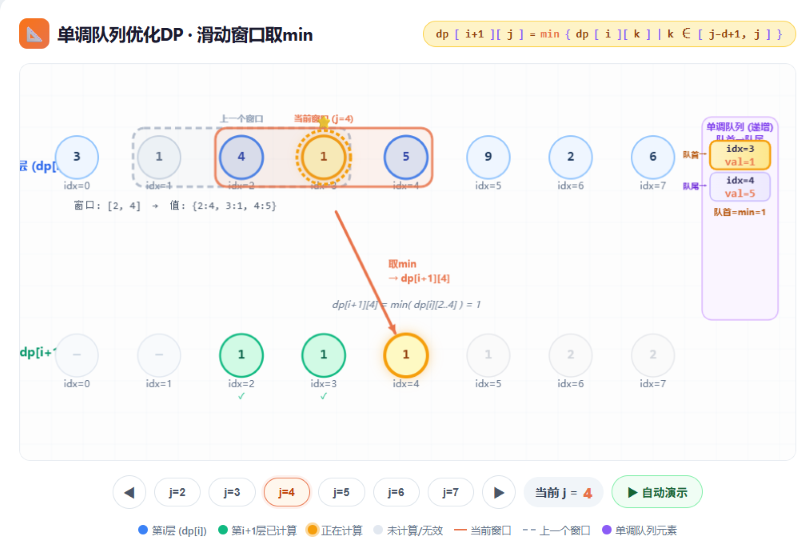

**通用形式**
$dp[i] = \max_{j \in [L(i),\,R(i)]} \big\{ dp[j] + A(i) + B(j) \big\}$
（求 min 时完全对称）

- 条件：$L(i), R(i)$ 均单调不减。
- 评价值：$v[j] = dp[j] + B(j)$
- 队列：存下标 $j$，按 $v$ 单调（max 时递减，min 时递增）

**单步流程（以 max 为例）**

1. 入队：将新候选 $j = R(i)$ 加入队列  
   `while 队不空 && v[队尾] ≤ v[j]` 弹队尾，然后 \(j\) 入队尾
2. 出队：`while 队不空 && 队首 < L(i)` 弹队首
3. 转移：`dp[i] = v[队首] + A(i)`（队空则无合法转移）

---

**多重背包特化**

**每种物品的每个余数分组，都开一个单调队列优化。**时间复杂度O(N × V)

处理第 $i$ 种物品（体积 $w$，价值 $v$，个数 $c$），对每个余数 $r \in [0, w)$ 独立跑滑动窗口：

- 下标表示体积：$j = r + k \cdot w$，$k$ 递增
- 评价值：$val[j] = dp[j] - \lfloor j/w \rfloor \cdot v$
- 窗口范围：$$j' \in [j - c\cdot w,\, j - w]$$（即去掉旧层，滑动加入）
- 转移：$dp[j] = \max(val[\text{队首}]) + \lfloor j/w \rfloor \cdot v$

注意使用滚动数组或临时备份，避免同层覆盖。

------

### 斜率优化 DP

> **解决问题**：形如 dp[i] = min/max{dp[j] + a[i]·b[j] + c[i] + d[j]} 的转移，用凸包维护将转移从 $O(n^2)$优化到 $O(n log n)$ 或 $O(n)$
> **时间复杂度**：$O(n)$ ~ $O(n log n)$
> **适用场景**：乘积形式的 DP 转移方程

**转移通式**  
$dp[i] = \min_{j < i}\{\,dp[j] + a[i] \cdot b[j] + c[i] + d[j]\,\}$
（最大化同理，下以最小化为例）

**转化方法**  
将式子重排为  $\underbrace{   (dp[j] + d[j])  }_{\text{{$y_j$}}}=-a[i] \cdot\underbrace{    b[j]  }_{\text{{$x_j$}}}+\underbrace{    dp[i] - c[i]  }_{\text{b}}$

直线经过点$(x_j,y_j)$，且交$y$轴于点$b$。

我们要最小化$dp[i]$即为最小化$b$

则相当于用一条斜率为 $-a[i]$ 的直线去切这些点，求最小截距。  

- 若求最小值 → 维护**下凸壳**（斜率递增）  
- 若求最大值 → 维护**上凸壳**（斜率递减）  

**单调性分析（决定使用哪种板子）**

| 插入点横坐标 $x=b[j]$ | 查询斜率 $k=-a[i]$ | 推荐方法              | 复杂度       |
| --------------------- | ------------------ | --------------------- | ------------ |
| 单调递增              | 单调               | 单调队列              | $O(n)$       |
| 单调递增              | 不单调             | 单调队列+二分         | $O(n\log n)$ |
| 不单调                | 无所谓             | 李超线段树 / CDQ 分治 | $O(n\log n)$ |

下面为处理好的板子，只需要传入 1-based 的数组 `a,b,c,d` 和 `dp[1]`，即可自动计算完整的 1-based `dp`。

**单调队列**

> **前提**：`solve_min` 要求 `b[1..n]` 非递减、`a[1..n]` 非递增；`solve_max` 要求 `b[1..n]` 非递减、`a[1..n]` 非递减。
> **接口**：`solve_min(a,b,c,d,dp1)` / `solve_max(a,b,c,d,dp1)`，四个数组均为 1-based，返回 1-based `dp`。

```c++
struct SlopeDPQueue {
    vector<int> a, b, c, d, dp;
    deque<int> q; // 保存下凸壳上的状态编号，b[q] 非递减

    int X(int j) {
        return b[j];
    }

    int Y(int j) {
        return dp[j] + d[j];
    }

    // 点 j 对查询斜率 k 的截距：Y(j)-k*X(j)。
    __int128 value(int j, int k) {
        return (__int128)Y(j) - (__int128)k * X(j);
    }

    // p,mid,r 的横坐标递增；mid 不在下凸壳上时返回 1。
    bool bad(int p, int mid, int r) {
        return (__int128)(X(mid) - X(p)) * (Y(r) - Y(p))
             - (__int128)(Y(mid) - Y(p)) * (X(r) - X(p)) <= 0;
    }

    // 加入新状态 j。b 相等时，只保留 Y 更小的点。
    void add_point(int j) {
        while (!q.empty() && X(q.back()) == X(j)) {
            if (Y(q.back()) <= Y(j)) return;
            q.pop_back();
        }
        while (q.size() >= 2 && bad(q[q.size() - 2], q.back(), j)) q.pop_back();
        q.push_back(j);
    }

public:
    // 计算 dp[i]=min_{j<i}(dp[j]+a[i]*b[j]+c[i]+d[j])。
    // A、B、C、D 必须等长且从下标 1 开始存；下标 0 不使用。
    vector<int> solve_min(const vector<int> &A, const vector<int> &B,
                          const vector<int> &C, const vector<int> &D, int dp1) {
        int n = (int)A.size() - 1;
        a = A, b = B, c = C, d = D;
        dp.assign(n + 1, 0);
        q.clear();

        dp[1] = dp1; // 初始状态由题目决定
        add_point(1);
        for (int i = 2; i <= n; ++i) {
            int k = -a[i];
            // k 非递减，所以最优点只会从队首向后移动。
            while (q.size() >= 2 && value(q[0], k) >= value(q[1], k)) q.pop_front();
            dp[i] = c[i] + (int)value(q.front(), k);
            add_point(i); // 放在计算后，保证只从 j<i 转移
        }
        return dp;
    }

    // 计算 dp[i]=max_{j<i}(dp[j]+a[i]*b[j]+c[i]+d[j])。
    // 令 g[i]=-dp[i]，则转化为 solve_min(-a,b,-c,-d,-dp1)。
    vector<int> solve_max(const vector<int> &A, const vector<int> &B,
                          const vector<int> &C, const vector<int> &D, int dp1) {
        int n = (int)A.size() - 1;
        vector<int> na = A, nc = C, nd = D;
        for (int i = 1; i <= n; ++i) {
            na[i] = -na[i];
            nc[i] = -nc[i];
            nd[i] = -nd[i];
        }
        vector<int> ans = solve_min(na, B, nc, nd, -dp1);
        for (int i = 1; i <= n; ++i) ans[i] = -ans[i];
        return ans;
    }
};
```

**使用说明**：最小化调用 `solver.solve_min(a,b,c,d,dp1)`；最大化调用 `solver.solve_max(a,b,c,d,dp1)`。最大化时 `a` 必须非递减；其余情况改用下面两份。

**单调队列+二分**

> **前提**：`b[1..n]` 非递减；`a` 可以任意，最小化和最大化均相同。
> **接口**：`solve_min(a,b,c,d,dp1)` / `solve_max(a,b,c,d,dp1)`，与单调队列版完全相同。

```c++
struct SlopeDPBinary {
    vector<int> a, b, c, d, dp;
    vector<int> hull; // 保存下凸壳上的状态编号，b[hull] 非递减

    int X(int j) {
        return b[j];
    }

    int Y(int j) {
        return dp[j] + d[j];
    }

    __int128 value(int j, int k) {
        return (__int128)Y(j) - (__int128)k * X(j);
    }

    bool bad(int p, int mid, int r) {
        return (__int128)(X(mid) - X(p)) * (Y(r) - Y(p))
             - (__int128)(Y(mid) - Y(p)) * (X(r) - X(p)) <= 0;
    }

    void add_point(int j) {
        while (!hull.empty() && X(hull.back()) == X(j)) {
            if (Y(hull.back()) <= Y(j)) return;
            hull.pop_back();
        }
        while (hull.size() >= 2 && bad(hull[hull.size() - 2], hull.back(), j)) {
            hull.pop_back();
        }
        hull.push_back(j);
    }

    // 二分凸壳上第一个最小截距；查询斜率 k 不需要单调。
    int query(int k) {
        int l = 0, r = (int)hull.size() - 1;
        while (l < r) {
            int mid = (l + r) >> 1;
            if (value(hull[mid], k) <= value(hull[mid + 1], k)) r = mid;
            else l = mid + 1;
        }
        return (int)value(hull[l], k);
    }

public:
    // 计算 dp[i]=min_{j<i}(dp[j]+a[i]*b[j]+c[i]+d[j])。
    vector<int> solve_min(const vector<int> &A, const vector<int> &B,
                          const vector<int> &C, const vector<int> &D, int dp1) {
        int n = (int)A.size() - 1;
        a = A, b = B, c = C, d = D;
        dp.assign(n + 1, 0);
        hull.clear();

        dp[1] = dp1;
        add_point(1);
        for (int i = 2; i <= n; ++i) {
            dp[i] = c[i] + query(-a[i]);
            add_point(i);
        }
        return dp;
    }

    // 计算 dp[i]=max_{j<i}(dp[j]+a[i]*b[j]+c[i]+d[j])。
    // 令 g[i]=-dp[i]，则转化为 solve_min(-a,b,-c,-d,-dp1)。
    vector<int> solve_max(const vector<int> &A, const vector<int> &B,
                          const vector<int> &C, const vector<int> &D, int dp1) {
        int n = (int)A.size() - 1;
        vector<int> na = A, nc = C, nd = D;
        for (int i = 1; i <= n; ++i) {
            na[i] = -na[i];
            nc[i] = -nc[i];
            nd[i] = -nd[i];
        }
        vector<int> ans = solve_min(na, B, nc, nd, -dp1);
        for (int i = 1; i <= n; ++i) ans[i] = -ans[i];
        return ans;
    }
};
```

**使用说明**：最小化调用 `solver.solve_min(a,b,c,d,dp1)`；最大化调用 `solver.solve_max(a,b,c,d,dp1)`。它比单调队列慢一个二分，但 `a[i]` 无需单调；`b[i]` 仍必须非递减。

**李超线段树**

> **前提**：`a,b` 均可任意；所有状态 `j<i` 一直有效，最小化和最大化均相同。
> **接口**：`solve_min(a,b,c,d,dp1)` / `solve_max(a,b,c,d,dp1)`；查询斜率会在内部自动排序、去重。

```c++
struct SlopeDPLiChao {
    struct line {
        int k, b;

        line(int slope = 0, int intercept = 0) : k(slope), b(intercept) {
        }

        __int128 value(int x) const {
            return (__int128)k * x + b;
        }
    };

    vector<int> a, b, c, d, dp;
    vector<int> xs; // 所有会被查询的 -a[i]，内部排序、去重
    vector<line> tr;
    vector<char> has;

    bool better(const line &x, const line &y, int pos) {
        return x.value(xs[pos]) < y.value(xs[pos]); // 维护最小值
    }

    void insert_line(int dq, int l, int r, line f) {
        if (!has[dq]) {
            tr[dq] = f;
            has[dq] = 1;
            return;
        }
        int mid = (l + r) >> 1;
        if (better(f, tr[dq], mid)) swap(f, tr[dq]);
        if (l == r) return;
        if (better(f, tr[dq], l)) insert_line(dq << 1, l, mid, f);
        else if (better(f, tr[dq], r)) insert_line(dq << 1 | 1, mid + 1, r, f);
    }

    __int128 query(int dq, int l, int r, int pos) {
        __int128 ans = has[dq] ? tr[dq].value(xs[pos]) : ((__int128)1 << 120);
        if (l == r) return ans;
        int mid = (l + r) >> 1;
        __int128 child = pos <= mid ? query(dq << 1, l, mid, pos)
                                    : query(dq << 1 | 1, mid + 1, r, pos);
        return min(ans, child);
    }

    // 状态 j 对应 f(k)=dp[j]+d[j]-k*b[j]。
    void add_point(int j) {
        insert_line(1, 0, (int)xs.size() - 1, line(-b[j], dp[j] + d[j]));
    }

    int query_slope(int k) {
        int pos = lower_bound(xs.begin(), xs.end(), k) - xs.begin();
        return (int)query(1, 0, (int)xs.size() - 1, pos);
    }

public:
    // 计算 dp[i]=min_{j<i}(dp[j]+a[i]*b[j]+c[i]+d[j])。
    vector<int> solve_min(const vector<int> &A, const vector<int> &B,
                          const vector<int> &C, const vector<int> &D, int dp1) {
        int n = (int)A.size() - 1;
        a = A, b = B, c = C, d = D;
        dp.assign(n + 1, 0);
        dp[1] = dp1;
        if (n == 1) return dp;

        xs.clear();
        for (int i = 2; i <= n; ++i) xs.push_back(-a[i]);
        sort(xs.begin(), xs.end());
        xs.erase(unique(xs.begin(), xs.end()), xs.end());
        tr.assign(4 * (int)xs.size() + 5, line());
        has.assign(4 * (int)xs.size() + 5, 0);

        add_point(1);
        for (int i = 2; i <= n; ++i) {
            dp[i] = c[i] + query_slope(-a[i]);
            add_point(i); // 后插入，保证转移仅使用 j<i
        }
        return dp;
    }

    // 计算 dp[i]=max_{j<i}(dp[j]+a[i]*b[j]+c[i]+d[j])。
    // 令 g[i]=-dp[i]，则转化为 solve_min(-a,b,-c,-d,-dp1)。
    vector<int> solve_max(const vector<int> &A, const vector<int> &B,
                          const vector<int> &C, const vector<int> &D, int dp1) {
        int n = (int)A.size() - 1;
        vector<int> na = A, nc = C, nd = D;
        for (int i = 1; i <= n; ++i) {
            na[i] = -na[i];
            nc[i] = -nc[i];
            nd[i] = -nd[i];
        }
        vector<int> ans = solve_min(na, B, nc, nd, -dp1);
        for (int i = 1; i <= n; ++i) ans[i] = -ans[i];
        return ans;
    }
};
```

**使用说明**：最小化调用 `solver.solve_min(a,b,c,d,dp1)`；最大化调用 `solver.solve_max(a,b,c,d,dp1)`。这是最稳妥的默认选择：`a,b` 都无需单调，且不用你提供斜率范围或离散化数组。

### 四边形不等式优化 DP

> **解决问题**：加速满足四边形不等式的区间 DP 和 1D/1D DP，大幅降低时间复杂度。  
> **时间复杂度**：区间 DP 从 $O(n^3)$ 降至 $O(n^2)$；1D/1D DP 从 $O(n^2)$ 降至 $O(n\log n)$ 或 $O(n)$。  
> **适用场景**：石子合并、最优二叉搜索树、邮局选址、序列划分等，代价函数具有“交叉 ≤ 包含”性质。

**四边形不等式**（交叉 ≤ 包含）  
对于 $a \le b \le c \le d$，有  
$val(a,c) + val(b,d) \le val(a,d) + val(b,c)$

**区间包含单调性**  
对于 $a \le b \le c \le d$，有  
$val(b,c) \le val(a,d)$ 
即小区间代价 ≤ 大区间代价。

以上性质赛时若无法证明可**打表**判断

**设$w(j, i)$表示“以 j 作为前一段的结束，以 i 作为当前段的结束”的转移代价**

------

#### 区间 DP 优化

**转移式**
$dp[i][j] = \min_{i \le k < j} \big\{ dp[i][k] + dp[k+1][j] + w(i,j) \big\}$

若 $w$ 满足**四边形不等式 + 区间包含单调性**，则最优分割点 $opt[i][j]$ 满足：
$opt[i][j-1] \le opt[i][j] \le opt[i+1][j]$

**优化效果**：  
枚举 $k$的范围从 $[i,j-1]$ 缩小到 $[opt[i][j-1],\, opt[i+1][j]]$，总复杂度均摊 $O(n^2)$。

```c++
vector<vector<int> > dp(n + 2, vector<int>(n + 2, /*初始值,根据题目自行设置*/));
vector<vector<int> > opt(n + 2, vector<int>(n + 2, 0));
    // 初始化
for (int i = 1; i <= n; ++i) {
	dp[i][i] = 0; // 长度为 1 的区间代价为 0，根据要求的dp转移方程自行设置
	opt[i][i] = i; // 无分割点，但设为 i 以保证递推安全
}
    // 主递推
for (int len = 2; len <= n; ++len) {
	for (int l = 1; l + len - 1 <= n; ++l) {
		int r = l + len - 1;
		for (int k = opt[l][r - 1]; k <= min(opt[l + 1][r], r - 1); ++k) {
                //枚举可能的分割点
            int val = dp[l][k] + dp[k + 1][r] + w(l, r); //计算答案
          	if (val < dp[l][r]) {
                    //根据要求的dp值来判断
               	dp[l][r] = val;
              	opt[l][r] = k;
          	}
        }
	}
}
```

------

#### 1D/1D DP 优化

**转移式**：  
$dp[i] = \min_{j < i} \big\{ dp[j] + w(j,i) \big\}$  
或带层数  
$dp[k][i] = \min_{j < i} \big\{ dp[k-1][j] + w(j,i) \big\}$  
若 $w$满足**四边形不等式**，则最优决策点 $opt[i]$ 单调：  
$opt[i] \le opt[i+1]$

**分治法**：  
特别适合**带层数**的 DP,从小到大一层一层算,对于当前层，递归计算 $dp[l..r]$，已知其决策点在 $[optL, optR]$ 内，取中点枚举决策，均摊 $O(n\log n)$ 每层。 总复杂度$O(k*n\log n)$

```c++
int n, k;
    vector<int> pre(n + 1, /*根据题目自行设置*/); // 把第一层当作 pre
    vector<int> cur(n + 1);
    pre[0] = 0;
    for (int i = 1; i <= n; ++i) {
        //计算第一层的值
        pre[i] = w(0, i);
    }

    // 分治函数，k 不再需要，只依赖 pre 和 cur
    function<void(int, int, int, int)> compute = [&](int l, int r, int optL, int optR) {
        if (l > r) return;
        int mid = (l + r) >> 1;
        int best = optL;
        int minv = 1e18;
        for (int j = optL; j <= min(mid - 1, optR); ++j) {
            // pre[j] 是上一层 dp[j] 的值
            int val = pre[j] + w(j, mid);
            if (val < minv) {
                minv = val;
                best = j;
            }
        }
        cur[mid] = minv; // 填入当前层
        compute(l, mid - 1, optL, best);
        compute(mid + 1, r, best, optR);
    };
    // 主循环：从第 2 层开始计算,一层一层的算k
    for (int i = 2; i <= k; i++) {
        fill(cur.begin(), cur.end(), 1e18);
        // i 从当前层数开始（至少 i 个元素），j 至少 i-1（上一层至少 i-1 个元素）
        compute(i, n, i - 1, n - 1); // 边界必须使用当前层 i
        pre.swap(cur); // 当前层变成下一轮的上一层
    }
```

**单调队列法**：  
主要用于**没有层数**的 1D DP,维护决策点的二分栈，每个决策覆盖一段连续区间，时间复杂度 $O(n\log n)$ 或 $O(n)$。

```c++
const int INF = 1e18; // 安全大数，避免溢出
    struct Decision {
        int j, l, r; // j是决策点，[l,r] 是其负责的区间
    };
    vector<int> dp(n + 1, INF);
    dp[0] = 0; // 初始决策点
    deque<Decision> dq;
    dq.push_back({0, 1, n});
    for (int i = 1; i <= n; ++i) {
        // 1. 丢弃过期的队头
        while (!dq.empty() && dq.front().r < i) {
            dq.pop_front();
        }
        // 2.计算 dp[i]
        if (!dq.empty()) {
            int j = dq.front().j;
            dp[i] = dp[j] + w(j, i);
        } else {
            dp[i] = INF; // 无可用的决策，保持不可达
        }
        // 3. 如果当前状态不可达，不能作为后续的决策点
        if (dp[i] >= INF) continue;
        // 4. 淘汰队尾
        while (!dq.empty()) {
            auto &tail = dq.back();
            int j = tail.j;
            if (dp[i] + w(i, tail.l) <= dp[j] + w(j, tail.l)) {//里面符号根据dp具体判断
                dq.pop_back();
            } else {
                break;
            }
        }
        // 5. 插入新决策
        if (dq.empty()) {
            dq.push_back({i, i + 1, n});
        } else {
            auto &tail = dq.back();
            int j = tail.j;
            int l = tail.l - 1;
            int r = tail.r + 1;
            while (l + 1 < r) {
                int mid = (l + r) >> 1;
                // 注意：此处的比较符和弹出队尾的 <= 保持一致
                if (dp[i] + w(i, mid) > dp[j] + w(j, mid)) {//里面符号根据dp具体判断
                    l = mid; // 老决策更好
                } else {
                    r = mid; // 新决策更好（或打平）
                }
            }
            int pos = r;
            if (pos <= n) {
                tail.r = pos - 1;
                dq.push_back({i, pos, n});
            }
        }
    }
```

------

### WQS 二分

> **解决问题**：原 DP 需要记录“已选个数”，复杂度至少  $O(nk)$；通过给“选择”操作附加惩罚 $\lambda$，消去个数维度，将二维 DP 降为一维。 
> **时间复杂度**：$O(T(n) \log C)$，其中 $T(n)$ 是**无数量限制版本**的单次 DP 复杂度，通常 $O(n)$ 或 $O(n\log n)$，$C$ 为 $\lambda$ 值域。  
> **适用场景**：  
>
> - 题目要求**恰好（或至多/至少）选择 $k$ 次**（分 $k$ 段、建 $k$ 个基站、度数限制等）。  
> - 去掉个数限制后，存在高效的一维 DP（斜率优化、线段树、贪心等）。  
> - 目标函数 $f(k)$（恰好 $k$ 次的最优值）具有**凸性**。

**核心条件：凸性**

设 $f(k)$ 为“恰好选 $k$ 个”时的最优答案。

- **最小化代价** → $f(k)$ 必须**下凸**（二阶差分非负，边际代价递增）。  
- **最大化收益** → $f(k)$ 必须**上凸**（二阶差分非正，边际收益递减）。

通俗易懂的来讲

**最小化代价**：每多选一个,差值是否**越来越大**（或不变）

**最大化收益**：每多选一个,差值是否**越来越小**（或不变）

对于所有的k所对应答案画出来的图上来说，满足**凸起**或者**凹陷**(可以三分)

> **赛时验证**：写一个正确但低效的 $O(nk)$ DP 跑小数据，输出 $f(1), f(2), \dots$，检查差分是否单调。

**算法流程（精简）**

1. **加惩罚**：  
   - 最小化：每次“选择”，代价 **$+ \lambda$**。  
   - 最大化：每次“选择”，收益 **$- \lambda$**。

2. **无限制 DP**：用 **$O(n)$ 或 $O(n\log n)$** 的一维 DP 求出：
   - 最优值 $val$
   - 同时记录**实际选择了多少次** $cnt$（值相等时固定优先选 $cnt$ 多或少，保证单调）。

3. **二分**$\lambda$：  
   - 若 $cnt \ge k$ → 惩罚太轻（选太多），**增大 $\lambda$**。  
   - 若 $cnt < k$ → 惩罚太重（选太少），**减小 $\lambda$**。

4. **还原答案**：  
   - 最小化：$ans = val - \lambda \cdot k$
   - 最大化：$ans = val + \lambda \cdot k$

```c++
int n, k;
    struct Node {
        int val; //用来存储价值
        int cnt; //用来存储已经选了多少个
        // 定义比较规则：值越小越好；值相等时让 cnt 更大
        // 这样 cnt 会随 lambda 增大而单调减小
        bool operator <(const Node &o) const {
            //这里是求最小值的板子
            if (val != o.val) return val < o.val;
            return cnt > o.cnt;
        }
    };

    // 求解附加惩罚 lambda 的最优解
    // 注意：内部必须实现为 O(n) 或 O(n log n) 的高效 DP
    // 下面只给出结构示意，实际转移需要根据题目填
    auto solve = [&](int lambda) -> Node {
        // dp[i] 表示前 i 个元素的最优信息
        vector<Node> dp(n + 1, {INF, 0});
        dp[0] = {0, 0};
        for (int i = 1; i <= n; ++i) {
            // 不进行选择（视题目而定）
            dp[i] = dp[i - 1];
            // 具体转移：从 j 转移到 i，代表做了一次“选择”
            // 这一层循环必须用斜率优化/单调队列等手段压缩到均摊 O(1)
            // 此处仅示例结构，不要真写 O(n^2)
            // 使用题目对应的高效转移替代下面注释的部分
            // for (int j : 有效决策集) {
            //     Node cur = {dp[j].val + cost(j, i) + lambda, dp[j].cnt + 1};
            //     if (cur < dp[i]) dp[i] = cur;
            // }
        }
        return dp[n];
    };

    // 二分寻找合适的 lambda
    int l = -1e18, r = 1e18; // 需保证 check(l) = true, check(r) = false
    while (l + 1 < r) {
        int mid = (l + r) >> 1;
        if (solve(mid).cnt >= k) {
            // 选得太多 -> 增大 lambda
            l = mid;
        } else {
            // 选得太少 -> 减小 lambda
            r = mid;
        }
    }
    int lambda = l; // l 是满足 cnt >= k 的最大 lambda
    Node res = solve(lambda);
    int ans = res.val - lambda * k; // 减去多算的惩罚
```

---

### 长链剖分优化 DP

> **解决问题**：树上 DP 中，状态与深度有关时，用长链剖分将合并子树的复杂度从 $O(n^2)$ 优化为 $O(n)$  
> **时间复杂度**：$O(n)$  
> **适用场景**：树形 DP 中状态按深度分层，需要合并子树信息时

**转移式**  
设 $dp[u][d]$ 表示节点 $u$ 子树内，距离 $u$ 为 $d$ 的信息。合并儿子时通常为：
$$dp[u][d] = \bigoplus_{v \in son(u)} dp[v][d-1] \quad (d \ge 1)$$
且 $dp[u][0]$ 为自身基础值。$\bigoplus$ 可以是加法、取 $\min/\max$ 等逐位合并。

**核心优化**  

- 定义**高度 $len[u]$**（到最远叶子的节点数），**重儿子**为 $len$ 最大的儿子。  
- 性质：所有轻儿子的 $len$ 之和 $\le n$。  
- 全局数组 + 下标偏移，使父数组直接“包含”重儿子数组：`start[son] = start[u] + 1`，继承零开销。  
- 轻儿子暴力合并，总复杂度均摊 $O(n)$。

**代码模板**

```cpp
#include <bits/stdc++.h>
using namespace std;
const int N = 1e6 + 5;
const int INF = 0x3f3f3f3f;
vector<int> adj[N];
int len[N], son[N];   // len[u]: 子树高度(节点数); son[u]: 重儿子
int dp_pool[N];       // 全局DP内存池
int start[N];         // 每个节点DP数组的起始下标
int cur_idx;          // 内存池下一个空闲位置
// 第一次DFS：求每个节点的高度与重儿子
void dfs1(int u, int fa) {
    len[u] = 1;
    son[u] = 0;
    for (int v : adj[u]) {
        if (v == fa) continue;
        dfs1(v, u);
        if (len[v] > len[son[u]]) {
            son[u] = v;
        }
    }
    len[u] = len[son[u]] + 1;
}
// 第二次DFS：长链剖分DP
void dfs2(int u, int fa) {
    // 1. 重儿子零开销继承：下标偏移1位，直接复用内存
    if (son[u]) {
        start[son[u]] = start[u] + 1;
        dfs2(son[u], u);
    }

    // 2. 轻儿子：分配独立空间 → 递归计算 → 暴力合并
    for (int v : adj[u]) {
        if (v == fa || v == son[u]) continue;
        start[v] = cur_idx;
        cur_idx += len[v];//以v开始往下延申最长长度是len[v],对于v的轻儿子会再开新的点，所欲i可以这么用
        dfs2(v, u);

        // 合并操作：以加法为例，可替换为 max= / min=
        for (int d = 1; d <= len[v]; ++d) {
            dp_pool[start[u] + d] += dp_pool[start[v] + d - 1];
        }
    }
    // 3. 设置当前节点深度为0的基础值
    dp_pool[start[u]] = 1;   // 示例：距离u为0的节点数为1（自身）
}
// 初始化与调用示例
int main() {
    int n;
    scanf("%d", &n);
    for (int i = 1; i < n; ++i) {
        int u, v;
        scanf("%d%d", &u, &v);
        adj[u].push_back(v);
        adj[v].push_back(u);
    }
    dfs1(1, 0);
    start[1] = 0;
    cur_idx = len[1];  // 根节点占用 len[1] 个空间
    dfs2(1, 0);
    return 0;
}
```

**维护最值**  
在继承时维护最优决策点 `best[u] = best[son] + 1`，轻合并循环内更新，最后检查 `dp[u][0]`，保持 $O(n)$。

**注意事项**  
- `cur_idx` 增长量等于各长链长度之和，总空间严格 $O(n)$。  
- 合并循环范围 `d = 1..len[v]`，不可越界。  
- 根据题目将 `+=` 换成 `max=`、`min=` 等，重儿子继承逻辑不变。
- `dp_pool[start[u]+d]` 只在 `dfs2(u)` 结束、尚未返回父亲时完整有效；重链共享内存，父亲后续合并会覆盖重儿子的状态。需要的节点答案应在 `dfs2(u)` 末尾保存到独立的 `ans[u]`，不能建完后任意查询所有节点的完整 DP 数组。

---

## 插头 DP（轮廓线 DP）

> **解决问题**：在网格图上用轮廓线+插头状态进行 DP，常用于解决 Hamilton 回路、棋盘覆盖等问题
> **时间复杂度**：O(nm·状态数)
> **适用场景**：网格上的哈密顿回路计数、多米诺骨牌覆盖、连通性状态压缩问题

以一行一行、每行从左到右的顺序扫描网格。当处理到格子 $(i,j)$ 时，已经扫描过的区域与未扫描区域之间形成一条 **轮廓线**,如下图所示

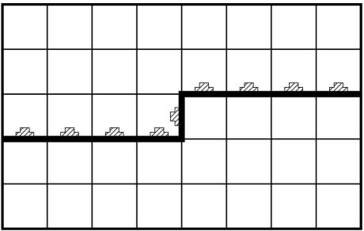

一个大小为n*m的矩形，对于每个点$(i,j)$,都需要一个轮廓线，轮廓线上有m+1个插头。我们通过往里面加入下面这样的格子，影响插头的状态，进而求解

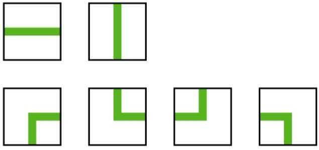

**状态设计**

- **多回路**(途中能够出现多个回路)
  只记有无插头：`0` 无，`1` 有。状态为 m+1位二进制。
- **单回路**(一个回路占领所有格子)
  插头分属不同路径段，必须记录**连通性**。因路径不相交，插头配对像**合法括号序列**：
  `0`：无插头
  `1`：左括号（路径左端）
  `2`：右括号（路径右端）
  状态为 m+1 位四进制，且括号不可交叉。

**单回路转移注意左右括号转移后的变化**

00转: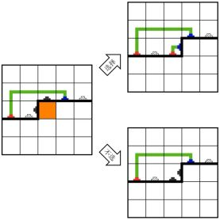

12转: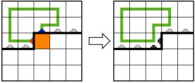

21转: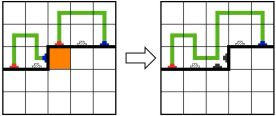

11转：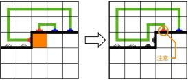

22转: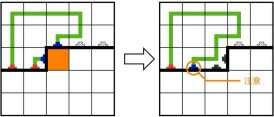

10/01转: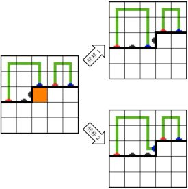

**实现要点**

- **存储**：状态数远小于 $4^{m+1}$，用哈希表滚存 `dp[state]`。
- **位操作**：每插头 2 bits，`(state >> (k*2)) & 3` 读取，`set` 宏修改。
- **行转移**：一行结束后最右位必须为 0，状态左移 2 bits，末位补 0。
- **匹配括号**：`find_match(state, pos)`，从 `pos` 沿匹配方向扫描，计数括号平衡得到位置。
- **初始化**：`dp[0] = 1`，最终答案为 `dp[0]`（所有插头关闭）。

## 动态 DP (DDP)【待补充】

> **解决问题**：支持修改点权/边权后快速重新计算树上的 DP 值
> **时间复杂度**：$O((n+q) log n)$ 或 $O((n+q) log^2 n)$
> **适用场景**：树上带修改的 DP 问题，如动态最大独立集

---

# 字符串

## 重要定义

$$
周期：设字符串s的长度为n。如果存在整数p\in (1 \leq p \leq n)，\\使得对于所有  i \in [p, n] ，有  s[i] = s[i-p] ，则称  p  是  s  的一个周期。\\
循环节：如果周期p满足 p \mid n,则称p是s的一个循环节\\
Border：如果字符串s长度为k的前缀等于长度为k的后缀，则称长度为k的前缀是s的一个border。\\
border性质:\begin{cases}
若s为字符串的周期，则n-s长度的前缀一定为本身的border(可以利用这点求出border后来反推出周期)\\
本身border的border一定为本身的border
\end{cases}\\
$$

---

## 字符串哈希

> **解决问题**：$O(1)$ 判断两个子串是否相等
> **时间复杂度**：预处理 $O(n)$，查询 $O(1)$
> **适用场景**：字符串匹配、回文判定、最长公共前缀（配合二分）

```c++
const int mod = 998244353; //1e9+7
const int base = 131;
const int N = 200005; // 按字符串最大长度修改
int hs[N], p[N];

// 传入普通 0-based string；get_hx(l,r) 的参数仍是 1-based 闭区间。
void build_hash(const string &s) {
    int n = s.size();
    p[0] = 1;
    for (int i = 1; i <= n; ++i) {
        p[i] = p[i - 1] * base % mod;
        hs[i] = (hs[i - 1] * base + (unsigned char)s[i - 1]) % mod;
    }
}

int get_hx(int l, int r) {
    return (hs[r] - hs[l - 1] * p[r - l + 1] % mod + mod) % mod;
}
```

---

## KMP 算法

> **解决问题**：单模式串匹配——在文本串中找出模式串出现的所有位置
> **时间复杂度**：O(n+m)，其中 n 为文本串长度，m 为模式串长度
> **适用场景**：字符串匹配、求字符串的最小循环节、求 Border

$$
next数组:存储zfc的前缀的最大非平凡border的长度(非平凡意味着不等于本身)\\
字符串下标从1开始,故next[1]=0\\
我们通过对模式串构建next数组,然后对匹配串进行跳跃,则可o(n)时间复杂度之内匹配字符串
$$

### 普通 next 数组

```c++
int nex[N]; //用来存储每个前缀的最大border
string zfc; //作为模式串参与匹配

void getnext() {
    //构建next数组,这个字符串从1号开始存储字符
    int dq = 0; //用来存储i号的border的长度
    for (int i = 2; i < zfc.size(); i++) {
        while (dq > 0 && zfc[dq + 1] != zfc[i]) {
            dq = nex[dq];
        }
        if (zfc[dq + 1] == zfc[i]) {
            dq++;
        }
        nex[i] = dq;
    }
}

vector<int> kmp(string ls) {
    //ls从1号位置开始存储字符串
    vector<int> wz; //用来存储出现的位置
    int dq = 0; //用来存储到目前为止，成功匹配的长度
    for (int i = 1; i < ls.size(); i++) {
        while (dq > 0 && zfc[dq + 1] != ls[i]) {
            dq = nex[dq];
        }
        if (zfc[dq + 1] == ls[i]) {
            dq++;
        }
        if (dq == zfc.size() - 1) {
            //如果完整出现，那么记录一下
            wz.push_back(i - zfc.size() + 2);
            dq = nex[dq];
        }
    }
    return wz;
}
```

### nextval 注意：要求所有（含重叠）匹配时使用普通 next

$$
我们发现,查询next数组时如果匹配不成功,那么就一直往后跳\\
在这个往后跳的过程中,如果判断条件的字符与上一个判断失败的字符一样的话，那么我们不用判断直接跳\\
我们优化掉这个跳跃的过程,可以使得next数组更优
$$

```c++
int nex[N]; // 普通 border；它能正确保留重叠匹配
string zfc; // 模式串从 1 号位置开始存储字符

void getnext() {
    for (int i = 2; i < zfc.size(); ++i) {
        int dq = nex[i - 1];
        while (dq > 0 && zfc[dq + 1] != zfc[i]) dq = nex[dq];
        if (zfc[dq + 1] == zfc[i]) ++dq;
        nex[i] = dq;
    }
}

vector<int> kmp(const string &ls) {
    vector<int> wz;
    int dq = 0;
    for (int i = 1; i < ls.size(); ++i) {
        while (dq > 0 && zfc[dq + 1] != ls[i]) dq = nex[dq];
        if (zfc[dq + 1] == ls[i]) ++dq;
        if (dq == zfc.size() - 1) {
            wz.push_back(i - zfc.size() + 2);
            dq = nex[dq];
        }
    }
    return wz;
}
```

---

## Z 函数（扩展 KMP）

> **解决问题**：求字符串的 Z 函数——`z[i]` 表示字符串 `s` 与后缀 `s[i...n-1]` 的最长公共前缀 (LCP) 长度。  
> **时间复杂度**：O(n)  
> **适用场景**：字符串匹配（构造 `P + '#' + T` 求 Z 数组）、求最小循环节、寻找字符串周期等。

```c++
// 返回数组 z，其中 z[0] 通常置为 0（也可根据需要设为 n）
vector<int> z_function(const string &s) {
    int n = s.size();
    vector<int> z(n);
    // l, r 维护已匹配的最右区间 [l, r]
    for (int i = 1, l = 0, r = 0; i < n; ++i) {
        if (i <= r) // 落在已知区间内，利用对称信息
            z[i] = min(r - i + 1, z[i - l]);
        // 暴力扩展未知部分
        while (i + z[i] < n && s[z[i]] == s[i + z[i]])
            ++z[i];
        // 更新最右匹配区间
        if (i + z[i] - 1 > r) {
            l = i;
            r = i + z[i] - 1;
        }
    }
    return z;
}
```

**使用要点**  
- 若需 `z[0] = n`（表示整个字符串与自己匹配），只需在返回前加 `z[0] = n;`。  
- **字符串匹配**：构造 `S = P + '#' + T`，对 `S` 求 Z 数组，若 `z[i] == |P|`，则在 `T` 的位置 `i - |P| - 1` 出现一次匹配。  
- **最小循环节**：找到最小的 `i > 0` 满足 `i + z[i] == n` 且 `n % i == 0`，则 `i` 是最小循环节长度。

------

## Trie（字典树）

> **解决问题**：维护多字符串的前缀、完整串出现次数，以及整数集合的异或查询
> **时间复杂度**：字符 Trie 为 $O(|S|)$；01Trie 每次操作为 $O(63)$
> **适用场景**：多字符串前缀匹配、字典序前缀统计、最大异或、异或小于某值计数

下面两份板子用途不同，按题目分别复制；字符 Trie 只接受小写字母，01Trie 只接受非负整数。

### 小写字母 Trie

```c++
struct Trie {
    struct node {
        array<int, 26> nxt;
        int pass, end;

        node() : pass(0), end(0) {
            nxt.fill(0);
        }
    };

    vector<node> tr;

    Trie() {
        clear();
    }

    // 清空全部字符串，之后可重新 insert
    void clear() {
        tr.clear();
        tr.emplace_back(); // 0 为根
    }

    // 插入一条只含小写字母的字符串 s，可重复插入
    void insert(const string &s) {
        int u = 0;
        tr[u].pass++;
        for (char ch : s) {
            int c = ch - 'a';
            if (!tr[u].nxt[c]) {
                tr[u].nxt[c] = (int)tr.size();
                tr.emplace_back();
            }
            u = tr[u].nxt[c];
            tr[u].pass++;
        }
        tr[u].end++;
    }

    // 返回完整字符串 s 被插入的次数
    int count_word(const string &s) const {
        int u = 0;
        for (char ch : s) {
            int c = ch - 'a';
            if (c < 0 || c >= 26 || !tr[u].nxt[c]) return 0;
            u = tr[u].nxt[c];
        }
        return tr[u].end;
    }

    // 返回以 s 为前缀的已插入字符串数量（包括 s 本身）
    int count_prefix(const string &s) const {
        int u = 0;
        for (char ch : s) {
            int c = ch - 'a';
            if (c < 0 || c >= 26 || !tr[u].nxt[c]) return 0;
            u = tr[u].nxt[c];
        }
        return tr[u].pass;
    }
};
```

### 01Trie（异或）

```c++
struct BitTrie {
    struct node {
        int nxt[2], cnt;

        node() : nxt{0, 0}, cnt(0) {
        }
    };

    static constexpr int LOG = 62; // 支持 [0, 2^63) 的非负整数
    vector<node> tr;

    BitTrie() {
        clear();
    }

    // 清空整个整数多重集
    void clear() {
        tr.clear();
        tr.emplace_back(); // 0 为根
    }

    // 向多重集插入一个非负整数 x
    void insert(int x) {
        int u = 0;
        tr[u].cnt++;
        for (int b = LOG; b >= 0; --b) {
            int c = (x >> b) & 1;
            if (!tr[u].nxt[c]) {
                tr[u].nxt[c] = (int)tr.size();
                tr.emplace_back();
            }
            u = tr[u].nxt[c];
            tr[u].cnt++;
        }
    }

    // 从多重集删除一个已有的非负整数 x
    void erase(int x) {
        int u = 0;
        vector<int> path = {0};
        for (int b = LOG; b >= 0; --b) {
            int c = (x >> b) & 1;
            u = tr[u].nxt[c];
            path.push_back(u);
        }
        for (int v : path) tr[v].cnt--;
    }

    // 返回 max(x xor y)；空集时返回 -1
    int max_xor(int x) const {
        if (!tr[0].cnt) return -1;
        int u = 0, ans = 0;
        for (int b = LOG; b >= 0; --b) {
            int c = (x >> b) & 1;
            int want = c ^ 1;
            if (tr[u].nxt[want] && tr[tr[u].nxt[want]].cnt) {
                ans |= (1LL << b);
                u = tr[u].nxt[want];
            } else {
                u = tr[u].nxt[c];
            }
        }
        return ans;
    }

    // 返回多重集中满足 (x xor y) < lim 的 y 个数；x、lim 都需非负
    int count_xor_less(int x, int lim) const {
        if (lim <= 0) return 0;
        int u = 0, ans = 0;
        for (int b = LOG; b >= 0; --b) {
            int xb = (x >> b) & 1;
            int lb = (lim >> b) & 1;
            if (lb) {
                int same = tr[u].nxt[xb];
                if (same) ans += tr[same].cnt;
                u = tr[u].nxt[xb ^ 1];
            } else {
                u = tr[u].nxt[xb];
            }
            if (!u) break;
        }
        return ans;
    }
};
```

**使用方法**

```c++
Trie tr;
tr.insert("abc");
cout << tr.count_word("abc") << ' ' << tr.count_prefix("ab") << '\n';

BitTrie bt;
bt.insert(1);
bt.insert(4);
cout << bt.max_xor(2) << ' ' << bt.count_xor_less(2, 5) << '\n';
```

---
## KMP 自动机

> **解决问题**：在 KMP 的 next 数组基础上，对每个状态预处理出接收每个字符后的转移，实现真正的自动机
> **时间复杂度**：构建 O(n$\Sigma$)，匹配 O(|文本串|)
> **适用场景**：需要在模式串上做 DP 转移、多文本串匹配同一模式串

```c++
struct KMP{
    int nxt[N];
    int len;
    int aut[N][26];
    string p;
    void built(string s){//构建next失配指针
        len=s.length();
        s=' '+s;
        p=s;
        for(int i=2;i<=len;i++){
            nxt[i]=nxt[i-1];
            while(nxt[i]&&s[nxt[i]+1]!=s[i]){
                nxt[i]=nxt[nxt[i]];
            }
            nxt[i]+=(s[nxt[i]+1]==s[i]);
        }
    }
    void authbuilt(){//kmp自动机
        aut[0][p[1]-'a']=1;//注意字符串内只能为小写字母
        for(int i=1;i<=len;i++){
            for(int j=0;j<26;j++){
                char tmp='a'+j;
                if(i!=len&& tmp==p[i+1]){
                    aut[i][j]=i+1;
                }
                else{
                    aut[i][j]=aut[nxt[i]][j];
                }
            }
        }
    }
    //使用时,先调用built再调用authbuilt
}; // KMP
```

## AC 自动机

> **解决问题**：多模式串匹配——一次性统计所有模式串在文本串中的出现次数
> **时间复杂度**：$O(26\sum|模式串|+|文本串|+模式串个数)$，字符集大小视为常数
> **适用场景**：多模式串同时匹配、敏感词过滤、自动机上的 DP

$$
用途: 多模式串匹配，一次性统计所有模式串在文本串中的出现次数\\
如果需要逐个输出匹配位置，复杂度还要加上总匹配次数
$$

```c++
int n;
string s;
int tr[N][26];
int fail[N];
int num[N]; //文本经过每个状态的次数
int end_node[N]; //每个模式串的结尾节点
int order[N], ord_cnt;
int tot;

void built() {
    //直接在字典树的对应边上跳转到失配的情况//
    queue<int> q;
    for (int i = 0; i < 26; i++) {
        if (tr[0][i]) {
            //注意这里没有跑0这个点
            q.push(tr[0][i]);
        }
    }
    while (!q.empty()) {
        //模拟bfs 一层一层构建失配指针，必须bfs的跑，不能dfs的跑，dfs跑，其他路径的fail指针还没有构建好，当前点的fail指针就会构建失败
        int u = q.front();
        q.pop();
        order[++ord_cnt] = u;
        for (int i = 0; i < 26; i++) {
            if (tr[u][i]) {
                //因为当前点深度之前的点的失配指针都已经完成构建所以只需要找这个点之前的失配指针就行了
                fail[tr[u][i]] = tr[fail[u]][i]; //如果当前点失配了那就跑到这个点失配指针指向的点看看它是否有第i个字母
                q.push(tr[u][i]);
            } else {
                tr[u][i] = tr[fail[u]][i]; //已经失配的情况//
            }
        }
    }
}

void solve() {
    cin >> n;
    for (int i = 0; i < n; i++) {
        cin >> s;
        int m = s.size();
        int now = 0;
        for (int j = 0; j < m; j++) {
            //构造字典树
            int tmp = s[j] - 'a';
            if (tr[now][tmp] != 0) {
                now = tr[now][tmp];
            } else {
                tr[now][tmp] = ++tot;
                now = tot;
            }
        }
        end_node[i + 1] = now;
    }
    built(); //构建字典树之中的失配指针
    cin >> s;
    int m = s.size();
    int p = 0;
    for (int i = 0; i < m; i++) {
        int tmp = s[i] - 'a';
        p = tr[p][tmp]; //文本串匹配
        num[p]++;
    }
    //fail树上从深到浅累加，避免每个字符逐级跳fail
    for (int i = ord_cnt; i >= 1; i--) {
        int u = order[i];
        num[fail[u]] += num[u];
    }
    for (int i = 1; i <= n; i++) cout << num[end_node[i]] << '\n';
}
```

---

## 最小表示法

> **解决问题**：求循环移位后字典序最小的字符串（或数组）
> **时间复杂度**：O(n)
> **适用场景**：字符串/数组循环同构判定、最小字典序循环移位

```c++
//用于解决循环移位后最小字典序的字符串或数组  ans代表从左往右移动多少位构造成功答案不妨先考虑 S[i+k]>S[j+k] 的情况，我们发现起始位置下标 l 满足 i<=l<= i+k 的字符串均不能成为答案。因为对于任意一个字符串 S_{i+p}（表示以 i+p 为起始位置的字符串，p in [0, k]）一定存在字符串 S_{j+p} 比它更优。
int work(){
	int i=0;//假设从i开始
	int j=1;//假设从j开始
	int k=0;
	while(i<n&&j<n&&k<n){
		if(a[(i+k)%n]==a[(j+k)%n]){//左右相同拓展区间
			k++;
		}
		else{
			if(a[(i+k)%n]>a[(j+k)%n]){//将大的一段变成小的
				i+=k+1;
			}
			else{
				j+=k+1;
			}
			if(i==j){
				i++;
			}
			k=0;//重置区间重新比较

		}
	}
	return min(i,j);
}
void solve(){
	cin>>n;
	for(int i=0;i<n;i++){
		cin>>a[i];
	}
	int ans=work();//求解需从左往右移动多少位能构成最小字典序
	for(int i=0;i<n;i++){
		cout<<a[(i+ans)%n]<<' ';
	}
}
```

---

## Manacher（马拉车求回文）

> **解决问题**：求字符串 S 中最长回文子串的长度（或多个回文子串信息）
> **时间复杂度**：O(n)
> **适用场景**：回文子串问题、回文划分

```c++
//求 *S* 中最长回文串的长度
void built(){//先拓展字符串防止出现偶数串的情况也防止边界问题
	cin>>s;
	c[cnt]='~';
	cnt++;
	c[cnt]='|';
	cnt++;
	for(int i=0;i<s.length();i++){
		c[cnt++]=s[i];
		c[cnt++]='|';
	}
	c[cnt++]='!';
}
void work1(){
	int mr=0,ans=0,mid=0;//p[i]代表以i为回文中心的最长回文长度 //mr代表最远的一个回文串的右端点 //mid代表最右边回文串的回文中心
	for(int i=2;i<=cnt-1;i++){
		if(i<=mr){
			p[i]=min(p[mid*2-i],mr-i+1);//已经在最远出现过的回文中所以当前点作为回文中心的长度一定有一个起点是 当前点到右边界的长度或者当前点与现在最远的回文中心的对称点的回文长度比较取最小 保证所有情况都已经被遍历过
		}
		else{
			p[i]=1;//如果当前点为被拓展过则当前点的回文长度至少为本身也就是1
		}
		while(c[i-p[i]]==c[i+p[i]]){//暴力拓展回文长度//
			p[i]++;
		}
		if(i+p[i]>mr){//更新最远点
			mr=i+p[i]-1;
			mid=i;
		}
		ans=max(ans,p[i]);
	}
	cout<<ans-1;
}
void solve(){
	built();
	work1();
}
```

---

## 回文树 / 回文自动机 (PAM)

> **解决问题**：在线维护一个字符串的所有本质不同回文子串及其出现次数
> **时间复杂度**：每次 extend 均摊 $O(1)$，构建总计 $O(n)$
> **适用场景**：不同回文子串数、回文出现次数、回文相关 DP

字符集为小写字母。extend 适合在线 DP；普通题直接 build(s)，再按需查询。

```c++
struct PAM {
    struct node {
        array<int, 26> nxt;
        int len, link, cnt;

        node(int len = 0) : len(len), link(0), cnt(0) {
            nxt.fill(0);
        }
    };

    vector<node> tr;
    vector<int> s;
    int last;

    PAM() {
        clear();
    }

    // 清空当前字符串；之后可从头 extend 或 build
    void clear() {
        tr.clear();
        tr.emplace_back(-1); // 0：奇根，长度 -1
        tr.emplace_back(0);  // 1：偶根，长度 0
        tr[0].link = 0;
        tr[1].link = 0;
        s = {-1};            // 哨兵，避免越界
        last = 1;
    }

    // 在当前串末尾加入字符编号 c（0~25）
    void extend(int c) {
        s.push_back(c);
        int pos = (int)s.size() - 1;
        int p = last;

        while (s[pos - 1 - tr[p].len] != c) p = tr[p].link;
        if (!tr[p].nxt[c]) {
            int u = (int)tr.size();
            tr.emplace_back(tr[p].len + 2);

            if (tr[u].len == 1) {
                tr[u].link = 1;
            } else {
                int q = tr[p].link;
                while (s[pos - 1 - tr[q].len] != c) q = tr[q].link;
                tr[u].link = tr[q].nxt[c];
            }
            tr[p].nxt[c] = u;
        }
        last = tr[p].nxt[c];
        tr[last].cnt++; // 该回文作为当前位置最长后缀回文出现一次
    }

    // 清空后构建字符串 str，只接受小写字母
    void build(const string &str) {
        clear();
        for (char ch : str) extend(ch - 'a');
    }

    // 返回本质不同的非空回文子串个数
    int count_distinct() const {
        return (int)tr.size() - 2;
    }

    // 返回所有回文子串的出现次数总和；可重复调用，不会修改 PAM
    int count_all() const {
        int n = (int)tr.size(), mx = 0, ans = 0;
        for (const node &x : tr) mx = max(mx, x.len);

        vector<int> cnt_len(mx + 2, 0), ord(n), occ(n);
        for (int i = 0; i < n; ++i) {
            cnt_len[tr[i].len + 1]++;
            occ[i] = tr[i].cnt;
        }
        for (int i = 1; i < (int)cnt_len.size(); ++i)
            cnt_len[i] += cnt_len[i - 1];
        for (int i = n - 1; i >= 0; --i)
            ord[--cnt_len[tr[i].len + 1]] = i;

        for (int i = n - 1; i >= 2; --i) {
            int u = ord[i];
            occ[tr[u].link] += occ[u];
        }
        for (int i = 2; i < n; ++i) ans += occ[i];
        return ans;
    }
};
```

**使用方法**

```c++
PAM pam;
pam.build("ababa");
cout << pam.count_distinct() << ' ' << pam.count_all() << '\n'; // 5 9

pam.clear();
for (char ch : s) pam.extend(ch - 'a'); // 在线加入
```

---
## 后缀数组 (SA)

> **解决问题**：**后缀数组把“所有子串问题”转化成“所有后缀的前缀问题**，对字符串的所有后缀排序，得到 sa 数组和 height 数组
> **时间复杂度**：$O(n log n)$（倍增法）或 $O(n)$（DC3/SA-IS）
> **适用场景**：子串查询、最长公共子串、不同子串个数、两个字符串的最长公共子串

```c++
const int N = 100005; // 按题目需要修改最大长度（真实串长 <= N-5）
int sa[N], rk[N], oldrk[N << 1], id[N], cnt[N];
//sa[i]代表所有后缀按字典序从小到大排序后，排名为i的后缀在原串中的起始位置
//rk[i]代表起始位置为 i 的后缀，在所有后缀按字典序排列后，排在第几名
int height[N];//代表排名第 i 的后缀 与 排名第 i-1 的后缀 的 最长公共前缀长度 (LCP)
string s; // 1‑based，s[0] 占位不用（调用者自行保证 s = " " + 原串）
void clear_sa_arrays(int n) {
    for (int i = 0; i <= n + 2; i++) {
        sa[i] = rk[i] = id[i] = cnt[i] = height[i] = 0;
    }
    for (int i = 0; i <= (n << 1) + 2; i++) {
        oldrk[i] = 0;
    }
}
void build_sa() { // 要求字符串长度小于 N
    int n = (int) s.size() - 1;
    clear_sa_arrays(n);
    int m = max(256ll, n);
    fill(cnt, cnt + m + 1, 0);
    for (int i = 1; i <= n; i++) {
        cnt[rk[i] = (unsigned char) s[i]]++;
    }
    for (int i = 1; i <= m; i++) {
        cnt[i] += cnt[i - 1];
    }
    for (int i = n; i >= 1; i--) {
        sa[cnt[rk[i]]--] = i;
    }
    for (int w = 1; w < n; w <<= 1) {
        int p = 0;
        for (int i = n; i > n - w; i--) {
            id[++p] = i;
        }
        for (int i = 1; i <= n; i++) {
            if (sa[i] > w) id[++p] = sa[i] - w;
        }
        for (int i = 0; i <= m; i++) {
            cnt[i] = 0;
        }
        for (int i = 1; i <= n; i++) {
            cnt[rk[id[i]]]++;
        }
        for (int i = 1; i <= m; i++) {
            cnt[i] += cnt[i - 1];
        }
        for (int i = n; i >= 1; i--) {
            sa[cnt[rk[id[i]]]--] = id[i];
        }
        memcpy(oldrk, rk, (n + 2) * sizeof(int));
        p = 0;
        for (int i = 1; i <= n; i++) {
            if (oldrk[sa[i]] == oldrk[sa[i - 1]] && oldrk[sa[i] + w] == oldrk[sa[i - 1] + w]) {
                rk[sa[i]] = p;
            } else {
                rk[sa[i]] = ++p;
            }
        }
        m = p;
        if (m == n) break;
    }
}
void build_height() {
    int n = (int) s.size() - 1;
    for (int i = 1; i <= n; i++) {
        rk[sa[i]] = i;
    }
    int k = 0;
    height[1] = 0;
    for (int i = 1; i <= n; i++) {
        if (rk[i] == 1) {
            k = 0;
            continue;
        }
        if (k) k--;
        int j = sa[rk[i] - 1];
        while (i + k <= n && j + k <= n && s[i + k] == s[j + k]) {
            k++;
        }
        height[rk[i]] = k;
    }
}

//调用时，先确保s从1开始存储，然后build_sa()再build_height()
```

## 后缀自动机 (SAM)

> **解决问题**：以高度压缩的形式表示字符串的所有子串，支持在线构建
> **时间复杂度**：构建 O(n)，每个结点数不超过 2n
> **适用场景**：不同子串个数/总长度、字典序第 k 大子串、最长公共子串、最短未出现字符串

---

```c++
struct SAM {
    vector<array<int, 26> > tr;
    vector<int> link, maxlen, endpos, occ;
    int last;
    int new_node() {
        tr.push_back({});
        tr.back().fill(-1);
        link.push_back(-1);
        maxlen.push_back(0);
        endpos.push_back(0);
        occ.push_back(0);
        return (int) tr.size() - 1;
    }
    SAM() {
        new_node(); // root = 0
        last = 0;
    }
    SAM(const string &s) : SAM() {
        for (char ch: s) extend(ch - 'a'); //注意传入进来的字符串是否全为小写字母
        build_endpos();
    }
    // 插入一个字符 c（0~25）
    void extend(int c) {
        //注意这里的c的范围
        int cur = new_node();
        maxlen[cur] = maxlen[last] + 1;
        occ[cur] = 1;
        int p = last;
        while (p != -1 && tr[p][c] == -1) {
            tr[p][c] = cur;
            p = link[p];
        }
        if (p == -1) {
            link[cur] = 0;
        } else {
            int q = tr[p][c];
            if (maxlen[q] == maxlen[p] + 1) {
                link[cur] = q;
            } else {
                int clone = new_node();
                tr[clone] = tr[q];
                link[clone] = link[q];
                maxlen[clone] = maxlen[p] + 1;
                endpos[clone] = 0;
                while (p != -1 && tr[p][c] == q) {
                    tr[p][c] = clone;
                    p = link[p];
                }
                link[q] = link[cur] = clone;
            }
        }
        last = cur;
    }
    // 统计每个状态的 endpos 大小（出现次数）
    // 可重复调用；每次都从单串的原始出现次数重新统计。
    void build_endpos() {
        endpos = occ;
        int sz = (int) tr.size();
        int mx = 0;
        for (int x: maxlen) mx = max(mx, x);
        vector<int> cnt(mx + 1, 0), ord(sz);
        for (int i = 0; i < sz; ++i) {
            cnt[maxlen[i]]++;
        }
        for (int i = 1; i <= mx; ++i) {
            cnt[i] += cnt[i - 1];
        }
        for (int i = sz - 1; i >= 0; --i) {
            ord[--cnt[maxlen[i]]] = i;
        }
        for (int i = sz - 1; i > 0; --i) {
            int x = ord[i];
            int fa = link[x];
            if (fa != -1) endpos[fa] += endpos[x];
        }
    }
};
```

## 广义 SAM

> **解决问题**：表示多字符串所有子串的并，并求多串最长公共子串
> **时间复杂度**：构建 $O(\sum |S_i|)$；多串 LCS 为 $O(\sum |S_i|)$
> **适用场景**：多字符串子串是否出现、多个字符串的最长公共子串

广义 SAM 先把所有字符串建成 Trie，再按 Trie 的 BFS 顺序扩展 SAM；不能把普通 SAM 的 last 简单重置后逐串插入。字符集为小写字母。

```c++
struct GeneralSAM {
    struct trie_node {
        array<int, 26> nxt;

        trie_node() {
            nxt.fill(0);
        }
    };

    vector<trie_node> trie;
    vector<array<int, 26> > go;
    vector<int> link, maxlen;
    bool built;

    GeneralSAM() {
        clear();
    }

    // 清空已加入的所有字符串和已构建的 SAM
    void clear() {
        trie.clear();
        trie.emplace_back();
        go.clear();
        link.clear();
        maxlen.clear();
        built = false;
    }

    // 加入一条只含小写字母的字符串；必须在 build 前调用
    void add_string(const string &s) {
        int u = 0;
        for (char ch : s) {
            int c = ch - 'a';
            if (!trie[u].nxt[c]) {
                trie[u].nxt[c] = (int)trie.size();
                trie.emplace_back();
            }
            u = trie[u].nxt[c];
        }
    }

    // 把已收集的 Trie 构造成“所有字符串子串并”的广义 SAM
    void build() {
        go.clear();
        link.clear();
        maxlen.clear();
        new_node(); // 0：SAM 根

        vector<int> id(trie.size(), 0);
        queue<int> q;
        q.push(0);

        while (!q.empty()) {
            int u = q.front();
            q.pop();
            for (int c = 0; c < 26; ++c) {
                int v = trie[u].nxt[c];
                if (!v) continue;
                id[v] = extend(id[u], c);
                q.push(v);
            }
        }
        built = true;
    }

    // 返回 t 是否是某条已加入字符串的子串；需先 build
    bool contains(const string &t) const {
        int u = 0;
        for (char ch : t) {
            int c = ch - 'a';
            if (c < 0 || c >= 26 || go[u][c] == -1) return false;
            u = go[u][c];
        }
        return true;
    }

    // 返回 ss 中所有字符串的最长公共子串长度；ss 为空时返回 0
    static int longest_common_substring(const vector<string> &ss) {
        if (ss.empty()) return 0;

        GeneralSAM sam;
        sam.add_string(ss[0]);
        sam.build();

        int n = (int)sam.go.size();
        vector<int> mn = sam.maxlen, ord = sam.order_by_len();

        for (int k = 1; k < (int)ss.size(); ++k) {
            vector<int> best(n, 0);
            int u = 0, len = 0;

            for (char ch : ss[k]) {
                int c = ch - 'a';
                while (u && sam.go[u][c] == -1) {
                    u = sam.link[u];
                    len = sam.maxlen[u];
                }
                if (sam.go[u][c] != -1) {
                    u = sam.go[u][c];
                    ++len;
                } else {
                    u = 0;
                    len = 0;
                }
                best[u] = max(best[u], len);
            }

            for (int i = n - 1; i > 0; --i) {
                int x = ord[i];
                int fa = sam.link[x];
                best[fa] = max(best[fa], min(best[x], sam.maxlen[fa]));
            }
            for (int i = 0; i < n; ++i) mn[i] = min(mn[i], best[i]);
        }

        return *max_element(mn.begin(), mn.end());
    }

private:
    int new_node() {
        go.push_back({});
        go.back().fill(-1);
        link.push_back(-1);
        maxlen.push_back(0);
        return (int)go.size() - 1;
    }

    // 从状态 p 沿字符 c 扩展，返回 Trie 子节点对应的 SAM 状态
    int extend(int p, int c) {
        int cur = new_node();
        maxlen[cur] = maxlen[p] + 1;

        while (p != -1 && go[p][c] == -1) {
            go[p][c] = cur;
            p = link[p];
        }
        if (p == -1) {
            link[cur] = 0;
        } else {
            int q = go[p][c];
            if (maxlen[q] == maxlen[p] + 1) {
                link[cur] = q;
            } else {
                int clone = new_node();
                go[clone] = go[q];
                link[clone] = link[q];
                maxlen[clone] = maxlen[p] + 1;

                while (p != -1 && go[p][c] == q) {
                    go[p][c] = clone;
                    p = link[p];
                }
                link[q] = link[cur] = clone;
            }
        }
        return cur;
    }

    vector<int> order_by_len() const {
        int n = (int)go.size(), mx = 0;
        for (int x : maxlen) mx = max(mx, x);

        vector<int> cnt(mx + 1, 0), ord(n);
        for (int x : maxlen) cnt[x]++;
        for (int i = 1; i <= mx; ++i) cnt[i] += cnt[i - 1];
        for (int i = n - 1; i >= 0; --i) ord[--cnt[maxlen[i]]] = i;
        return ord;
    }
};

// 等价的直接调用写法：不需要先创建 GeneralSAM 对象
int longest_common_substring(const vector<string> &ss) {
    return GeneralSAM::longest_common_substring(ss);
}
```

**使用方法**

```c++
GeneralSAM sam;
sam.add_string("ababc");
sam.add_string("bca");
sam.build();
cout << sam.contains("bab") << '\n';

cout << longest_common_substring(vector<string>{"ababc", "babca", "abcba"}) << '\n'; // 3
```

---
## Lyndon 分解【待补充】

> **解决问题**：将字符串分解为 Lyndon 串（字典序严格小于其所有非平凡后缀的串）的拼接
> **时间复杂度**：$O(n)$（Duval 算法）
> **适用场景**：最小表示法的另一种解法、字符串的周期性质分析

---

# 数学

## 数论

### 快速幂

> **解决问题**：快速计算 $a^b mod p$
> **时间复杂度**：O(log b)
> **适用场景**：各种需要快速幂的场景，如求逆元、矩阵快速幂

```c++
int ksm(int di, int mi) {
    int ans = 1;
    while (mi) {
        if (mi & 1) {
            ans = (ans * di) % MOD;
        }
        mi >>= 1;
        di = (di * di) % MOD;
    }
    return ans;
}
```

### 普通 GCD

> **解决问题**：求两个数的最大公约数
> **时间复杂度**：$$O(log(min(a,b)))$$
> **适用场景**：所有需要求 GCD 的场景

```c++
int gcd(int x, int y) {
    return y == 0 ? x : gcd(y, x % y);
}
```

### 拓展欧几里得

> **解决问题**：求 ax+by=gcd(a,b) 的一组整数解 (x,y)，并由此解线性同余方程
> **时间复杂度**：$$O(log(min(a,b)))$$
> **适用场景**：求逆元（模数非质数）、解同余方程、CRT 合并

$$
由于辗转相除法可得\gcd(a,b)=\gcd(b, a\%b)\\
由于裴蜀定理可知，一定存在整数x,y，使ax+by=\gcd成立\\
所以我们可以利用辗转相除法的递归过程,求出x与y的值\\
首先,辗转相除的过程中,求\gcd(a,b),a=最大公因数,b=0时,此时系数x=1,y=0\\
对于两项\gcd(a,b)=\gcd(b, a\%b),可列出方程为 \begin{cases}
ax_1+by_1=\gcd\\
bx_2+(a\%b)y_2=\gcd\\
  \end{cases}\\
  由于是递归过程,现我们已知a,b,x_2,y_2,\gcd,现在我们要倒推x_1,y_1\\
  我们设a=b\times\lfloor \frac{a}{b} \rfloor +r\, ,此时有a\%b=r,此时公式可替换为
  \begin{cases}
(b\times\lfloor \frac{a}{b} \rfloor +r)x_1+by_1=\gcd\\
bx_2+ry_2=\gcd\\
  \end{cases}\\
  合并同类相得\begin{cases}
b(\lfloor \frac{a}{b} \rfloor x_1+y_1)+rx_1=\gcd\\
bx_2+ry_2=\gcd\\
  \end{cases}\\
  可以得到两个等式为:\begin{cases}
\lfloor \frac{a}{b} \rfloor x_1+y_1=x_2  \\
x_1=y_2\\
  \end{cases}\\
  得到答案为:\begin{cases}
y_1=x_2-\lfloor \frac{a}{b} \rfloor y_2  \\
x_1=y_2\\
  \end{cases}\\
$$

**通解推导：**
$$
现在我们已知ax_0+by_0=\gcd,我们需要求x与y的通解\\
我们可列出方程为\begin{cases}
ax_0+by_0=\gcd\\
ax+by=\gcd\ \ (x和y为我们要求的通解)
  \end{cases}\\
  上下两式相减得:a(x_0-x)+b(y_0-y)=0\\
  移项得:a(x_0-x)=-b(y_0-y)=b(y-y_0)\\
  两边同除以a和b的\gcd(a,b)得:\frac{a}{\gcd}(x_0-x)=\frac{b}{\gcd}(y-y_0)\\
  因为\frac{a}{\gcd}与\frac{b}{\gcd}互质,故\frac{a}{\gcd}|(y-y_0)且\frac{b}{\gcd}|(x_0-x)\\
  我们两边同乘k得到等式:k\frac{a}{\gcd}(x_0-x)=k\frac{b}{\gcd}(y-y_0)\\
  因为上面互质关系,可令\begin{cases}
k\frac{b}{\gcd}=(x_0-x)\\
k\frac{a}{\gcd}=(y-y_0)\\
  \end{cases}\\
  故通解为:\begin{cases}
x=x_0-k\frac{b}{\gcd}\\
y=y_0+k\frac{a}{\gcd}\\
  \end{cases}\\
$$

```c++
//对于a或者b为负数的情况,我们可以把负号提到x,y上面去,保证a,b为正数
int exgcd(int a, int b, int &x, int &y) {//需要保证传入的参数为正数
    if (b == 0) return x = 1, y = 0, a;
    int gcd = exgcd(b, a % b, y, x);
    y -= a / b * x;
    return gcd;
}
```

判断解是否在范围内常用代码

```c++
bool check(int a,int b,int gcd,int x,int y,int minx,int maxx,int miny,int maxy) {
    //ax+by==你要满足的值,判断能否同时满足x在[minx,maxx]且y在[miny,maxy]的范围内
    //如果不能满足,下面自己定义返回值;
    int bsx = b / gcd, bsy = a / gcd;
    auto ceil_div = [](int x, int y) { // 要求 x >= 0, y > 0
        return x / y + (x % y != 0);
    };
    if (x < minx) {
        int bs = ceil_div(minx - x, bsx); // 避免浮点精度丢失
        x += bs * bsx;
        y -= bs * bsy;
    }
    //进行这一步之后,x比minx要大了，此时我们把x拉到x的最小值
    int bs = (x - minx) / bsx; // 此时分子非负，整数除法即 floor
    x -= bs * bsx;
    y += bs * bsy;
    //现在x是最小的了，我们移动y使得y变小,x变大
    if (y > maxy) {
        int bs = ceil_div(y - maxy, bsy); // 避免浮点精度丢失
        y -= bs * bsy;
        x += bs * bsx;
    }
    if (minx <= x && x <= maxx && miny <= y && y <= maxy) {
        return 1;
    }else {//根据题目需要，可以更改成返回x与y的值
        return 0;
    }
}
```

### 大整数的 GCD（Stein 算法）

> **解决问题**：两个大整数（`__int128` 也存不下）的 GCD，避免取模运算
> **时间复杂度**：$$O(log(max(a,b))^2)$$
> **适用场景**：高精度/大整数场景下求 GCD

$$
当我们求两个大整数(\_\_int128也存不下)的GCD的时候,\%运算非常耗费时间\\
这时候使用stein算法可在\mathcal{O}\left( \log(\max\{a, b\})^2 \right)求出\gcd\\
算法流程为:
  \begin{cases}
  如果a=0或者b=0,则\gcd(0,b)=b,\gcd(a,0)=a\\
  如果a,b都为偶数则\gcd(a,b)=2*\gcd(a/2,b/2)\\
  如果a为奇数,b为偶数,则\gcd(a,b)=\gcd(a,b/2)\\
  如果a为偶数,b为奇数,则\gcd(a,b)=\gcd(a/2,b)\\
  如果a,b都为奇数,则设a>b,则\gcd(a,b)=\gcd(b,a-b)\\
  \end{cases}\\
$$

---

### 筛法

#### 埃氏筛

> **解决问题**：求出 1~N 中所有素数，并记录每个数的最小质因子
> **时间复杂度**：$O(n log log n)$
> **适用场景**：N 不大$$（< 10^7）$$时的素数筛选

```c++
int prim[N], tot;
int bj[N]; //用来记录每个数的最小质因子
void getprim() {
    for (int i = 2; i < N; i++) {
        if (!bj[i]) {
            prim[++tot] = i;
            bj[i] = i; //每个数字除以这个数字
            for (int j = 2 * i; j < N; j += i) {
                if (!bj[j])bj[j] = i;
            }
        }
    }
}
```

#### 欧拉筛

> **解决问题**：线性时间内求出 1~N 中所有素数及每个数的最小质因子
> **时间复杂度**：O(n)
> **适用场景**：需要线性复杂度筛素数或筛积性函数时（N 可达 10^7~10^8）

```c++
int prim[N], tot;
int bj[N]; //用来记录每个数的最小质因子
void getprim() {
    for (int i = 2; i < N; i++) {
        if (!bj[i]) {
            prim[++tot] = i;
            bj[i] = i; //每个数字除以这个数字
        }
        for (int j = 1; j <= tot && prim[j] * i < N; j++) {
            bj[prim[j] * i] = prim[j];
            if (i % prim[j] == 0)break;
        }
    }
}
```

#### 区间筛

> **解决问题**：求区间 $[L,R]$ 内所有素数，避免对 $1\sim R$ 开完整标记数组。
> **时间复杂度**：$O(\sqrt R\log\log R + W\log\log R)$，其中 $W=R-L+1$。
> **空间复杂度**：$O(\sqrt R + W)$。
> **适用场景**：$R$ 很大（如 $10^{12}$），但区间宽度 $W$ 较小（如 $10^5\sim 10^6$），且 $\sqrt R$ 内素数可以正常筛出。

```c++
#define int long long

class intervalsieve {
    using i128 = __int128_t;

public:
    // 唯一对外开放接口：返回区间 [l, r] 内所有素数
    static vector<int> getprimes(int l, int r) {
        vector<char> st = seg(l, r);
        vector<int> ans;
        for (int i = 0; i <= r - l; ++i) {
            if (st[i]) ans.push_back(l + i);
        }
        return ans;
    }

private:
    // floor(sqrt(x))，要求 x >= 0
    static int isqrt(int x) {
        int r = sqrtl((long double) x);
        while (r + 1 <= x / (r + 1)) ++r;
        while (r && r > x / r) --r;
        return r;
    }

    // 筛出 [2, n] 内全部素数
    static vector<int> sieve(int n) {
        vector<char> vis(n + 1);
        for (int p = 2; p <= n / p; ++p) {
            if (vis[p]) continue;
            for (int x = p * p; x <= n; x += p) vis[x] = 1;
        }
        vector<int> pri;
        for (int x = 2; x <= n; ++x) if (!vis[x]) pri.push_back(x);
        return pri;
    }

    // st[i]=1 表示 l+i 是素数；要求 0 <= l <= r，且区间数组能开下
    static vector<char> seg(int l, int r) {
        vector<char> st(r - l + 1, 1);
        vector<int> pri = sieve(isqrt(r));

        for (int p: pri) {
            // 起点取 max(p^2, ceil(l/p)*p)，避免把质数 p 本身误删
            i128 s = max((i128) p * p, ((i128) l + p - 1) / p * p);
            for (i128 x = s; x <= r; x += p) st[(int) x - l] = 0;
        }

        // 手动排除 0 和 1
        for (int x = l; x <= min(r, 1LL); ++x) st[x - l] = 0;
        return st;
    }
};
```

### 积性函数概念

> **解决问题**：理解积性函数的定义和性质，为后续莫比乌斯反演、杜教筛等做铺垫
> **时间复杂度**：理论定义，不涉及固定算法复杂度
> **适用场景**：遇到需要利用积性函数性质的问题时

$$
如果函数  F : \mathbb{N} \to \mathbb{R},满足对于任意一对互质的正整数p,q，都有F(pq) = F(p)F(q),则称F为积性函数。\\
我们可以把F(p)和F(q)函数拆解成两个表达式,两个表达式乘积满足与F(pq)的表达式相等\\
积性函数举例:\\
\begin{cases}
id(n)& \text{(函数本身)}\\
\epsilon(n)=[n=1]&(单位函数,是1则返回1,不是1则返回0)\\
\varphi(n)=\sum_{i=1}^{n}[\gcd(i,n)=1]&(1 \ldots n中与n互质的数的数量)\\
d(n)&(n的正因子的数量)\\
\end{cases}\\


如果 f(n), g(n)是积性函数，则h(n) = f(n)g(n)也是积性函数。\\
如果F()为积性函数,设n=p_{1}^{a_1}p_{2}^{a_2}...p_{k}^{a_k}\\
F(n)=F(p_{1}^{a_1})F(p_{2}^{a_2})...F(p_{k}^{a_k})\\
$$

---

### Dirichlet 卷积【待补充】

> **解决问题**：$(f*g)(n)=\sum_{d|n}f(d)g(n/d)$，数论函数间的运算，是莫比乌斯反演和杜教筛的代数基础
> **时间复杂度**：单点 O(√n)，批量可用筛法
> **适用场景**：莫比乌斯反演的理论基础、杜教筛/洲阁筛的前置、积性函数推导

---

### 欧拉函数

> **解决问题**：求 1~N 中与 N 互质的数的个数
> **时间复杂度**：筛法 O(n)，单点 O(√a)
> **适用场景**：欧拉定理、欧拉降幂、互质计数问题

$$
欧拉函数 \varphi(n) 定义为：
\varphi(n) = \sum_{d=1}^n [\gcd(d, n) = 1],其中\varphi(1)=1\\
更具体来说为:
定义欧拉函数 \varphi(n) 为正整数n与序列 1,2,...,n-1,n 中互质的数的个数。\\
设 n=p_1^{\alpha_1}p_2^{\alpha_2}...p_k^{\alpha_k}，则利用容斥原理可得  \\
\varphi(n) = (p_1 - 1)p_1^{\alpha_1 - 1} \times (p_2 - 1)p_2^{\alpha_2 - 1} \times ....
\times (p_k - 1)p_k^{\alpha_k - 1}\\
利用该式结合欧拉筛可以得到每个数字的欧拉函数\\\\
欧拉函数重要性质:n=\sum_{d|n}\varphi(d)
$$

- 若 `p` 为质数，$\varphi(p)=p-1$。
- $\varphi(p^k)=p^k-p^{k-1}$。
- 若 $\gcd(a,b)=1$，则 $\varphi(ab)=\varphi(a)\varphi(b)$。
- $\sum_{d\mid n}\varphi(d)=n$。
- 当 `n>1` 时，`1~n` 中所有与 `n` 互质的数之和为 $n\varphi(n)/2$；`n=1` 时单独为 1。

求多个数字的欧拉函数：

```c++
int prim[N], tot;
int bj[N]; //用来记录每个数的最小质因子
int phi[N]; //记录每个数字的欧拉函数
void oulahanshu() {
    phi[1] = 1;
    for (int i = 2; i < N; i++) {
        if (!bj[i]) {
            prim[++tot] = i;
            bj[i] = i; //每个数字除以这个数字
            phi[i] = i - 1;
        }
        for (int j = 1; j <= tot && prim[j] * i < N; j++) {
            bj[prim[j] * i] = prim[j];
            if (i % prim[j] == 0) {
                phi[prim[j] * i] = phi[i] * prim[j];
                break;
            }
            phi[prim[j] * i] = phi[i] * (prim[j] - 1);
        }
    }
}
```

求单个数字的欧拉函数 $O(\sqrt a)$

```c++
int getoula(int a) {
    // 求n的欧拉函数
    int phi = 1;
    for (int i = 2; i * i <= a; i++) {
        if (a % i == 0) {
            phi *= (i - 1);
            a /= i;
            while (a % i == 0) phi *= i, a /= i;
        }
    }
    if (a > 1) phi *= (a - 1);
    return phi;
}
```

### 威尔逊定理

> **解决问题**：利用 $(p-1)!\equiv-1\pmod p$ 处理素数模下的阶乘同余
> **时间复杂度**：公式代入 $O(1)$；直接计算阶乘为 $O(p)$
> **适用场景**：素数判定的理论推导、模素数阶乘和阶乘缺项问题

$$
如果p为素数，那么(p-1)!\equiv-1 (\mod p)
$$

### 欧拉定理 & 费马小定理

> **解决问题**：在互质条件下进行模意义降幂，并求模逆元
> **时间复杂度**：快速幂 $O(\log m)$；若需计算 $\varphi(m)$ 还要加上其计算复杂度
> **适用场景**：模幂、模逆元、指数周期与同余式化简

$$
欧拉定理:\\
如果 \gcd(a, m) = 1，那么 a^{\varphi(m)} \equiv 1 \pmod{m}。\\
其中\varphi(m)为欧拉函数
\\
费马小定理:\\
如果p为质数，如果 p不能整除a，那么 a^{p-1} \equiv 1 \pmod{p}。\\
我们可以利用上面定理,来解决模数不是质数的情况,来求逆元 \\
设 m 为正整数，a \in \mathbb{Z}_m, \gcd(a, m) = 1，逆元 a^{-1} = a^{\varphi(m)-1}  \\
设 p 为质数，a \in \mathbb{Z}_p, 0 < a < p，逆元 a^{-1} = a^{p-2}\\
$$

### 拓展欧拉定理（欧拉降幂）

> **解决问题**：当幂指数 c 过大时，利用欧拉定理降低幂次
> **时间复杂度**：O(log φ(m)) 用于快速幂
> **适用场景**：指数巨大（如用字符串表示的指数）时的模意义幂运算

$$
a^c \equiv a^{c \bmod \varphi(m) + \varphi(m)} \pmod{m}\quad \text{若} c \geq \varphi(m)\\
当c过大的时候,我们可以利用该公式降低幂次使用快速幂进行求解
$$

---

### 线性递推求多项逆元

> **解决问题**：O(n) 求出 1~n 所有数关于 MOD 的逆元
> **时间复杂度**：O(n)
> **适用场景**：需要多次求不同数的逆元时

$$
我们现在已经知道前i-1项逆元,现在要求第i项逆元,即i^{-1}\\
p=i\times\lfloor \frac{p}{i} \rfloor +p\%i,我们设k=\lfloor \frac{p}{i} \rfloor,t=p\%i，可知t<i\\
此时有:i\times k+t\equiv0(mod\ p)\\
移项得:i\times k\equiv -t(mod\ p)\\
两边同乘i^{-1},t^{-1}得:t^{-1}\times k\equiv -i^{-1}(mod\ p)\\
i^{-1}\equiv-t^{-1}\times k(mod\ p)\\
故我们可以使用递推公式:i^{-1}=((-(p\%i)^{-1}*\lfloor \frac{p}{i} \rfloor)\%p+p)\%p进行递推
$$

```c++
int inv[N];
void getinv() {
    inv[1] = 1;
    for (int i = 2; i < N; i++) {
        inv[i] = ((-1 * inv[MOD % i] * (MOD / i)) % MOD + MOD) % MOD;
    } //注意(MOD / i)用了括号使得向下取整,不要忘记加了
}
```

---

### 中国剩余定理

> **解决问题**：模数两两互质的同余方程组求解
> **时间复杂度**：$$O(k log M)
> **适用场景**：模数两两互质时，比扩展 CRT 更简洁

$$
解同余方程组时,若m_1,m_2,m_3....m_k两两互质,此时我们可以运用中国剩余定理,求出其构造解\\
设  m_1, m_2, \ldots, m_k  是两两互质的  k  个正整数，

则方程组

\begin{cases}
x \equiv a_1 \pmod{m_1} \\
x \equiv a_2 \pmod{m_2} \\
\vdots \\
x \equiv a_k \pmod{m_k}
\end{cases}的解为  x \equiv \sum_{i=1}^k M_i^{-1} M_i a_i \pmod{M}\\
其中  M = m_1 m_2 \cdots m_k ,  M_i = M/m_i ,  M_i^{-1} M_i \equiv 1 \pmod{m_i} 。\\
详细来说M为所有模数的乘积，M_i为除去i号模数之外,其余模数的乘积,M_i^{-1}为M_i关于m_i的逆元\\
我们对于\sum_{i=1}^k M_i^{-1} M_i a_i 取m_s模数时\\第s项之外的M中都包含m_s,第s项,又因为M_s^{-1}是M_s关于m_s的逆元，M_s^{-1}把M_i抵消了,剩下a_s.满足x \equiv a_s \pmod{m_s}
$$

```c++
int a[N], m[N];
int exgcd(int a, int b, int &x, int &y) {
    //需要保证传入的参数为正数
    if (b == 0) return x = 1, y = 0, a;
    int gcd = exgcd(b, a % b, y, x);
    y -= a / b * x;
    return gcd;
}

int inv(int a,int m) {
    //求a在%m情况下的逆元,因为m不一定是质数,中国剩余定理只保证了互质,所以不可以用费马小定理用快速幂来求逆元
    int x, y;
    int gc = exgcd(a, m, x, y); //ax+my=1,此时x就是逆元
    return ((x % m) + m) % m;
}

pair<int,int> tongyu(int n) {
    int M = 1;
    int A = 0;
    for (int i = 1; i <= n; i++) {
        M = M * m[i];
    }
    for (int i = 1; i <= n; i++) {
        A = (A + a[i] * (M / m[i]) * inv((M / m[i]), m[i])) % M;
    }
    return {A, M};
}
```

---

### 解同余方程组

> **解决问题**：求解模数不一定互质的同余方程组 $x≡a_i (mod m_i)$
> **时间复杂度**：$O(k log M)$，k 为方程数
> **适用场景**：通用同余方程组求解，不要求模数互质

$$
求方程组\begin{cases}
	x\equiv a_1(mod\ m_1)\\
	x\equiv a_2(mod\ m_2)\\
	.\\.\\.\\
	x\equiv a_k(mod\ m_k)\\
  \end{cases}\\
  我们依次合并两项,将大小为k的问题转换为大小为k-1的问题,具体来说,考虑k=2的情况\\
  此时有\begin{cases}
	x\equiv a_1(mod\ m_1)\\
	x\equiv a_2(mod\ m_2)\\
  \end{cases}--->\begin{cases}
	x= a_1+y_1\times m_1\\
	x= a_2+y_2\times m_2\\
  \end{cases}\\
  a_1+y_1\times m_1=a_2+y_2\times m_2\\
  移项得:y_1\times m_1+y_2\times (-m_2)=a_2-a_1,其中a_2-a_1,m_1,m_2是定值\\
  运用拓展欧几里得,当\gcd(m_1,m_2)|a_2-a_1时有解，有解时,我们可以解出y_1,y_2\\
  y_1的通解为:y=y_1-k\frac{m_2}{\gcd},y_2的通解为:y=y_2+k\frac{m_1}{\gcd}\\
  带入得:x=a_1+(y_1-k\frac{m_2}{\gcd})\times m_1=a_2+(y_2+k\frac{m_1}{\gcd})\times m_2\\
  化简得:x=(a_1+y_1\times m_1)-k\frac{m_1m_2}{\gcd}=(a_2+y_2\times m_2)+k\frac{m_1m_2}{\gcd}\\
  可以发现\frac{m_1m_2}{\gcd}=lcm(m_1,m_2)\\
  我们令x_0=a1+y_1\times m_1=a_2+y_2\times m_2\\
  所以\begin{cases}
	x\equiv a_1(mod\ m_1)\\
	x\equiv a_2(mod\ m_2)\\
  \end{cases}可化为 x\equiv x_0(mod\ lcm(m_1,m_2))\\
  我们将新生成的等式替代原来的两式，故大小为k的问题转换为大小为k-1的问题,使用k-1次即可求解完毕
$$

```c++
int a[N], m[N];
int exgcd(int a, int b, int &x, int &y) {
    //需要保证传入的参数为正数
    if (b == 0) return x = 1, y = 0, a;
    int gcd = exgcd(b, a % b, y, x);
    y -= a / b * x;
    return gcd;
}

pair<int,int> tongyu(int n) {//返回总体的a和总体的模数
    int prea = ((a[1] % m[1])+m[1])%m[1], prem = m[1];
    for (int i = 2; i <= n; i++) {
        int y1, y2;
        a[i] = ((a[i]%m[i])+m[i])%m[i];
        int gc = exgcd(prem, m[i], y1, y2);
        if ((a[i] - prea) % gc) return {-1, -1};
        y1 *= (a[i] - prea) / gc;//这一步很容易因为longlong爆,数据过大需要替换为龟速乘
        int ms = m[i] / gc;
        y1 = (y1 % ms + ms) % ms;
        prea = y1 * prem + prea;
        prem = prem / gc * m[i];
        prea = (prea % prem + prem) % prem;
    }
    return {prea, prem};
}
```

---

### 莫比乌斯函数

> **解决问题**：莫比乌斯函数 μ(n) 是莫比乌斯反演的核心，用于容斥与计数
> **时间复杂度**：欧拉筛 O(n)
> **适用场景**：莫比乌斯反演、环计数、整除分块配合使用

$$
\\莫比乌斯函数\mu(n) 定义如下：
\\
\mu(n) =
\begin{cases}
1 & \text{如果 } n = 1, \\
(-1)^k & \text{如果 } n \text{ 是 } k \text{ 个不同质数的乘积}, \\
0 & \text{如果 } n \text{ 被一个质数的平方整除}.
\end{cases}\\
莫比乌斯函数是积性函数\\\\
重要性质:\\
[n=1]=\sum_{d|n}\mu(d)\\
\sum_{d|n}\mu(d)\frac{n}{d}=\varphi(n)
$$

欧拉筛求莫比乌斯函数：

```c++
int prim[N], tot;
int bj[N]; //用来记录每个数的最小质因子
int mu[N]; //莫比乌斯函数

void getprim() {
    mu[1] = 1;
    for (int i = 2; i < N; i++) {
        if (!bj[i]) {
            prim[++tot] = i;
            bj[i] = i; //每个数字除以这个数字
            mu[i] = -1;
        }
        for (int j = 1; j <= tot && prim[j] * i < N; j++) {
            bj[prim[j] * i] = prim[j];
            if (i % prim[j] == 0) {
                mu[prim[j] * i] = 0;
                break;
            }
            mu[prim[j] * i] = -mu[i];
        }
    }
}
```

## 莫比乌斯反演与狄利克雷卷积

这两部分都围绕“约数关系”展开。先区分三种常见卷积：

| 类型         | 下标关系                                 | 常见用途                       |
| ------------ | ---------------------------------------- | ------------------------------ |
| 多项式卷积   | $i+j=n$                                  | FFT / NTT                      |
| 狄利克雷卷积 | $dk=n$，等价于 $d\mid n$                 | 约数和、积性函数、莫比乌斯反演 |
| 按位卷积     | $i\oplus j=n$、$i\lor j=n$、$i\land j=n$ | FWT                            |

### 莫比乌斯函数

> **解决问题**：用 $\mu$ 将“恰好”条件和约数和条件互相转换，尤其用于消去 $\gcd=1$ 限制
> **时间复杂度**：单点取决于质因数分解；批量可用线性筛 $O(N)$
> **适用场景**：莫比乌斯反演、互质计数、积性函数与约数求和

设正整数 $n$ 的质因数分解为 $n=p_1^{a_1}p_2^{a_2}\cdots p_k^{a_k}$，莫比乌斯函数定义为：

$$
\mu(n)=
\begin{cases}
1, & n=1,\\
0, & n\text{ 含平方因子},\\
(-1)^k, & n\text{ 是 }k\text{ 个不同质数的乘积}.
\end{cases}
$$

例如：$\mu(1)=1$、$\mu(6)=1$、$\mu(30)=-1$、$\mu(12)=0$。

最重要的恒等式是：

$$
\sum_{d\mid n}\mu(d)=[n=1]
$$

其中 $[\text{条件}]$ 表示条件成立时为 1，否则为 0。它可以把 $\gcd=1$ 之类的限制转换为约数枚举。

### 线性筛同时求 mu、phi 和前缀和

> **解决问题**：一次预处理 `1~N` 的莫比乌斯函数、欧拉函数以及 $\mu$ 前缀和
> **时间复杂度**：时间 $O(N)$，空间 $O(N)$
> **适用场景**：莫比乌斯反演、整除分块和大量互质计数询问的预处理

下面的模板预处理 `1~n`，要求 `n>=1`。`mu[i]` 是莫比乌斯函数，`phi[i]` 是欧拉函数，`smu[i]=mu[1]+...+mu[i]`。时间复杂度 `O(n)`，空间复杂度 `O(n)`。

```c++
struct MuSieve {
    // n>=1；构造后直接访问 mu、phi、smu。
    int n;
    vector<int> pri,mu,phi,smu;
    vector<char> vis;
    MuSieve(int n_):n(n_),mu(n+1),phi(n+1),smu(n+1),vis(n+1){
        mu[1]=phi[1]=1;
        for(int i=2;i<=n;++i){
            if(!vis[i]) pri.push_back(i),mu[i]=-1,phi[i]=i-1;
            for(int p:pri){
                if(1LL*i*p>n) break;
                vis[i*p]=1;
                if(i%p==0){
                    // i*p 含平方因子 p^2，所以 mu=0。
                    mu[i*p]=0;
                    phi[i*p]=phi[i]*p;
                    break;
                }
                // p 不整除 i：多了一个不同质因子，mu 取反。
                mu[i*p]=-mu[i];
                phi[i*p]=phi[i]*(p-1);
            }
        }
        for(int i=1;i<=n;++i) smu[i]=smu[i-1]+mu[i];
    }
};
```
调用：

```c++
MuSieve sv(N);
cout << sv.mu[x] << '\n';
long long s = sv.smu[r] - sv.smu[l - 1];
```

### 莫比乌斯反演的两种形式

> **解决问题**：从约数和或倍数和 $F$ 中恢复原函数 $f$
> **时间复杂度**：单点约数枚举 $O(\sqrt n)$，批量筛法通常 $O(N\log N)$
> **适用场景**：由“至少/包含”贡献恢复“恰好”贡献，或处理约数、倍数关系求和

#### 约数和形式

若：

$$
F(n)=\sum_{d\mid n}f(d),
$$

则：

$$
f(n)=\sum_{d\mid n}\mu(d)F\left(\frac nd\right).
$$

也可以把 $d$ 换成 $n/d$，写成 $f(n)=\sum_{d\mid n}\mu(n/d)F(d)$；两种写法等价。

#### 倍数和形式

只讨论 `1~N`。若：

$$
F(n)=\sum_{n\mid d}f(d),
$$

则：

$$
f(n)=\sum_{n\mid d}\mu\left(\frac dn\right)F(d).
$$

判断方向的方法：固定 $n$ 后枚举 $d\mid n$，用约数和形式；固定 $n$ 后枚举 $n,2n,3n,\ldots$，用倍数和形式。

### 约数 Zeta 变换与逆变换

> **解决问题**：批量计算所有数的约数贡献和，并从约数和数组恢复原数组
> **时间复杂度**：时间 $O(N\log N)$，额外空间 $O(N)$
> **适用场景**：下标由整除关系连接的批量约数统计与莫比乌斯逆变换

若要一次求出所有 $F(n)=\sum_{d\mid n}f(d)$，直接枚举每个数的倍数即可。下面在任意正模数下工作；要求 `md>0`、数组长度至少为 2，且下标 0 被忽略。时间复杂度 $O(n\log n)$，额外空间复杂度 $O(n)$。

```c++
using ll=long long;
using i128=__int128_t;
// f[n]=所有 a[d]（d|n）之和；a[0] 不参与。
vector<ll> zeta(const vector<ll>&a,ll md){
    if(md<=0||a.size()<2) return {};
    int n=a.size()-1;
    vector<ll> f(n+1);
    // 固定约数 d，把 a[d] 加到 d 的所有倍数。
    for(int d=1;d<=n;++d){
        ll v=a[d]%md;
        if(v<0) v+=md;
        for(int x=d;x<=n;x+=d)
            f[x]=(ll)(((i128)f[x]+v)%md);
    }
    return f;
}
// 已知约数和 f，原地还原 a；顺序必须从小到大。
vector<ll> mob_inv(vector<ll> f,ll md){
    if(md<=0||f.size()<2) return {};
    int n=f.size()-1;
    for(int i=1;i<=n;++i){
        f[i]%=md;
        if(f[i]<0) f[i]+=md;
    }
    // d 从小到大时，f[d] 已经还原成原数组值。
    // 将它从 2d,3d,... 中减去。
    for(int d=1;d<=n;++d)
        for(int k=2;k<=n/d;++k){
            int x=d*k;
            f[x]=(ll)(((i128)f[x]-f[d])%md);
            if(f[x]<0) f[x]+=md;
        }
    return f;
}
```
这份逆变换没有显式使用 `mu`，但本质就是莫比乌斯反演。不取模时应把数组改为 `__int128`，避免约数和溢出。

### 经典应用：统计互质数对

> **解决问题**：统计矩形范围内满足 $\gcd(i,j)=1$ 或 $\gcd(i,j)=k$ 的有序数对
> **时间复杂度**：预处理 $O(N)$，单次整除分块约 $O(\sqrt n+\sqrt m)$
> **适用场景**：网格点互质计数、指定 GCD 的数对计数及相关数论求和

统计 $1\le i\le n$、$1\le j\le m$ 且 $\gcd(i,j)=1$ 的有序数对。因为：

$$
[\gcd(i,j)=1]=\sum_{d\mid\gcd(i,j)}\mu(d),
$$

交换枚举顺序后：

$$
\sum_{d=1}^{\min(n,m)}
\mu(d)\left\lfloor\frac nd\right\rfloor
\left\lfloor\frac md\right\rfloor.
$$

直接枚举 $d$ 是 $O(\min(n,m))$。使用 $\mu$ 前缀和与整除分块后，每次询问为 $O(\sqrt n+\sqrt m)$；预处理仍为 $O(N)$。

```c++
using ll=long long;
using i128=__int128_t;
// 统计 gcd(x,y)=1 的有序对；smu 是 mu 的前缀和。
i128 cop_cnt(ll n,ll m,const vector<int>&smu){
    if(n<=0||m<=0) return 0;
    ll N=min(n,m);
    if((ll)smu.size()<=N) return -1; // 前缀和长度不足
    i128 ans=0;
    for(ll l=1,r;l<=N;l=r+1){
        ll a=n/l,b=m/l;
        // [l,r] 内 n/d=a、m/d=b，可整段使用 mu 前缀和。
        r=min(n/a,m/b);
        ans+=(i128)(smu[r]-smu[l-1])*a*b;
    }
    return ans;
}
// 统计 gcd(x,y)=k：先把两边同时除以 k，再统计互质。
i128 gcd_cnt(ll n,ll m,ll k,const vector<int>&smu){
    if(k<=0) return 0;
    return cop_cnt(n/k,m/k,smu);
}
```

`__int128` 输出函数：

```c++
void print128(__int128 x){
    if(x<0) cout<<'-',x=-x;
    string s;
    do{ s.push_back('0'+x%10); x/=10; }while(x);
    reverse(s.begin(),s.end());
    cout<<s;
}
```

调用前应保证 `smu` 至少预处理到 `min(n,m)`。上面返回 `__int128`；若确定 $nm\le\texttt{LLONG\_MAX}$，才可安全转成 `long long`。需要输出时可使用上面的 `print128`。

另一个常用恒等式是：

$$
\sum_{i=1}^{n}\sum_{j=1}^{m}\gcd(i,j)
=\sum_{d=1}^{\min(n,m)}\varphi(d)
\left\lfloor\frac nd\right\rfloor
\left\lfloor\frac md\right\rfloor.
$$

它来自 $\operatorname{id}=\varphi*\mathbf{1}$。预处理 $\varphi$ 后直接枚举为 $O(\min(n,m))$，再结合 $\varphi$ 前缀和与整除分块可降为每次约 $O(\sqrt n+\sqrt m)$。

### 狄利克雷卷积

> **解决问题**：计算 $h(n)=\sum_{d\mid n}f(d)g(n/d)$，统一描述常见数论函数的约数关系
> **时间复杂度**：单点约数枚举 $O(\sqrt n)$；批量前 $N$ 项可做到 $O(N\log N)$
> **适用场景**：积性函数推导、约数和、莫比乌斯反演与狄利克雷逆

数论函数 `f、g` 的狄利克雷卷积定义为：

$$
(f*g)(n)=\sum_{d\mid n}f(d)g\left(\frac nd\right).
$$

它的下标从 1 开始，`0` 不属于定义域。狄利克雷卷积满足交换律、结合律和分配律。

#### 常见函数与恒等式

| 记号                   | 定义                     | 常用关系                                                     |
| ---------------------- | ------------------------ | ------------------------------------------------------------ |
| $\varepsilon(n)$       | $n=1$ 时为 1，否则为 0   | 卷积单位元，$f*\varepsilon=f$                                |
| $\mathbf{1}(n)$        | 恒为 1                   | $(f*\mathbf{1})(n)=\sum_{d\mid n}f(d)$                       |
| $\operatorname{id}(n)$ | $\operatorname{id}(n)=n$ | 恒等值函数，不是卷积单位元                                   |
| $\mu(n)$               | 莫比乌斯函数             | $\mu*\mathbf{1}=\varepsilon$                                 |
| $\varphi(n)$           | 欧拉函数                 | $\varphi*\mathbf{1}=\operatorname{id}$，所以 $\varphi=\operatorname{id}*\mu$ |
| $\tau(n)$              | 约数个数                 | $\tau=\mathbf{1}*\mathbf{1}$                                 |
| $\sigma(n)$            | 约数和                   | $\sigma=\operatorname{id}*\mathbf{1}$                        |

因此“对所有约数求和”就是与常数函数 `1` 做卷积；莫比乌斯反演就是再与 `mu` 卷积：

$$
F=f*1\quad\Longrightarrow\quad f=F*\mu.
$$

#### 筛法计算前 n 项卷积

> **解决问题**：批量计算两个数论函数狄利克雷卷积的前 $N$ 项
> **时间复杂度**：时间 $O(N\log N)$，额外空间 $O(N)$
> **适用场景**：需要完整卷积数组，或验证 $\tau=\mathbf1*\mathbf1$ 等恒等式时

把 $n=dk$ 直接展开，枚举 $d$ 和 $k$。总枚举次数为调和级数：

$$
\sum_{d=1}^{n}\left\lfloor\frac nd\right\rfloor=O(n\log n).
$$

额外空间复杂度为 `O(n)`。

```c++
using ll=long long;
using i128=__int128_t;
// h[n]=所有 f[d]*g[n/d]（d|n）之和；下标从 1 开始。
vector<ll> dir_conv(vector<ll> f,vector<ll> g,ll md){
    if(md<=0||f.size()<2||f.size()!=g.size()) return {};
    int n=f.size()-1;
    vector<ll> h(n+1);
    for(int i=1;i<=n;++i){
        f[i]%=md; if(f[i]<0) f[i]+=md;
        g[i]%=md; if(g[i]<0) g[i]+=md;
    }
    // 枚举 n=d*k；每一对 (d,k) 恰好贡献一次。
    for(int d=1;d<=n;++d)
        for(int k=1;k<=n/d;++k)
            h[d*k]=(ll)(((i128)h[d*k]+(i128)f[d]*g[k])%md);
    return h;
}
```
调用示例：

```c++
// 验证 tau=1*1：tau[x] 应等于 x 的约数个数。
vector<long long> one(n + 1, 1);
one[0] = 0;
vector<long long> tau =
    dir_conv(one, one, MOD);
```

若题目不取模，不能只删掉 `%mod` 后继续用 `long long`；应把结果数组和乘加都改成 `__int128`。

#### 积性函数与质数幂

> **解决问题**：由质数幂 $p^k$ 处的取值构造或推导积性函数的一般取值
> **时间复杂度**：已知质因数分解后为 $O(质因子种类数)$；示例等比和递推为 $O(k)$
> **适用场景**：计算 $\mu、\varphi、\tau、\sigma$ 等积性函数及其卷积

若 $\gcd(a,b)=1$ 时有 $f(ab)=f(a)f(b)$，则 $f$ 是积性函数。两个积性函数的狄利克雷卷积仍是积性函数。因此只要知道每个质数幂 $p^k$ 处的值，就能利用质因数分解得到一般 $n$ 的值。

常用质数幂公式：

- $\mu(p)=-1$，$\mu(p^k)=0\ (k\ge2)$；
- $\varphi(p^k)=p^k-p^{k-1}$；
- $\tau(p^k)=k+1$；
- $\sigma(p^k)=1+p+\cdots+p^k$。
`σ(p^k)=...` 是数学公式，不是一行 C++。需要计算模 `md` 的值时可以直接递推：

```c++
long long sig_pk(long long p,int k,long long md){
    if(k<0||md<=0) return -1;
    long long x=1%md,s=1%md; // 当前 p^i，以及 1+p+...+p^i
    while(k--){
        x=(__int128)x*p%md;
        s=(s+x)%md;
    }
    return s;
}
```

时间复杂度 $O(k)$；若 `k` 很大，可用等比数列分治做到 $O(\log k)$。

注意“积性”只要求互质的 $a、b$，不是任意两个数都能直接相乘。

#### 狄利克雷逆

> **解决问题**：求唯一的数论函数 $g$，使得 $f*g=\varepsilon$
> **时间复杂度**：计算前 $N$ 项为 $O(N\log N)$，额外空间 $O(N)$
> **适用场景**：反演约数卷积关系，或在模意义下求数论函数的卷积逆

若 `f[1]` 在当前模数下存在乘法逆元，则存在唯一的 `g` 使

$$
f*g=\varepsilon.
$$

其中 $\varepsilon(1)=1$，其余位置为 0。由卷积定义：

$$
g(1)=f(1)^{-1},
$$
$$
g(n)=-f(1)^{-1}
\sum_{\substack{d\mid n\\d>1}}f(d)g(n/d),\qquad n>1.
$$

下面计算模 `md` 意义下的前 `N` 项。数组下标从 1 开始；若 `f[1]` 没有逆元，返回空数组。

```c++
using ll=long long;
using i128=__int128_t;

ll exgcd(ll a,ll b,ll&x,ll&y){
    if(!b){ x=1; y=0; return a; }
    ll x1,y1,g=exgcd(b,a%b,x1,y1);
    x=y1; y=x1-a/b*y1;
    return g;
}

ll inv_mod(ll a,ll md){
    a%=md; if(a<0) a+=md;
    ll x,y,g=exgcd(a,md,x,y);
    if(g!=1) return -1;
    x%=md; if(x<0) x+=md;
    return x;
}

vector<ll> dir_inv(vector<ll> f,ll md){
    if(md<=0||f.size()<2) return {};
    int n=f.size()-1;
    for(int i=1;i<=n;++i){
        f[i]%=md; if(f[i]<0) f[i]+=md;
    }
    ll iv=inv_mod(f[1],md);
    if(iv<0) return {};

    vector<ll> g(n+1),s(n+1);
    g[1]=iv;
    for(int k=1;k<=n;++k){
        // s[k] 已保存 sum_{d|k,d>1} f[d]*g[k/d]。
        if(k>1) g[k]=(md-(ll)((i128)s[k]*iv%md))%md;
        // 当前 g[k] 向 k 的所有倍数贡献。
        for(int d=2;d<=n/k;++d)
            s[d*k]=(s[d*k]+(i128)f[d]*g[k])%md;
    }
    return g;
}
```

调用 `vector<ll> g=dir_inv(f,md);`。时间复杂度 $O(N\log N)$，额外空间 $O(N)$。可以再算一次 `dir_conv(f,g,md)` 验证：结果应为 `[0,1,0,0,...]`。

#### **注意事项**

- 出现 $\sum_{d\mid n}$ 或 $f(d)g(n/d)$：优先考虑狄利克雷卷积。
- 出现 $\gcd(i,j)=1$：把指示函数改写成 $\sum_{d\mid\gcd(i,j)}\mu(d)$。
- 出现 $\gcd(i,j)=k$：先同时除以 $k$，转成互质计数。
- 需要从“所有约数贡献”恢复“恰好贡献”：使用莫比乌斯反演。
- 同时出现多个 $\lfloor n/i\rfloor$：结合整除分块与前缀和。
- 数组下标必须从 1 开始；代码中要初始化 `mu[1]=1`。
- `mu` 有负数；取模累加后要把结果规范到 `[0,mod)`。

| 内容                                   | 时间复杂度                | 空间复杂度         |
| -------------------------------------- | ------------------------- | ------------------ |
| 线性筛 $\mu、\varphi$                  | $O(N)$                    | $O(N)$             |
| 单个数朴素枚举约数                     | $O(\sqrt n)$              | $O(1)$ 或约数数组  |
| 前 $N$ 项约数 Zeta / 逆变换            | $O(N\log N)$              | $O(N)$             |
| 前 $N$ 项任意狄利克雷卷积 / 狄利克雷逆 | $O(N\log N)$              | $O(N)$             |
| 互质数对直接求和                       | $O(\min(n,m))$            | $O(1)$（不计筛表） |
| 互质数对 + 整除分块                    | 每次 $O(\sqrt n+\sqrt m)$ | $O(1)$（不计筛表） |

#### 因子莫比乌斯反演

> **解决问题**：已知 f(n)=∑_{d|n} g(d)，反推出 g(n)=∑_{d|n} μ(n/d) f(d)
> **时间复杂度**：O(n log n) 或 O(n) 配合欧拉筛
> **适用场景**：数论容斥、计数问题中的反演推理

$$
我们已知两个函数之间某一单向过程f,求其逆过程f^{-1}的过程我们便称之为反演\\
莫比乌斯反演:\\
设  f: \mathbb{N} \to \mathbb{R},\ g: \mathbb{N} \to \mathbb{R}  是两个函数，则\\
f(n) = \sum_{d|n} g(d) \quad \Leftrightarrow \quad g(n) = \sum_{d|n} \mu\left(\frac{n}{d}\right) f(d)
\\\\
运用容斥定理证明如下:\\
我们现在已知f(n) = \sum_{d|n} g(d)，我们分解n得到n=p_1^{a_1}p_2^{a_2}...p_k^{a_k},带入原式并且展开得\\
f(p_1^{a_1}p_2^{a_2}...p_k^{a_k}) = g(p_1^{a_1}p_2^{a_2}...p_k^{a_k})+g(p_1^{a_{1}-1}p_2^{a_2}...p_k^{a_k})+g(p_1^{a_1}p_2^{a_{2}-1}...p_k^{a_k})+.....\\
我们现在要求g(p_1^{a_1}p_2^{a_2}...p_k^{a_k}),可以用利用容斥原理求解:\\
设\begin{cases}
全集方案数为S,故S=f(p_1^{a_1}p_2^{a_2}...p_k^{a_k})\\
满足条件:n的第i位素因子p_i的幂最大为a_{i}-1的方案数为A_i,故A_i=f(p_1^{a_1}...p_i^{a_i-1}...p_k^{a_k})\\
\end{cases}\\
故\bigcup_{i=1}^k A_i为满足条件为至少有一个素因子p_i,其幂不超过a_i-1的方案数\\
故S-\bigcup_{i=1}^k A_i为所有质因子p_i的幂=a_i的方案数\\
g(n)=S-\bigcup_{i=1}^k A_i=\sum_{i=0}^{k}\left(-1\right)^i\sum_{j_1+j_2+...+j_k=i且j_w\in\{0,1\}}f(p_1^{a_1-j_1}p_2^{a_2-j_2}...p_k^{a_k-j_k})\\
我们设d=p_1^{a_1-j_1}p_2^{a_2-j_2}...p_k^{a_k-j_k},则p_1^{j_1}p_2^{j_2}...p_k^{j_k}=\frac{n}{d}\\
(-1)^i取决于\frac{n}{d}中质因子的个数,我们令函数\mu(\frac{n}{d})=\left(-1\right)^i
\\用莫比乌斯函数来代替容斥中的\left(-1\right)^i,并且当\frac{n}{d}有重复质因子时令\mu=0,故可以消除拥有重复质因子的因数\\
g(n)=\sum_{i=0}^{k}\left(-1\right)^i\sum_{j_1+j_2+...+j_k=i且j_w\in\{0,1\}}f(p_1^{a_1-j_1}p_2^{a_2-j_2}...p_k^{a_k-j_k})=\sum_{d|n}\mu\left(\frac{n}{d}\right)f(d)
$$

#### 倍数莫比乌斯反演

$$
设f:\mathbb{N}\to\mathbb{R},g:\mathbb{N}\to\mathbb{R}是两个函数，且存在正整数N,对于所有n > N,f(n) = g(n) = 0则  \\
f(n) = \sum_{n|m} g(m) \Leftrightarrow g(n) = \sum_{n|m} \mu\left(\frac{m}{n}\right) f(m)\\
\\
证明方法同理,运用容斥定理证明如下:\\
我们现在已知f(n) = \sum_{n|m} g(m)，我们分解n得到n=p_1^{a_1}p_2^{a_2}...p_k^{a_k},带入原式并且展开得\\
f(p_1^{a_1}p_2^{a_2}...p_k^{a_k}) = g(p_1^{a_1}p_2^{a_2}...p_k^{a_k})+g(p_1^{a_{1}+1}p_2^{a_2}...p_k^{a_k})+g(p_1^{a_1}p_2^{a_{2}+1}...p_k^{a_k})+.....\\
我们现在要求g(p_1^{a_1}p_2^{a_2}...p_k^{a_k}),可以用利用容斥原理求解:\\
设\begin{cases}
全集方案数为S,故S=f(p_1^{a_1}p_2^{a_2}...p_k^{a_k})\\
满足条件:n的第i位素因子p_i的幂最少为a_{i}+1的方案数为A_i,故A_i=f(p_1^{a_1}...p_i^{a_i+1}...p_k^{a_k})\\
\end{cases}\\
故\bigcup_{i=1}^k A_i为满足条件为至少有一个素因子p_i,其幂至少为a_i+1的方案数\\
故S-\bigcup_{i=1}^k A_i为所有质因子p_i的幂=a_i的方案数\\
g(n)=S-\bigcup_{i=1}^k A_i=\sum_{i=0}^{k}\left(-1\right)^i\sum_{j_1+j_2+...+j_k=i且j_w\in\{0,1\}}f(p_1^{a_1+j_1}p_2^{a_2+j_2}...p_k^{a_k+j_k})\\
我们设m=p_1^{a_1+j_1}p_2^{a_2+j_2}...p_k^{a_k+j_k},则p_1^{j_1}p_2^{j_2}...p_k^{j_k}=\frac{m}{n}\\
(-1)^i取决于\frac{m}{n}中质因子的个数,我们令函数\mu(\frac{m}{n})=\left(-1\right)^i
\\用莫比乌斯函数来代替容斥中的\left(-1\right)^i,并且当\frac{m}{n}有重复质因子时令\mu=0,故可以消除拥有重复质因子的因数\\
g(n)=\sum_{i=0}^{k}\left(-1\right)^i\sum_{j_1+j_2+...+j_k=i且j_w\in\{0,1\}}f(p_1^{a_1+j_1}p_2^{a_2+j_2}...p_k^{a_k+j_k})=\sum_{n|m}\mu\left(\frac{m}{n}\right)f(m)
$$

### 环计数问题

> **解决问题**：统计长度恰为 n 的普通环与本原环（数字可重，旋转同构视为相同）
> **时间复杂度**：O(N) 预处理，单次询问 $O(\sqrt n+\tau(n)\log n)$
> **适用场景**：环上的染色问题、旋转同构去重计数
> **使用前提**：`MOD` 为质数，且 `1 <= n < N <= MOD`；这里只把旋转视为相同，不合并翻转
> **接口说明**：同时提供普通环 `huanjishu` 与本原环 `benyuanhuan`

$$
用a\in[1,r]之内的数字填满一个长度为n的环,数字可重,求环不重的方案数(环之间不能通过旋转使得其相等)\\
旋转k个位置后保持不变的方案数为r^{\gcd(n,k)}，由Burnside引理得：\\
ans=\frac{1}{n}\sum_{k=0}^{n-1}r^{\gcd(n,k)}\\
按\gcd(n,k)的值合并同类项，可化为：\\
ans=\frac{1}{n}\sum_{d|n}\varphi(d)r^{n/d}\\
若要求最小循环节恰为n的本原环，则由莫比乌斯反演得：\\
primitive=\frac{1}{n}\sum_{d|n}\mu(d)r^{n/d}
$$

```c++
int prim[N], tot;
int bj[N]; //用来记录每个数的最小质因子
int phi[N]; //欧拉函数
int mu[N]; //莫比乌斯函数，用于本原环计数
int inv[N];
void getprim() {
    phi[1] = mu[1] = 1;
    for (int i = 2; i < N; i++) {
        if (!bj[i]) {
            prim[++tot] = i;
            bj[i] = i; //每个数字除以这个数字
            phi[i] = i - 1;
            mu[i] = -1;
        }
        for (int j = 1; j <= tot && prim[j] * i < N; j++) {
            bj[prim[j] * i] = prim[j];
            if (i % prim[j] == 0) {
                phi[prim[j] * i] = phi[i] * prim[j];
                mu[prim[j] * i] = 0;
                break;
            }
            phi[prim[j] * i] = phi[i] * (prim[j] - 1);
            mu[prim[j] * i] = -mu[i];
        }
    }
}

void getinv() {
    inv[1] = 1;
    for (int i = 2; i < N; i++) {
        inv[i] = ((-1 * inv[MOD % i] * (MOD / i)) % MOD + MOD) % MOD;
    } //注意(MOD / i)用了括号使得向下取整,不要忘记加了
}

void yuchuli() {
    //预处理函数,在计算之前,直接调用即可
    getprim();
    getinv();
}

int ksm(int a,int b) {
    a %= MOD;
    int ans = 1;
    while (b) {
        if (b & 1) ans = ans * a % MOD;
        a = a * a % MOD;
        b >>= 1;
    }
    return ans;
}

int huanjishu(int n,int r) {
    //返回n个位置放r种元素，旋转同构去重后的方案数
    int ans = 0;
    for (int d = 1; d * d <= n; d++) {
        if (n % d) continue;
        ans = (ans + phi[d] * ksm(r, n / d)) % MOD;
        if (d * d != n) {
            ans = (ans + phi[n / d] * ksm(r, d)) % MOD;
        }
    }
    return ans * inv[n] % MOD;
}

int benyuanhuan(int n,int r) {
    //返回最小循环节恰为n的环数量
    int ans = 0;
    for (int d = 1; d * d <= n; d++) {
        if (n % d) continue;
        ans = (ans + mu[d] * ksm(r, n / d) % MOD + MOD) % MOD;
        if (d * d != n) {
            ans = (ans + mu[n / d] * ksm(r, d) % MOD + MOD) % MOD;
        }
    }
    return ans * inv[n] % MOD;
}
```

---

### 数论分块

> **解决问题**：快速计算形如 $∑f(i)⌊n/i⌋$ 的求和式
> **时间复杂度**：O(√n)
> **适用场景**：包含 ⌊n/i⌋ 的求和、莫比乌斯反演后的整除分块、杜教筛

$$
对于形如\sum_{i=1}^n f(i)\lfloor\frac{n}{i}\rfloor类型的问题，我们可以使用整数分块,使得复杂度在\sqrt{n}之内\\
我们发现对于\lfloor\frac{n}{i}\rfloor,随着i的增大,其数字之间的变化会越来越小\\
我们对\lfloor\frac{n}{i}\rfloor的值进行分块,值相同在同一个块中,此时块的总数量小于2\sqrt{n}\\
且i所在的块的右侧端点为\lfloor\frac{n}{\lfloor\frac{n}{i}\rfloor}\rfloor,实现上来说为:n/(n/i)\\
我们可以对f(i)跑一次前缀和,运用前缀和来进行计算\\
\\
\sum_{i=1}^n f(i)\lfloor\frac{a_1}{i}\rfloor\lfloor\frac{a_2}{i}\rfloor...\lfloor\frac{a_k}{i}\rfloor时,我们r的取值为i所在的每个分块的右端点的最左侧点\\
即r=min(\lfloor\frac{a_1}{\lfloor\frac{a_1}{i}\rfloor}\rfloor,\lfloor\frac{a_2}{\lfloor\frac{a_2}{i}\rfloor}\rfloor...\lfloor\frac{a_k}{\lfloor\frac{a_k}{i}\rfloor}\rfloor);
$$

```c++
for (int l=1,r;l<=n;l=r+1) {
        r=a[1]/(a[1]/l);
        for (int i=2;i<=k;i++) {
            r=min(r,a[i]/(a[i]/l));
        }
        //现在l~r的块已经找出来了,在下面使用前缀和计算即可
}
```

### 求和公式处理

#### 变换规律

$$
对于和式计算满足以下规律\\
\begin{cases}
\sum_{k \in K} c a_k = c \sum_{k \in K} a_k &分配律\\
\sum_{k \in K} (a_k + b_k) = \sum_{k \in K} a_k + \sum_{k \in K} b_k&结合律\\
\sum_{k \in K} a_k = \sum_{p(k) \in K} a_{p(k)}&交换律\\
\end{cases}\\
替换条件式:\\
\sum_{i=1}^n \sum_{j=1}^m \sum_{d \mid \gcd(i,j)} d = \sum_{i=1}^n \sum_{j=1}^m
\sum_{d=1}^{\min(n,m)} [d \mid i][d \mid j] d\\
替换指标变量:\\
\sum_{i=1}^n \sum_{j=1}^m [\gcd(i,j) = k] = \sum_{ki=1}^n \sum_{kj=1}^m [\gcd(ki, kj) = k]=\sum_{ki=1}^n \sum_{kj=1}^m [\gcd(i, j) = 1]=\sum_{i=1}^{\lfloor\frac{n}{k}\rfloor} \sum_{j=1}^{\lfloor\frac{m}{k}\rfloor} [\gcd(i, j) = 1]\\
交换求和次序:\\
\sum_{i=1}^n \sum_{j=1}^m A(i)B(j) = \sum_{j=1}^m \sum_{i=1}^n A(i)B(j)\\
分离变量:\\
\sum_{i=1}^n \sum_{j=1}^m A(i)B(j) = \sum_{i=1}^n A(i)   \sum_{j=1}^m B(j)= \left( \sum_{i=1}^n A(i) \right) \left( \sum_{j=1}^m B(j) \right)
$$

#### 替换公式

$$
合式变换的重要公式:\\
\begin{cases}
n=\sum_{d|n}\varphi(d)&(\varphi()代表欧拉函数)\\
\epsilon(n)=[n=1]=\sum_{d|n}\mu(d)&(\mu()代表莫比乌斯函数)\\
\sum_{d|n}\mu(d)\frac{n}{d}=\varphi(n)&(将莫比乌斯函数\mu转换成欧拉函数\varphi)\\
d(ij)=\sum_{x|i}\sum_{y|j}[\gcd(x,y)=1]&(将因数函数转换成单位函数)\\
\end{cases}
$$

---

### BSGS 算法（大步小步）

> **解决问题**：求解 $a^x≡b (mod p)$ 的最小非负整数解 x，要求 gcd(a,p)=1
> **时间复杂度**：O(√p)
> **适用场景**：离散对数问题、Diffie-Hellman 相关

$$
BSGS 算法用于求解形如以下的同余方程：\\

a^x \equiv b \pmod{p}\\

其中：
 a，b，p 是已知的正整数\\
 a 和 p 互质（即 \gcd(a, p) = 1）\\
我们需要求解 x\\


BSGS 算法的核心思想是：\\

a^n \equiv b \cdot inv(a^m) \pmod{p}\\

简化为：\\

a^n \equiv b \cdot invA \pmod{p}\\

其中：
invA 表示 a^m 在模 p 下的乘法逆元\\
n 和 m 分别代表大步和小步\\


1. 将 x 表示为 x = im - j，其中 m = \lceil\sqrt{p}\rceil\\
2. 原方程转化为 a^{im} \equiv b \cdot a^j \pmod{p}\\
3. 构建一个表存储所有的 (j, b \cdot a^j \bmod p) 对\\
4. 枚举 i 值，计算 a^{im} \bmod p 并在表中查找匹配项\\

这种方法将时间复杂度从 O(p) 降低到 O(\sqrt{p})。\\
$$

```c++
// 求最小非负 x，使 a^x ≡ b (mod p)。要求 gcd(a,p)=1。
int exgcd(int a, int b, int &x, int &y) {
    if (!b) return x = 1, y = 0, a;
    int g = exgcd(b, a % b, y, x);
    y -= a / b * x;
    return g;
}
int inv_mod(int a, int p) {
    int x, y;
    if (exgcd(a, p, x, y) != 1) return -1;
    return (x % p + p) % p;
}
int qpow_mod(int a, int b, int p) {
    int ans = 1 % p;
    while (b) {
        if (b & 1) ans = ans * a % p;
        a = a * a % p;
        b >>= 1;
    }
    return ans;
}
int BSGS(int a, int b, int p) {
    if (p == 1) return 0;
    a = (a % p + p) % p;
    b = (b % p + p) % p;
    if (b == 1) return 0;
    int n = sqrtl((long double)p) + 1;
    unordered_map<int, int> mp;
    int cur = 1;
    for (int j = 0; j < n; ++j) {
        if (!mp.count(cur)) mp[cur] = j;
        cur = cur * a % p;
    }
    int inv_an = inv_mod(qpow_mod(a, n, p), p);
    if (inv_an == -1) return -1;
    cur = b;
    for (int i = 0; i <= n; ++i) {
        if (mp.count(cur)) return i * n + mp[cur];
        cur = cur * inv_an % p;
    }
    return -1;
}
```

### exBSGS（扩展 BSGS）

> **解决问题**：当 a 和 p 不互质时求解 $a^x≡b (mod p)$
> **时间复杂度**：O(√p)
> **适用场景**：一般化的离散对数问题

```c++
//exBSGS:        An = b * invA  (mod p)
//当a,p不互质时使用
int exBSGS(int a,int b,int p){
    b=(b%p+p)%p;
    if(b==1||p==1)return 0;

    int k=1;
    int cnt=0;

    while(1){
        int d=__gcd(a,p);
        if(d==1)break;
        if(b%d!=0)return -1;
        cnt++;
        b/=d;
        p/=d;
        k=k*(a/d)%p;
        if(k==b)return cnt;
    }

    map<int,int> mp;
    int n=sqrt(1.0*p)+1;
    int res=b;
    for(int i=0;i<=n;i++){
        mp[res]=i;
        res=res*a%p;
    }
    res=ksm(a,n,p);
    int now=k;
    for(int i=1;i<=n;i++){
        now=now*res%p;
        if(mp.count(now))return i*n-mp[now]+cnt;
    }
    return -1;
}
```

---

### 原根 / 阶【待补充】

> **解决问题**：求模素数 p 的原根
> **时间复杂度**：$O(√(p-1) log p)$
> **适用场景**：NTT 中需要原根、离散对数系统

---

### 二次剩余【待补充】

> **解决问题**：求解 $x^2≡n (mod p)$
> **时间复杂度**：$O(log^2 p)$（Cipolla 算法）
> **适用场景**：平方根模运算

---

### Miller-Rabin 素性测试

> **解决问题**：快速判定一个大整数（$≤ 10^{18}$ 或更大）是否为素数，概率算法
> **时间复杂度**：$O(k \log^3 n)$，k 为测试轮数
> **适用场景**：大整数素性判定、Pollard-Rho 分解质因数的前置算法

注意，被判断nb需要在long long范围内

```c++
__int128 ksm(__int128 di, __int128 mi, __int128 mod) {
    __int128 ans = 1;
    while (mi) {
        if (mi & 1) ans = ans * di % mod;
        di = di * di % mod;
        mi >>= 1;
    }
    return ans;
}

// 合并后的素性判定，单个函数搞定
bool is_prime(__int128 nb) {
    if (nb < 2) return false;
    if (nb == 2) return true;
    if ((nb & 1) == 0) return false;
    // 小素数预判
    for (__int128 p: {3, 5, 7, 11, 13, 17, 19, 23, 29, 31, 37}) {
        if (nb % p == 0) return nb == p;
    }
    __int128 d = nb - 1, s = 0;
    while (!(d & 1)) {
        d >>= 1;
        ++s;
    }
    for (__int128 a: {2, 325, 9375, 28178, 450775, 9780504, 1795265022}) {
        if (a % nb == 0) {
            continue;
        }
        __int128 x = ksm(a, d, nb);
        if (x == 1 || x == nb - 1) {
            continue;
        }
        bool ok = false;
        for (__int128 r = 1; r < s; ++r) {
            x = x * x % nb;
            if (x == nb - 1) {
                ok = true;
                break;
            }
        }
        if (!ok) {
            return false;
        }
    }
    return true;
}
```

---

### Pollard-Rho 分解质因数

> **解决问题**：大整数（$10^{18}$ 级别）的质因数分解
> **时间复杂度**：$O(n^{1/4})$
> **适用场景**：大数的质因数分解

```c++
struct PollardRho {
private:
    // 随机数生成（局部静态，自动初始化）
    static __int128 rand128(__int128 n) {
        static mt19937_64 rng(chrono::steady_clock::now().time_since_epoch().count());
        return rng() % (n - 1) + 1;
    }

    // 快速幂
    static __int128 ksm(__int128 di, __int128 mi, __int128 mod) {
        __int128 ans = 1;
        while (mi) {
            if (mi & 1) ans = ans * di % mod;
            di = di * di % mod;
            mi >>= 1;
        }
        return ans;
    }

    // Miller-Rabin 素性判定
    static bool mr(__int128 nb) {
        if (nb < 2) return false;
        if (nb == 2) return true;
        if ((nb & 1) == 0) return false;
        for (__int128 p: {3, 5, 7, 11, 13, 17, 19, 23, 29, 31, 37})
            if (nb % p == 0) return nb == p;
        __int128 d = nb - 1, s = 0;
        while (!(d & 1)) d >>= 1, ++s;
        for (__int128 a: {2, 325, 9375, 28178, 450775, 9780504, 1795265022}) {
            if (a % nb == 0) continue;
            __int128 x = ksm(a, d, nb);
            if (x == 1 || x == nb - 1) continue;
            bool ok = false;
            for (__int128 r = 1; r < s; ++r) {
                x = x * x % nb;
                if (x == nb - 1) {
                    ok = true;
                    break;
                }
            }
            if (!ok) return false;
        }
        return true;
    }

    // Pollard-Rho
    static __int128 find_factor(__int128 n) {
        if (n % 2 == 0) return 2;
        if (mr(n)) return n;
        while (true) {
            __int128 c = rand128(n);
            __int128 x = rand128(n), y = x;
            __int128 d = 1;
            auto f = [&](__int128 v) { return (v * v + c) % n; };
            while (d == 1) {
                x = f(x);
                y = f(f(y));
                __int128 diff = (x > y ? x - y : y - x);
                d = __gcd(diff, n);
            }
            if (d != n) return d;
        }
    }

    // 递归分解
    static void decompose(__int128 n, vector<__int128> &factors) {
        if (n == 1) return;
        if (mr(n)) {
            factors.push_back(n);
            return;
        }
        __int128 d = find_factor(n);
        decompose(d, factors);
        decompose(n / d, factors);
    }

public:
    static bool is_prime(int n) {
        return mr((__int128) n);
    }

    static vector<int> factorize(int n) {
        if (n <= 1) return {};
        vector<__int128> tmp;
        decompose((__int128) n, tmp);
        vector<int> res;
        for (auto x: tmp) res.push_back((int) x);
        sort(res.begin(), res.end());
        return res;
    }
};
```

---

### 杜教筛 / Min_25 筛【待补充】

> **解决问题**：亚线性时间内求积性函数前缀和
> **时间复杂度**：杜教筛 $O(n^{2/3})$，Min_25 筛 $O(n^{3/4}/log n)$
> **适用场景**：n 很大（10^9~10^11）时求积性函数前缀和

---

### 类欧几里得算法

> **解决问题**：快速计算形如 ∑⌊(ai+b)/c⌋ 的和式
> **时间复杂度**：O(log c)
> **适用场景**：Floor Sum 问题

计算

$$
\sum_{i=0}^{n}\left\lfloor\frac{ai+b}{c}\right\rfloor.
$$

下面要求 `n,a,b>=0`、`c>0`，返回 `__int128` 防止答案溢出。它不断提出 `a/c、b/c` 的整数部分，再交换分子分母继续递归，复杂度与欧几里得算法相同。

```c++
using ll=long long;
using i128=__int128_t;

// sum_{i=0}^{n-1} floor((a*i+b)/m)
i128 floor_sum(ll n,ll m,ll a,ll b){
    i128 ans=0;
    while(1){
        if(a>=m){
            ans+=(i128)n*(n-1)/2*(a/m);
            a%=m;
        }
        if(b>=m){
            ans+=(i128)n*(b/m);
            b%=m;
        }
        i128 y=(i128)a*n+b;
        if(y<m) break;
        n=(ll)(y/m);
        b=(ll)(y%m);
        swap(a,m);
    }
    return ans;
}

// sum_{i=0}^{n} floor((a*i+b)/c)
i128 fsum(ll n,ll a,ll b,ll c){
    if(n<0||a<0||b<0||c<=0) return -1;
    return floor_sum(n+1,c,a,b);
}
```

调用 `__int128 ans=fsum(n,a,b,c);`。时间复杂度 $O(\log\max(a,c))$，空间复杂度 $O(1)$。若 `a、b` 可能为负数，应先用整除下取整规则把它们规范化，不能直接依赖 C++ 对负数的截断除法。

### LTE 引理【待补充】

> **解决问题**：求 v_p(a^n-b^n)（p 在 a^n-b^n 中的指数）
> **时间复杂度**：$O(log n)$
> **适用场景**：数论中涉及素因子幂次的问题

---

### 连分数 / Stern-Brocot 树【待补充】

> **解决问题**：用连分数逼近实数、Stern-Brocot 树表示所有有理数
> **时间复杂度**：$O(log max(a,b))$
> **适用场景**：分数逼近、有理数枚举

---

### Pell 方程【待补充】

> **解决问题**：求解 $x^2 - D·y^2 = 1$的整数解
> **时间复杂度**：$O(log D)$
> **适用场景**：特殊的丢番图方程

---

## 组合数学

### 基本公式

> **解决问题**：排列数和组合数的基本公式
> **时间复杂度**：公式代入 $O(1)$；阶乘或组合数预处理复杂度取决于具体实现
> **适用场景**：作为组合计数的基础

$$
A_{n}^{m}=A(n, m) = \frac{n!}{(n-m)!}\\
C_{n}^{m}=C(n, m) = \binom{n}{m} = \frac{n!}{m!(n-m)!}\\
C_{n}^{m}=C_{n-1}^{m-1}+C_{n-1}^{m}=\frac{n}{m}C_{n-1}^{m-1}=\frac{n-m+1}{m}C_{n}^{m-1}\\
对于取模类型问题,如果模数和分母不互质,则无法使用费马小定理\&欧拉定理求逆元\\
此时我们就不能使用定义式来求取模后的结果,此时应当使用递推式
$$

---

### 范德蒙德卷积

> **解决问题**：$$∑C(n,i)·C(m,k-i)=C(n+m,k)$$ 形式的卷积恒等式
> **时间复杂度**：识别并代换恒等式为 $O(1)$
> **适用场景**：组合恒等式化简、生成函数推导

---

### 动态规划递推求 C

> **解决问题**：当 MOD 与分母不互质时，用 DP 递推求组合数
> **时间复杂度**：$$O(n^2)$$ 预处理，O(1) 查询
> **适用场景**：MOD 不是质数时的组合数计算

```c++
int C[N][N];
void getc() {
    C[0][0] = 1;
    for (int i = 1; i < N; i++) {
        C[i][0] = 1;
        for (int j = 1; j < N; j++) {
            C[i][j] = (C[i - 1][j - 1] + C[i - 1][j]);//数字过大时，根据题目要求加上取模
        }
    }
}
```

### 逆元求 C（MOD 为质数）

> **解决问题**：用阶乘+逆元 O(1) 求组合数（需 MOD 为质数）
> **时间复杂度**：O(n) 预处理，O(1) 查询
> **适用场景**：MOD 为质数且 n 不太大时

```c++
int ksm(int di,int mi) {
    int ans = 1;
    while (mi) {
        if (mi & 1) {
            ans = (ans * di) % MOD;
        }
        mi >>= 1;
        di = (di * di) % MOD;
    }
    return ans;
}

int jc[N]; //用来记录阶乘的结果,需要提前计算出来
int C(int a,int b) {
    //返回在a中取b个的结果
    if (b < 0 || b > a) return 0;
    return (((jc[a] * ksm(jc[b], MOD - 2)) % MOD) * ksm(jc[a - b], MOD - 2)) % MOD;
}

//下面预处理的时候使用
void yuchuli() {
    //预处理函数,在计算之前,直接调用即可
    jc[0] = 1;
    for (int i = 1; i < N; i++) {
        jc[i] = (jc[i - 1] * i) % MOD;
    }
}
```

### 卢卡斯定理

> **解决问题**：当 p 为素数且 n,m 大于 p 时，求 C(n,m) mod p
> **时间复杂度**：O(log_p n)
> **适用场景**：MOD 为较小质数（如 p=1000003）且 n,m 很大时

$$
我们可以使用逆元和递推公式C_{n}^{m}=\frac{n!}{m!(n-m)!}来求C_{n}^{m}(mod\ p)情况下的组合数\\
$$

$$
当p为素数时,若分母大于p,则不一定保证互质,此时使用逆元则会出现问题\\
我们可以使用卢卡斯定理:C_{n}^{m}\equiv C_{n\%p}^{m\%p}\times C_{\lfloor \frac{n}{p} \rfloor}^{\lfloor \frac{m}{p} \rfloor},其中 C_{n\%p}^{m\%p}使用逆元求解,C_{\lfloor \frac{n}{p} \rfloor}^{\lfloor \frac{m}{p} \rfloor}使用递归求解
$$

```c++
int ksm(int di,int mi) {
    int ans = 1;
    while (mi) {
        if (mi & 1) {
            ans = (ans * di) % MOD;
        }
        mi >>= 1;
        di = (di * di) % MOD;
    }
    return ans;
}

int jc[N]; //用来记录阶乘的结果,需要提前计算出来
int C(int a,int b) {
    //返回在a中取b个的结果
    if (b < 0 || b > a) return 0;
    return (((jc[a] * ksm(jc[b], MOD - 2)) % MOD) * ksm(jc[a - b], MOD - 2)) % MOD;
}

int lukasi(int a,int b) {
    //返回a中取b个使用卢卡斯定理的结果
    if (b == 0) return 1;
    return (C(a % MOD, b % MOD) * lukasi(a / MOD, b / MOD)) % MOD;
}

//下面预处理的时候使用
void yuchuli() {
    //预处理函数,在计算之前,直接调用即可
    jc[0] = 1;
    for (int i = 1; i < N; i++) {
        jc[i] = (jc[i - 1] * i) % MOD;
    }
}
```

### 扩展 Lucas 定理（合数模组合数）

> **解决问题**：计算合数模数 $P$ 下的组合数 $\binom nm\bmod P$
> **时间复杂度**：$O(\sqrt P+\sum p_i^{q_i}+\sum\log_{p_i}n)$，其中 $P=\prod p_i^{q_i}$
> **适用场景**：模数不是质数，普通 Lucas 和阶乘逆元无法直接使用时

**适用问题**

普通 Lucas 定理只能计算质数模数下的组合数。扩展 Lucas 用来计算：

$$
\binom{n}{m}\bmod P,
$$

其中 $P$ 可以是合数。基本步骤如下：

1. 分解模数：$P=\prod_i p_i^{q_i}$。
2. 分别计算 $\binom{n}{m}\bmod p_i^{q_i}$。
3. 各质数幂两两互质，用 CRT 合并为模 $P$ 的答案。

计算模 $p^q$ 的组合数时，不能直接对阶乘求逆，因为阶乘可能含有因子 $p$。需要先用 Legendre 公式统计 $p$ 的指数，再计算“去掉所有 $p$ 因子后的阶乘”。

**可直接调用模板**

```c++
#include <bits/stdc++.h>
using namespace std;
namespace ExLucas {
using ll=long long;
using i128=__int128_t;
ll mul(ll a,ll b,ll m){ return (i128)a*b%m; }
ll qpow(ll a,ll b,ll m){
    ll r=1%m;
    while(b){
        if(b&1) r=mul(r,a,m);
        a=mul(a,a,m); b>>=1;
    }
    return r;
}
i128 exgcd(i128 a,i128 b,i128&x,i128&y){
    if(!b){ x=1; y=0; return a; }
    i128 x1,y1,g=exgcd(b,a%b,x1,y1);
    x=y1; y=x1-a/b*y1;
    return g;
}
// 这里只在 gcd(a,m)=1 时调用逆元。
ll inv(ll a,ll m){
    i128 x,y; exgcd(a,m,x,y);
    x%=m; if(x<0) x+=m;
    return (ll)x;
}
ll vp(ll n,ll p){
    ll r=0;
    while(n) n/=p,r+=n;
    return r;
}
// 返回 n! 去掉全部因子 p 后的部分，再模 pk。
ll fac(ll n,ll p,ll pk,const vector<ll>&f){
    if(!n) return 1;
    // 完整块、尾块，再递归统计抽掉一层 p 后的贡献。
    ll r=qpow(f[pk-1],n/pk,pk);
    r=mul(r,f[n%pk],pk);
    return mul(r,fac(n/p,p,pk,f),pk);
}
// 求 C(n,m) mod pk，其中 pk=p^q。
ll Cpk(ll n,ll m,ll p,ll pk){
    if(m<0||m>n) return 0;
    vector<ll> f(pk,1);
    // f[i]：1~i 跳过 p 的倍数后的乘积。
    for(ll i=1;i<pk;++i){
        f[i]=f[i-1];
        if(i%p) f[i]=mul(f[i],i,pk);
    }
    // e 是组合数中剩余的 p 的指数。
    ll e=vp(n,p)-vp(m,p)-vp(n-m,p);
    ll r=fac(n,p,pk,f);
    r=mul(r,inv(fac(m,p,pk,f),pk),pk);
    r=mul(r,inv(fac(n-m,p,pk,f),pk),pk);
    return mul(r,qpow(p,e,pk),pk);
}
// 合并 r(mod m) 与 a(mod md)；这里两模数一定互质。
void crt(ll&r,ll&m,ll a,ll md){
    a%=md; if(a<0) a+=md;
    ll d=(ll)(((i128)a-r)%md);
    if(d<0) d+=md;
    ll t=mul(d,inv(m%md,md),md);
    i128 nm=(i128)m*md;
    r=(ll)(((i128)r+(i128)m*t)%nm);
    m=(ll)nm;
}
// 对外接口：求 C(n,m) mod P；非法输入返回 -1。
ll C(ll n,ll m,ll P){
    if(n<0||P<=0) return -1;
    if(m<0||m>n||P==1) return 0;
    ll r=0,md=1,x=P;
    for(ll p=2;p<=x/p;++p){
        if(x%p) continue;
        ll pk=1;
        while(x%p==0) x/=p,pk*=p;
        crt(r,md,Cpk(n,m,p,pk),pk);
    }
    if(x>1) crt(r,md,Cpk(n,m,x,x),x);
    return r;
}
}
```

**如何调用**

整个封装对外只需要调用：

```c++
ExLucas::C(n,m,P)
```

它返回：

$$
\binom{n}{m}\bmod P.
$$

把下面的 `main` 放在 `namespace ExLucas` 的代码块之后即可。使用 `using namespace std;` 不会影响调用；保留 `ExLucas::` 前缀可以避免与其他模板重名。

```c++
int main() {
    ios::sync_with_stdio(false);
    cin.tie(nullptr);

    long long n,m,P;
    cin >> n >> m >> P;

    cout << ExLucas::C(n,m,P) << '\n';
    return 0;
}
```

例如输入：

```text
10 3 9
```

因为 $\binom{10}{3}=120$，所以输出：

```text
3
```

多组询问时这样调用：

```c++
int main() {
    ios::sync_with_stdio(false);
    cin.tie(nullptr);

    int q;
    cin >> q;
    while(q--) {
        long long n,m,P;
        cin >> n >> m >> P;
        cout << ExLucas::C(n,m,P) << '\n';
    }
    return 0;
}
```

通常不要直接调用 `fac`、`crt` 等内部函数；比赛时调用 `ExLucas::C` 即可。

**时间与空间复杂度**

设 $P=\prod_i p_i^{q_i}$，记 $P_i=p_i^{q_i}$：

- 朴素分解 $P$：$O(\sqrt P)$。
- 对每个质数幂建立去 $p_i$ 阶乘前缀：$O(P_i)$。
- 单个质数幂下的递归层数：$O(\log_{p_i}n)$。
- CRT 合并：质因子种类很少，约为 $O(\omega(P)\log P)$。
- 总时间复杂度：$O\!\left(\sqrt P+\sum_i P_i+\sum_i\log_{p_i}n\right)$。
- 模板逐个处理质数幂，主要空间复杂度为 $O(\max_i P_i)$，递归栈为 $O(\log n)$。

**使用条件与易错点**

- `P` 必须为正；`P=1` 时答案为 0；非法的 `n、P` 返回 -1。
- 这份模板使用 `__int128`，适用于 GCC/Clang 的 GNU++14 及以上 环境。
- 最大质数幂 $p^q$ 必须能开下长度为 $p^q$ 的数组。若 $p^q$ 很大，例如接近 $10^9$，该朴素模板在时间和内存上都不适用。
- 多次查询相同模数时，应把模数分解和每个质数幂的 `f` 数组缓存起来，避免每次重新预处理。
- 普通 Lucas 处理“质数模”；扩展 Lucas 处理“合数模组合数”，不要混用。
- 数学表达式中的除法不能直接写成整数除法或普通模逆元；必须先去掉阶乘中的质因子 `p`。

### 多重组合数（重复性质元素排列数）

> **解决问题**：有重复元素时求全排列数
> **时间复杂度**：O(n)
> **适用场景**：可重集合的排列计数

$$
对于一个长度为n的可重集合,求其内部元素长度为n的排列时，我们看成n个位置,依次往里面放数字,相同数字同一次放。\\
对于k_1个a_1,k_2个a_2,k_3个a_3...k_n个a_n情况时。有\prod_{i=1}^{n}C_{n-{\sum_{j=1}^{i-1}k_j}}^{k_i}种可能\\
即C_{n}^{k_1}*C_{n-k_1}^{k_2}*C_{n-k_1-k_2}^{k_3}..*C_{k_n}^{k_n}\\
化简得:\frac{n!}{\prod_{i=1}^{n}{k_i!}}
$$

### 隔板法（解下限固定不定方程组合数）

> **解决问题**：把 n 分成 k 份，每份至少 $a_i$ 个，求方案数
> **时间复杂度**：O(1)（公式直接算）
> **适用场景**：分配问题、不定方程下限固定

$$
隔板法用于解决分配类型问题,其题目类似于把n分成k份,第i份最少a_i个,问方案数
其题目具体如下:\\
对于不定方程:x_1+x_2+...+x_k=n,其中x_i>=a_i,a_i>=0\\\\
当特殊情况:所有a=1时,题目类似于在n个物体中插入k-1个板子,每两个物体之间最多插入一个板\\
此时一共n-1个可能可以插入板子的地方，所以答案为C_{n-1}^{k-1}\\\\
当一般情况:对于a!=1时,x_i>=a_i,即x_i-a_i>=0,x_i-a_i+1>=1\\
我们令y_i=x_i-a_i+1,此时题目转化为了求y_i>=1的方案数\\
此时不定方程为:(y_1+a_1-1)+(y_2+a_2-1)+....+(y_k+a_k-1)=n\\
化简为:y_1+y_2+...+y_k=n- \sum_{i=1}^{k} a_i+k\\
此时答案为C_{n+k-1- \sum_{i=1}^{k} a_i}^{k-1}\\\\
若要求x_1+x_2+...+x_k<=n,其中x_i>=a_i,a>=0的方案数时,我们可以在限制条件内添加x_{k+1},x_{k+1}>=0\\
此时转换为求x_1+x_2+...+x_k+x_{k+1}=n的方案数
$$

### 解上下限固定不定方程组合数

> **解决问题**：不定方程每个变量有上下限时求方案数
> **时间复杂度**：O(2^k·k)，k 为变量数（一般很小）
> **适用场景**：带上下限制的不定方程方案数统计

$$
我们使用隔板法,可以解决下限固定的不定方程，可如果上限下限都固定的不定方程,则需要我们进一步使用容斥来解决\\
例如:对于不定方程:x_1+x_2+...+x_k=n,其中x_i \in \left[l_i,r_i\right](l,r>=0)。求其方案数\\
\\
我们先忽略r_i的限制条件,我们对于"{x_1+x_2+...+x_k=n,其中x_i>=l_i}"可以通过令y_i=x_i-l_i+1,使用隔板法来进行求解\\
我们得到所有{x_i>=l_i}条件都满足的方案数为S\\
我们令{x_i>=r_i+1}的方案数为A_i,故对于A_1,A_2....A_k,至少有一个A_i满足的方案为\bigcup_{i=1}^k A_i\\
对于x_i \in \left[l_i,r_i\right]问题,即S-\bigcup_{i=1}^k A_i为题目要求的方案数\\
S-\bigcup_{i=1}^k A_i=S-(\sum_{j=1}^k (-1)^{j-1} \sum_{1 \leq w_1 < w_2 < \dots < w_j \leq k}  A_{w_1} \cap A_{w_2} \cap \dots \cap A_{w_j}  )\\
对于求A_{w_1} \cap A_{w_2} \cap \dots \cap A_{w_j}即求\\
对于不定方程x_1+x_2+...+x_k=n\\满足x_{w_1}>=r_{w_1}+1,x_{w_2}>=r_{w_2}+1...x_{w_j}>=r_{w_j}+1且i\notin\{w_1,w_2...w_j\}时,x_i>=l_i的不定方程的根的数量\\
$$

```c++
const int MOD = 998244353;
int jc[N]; // 阶乘数组
int l[N + 1], r[N + 1];//每一项不定方程的限制,l存储下界,r存储上界
int ksm(int di, int mi) {
    int ans = 1;
    while (mi) {
        if (mi & 1) {
            ans = (ans * di) % MOD;
        }
        mi >>= 1;
        di = (di * di) % MOD;
    }
    return ans;
}
int C(int a, int b) {
    if (a < 0 || b < 0 || a < b) return 0;
    return ((jc[a] * ksm(jc[b], MOD - 2)) % MOD * ksm(jc[a - b], MOD - 2)) % MOD;
}
int budingfangcheng(int k, int n) {
    //不定方程有k项,加起来总和为n,返回根的个数
    int suml=0,sumr = 0;
    for (int i = 1; i <= k; i++) {
        suml += l[i];
        sumr += r[i];
    }
    if (n < suml || n > sumr) return 0;
    int ans = 0;
    for (int s = 0; s < (1 << k); s++) {
        //遍历每一种情况
        int cnt = 0;
        int add = 0;
        for (int i = 0; i < k; i++) {
            if (s & (1 << i)) {
                //判断此时枚举的哪种情况
                cnt++;
                add += (r[i + 1] - l[i + 1] + 1);
            }
        }
        if (n + k - 1 - (suml + add) < 0) continue;
        if (cnt % 2 == 0) {
            //根据奇偶性判断其符号
            ans = (ans + C(n + k - 1 - (suml + add), k - 1)) % MOD;
        } else {
            ans = (ans - C(n + k - 1 - (suml + add), k - 1) + MOD) % MOD;
        }
    }
    return ans;
}
//下面部分放入开头，提前预处理
void yuchuli() {
    //预处理函数,在计算之前,直接调用即可
    jc[0] = 1;
    for (int i = 1; i < N; i++) {
        jc[i] = (jc[i - 1] * i) % MOD;
    }
}
```

### 环排列问题

> **解决问题**：n 个不同元素的环去重排列
> **时间复杂度**：O(1)
> **适用场景**：圆排列、环上的无重复元素排列

$$
对于有n个元素的普通全排列,方案数目为n!种\\
对于环上去重全排列方案数,我们可以看成选一个元素固定为第一个,此时剩下n-1个元素,故方案为(n-1)!种\\
我们可能会运用到隔板法使得元素变少,设用了i次捆绑法，此时剩下n-i个元素,故方案为(n-i-1)!种\\
使用到隔板法时,应当逐项计算,不能统一计算再除以总数量长度,这样计算会出问题
$$

### 全容斥原理

> **解决问题**：把多个条件的并集或“至少满足一个”转换为各交集的交替加减
> **时间复杂度**：直接枚举 $k$ 个条件的所有子集为 $O(2^k)$
> **适用场景**：禁位计数、至少/一个都不满足、错排及集合并集计数

$$
我们可以使用容斥定理,将求并集转化为求交集\\
  \bigcup_{i=1}^k A_i  = \sum_{j=1}^k (-1)^{j-1} \sum_{1 \leq w_1 < w_2 < \dots < w_j \leq k}  A_{w_1} \cap A_{w_2} \cap \dots \cap A_{w_j}  \\
  \bigcup_{i=1}^k A_i表示为对于A_1,A_2,A_3...A_k组成的就条件中,至少满足一个条件时的方案数\\
  举例来说，如果我们要求A_1,A_2,A_3之间的并集，可使用公式:\\
S=S_{A_1}+S_{A_2}+S_{A_3}-(S_{A_1A_2}+S_{A_1A_3}+S_{A_2A_3})+S_{A_1A_2A_3}\\
设全集为S，则S-\bigcup_{i=1}^k A_i=\sum_{j=0}^k (-1)^{j} \sum_{1 \leq w_1 < w_2 < \dots < w_j \leq k}  A_{w_1} \cap A_{w_2} \cap \dots \cap A_{w_j}\\
表示为对于所有A_i都不满足时的方案数
$$

### 部分容斥原理

> **解决问题**：统计必须满足一组条件、同时不能满足另一组条件的方案数
> **时间复杂度**：对 $b$ 个被排除条件直接容斥为 $O(2^b)$
> **适用场景**：部分条件固定满足，其余条件需要逐项排除的组合计数

$$
对于条件A_1,A_2\ldots A_a,和B_1,B_2\ldots B_b,要求满足A_1,A_2\ldots A_a,但不满足B_1,B_2\ldots B_b时的方案数时,可采用容斥原理的符号形式\\

我们定义:容斥原理的符号形式\\
\begin{cases}
设  S  是一个有限集,A_1, A_2, \ldots, A_n是n种条件\\
记  N(A_i) 为  S  中满足A_i条件的元素的数量。特殊的，记  N(1) =S。\\
记  N(1 - A_i)  为  S  中不满足A_i条件的元素的数量。\\
 N(A_{i_1}A_{i_2}\ldots A_{i_k})表示对A_{i_1}, A_{i_2}, \ldots, A_{i_k}取并集,代表S中同时满足  A_{i_1}, A_{i_2}, \ldots, A_{i_k}条件的元素的数量。\\
 N(A \pm B) = N(A) \pm N(B)。\\
  \end{cases}\\

对于所有A_i都不满足时的方案数S-\bigcup_{i=1}^n A_i可表示为:\\
S-\bigcup_{i=1}^n A_i=N((1 - A_1)(1 - A_2)\cdots(1 - A_n)) = \sum_{i=0}^{n} (-1)^i \sum_{1 \leq j_1 < j_2 < \cdots < j_i \leq n} N(A_{j_1}A_{j_2}\ldots A_{j_i})\\
举例来说,对于N((1 - A_1)(1 - A_2))=N(1-A_1-A_2+A_1A_2)=N(1)-(N(A_1)+N(A_2))+N(A_1A_2)\\\\
故满足A_1,A_2\ldots A_a,但不满足B_1,B_2\ldots B_b时的方案数可表示为:\\
N(A_1 A_2 \cdots A_a (1 - B_1)(1 - B_2) \cdots (1 - B_b)) = \sum_{i=0}^{b} (-1)^i \sum_{1 \leq k_1 < k_2 < \cdots < k_i \leq b} N(A_1 A_2 \cdots A_a B_{k_1} B_{k_2} \cdots B_{k_i})\\
举例来说,对于N(A_1A_2(1 - B_1)(1 - B_2))=N(A_1A_2-A_1A_2B_1-A_1A_2B_2+A_1A_2B_1B_2)\\=N(A_1A_2)-(N(A_1A_2B_1)+N(A_1A_2B_2))+N(A_1A_2B_1B_2)\\\\
$$

---

### 二项式反演【待补充】

> **解决问题**：$f(n)=\sum_{k=0}^n \binom{n}{k}g(k) \iff g(n)=\sum_{k=0}^n (-1)^{n-k}\binom{n}{k}f(k)$，用于「恰好 k 个」与「至少 k 个」之间的转换
> **时间复杂度**：O(n) 预处理阶乘逆元后 O(1) 查询
> **适用场景**：错排问题、恰好满足某条件的计数、斯特林数与下降幂的转换

---

### Raney 引理

> **解决问题**：统计循环移位后所有非空前缀和严格为正或严格为负的方案数
> **时间复杂度**：应用结论计数 $O(1)$；实际构造或验证一个移位为 $O(n)$
> **适用场景**：Catalan 数、投票问题、循环移位和中途不破产概率

**性质:**

设整数序列 $a[1..m]$满足 $∑a[i] = 1$。  
则在它的 **m 个循环移位**中，**恰好存在一个**，使得它的**每一个前缀和都 > 0**。

**推广：Cycle Lemma（总和 n > 0）**

设整数序列 $a[1..m]$ 满足：
- 每一项 $a[i] ≤ 1$
- 总和 $∑a[i] = n$，且 $n > 0$

则在所有 $m$ 个循环移位中，**恰好有 n 个**满足**所有非空前缀和 > 0**。  
（n = 1 时退化为标准 Raney 引理。）

**常用特例：±1 序列**

若序列由 `p` 个 `+1` 和 `q` 个 `-1` 组成：
- `p > q` 时，恰有 **p - q** 个循环移位使所有非空前缀和 `> 0`
- `p < q` 时，恰有 **q - p** 个循环移位使所有非空前缀和 `< 0`
- `p = q` 时，因为完整前缀和为 `0`，不存在所有非空前缀和严格同号的循环移位

这里的循环移位按**起始位置**计数；即使两个移位后的序列相同，也仍视为两个起点。

------

### 卡特兰数

> **解决问题**：卡特兰数第 n 项，常见于括号序列、进出栈、二叉树计数问题
> **时间复杂度**：O(1)（公式计算）或 O(n)（递推）
> **适用场景**：合法括号序列计数、n 个节点的二叉搜索树个数、n+1 边形三角剖分数

$$
我们设卡特兰数第n项为KTL(n)\\
通项公式为:KTL(n)=\begin{cases}
C_{2n}^n-C_{2n}^{n-1}\\
\frac{1}{n+1}C_{2n}^{n}\\
\frac{4n-2}{n+1}KTL(n-1)&(其中KTL(0)=1)\\
\end{cases}
$$

---

### 康托展开【待补充】

> **解决问题**：排列 ↔ 字典序排名的双向转换，可用于状态压缩（如八数码 BFS 的状态哈希）
> **时间复杂度**：$$O(n \log n)$$（树状数组优 化）或 $O(n^2)$（朴素）
> **适用场景**：排列编码/解码、BFS/DP 中的排列状态去重、求排列的字典序排名

---

### 斯特林数
---

#### 第一类斯特林数

> **解决问题**：n 个元素分为 k 个非空圆排列的方案数
> **时间复杂度**：$$O(nk)$$ 递推
> **适用场景**：圆排列分组问题

圆排列定义：圆排列是排列的一种，指从n个不同元素中取出m（1≤m≤n）个不同的元素排列成一个环形，既无头也无尾。两个圆排列相同当且仅当所取元素的个数相同并且元素取法一致，在环上的排列顺序一致。

求有多少种不同的圆排列。(n-1)!

将 1 ~ n 的一个排列，划分为 k 个圆排列，一共有多少种方案。

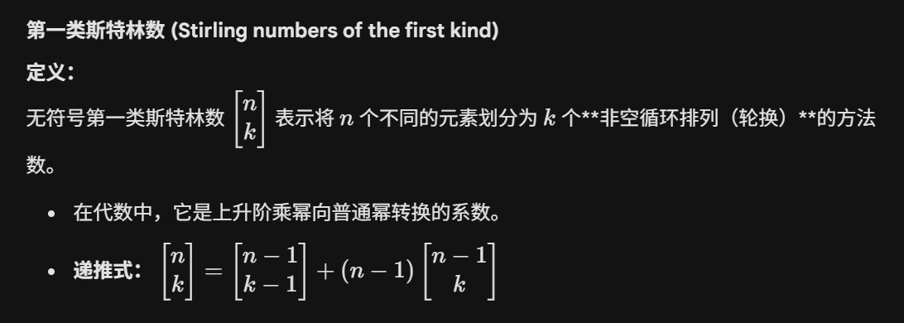

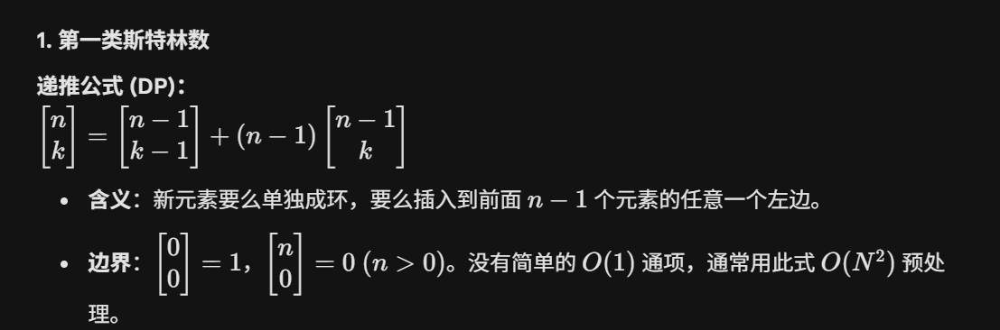

| **n\k** | **1** | **2** | **3** | **4** | **5** | **6** |
| ------- | ----- | ----- | ----- | ----- | ----- | ----- |
| **1**   | 1     |       |       |       |       |       |
| **2**   | 1     | 1     |       |       |       |       |
| **3**   | 2     | 3     | 1     |       |       |       |
| **4**   | 6     | 11    | 6     | 1     |       |       |
| **5**   | 24    | 50    | 35    | 10    | 1     |       |
| **6**   | 120   | 274   | 225   | 85    | 15    | 1     |

#### 第二类斯特林数

> **解决问题**：把 n 个不同的球放入 k 个互不区分的盒子中，每个盒子至少有一个球
> **时间复杂度**：$$O(k log n)$$（容斥公式）或 $O(nk)$（递推）
> **适用场景**：盒子不可区分且非空的分配问题

$$
把n个球放入到k个互不区分盒子中,且每个盒子至少有一个球的方案数称为:第二类斯特林数\\
我们设函数STL(n,k)为把n个球放入到k个互不区分盒子中,且每个盒子至少有一个球的方案数\\
则递推式为:\\
STL(n,k)=STL(n-1,k-1)+k*STL(n-1,k)\\
STL(n-1,k-1)代表新开一个盒子,k*STL(n-1,k)代表不新开一个盒子,在之前加入过的k个盒子内选一个加入\\\\
我们可以利用容斥原理求解:我们先赋予每个盒子一个编号,我们设A_i条件为i号盒子中没有球,S为全集\\
则\bigcup_{i=1}^k A_i代表至少有一个盒子中没有球,故S-\bigcup_{i=1}^k A_i代表盒子内都有球\\
S-\bigcup_{i=1}^k A_i=N((1 - A_1)(1 - A_2)\cdots(1 - A_k))=\sum_{i=0}^{k} (-1)^i \sum_{1 \leq j_1 < j_2 < \cdots < j_i \leq k} N(A_{j_1}A_{j_2}\ldots A_{j_i})\\
又因为我们赋予每个盒子一个编号,而实际上盒子之间是没有去别的,所以我们需要除去盒子排列的方案数\\
故方案数为:\frac{\sum_{i=0}^{k} (-1)^i \sum_{1 \leq j_1 < j_2 < \cdots < j_i \leq k} N(A_{j_1}A_{j_2}\ldots A_{j_i})}{k!}\\\\
第二类斯特林数有一个重要结论
n^m=\sum_{k=0}^{n}C_{n}^{k}\times STL(m,k)\times k!\\
n^m可以看成m个物体放入n个盒子的方案数,C_{n}^{k}在n个盒子中选k个盒子,STL(m,k)让这些盒子至少有一个物品,k!对盒子排列
$$

[image-20260423190523119](./笔记本嵌入图片/image-20260423190523119.png)

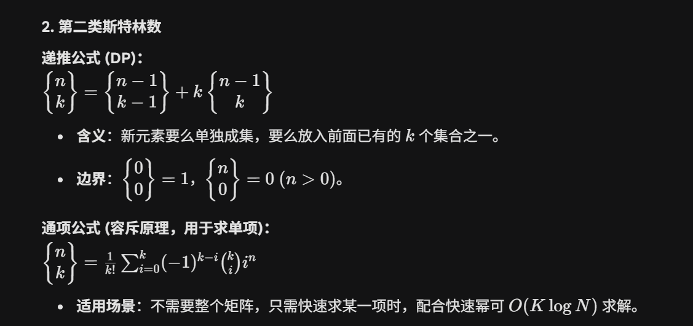

| **n\k** | **1** | **2** | **3** | **4** | **5** | **6** |
| ------- | ----- | ----- | ----- | ----- | ----- | ----- |
| **1**   | 1     |       |       |       |       |       |
| **2**   | 1     | 1     |       |       |       |       |
| **3**   | 1     | 3     | 1     |       |       |       |
| **4**   | 1     | 7     | 6     | 1     |       |       |
| **5**   | 1     | 15    | 25    | 10    | 1     |       |
| **6**   | 1     | 31    | 90    | 65    | 15    | 1     |

**递推式求**。

考虑S(n,m)可以由什么转移得到

1、S ( n − 1 , m − 1 ) ，将n − 1个不同元素划分为了m − 1个集合，则第n个元素必须单独放入第m个集合。方案数：
$$
S ( n − 1 , m − 1 )
$$
2、S ( n − 1 , m ) ，将n − 1个不同元素已经划分为了m个集合，则第n个元素可以放在m个集合中任意一个里面。方案数：
$$
S(n−1,m)∗m
$$
则可以得出递推式：
$$
S ( n , m ) = S ( n − 1 , m − 1 ) + S ( n − 1 , m ) ∗ m
$$
**S(0,0)=1**,用动态规划求，复杂度为$O(n^2)$。

**通向求**

```c++
int jc[N]; // 阶乘数组
int ksm(int di, int mi) {
    int ans = 1;
    while (mi) {
        if (mi & 1) {
            ans = (ans * di) % MOD;
        }
        mi >>= 1;
        di = (di * di) % MOD;
    }
    return ans;
}
int C(int a, int b) {
    return (((jc[a] * ksm(jc[b], MOD - 2)) % MOD) * ksm(jc[a - b], MOD - 2)) % MOD;
}
int STL(int n, int k) {//输入物品数,盒子数
    if (k > n) return 0;
    if (k == 0) return n == 0 ? 1 : 0;
    int sum = 0;
    for (int i = 0; i <= k; i++) {
        int term = C(k, i) * ksm(k - i, n) % MOD;
        if (i & 1) {
            sum = ((sum - term) % MOD + MOD) % MOD;
        } else {
            sum = (sum + term) % MOD;
        }
    }
    sum = sum * ksm(jc[k], MOD - 2) % MOD;
    return sum;
}
//下面是预处理
void yuchuli() {
    //预处理函数,在计算之前,直接调用即可
    jc[0] = 1;
    for (int i = 1; i < N; i++) {
        jc[i] = (jc[i - 1] * i) % MOD;
    }
}
```

#### 第三类斯特林数

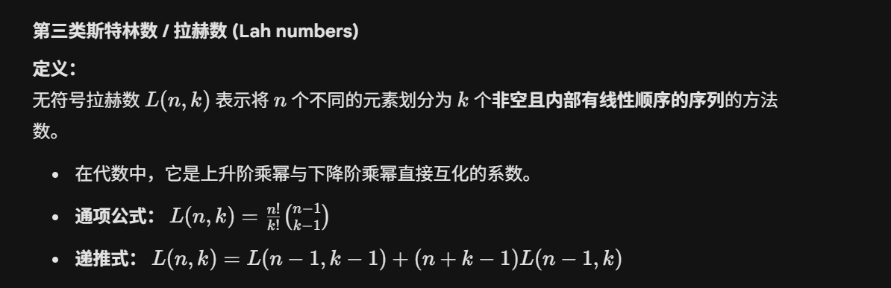

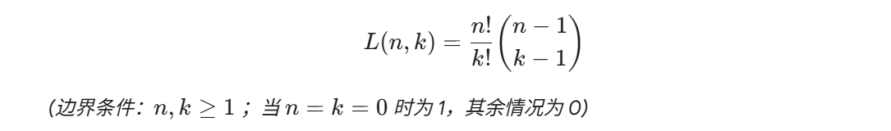


| **n\k** | **1** | **2** | **3** | **4** | **5** | **6** |
| ------- | ----- | ----- | ----- | ----- | ----- | ----- |
| **1**   | 1     |       |       |       |       |       |
| **2**   | 2     | 1     |       |       |       |       |
| **3**   | 6     | 6     | 1     |       |       |       |
| **4**   | 24    | 36    | 12    | 1     |       |       |
| **5**   | 120   | 240   | 120   | 20    | 1     |       |
| **6**   | 720   | 1800  | 1200  | 300   | 30    | 1     |

---

### 贝尔数【待补充】

> **解决问题**：n 个不同元素划分为任意个非空集合的方案总数
> **时间复杂度**：$$O(n^2)$$ 或 $O(n log n)$
> **适用场景**：集合划分总数

---

### 伯努利数【待补充】

> **解决问题**：用于等幂求和 ∑k^p 的公式
> **时间复杂度**：$$O(n^2)$$ 递推或 $O(n log n)$ NTT
> **适用场景**：整数幂和、多项式求和

---

### 分拆数【待补充】

> **解决问题**：把 n 拆分为正整数之和（顺序无关）的方案数
> **时间复杂度**：O(n√n)（五边形数定理）或 O(n^2) DP
> **适用场景**：整数拆分问题

---

### Pólya 计数 / Burnside 引理【待补充】

> **解决问题**：群作用下的染色计数（考虑对称性）
> **时间复杂度**：取决于置换群的规模
> **适用场景**：项链计数、正多面体染色等带对称性的计数问题

---

## 生成函数与多项式

### 常用化简公式

> **解决问题**：将生成函数中的无穷级数用有限公式代换
> **时间复杂度**：单次公式代换 $O(1)$，整体复杂度取决于后续多项式运算
> **适用场景**：生成函数推导的化简步骤

$$
遇到生成函数类型的题目时,通常采用如下流程:
\begin{cases}
1.将无穷级数字使用有限公式代换表示\\
2.将有限公式化简\\
3.拆开有限公式,重构无穷级数\\
4.取对应项系数作为答案
\end{cases}\\
牛顿二项式系数:
\binom{\alpha}{k} =
\begin{cases}
0 & k < 0 \\
1 & k = 0 \\
\dfrac{\alpha(\alpha-1)\cdots(\alpha-k+1)}{k!} & k > 0
\end{cases}\\
特别的,当\ n, m 皆为正整数且\ m \leq n\ 时：
\binom{n}{m} = C_n^m = \frac{n!}{m!(n-m)!}\\
牛顿二项式定理:(x+y)^a=\sum_{n=0}^{+\infty}\binom{a}{n}x^{n}y^{a-n}\\
对于生成函数，我们常用:
\frac{1}{(1-x)^a}=\sum_{n=0}^{+\infty}\binom{a+n-1}{n}x^n=\sum_{n=0}^{+\infty}C_{a+n-1}^{n}x^n(最后C的替换时满足上条件才成立)\\
如下为常用普通生成函数化简代换公式:\begin{cases}
1+x^1+x^2+...+x^n\Leftrightarrow \frac{1-x^{n+1}}{1-x}&(等比数列求和公式)\\
1+x^1+x^2+...\Leftrightarrow \frac{1}{1-x}&(牛顿二项式定理)\\
C_{1}^{0}+C_{2}^{1}x^1+C_{3}^{2}x^2+...\Leftrightarrow \frac{1}{(1-x)^2}&(牛顿二项式定理)\\
1+x^2+x^4+x^6+... \Leftrightarrow \frac{1}{1-x^2}\\
1+x^a+x^{2a}+x^{3a}+...\Leftrightarrow \frac{1}{1-x^a}\\
\end{cases}\\
如下为常用指数生成函数化简代换公式:\begin{cases}
\sum_{n=0}^{+\infty}\frac{x^n}{n!}=\sum=1+\frac{x}{1!}+\frac{x^{2}}{2!}....=e^x\\
\sum_{n=0}^{+\infty}\frac{(cx)^n}{n!}=1+\frac{(cx)}{1!}+\frac{(cx)^{2}}{2!}....=e^{cx}\\
\sum_{n=k}^{+\infty}\binom{n}{k}\frac{x^n}{n!}=\frac{x^k}{k!}e^x\\
\sum_{n=0}^{+\infty}\frac{x^{2n+1}}{(2n+1)!}=\frac{x}{1!}+\frac{x^{3}}{3!}+\frac{x^{5}}{5!}...=\frac{e^x-e^{-x}}{2}\\
\sum_{n=0}^{+\infty}\frac{x^{2n}}{(2n)!}=1+\frac{x^2}{2!}+\frac{x^{4}}{4!}+\frac{x^{6}}{6!}...=\frac{e^x+e^{-x}}{2}\\
\end{cases}
$$

### 普通生成函数 (OGF) — 组合数问题

> **解决问题**：用生成函数之间的乘法来快速计算复杂限制条件下的组合数
> **时间复杂度**：取决于展开方式
> **适用场景**：各个变量有不同限制的不定方程方案数统计

$$
对于不定方程:x_1+x_2+...+x_k=n,其中x_1,x_2...x_k分别由多项约束性质,我们可以使用普通生成函数来求解\\
对于我们将加法原理转化为幂相乘时指数上的加法以及系数的合并同类项,乘法原理转换为同底幂的加法\\使用生成函数之间的乘法来快速计算组合\\
比如x_1+x_2+...+x_k=n,其中x_1不能超过a,x_2是b的倍数,x_3不能比c小,x_4在d到e之间.....\\
我们可以构造\begin{cases}
a_1的生成函数(1+x+...+x^a)\\
a_2的生成函数(1+x^b+x^{2b}+....)\\
a_3的生成函数(x^c+x^{c+1}+x^{c+2}....)\\
a_4的生成函数(x^d+x^{d+1}+...+x^{e})\\
.......
\end{cases}\\
通过将上述所有生成函数相乘,再取第n项x^n的系数,即可得到我们想要的组合数\\
\\
例:x_1+x_2+x_3=6,其中x_1不能超过1,x_2是2的倍数,x_3不能比3小\\
则所有生成函数相乘为:(1+x)(1+x^2+x^4+x^6)(x^3+x^4+x^5+x^6)\\
化简后得到多项式:x^3 + 2x^4 + 3x^5 + 4x^6 + 4x^7 + 4x^8 + 4x^9 + 4x^{10} + 3x^{11} + 2x^{12} + x^{13}\\
故x^6的系数4为答案
$$

### 指数生成函数 (EGF) — 排列数问题

> **解决问题**：用指数生成函数解决带限制的排列数问题
> **时间复杂度**：取决于展开方式
> **适用场景**：有重复限制的排列数统计

$$
数列\{a_n\}对应的指数生成函数为:\sum_{n=0}^{+\infty}a_n\frac{x^n}{n!}\\
我们可以构造指数生成函数,来解决排列数问题,其计算方法与组合数的总生成函数类似,合并再展开\\
通过将所有指数生成函数相乘,再取第n项\frac{x^n}{n!}这个整体的系数,即可得到我们想要的排列数\\\\
例:1,2,3组成的数字中,要求1必须出现但不能出现超过两次,2出现不能超过两次,3出现偶数次,求所形成的五位数的个数\\
则可得到多项式:(\frac{x}{1!}+\frac{x^{2}}{2!})(1+\frac{x}{1!}+\frac{x^{2}}{2!})(1+\frac{x^{2}}{2!}+\frac{x^{4}}{4!})\\
展开后得:x+\frac{3x^2}{2}+\frac{3x^3}{2}+x^{4}+\frac{13x^{5}}{24}+\frac{3x^{6}}{16}+\frac{x^7}{24}+\frac{x^8}{96}\\
我们取第五项\frac{x^5}{5!}的式子\frac{13x^{5}}{24},可化为\frac{13*5!}{24}*\frac{x^5}{5!}\\
故方案数为:\frac{13*5!}{24}=65种
$$

---
### FFT / NTT 多项式卷积

> **解决问题**：快速计算两个多项式或序列的卷积
> **时间复杂度**：$O(L\log L)$，$L$ 为不小于结果长度的最小二次幂
> **适用场景**：大规模多项式乘法、计数卷积；要求精确模结果时优先 NTT

给定系数数组 `A、B`，卷积结果满足

$$
C_k=\sum_{i+j=k}A_iB_j.
$$

若长度分别为 `n、m`，结果长度是 `n+m-1`。朴素算法为 $O(nm)$；FFT/NTT 把复杂度降到 $O(L\log L)$，其中 `L` 是不小于 `n+m-1` 的最小二次幂。

- FFT：支持整数或实数卷积，但存在浮点误差。
- NTT：结果精确，但模数和变换长度必须满足条件。比赛最常用模数是 `998244353`。

#### FFT：整数卷积

```c++
#include <bits/stdc++.h>
using namespace std;

using ll=long long;
using cd=complex<double>;
const double PI=acos(-1.0);

void fft(vector<cd>&a,bool inv){
    int n=a.size();
    // 位逆序：迭代 FFT 的固定开头。
    for(int i=1,j=0;i<n;++i){
        int b=n>>1;
        for(;j&b;b>>=1) j^=b;
        j^=b;
        if(i<j) swap(a[i],a[j]);
    }
    // len 是当前合并段长度，前后两半各有 len/2 项。
    for(int len=2;len<=n;len<<=1){
        double ang=2*PI/len*(inv?-1:1);
        cd wn(cos(ang),sin(ang));
        for(int l=0;l<n;l+=len){
            cd w(1);
            for(int i=0;i<len/2;++i){
                cd x=a[l+i],y=w*a[l+i+len/2];
                a[l+i]=x+y;
                a[l+i+len/2]=x-y;
                w*=wn;
            }
        }
    }
    // 逆变换必须除以 n。
    if(inv) for(cd&x:a) x/=n;
}

vector<ll> conv_fft(const vector<ll>&A,const vector<ll>&B){
    if(A.empty()||B.empty()) return {};
    int need=A.size()+B.size()-1,lim=1;
    while(lim<need) lim<<=1;
    vector<cd> a(lim),b(lim);
    for(int i=0;i<(int)A.size();++i) a[i]=A[i];
    for(int i=0;i<(int)B.size();++i) b[i]=B[i];
    fft(a,false); fft(b,false);
    for(int i=0;i<lim;++i) a[i]*=b[i];
    fft(a,true);
    vector<ll> c(need);
    // llround 对正数、负数都按最近整数取整。
    for(int i=0;i<need;++i) c[i]=llround(a[i].real());
    return c;
}
```

调用：`vector<ll> c=conv_fft(a,b);`。若系数很大，浮点误差可能导致错一；这时使用多模 NTT/CRT 或拆系数。最终答案还必须能放入 `long long`。

#### NTT：模 `998244353` 的精确卷积

`998244353=119*2^23+1`，原根为 3，所以变换长度必须是二次幂且不能超过 `2^23`。

```c++
#include <bits/stdc++.h>
using namespace std;

const int MOD=998244353,G=3;

int qpow(int a,long long b){
    int r=1;
    while(b){
        if(b&1) r=1LL*r*a%MOD;
        a=1LL*a*a%MOD;
        b>>=1;
    }
    return r;
}

void ntt(vector<int>&a,bool inv){
    int n=a.size();
    for(int i=1,j=0;i<n;++i){
        int b=n>>1;
        for(;j&b;b>>=1) j^=b;
        j^=b;
        if(i<j) swap(a[i],a[j]);
    }
    for(int len=2;len<=n;len<<=1){
        int wn=qpow(G,(MOD-1)/len);
        if(inv) wn=qpow(wn,MOD-2);
        for(int l=0;l<n;l+=len){
            int w=1;
            for(int i=0;i<len/2;++i){
                int x=a[l+i];
                int y=1LL*w*a[l+i+len/2]%MOD;
                a[l+i]=x+y<MOD?x+y:x+y-MOD;
                a[l+i+len/2]=x-y>=0?x-y:x-y+MOD;
                w=1LL*w*wn%MOD;
            }
        }
    }
    if(inv){
        int iv=qpow(n,MOD-2);
        for(int&x:a) x=1LL*x*iv%MOD;
    }
}

vector<int> conv_ntt(vector<int>A,vector<int>B){
    if(A.empty()||B.empty()) return {};
    for(int&x:A){ x%=MOD; if(x<0) x+=MOD; }
    for(int&x:B){ x%=MOD; if(x<0) x+=MOD; }
    int need=A.size()+B.size()-1,lim=1;
    while(lim<need) lim<<=1;
    if(lim>(1<<23)) return {}; // 当前模数不支持更长变换
    A.resize(lim); B.resize(lim);
    ntt(A,false); ntt(B,false);
    for(int i=0;i<lim;++i) A[i]=1LL*A[i]*B[i]%MOD;
    ntt(A,true);
    A.resize(need);
    return A;
}
```

常用调用：

```c++
int n,m;
cin>>n>>m; // 输入的是最高次数，所以数组长度分别为 n+1、m+1
vector<int> a(n+1),b(m+1);
for(int&x:a) cin>>x;
for(int&x:b) cin>>x;
vector<int> c=conv_ntt(a,b);
for(int i=0;i<(int)c.size();++i)
    cout<<c[i]<<" \n"[i+1==(int)c.size()];
```

易错点：

- `need=n+m-1` 使用的是数组长度，不是最高次数。
- 正变换后逐点相乘，最后必须做逆变换。
- FFT 逆变换除以 `lim`；NTT 逆变换乘 `lim` 的逆元。
- NTT 输入负数要先规范到 `[0,MOD)`；本模板已在 `conv_ntt` 内处理。
- `lim>2^23` 时不能继续使用该模数的这份模板

---

### 单位根反演【待补充】

> **解决问题**：处理按模 k 分类求和的计数问题，$[k \mid n] = \frac{1}{k}\sum_{j=0}^{k-1} \omega_k^{jn}$
> **时间复杂度**：O(k) 单次
> **适用场景**：组合数按模分类求和、周期性计数、配合 NTT 使用

---

### 多项式全家桶（求逆/exp/ln/开根）【待补充】

> **解决问题**：多项式高级运算
> **时间复杂度**：$O(n log n)$ 到 $O(n log^2 n)$
> **适用场景**：生成函数的高级运算、常系数线性递推的前置

---

### Lagrange 反演 / 常系数线性递推【待补充】

> **解决问题**：Lagrange 反演用于从复合逆中提取系数；常系数齐次线性递推用于快速求第 n 项
> **时间复杂度**：$O(k log k log n)$
> **适用场景**：递推式的快速求第 n 项

---

## 线性代数

### 矩阵计算

> **解决问题**：进行矩阵加法、减法、乘法、快速幂运算
> **时间复杂度**：矩阵乘法 O(n^3)，快速幂 O(n^3 log k)
> **适用场景**：递推公式的加速、图论中的路径计数、线性递推

$$
三角函数的递推关系可以写成矩阵形式:\\
\sin(A \pm B) = \sin A \cos B \pm \cos A \sin B\\
\cos(A \pm B) = \cos A \cos B \mp \sin A \sin B\\
我们已知\sin(A),\cos(A)与B可以得出:\\
[\sin(A+B),\cos(A+B)]=[\sin(A),\cos(A)]\times
\begin{bmatrix}
\cos B & -\sin B\\
\sin B & \cos B
\end{bmatrix}\\
为了递推的方便,可以讲初始矩阵设置成:\begin{bmatrix}
\cos A  & -\sin A\\
\sin A  & \cos A
\end{bmatrix}\\
累加递推关系:
\begin{bmatrix}
\cos(A+B) & -\sin(A+B)\\
\sin(A+B) & \cos(A+B)
\end{bmatrix}=
\begin{bmatrix}
\cos A & -\sin A\\
\sin A & \cos A
\end{bmatrix}\times \begin{bmatrix}
\cos B & -\sin B\\
\sin B & \cos B
\end{bmatrix}\\
累减递推关系：
\begin{bmatrix}
\cos(A-B) & -\sin(A-B)\\
\sin(A-B) & \cos(A-B)
\end{bmatrix}
=
\begin{bmatrix}
\cos A & -\sin A\\
\sin A & \cos A
\end{bmatrix}
\times
\begin{bmatrix}
\cos B & \sin B\\
-\sin B & \cos B
\end{bmatrix}\\
$$

```c++
int matrixsize = 2;

struct matrix {
    vector<vector<int> > jz;

    matrix() {
        jz.assign(matrixsize, vector<int>(matrixsize));
    }

    void clear() {
        //清空矩阵
        for (int i = 0; i < matrixsize; i++) {
            for (int j = 0; j < matrixsize; j++) {
                jz[i][j] = 0;
            }
        }
    }

    void init() {
        //初始化为单位矩阵
        clear();
        for (int i = 0; i < matrixsize; i++) {
            jz[i][i] = 1;
        }
    }

    matrix operator +(const matrix &dx) {
        matrix ls;
        for (int i = 0; i < matrixsize; i++) {
            for (int j = 0; j < matrixsize; j++) {
                ls.jz[i][j] = jz[i][j] + dx.jz[i][j];
            }
        }
        return ls;
    }

    matrix operator -(const matrix &dx) {
        matrix ls;
        for (int i = 0; i < matrixsize; i++) {
            for (int j = 0; j < matrixsize; j++) {
                ls.jz[i][j] = jz[i][j] - dx.jz[i][j];
            }
        }
        return ls;
    }

    matrix operator *(const matrix &dx) {
        matrix ls;
        for (int i = 0; i < matrixsize; i++) {
            for (int j = 0; j < matrixsize; j++) {
                for (int k = 0; k < matrixsize; k++) {
                    ls.jz[i][j] = ls.jz[i][j] + jz[i][k] * dx.jz[k][j];
                }
            }
        }
        return ls;
    }

    matrix ksm(int mi) {
        //返回该矩阵的这么多幂次方
        matrix ls, di = *this;
        ls.init();
        while (mi) {
            if (mi & 1) {
                ls = ls * di;
            }
            mi >>= 1;
            di = di * di;
        }
        return ls;
    }
};
```

### 高斯消元

> **解决问题**：求线性方程组的一组解、判断无解/唯一解/多解，并求系数矩阵的秩
> **时间复杂度**：一般为 $O(nm\min(n,m))$；方阵可记作 $O(n^3)$
> **适用场景**：实数线性方程、质数模意义下的线性方程、异或方程组

> 下文的 $\oplus$ 是对当前数域中消元运算的统一表示：实数域对应普通加减，质数模域对应模意义下加减，只有异或方程中才是真的 XOR。

$$
求解线性方程组x的值,形如
\begin{cases}
a_{11}x_{1}⊕a_{12}x_{2}⊕a_{13}x_{3}⊕...⊕a_{1m}x_{m}=b_1\\
a_{21}x_{1}⊕a_{22}x_{2}⊕a_{23}x_{3}⊕...⊕a_{2m}x_{m}=b_2\\
....\\
a_{n1}x_{1}⊕a_{n2}x_{2}⊕a_{n3}x_{3}⊕...⊕a_{nm}x_{m}=b_n\\
\end{cases}其中⊕为运算符号\\
对于上述线性方程组,我们可以写成如下形式:\\
\begin{bmatrix}
a_{11}&a_{12}&a_{13}&....&a_{1m}\\
a_{21}&a_{22}&a_{23}&....&a_{2m}\\
...\\
a_{n1}&a_{n2}&a_{n3}&....&a_{nm}\\
\end{bmatrix}\times\begin{bmatrix}
x_1\\
x_2\\
...\\
x_m
\end{bmatrix}=\begin{bmatrix}
b_1\\
b_2\\
...\\
b_n
\end{bmatrix}\\
为了求解如上线性方程组,我们可以将线性方程组写成增广矩阵形式:\\
\begin{bmatrix}
a_{11}&a_{12}&a_{13}&....&a_{1m}&b_1\\
a_{21}&a_{22}&a_{23}&....&a_{2m}&b_2\\
...\\
a_{n1}&a_{n2}&a_{n3}&....&a_{nm}&b_n\\
\end{bmatrix}
\\
对于增广矩阵运算,满足如下性质\begin{cases}
交换两行结果不变\\
对某一行每个元素同时做某操作结果不变&(操作要满足⊕运算的性质)\\
将某一行⊕运算到另一行结果不变
\end{cases}\\
利用上述性质，我们可以使用高斯消元来求解\\
高斯消元流程:\begin{cases}
0.设置当前秩=0,逐步扩大秩\\
1.枚举主元列x_i,从秩+1行往后找到该列系数不为0的某一行，找不到则直接跳过,找下一列\\
2.将该行与当前秩+1行元素交换\\
3.将该行进行变换,使得其主元行上的系数为1\\
4.将该行⊕运算到其余行，使得除秩+1行外其余行系数为0\\
5.秩增加1,依次进行上述操作,直到矩阵变为行阶梯型矩阵\\
\end{cases}\\
我们可以通过系数矩阵 $A$ 与增广矩阵 $[A|b]$ 的秩来判断解的情况（$m$ 为未知数个数）：\\
\begin{cases}
无解:\operatorname{rank}(A)<\operatorname{rank}([A|b])\\
唯一解:\operatorname{rank}(A)=\operatorname{rank}([A|b])=m\\
存在自由变量:\operatorname{rank}(A)=\operatorname{rank}([A|b])<m
\end{cases}
$$

在实数、复数等无限域上，存在自由变量意味着无穷多解；在有限域 $\mathbb F_q$ 上则有 $q^{m-\operatorname{rank}(A)}$ 个解，应该称为“多解”而不是“无穷多解”。

含 $n$ 个方程、$m$ 个未知数的方程组可以写成 $Ax=b$，消元时直接维护增广矩阵 $[A\mid b]$：

$$
[A\mid b]=
\begin{bmatrix}
a_{11}&a_{12}&\cdots&a_{1m}&b_1\\
a_{21}&a_{22}&\cdots&a_{2m}&b_2\\
\vdots&\vdots&\ddots&\vdots&\vdots\\
a_{n1}&a_{n2}&\cdots&a_{nm}&b_n
\end{bmatrix}
$$

依次枚举未知数列，为每一列寻找非零主元；找到后交换到当前行，将主元化为 $1$，再消去其他行的这一列。没有主元的列对应自由变量。设系数矩阵的秩为 $rk$：

- 出现形如 $[0,0,\ldots,0\mid c]$ 且 $c\ne0$ 的行：无解。
- 没有矛盾行且 $rk=m$：唯一解。
- 没有矛盾行且 $rk<m$：多解；自由变量个数为 $m-rk$。

不同数域的“非零、除法、减法”完全不同，不能混用板子：

| 方程中的运算 | 使用板子 | 说明 |
| --- | --- | --- |
| 普通小数/实数四则运算 | `gaosi_real` | 用 `double` 和 `eps` 判断零，主元选绝对值最大的一行 |
| 所有运算对质数 $p$ 取模 | `gaosi_mod` | 除法改为乘逆元；原来的 `gaosi` 实际上就是这一类 |
| 系数和答案只有 `0/1`，加法是 XOR | `gaosi_xor` | 在 $\mathbb F_2$ 上消元，用 `bitset` 加速整行异或 |

三份代码统一约定：`0=无解，1=唯一解，2=多解`。只要不是无解，`ans` 都保存一组可行解；多解时把所有自由变量设为 `0`。矩阵、未知数和方程全部采用 **0-based**。

> **不要直接套用**：要求整数精确解、分数精确解或模数为合数时，普通除法/费马逆元可能不存在，需要另外处理；这几类不放入 ICPC 常用高斯消元板子。

#### 实数高斯消元


```c++
struct gaosi_real {
    double eps;
    vector<double> ans;       // 有解时保存一组解
    vector<int> where;        // where[i]表示变量i所在的主元行，-1为自由变量
    int rk;                   // 系数矩阵的秩
    int status;               // 0=无解，1=唯一解，2=多解

    gaosi_real(double e = 1e-10) : eps(e), rk(0), status(0) {
    }

    // a是0-based增广矩阵：n行m+1列，最后一列为常数项
    // 返回值：0=无解，1=唯一解，2=多解；多解时自由变量取0
    int solve(vector<vector<double>> a) {
        int n = a.size(), m = a[0].size() - 1;
        ans.assign(m, 0);
        where.assign(m, -1);
        rk = 0;
        status = 0;

        for (int col = 0, row = 0; col < m && row < n; ++col) {
            // 选绝对值最大的主元，减小浮点误差
            int pivot = row;
            for (int i = row + 1; i < n; ++i)
                if (fabs(a[i][col]) > fabs(a[pivot][col]))
                    pivot = i;
            if (fabs(a[pivot][col]) < eps) continue;

            swap(a[row], a[pivot]);
            where[col] = row;

            double div = a[row][col];
            for (int j = col; j <= m; ++j)
                a[row][j] /= div;

            // 化成最简行阶梯形，便于直接提取一组解
            for (int i = 0; i < n; ++i) {
                if (i == row || fabs(a[i][col]) < eps) continue;
                double f = a[i][col];
                for (int j = col; j <= m; ++j)
                    a[i][j] -= f * a[row][j];
            }
            ++row;
            ++rk;
        }

        // 出现0=c且c非0的行则无解
        for (int i = 0; i < n; ++i) {
            bool all_zero = 1;
            for (int j = 0; j < m; ++j)
                if (fabs(a[i][j]) >= eps)
                    all_zero = 0;
            if (all_zero && fabs(a[i][m]) >= eps) return status = 0;
        }

        // 自由变量保持0，主元变量直接取对应行常数项
        for (int i = 0; i < m; ++i)
            if (where[i] != -1)
                ans[i] = a[where[i]][m];
        return status = (rk == m ? 1 : 2);
    }

    // 无解返回空数组；唯一解返回答案；多解返回自由变量全取0的一组特解
    vector<double> get_solution() const {
        if (status == 0) return {};
        return ans;
    }
};
```

**使用说明**

```c++
int n, m;
cin >> n >> m;
vector<vector<double>> a(n, vector<double>(m + 1));
for (int i = 0; i < n; ++i)
    for (int j = 0; j <= m; ++j)
        cin >> a[i][j];

gaosi_real gs;
int res = gs.solve(a);       // a是0-based增广矩阵，原矩阵不会被修改
// res=0无解；res=1唯一解；res=2多解
vector<double> x = gs.get_solution();
// res!=0时x[0..m-1]是一组解；res==0时x为空；gs.rk为系数矩阵的秩
```

浮点消元必须使用 `eps` 判断零，不能直接与 `0` 比较。若题目误差要求特殊，可在构造时调整：`gaosi_real gs(1e-12);`。

#### 质数模高斯消元

> 所有加减乘除都在 $\mathbb F_p$ 上进行，`p` 必须是质数。原来的 `gaosi` 板子其实就是固定模数 `998244353` 的这一类，并不能求普通实数方程。

```c++
struct gaosi_mod {
    int mod;
    vector<int> ans;       // 有解时保存一组解
    vector<int> where;     // where[i]表示变量i所在的主元行，-1为自由变量
    int rk;                // 系数矩阵的秩
    int status;            // 0=无解，1=唯一解，2=多解

    gaosi_mod(int p = 998244353) : mod(p), rk(0), status(0) {
    }

    int norm(int x) {
        x %= mod;
        if (x < 0) x += mod;
        return x;
    }

    int qpow(int x, int y) {
        int res = 1;
        while (y) {
            if (y & 1) res = 1LL * res * x % mod;
            x = 1LL * x * x % mod;
            y >>= 1;
        }
        return res;
    }

    // a是0-based增广矩阵，允许传入负数和大于mod的数
    // 返回值：0=无解，1=唯一解，2=多解；多解时自由变量取0
    int solve(vector<vector<int>> a) {
        int n = a.size(), m = a[0].size() - 1;
        ans.assign(m, 0);
        where.assign(m, -1);
        rk = 0;
        status = 0;
        for (int i = 0; i < n; ++i)
            for (int j = 0; j <= m; ++j)
                a[i][j] = norm(a[i][j]);

        for (int col = 0, row = 0; col < m && row < n; ++col) {
            int pivot = -1;
            for (int i = row; i < n; ++i) {
                if (a[i][col]) {
                    pivot = i;
                    break;
                }
            }
            if (pivot == -1) continue;
            swap(a[row], a[pivot]);
            where[col] = row;

            int inv = qpow(a[row][col], mod - 2);
            for (int j = col; j <= m; ++j)
                a[row][j] = 1LL * a[row][j] * inv % mod;

            for (int i = 0; i < n; ++i) {
                if (i == row || !a[i][col]) continue;
                int f = a[i][col];
                for (int j = col; j <= m; ++j)
                    a[i][j] = norm(a[i][j] - 1LL * f * a[row][j] % mod);
            }
            ++row;
            ++rk;
        }

        for (int i = 0; i < n; ++i) {
            bool all_zero = 1;
            for (int j = 0; j < m; ++j)
                if (a[i][j])
                    all_zero = 0;
            if (all_zero && a[i][m]) return status = 0;
        }

        for (int i = 0; i < m; ++i)
            if (where[i] != -1)
                ans[i] = a[where[i]][m];
        return status = (rk == m ? 1 : 2);
    }

    // 无解返回空数组；唯一解返回答案；多解返回自由变量全取0的一组特解
    vector<int> get_solution() const {
        if (status == 0) return {};
        return ans;
    }
};
```

**使用说明**

```c++
int n, m;
cin >> n >> m;
vector<vector<int>> a(n, vector<int>(m + 1));
for (int i = 0; i < n; ++i)
    for (int j = 0; j <= m; ++j)
        cin >> a[i][j];

gaosi_mod gs(998244353); // 构造参数必须是质数
int res = gs.solve(a);    // a是0-based增广矩阵，原矩阵不会被修改
// res=0无解；res=1唯一解；res=2多解，共有mod^(m-rk)组解
vector<int> x = gs.get_solution();
// res!=0时x是一组模mod意义下的解；res==0时x为空
```

#### 异或高斯消元

> 方程形如 $a_{i0}x_0\oplus a_{i1}x_1\oplus\cdots\oplus a_{i,m-1}x_{m-1}=b_i$，所有系数、未知数和常数项都只取 `0/1`。

```c++
const int GAOSI_XOR_MAXM = 1005; // 最大未知数个数，赛场按需调整
struct gaosi_xor {
    vector<bitset<GAOSI_XOR_MAXM + 1>> a; // n行增广矩阵
    vector<int> ans;                       // 有解时保存一组0/1解
    vector<int> where;                     // where[i]表示变量i所在的主元行
    int rk;                                // 系数矩阵的秩
    int status;                            // 0=无解，1=唯一解，2=多解

    gaosi_xor() : rk(0), status(0) {
    }

    // mat是0-based的0/1增广矩阵，每个元素只保留最低位
    // 返回值：0=无解，1=唯一解，2=多解；多解时自由变量取0
    int solve(const vector<vector<int>> &mat) {
        int n = mat.size(), m = mat[0].size() - 1;
        a.assign(n, bitset<GAOSI_XOR_MAXM + 1>());
        ans.assign(m, 0);
        where.assign(m, -1);
        rk = 0;
        status = 0;
        for (int i = 0; i < n; ++i)
            for (int j = 0; j <= m; ++j)
                a[i][j] = mat[i][j] & 1;

        for (int col = 0, row = 0; col < m && row < n; ++col) {
            int pivot = -1;
            for (int i = row; i < n; ++i) {
                if (a[i][col]) {
                    pivot = i;
                    break;
                }
            }
            if (pivot == -1) continue;
            swap(a[row], a[pivot]);
            where[col] = row;

            for (int i = 0; i < n; ++i) {
                if (i != row && a[i][col])
                    a[i] ^= a[row];
            }
            ++row;
            ++rk;
        }

        for (int i = 0; i < n; ++i) {
            bool all_zero = 1;
            for (int j = 0; j < m; ++j)
                if (a[i][j])
                    all_zero = 0;
            if (all_zero && a[i][m]) return status = 0;
        }

        for (int i = 0; i < m; ++i)
            if (where[i] != -1)
                ans[i] = a[where[i]][m];
        return status = (rk == m ? 1 : 2);
    }

    // 无解返回空数组；唯一解返回答案；多解返回自由变量全取0的一组特解
    vector<int> get_solution() const {
        if (status == 0) return {};
        return ans;
    }
};
```

**使用说明**

```c++
int n, m;
cin >> n >> m;
vector<vector<int>> a(n, vector<int>(m + 1));
for (int i = 0; i < n; ++i)
    for (int j = 0; j <= m; ++j)
        cin >> a[i][j];

gaosi_xor gx;
int res = gx.solve(a); // a是0-based增广矩阵
// res=0无解；res=1唯一解；res=2多解，共有2^(m-rk)组解
vector<int> x = gx.get_solution();
// res!=0时x是一组0/1解；res==0时x为空
```

`bitset` 的长度必须在编译期确定；若未知数个数可能超过 `GAOSI_XOR_MAXM`，赛前按题目范围调大。传入的 `vector<vector<int>>` 会在 `solve` 内转成 `bitset`，异或消元不需要除法，整行消去直接使用 `a[i] ^= a[row]`。

### 异或性质

$$
a + b = (a \oplus b) + 2\cdot(a \mathrel{\&} b)
$$
$$
a + b = (a \mid b) + (a \mathrel{\&} b)
$$

$$
a \mid b = (a \oplus b) + (a \mathrel{\&} b)
$$

$$
a \mathrel{\&} b = \frac{(a+b) - (a \oplus b)}{2}
$$
$$
a \oplus b = (a+b) - 2\cdot(a \mathrel{\&} b)
$$

$$
a \oplus b = (a \mid b) - (a \mathrel{\&} b)
$$

$$
a \mid b = (a \oplus b) + (a \mathrel{\&} b)
$$

- 对与的分配律：$(a \oplus b) \mathrel{\&} c = (a \mathrel{\&} c) \oplus (b \mathrel{\&} c)$
- 对或 **没有** 分配律

### 线性基

> **解决问题**：求异或向量空间的基，支持判断一个数能否被已插入的数异或表示、求最大异或和等
> **时间复杂度**：插入 O(log V)，查询 O(log V)
> **适用场景**：异或相关的极值问题、线性相关判断、图中异或路径

**正确定义：**

- 把每个非负整数看成二进制向量，运算位于有限域 $\mathbb F_2$ 上：向量加法是异或，系数只能取 `0/1`。
- 一组向量线性无关，当且仅当 $c_1v_1\oplus c_2v_2\oplus\cdots\oplus c_kv_k=0$（$c_i\in\{0,1\}$）只能推出所有 $c_i=0$。
- 线性基是原集合中最大线性无关组。若基的大小为 `rk`，则能够异或表示出恰好 $2^{rk}$ 个不同数。
- 代码按最高位保存基向量，相当于在 $\mathbb F_2$ 上做高斯消元；`query` 判断能否表示，`getmax` 求可表示的最大异或值。

```c++
const int maxsize = 64; //数字最高位
struct xianxingji {
    int xxj[maxsize]; //xxj[i]表示最高位为第i位的线性基
    xianxingji() {
        for (int i = 0; i < maxsize; i++) {
            xxj[i] = 0;
        }
    }

    void add(int dq) {
        //讲dq这个数字加入到线性基中去
        for (int i = maxsize - 1; i >= 0; i--) {
            if ((dq >> i) & 1) {
                if (xxj[i]) {
                    dq ^= xxj[i];
                } else {
                    xxj[i] = dq;
                    return;
                }
            }
        }
    }

    bool query(int dq) {
        //判断dq是否能用已经存在的线性基表示
        for (int i = maxsize - 1; i >= 0; i--) {
            if ((dq >> i) & 1) {
                if (xxj[i]) {
                    dq ^= xxj[i];
                } else {
                    return 0;
                }
            }
        }
        return 1;
    }

    int getmax() {
        int ans = 0;
        for (int i = maxsize - 1; i >= 0; i--) {
            if ((ans ^ xxj[i]) > ans) {
                ans ^= xxj[i];
            }
        }
        return ans;
    }
};
```

---

### 行列式

> **解决问题**：计算矩阵行列式的值
> **时间复杂度**：$O(n^3)$
> **适用场景**：矩阵树定理前置、线性代数推导

```c++
// Bareiss 算法，O(n^3)，整数精确行列式
int determinant(vector<vector<int> > a) {//传入动态数组，返回值
    int n = (int) a.size();
    if (n == 0) return 1;
    for (int i = 0; i < n; ++i) {
        if ((int) a[i].size() != n) return 0;
    }
    int sign = 1;
    int prev = 1;
    for (int k = 0; k < n - 1; ++k) {
        // 部分主元：选列内绝对值最大的行，控制中间数大小，减少溢出
        int pivot = k;
        for (int i = k + 1; i < n; ++i) {
            if (llabs(a[i][k]) > llabs(a[pivot][k])) {
                pivot = i;
            }
        }
        if (a[pivot][k] == 0) return 0;
        if (pivot != k) {
            swap(a[k], a[pivot]);
            sign = -sign;
        }

        int p = a[k][k];
        for (int i = k + 1; i < n; ++i) {
            for (int j = k + 1; j < n; ++j) {
                __int128 val = (__int128) a[i][j] * p - (__int128) a[i][k] * a[k][j];
                a[i][j] = (int) (val / prev);
            }
        }
        prev = p;
    }
    return sign * a[n - 1][n - 1];
}
```

### 矩阵树定理

> **解决问题**：计算无向图/有向图的生成树个数
> **时间复杂度**：$O(n^3)$
> **适用场景**：生成树计数、完全图生成树公式

```c++
const int MOD = 998244353; // 按需修改模数

struct juzhenshu {
    // 快速幂求模逆元
    int qpow(int a, int b) {
        int res = 1;
        while (b) {
            if (b & 1) res = res * a % MOD;
            a = a * a % MOD;
            b >>= 1;
        }
        return res;
    }

    // 求n阶矩阵a的行列式（模MOD），矩阵1基索引
    int det(vector<vector<int>> a, int n) {
        int res = 1;
        for (int i = 1; i <= n; ++i) {
            int pos = -1;
            for (int j = i; j <= n; ++j) {
                if (a[j][i]) {
                    pos = j;
                    break;
                }
            }
            if (pos == -1) return 0;
            if (pos != i) swap(a[i], a[pos]), res = (MOD - res) % MOD;
            int inv = qpow(a[i][i], MOD - 2);
            for (int j = i + 1; j <= n; ++j) {
                int f = a[j][i] * inv % MOD;
                for (int k = i; k <= n; ++k)
                    a[j][k] = (a[j][k] - f * a[i][k] % MOD + MOD) % MOD;
            }
        }
        for (int i = 1; i <= n; ++i) res = res * a[i][i] % MOD;
        return res;
    }

    // 无向图生成树总数，n个点，edges为边列表
    int count_undir(int n, vector<pair<int, int>> &edges) {
        vector<vector<int>> lap(n + 1, vector<int>(n + 1, 0));
        for (auto &e : edges) {
            int u = e.first, v = e.second;
            if (u == v) continue; // 忽略自环
            lap[u][u] = (lap[u][u] + 1) % MOD;
            lap[v][v] = (lap[v][v] + 1) % MOD;
            lap[u][v] = (lap[u][v] - 1 + MOD) % MOD;
            lap[v][u] = (lap[v][u] - 1 + MOD) % MOD;
        }
        // 去掉第n行第n列，求n-1阶主子式
        vector<vector<int>> mat(n, vector<int>(n, 0));
        for (int i = 1; i < n; ++i)
            for (int j = 1; j < n; ++j)
                mat[i][j] = lap[i][j];
        return det(mat, n - 1);
    }

    // 有向图：以root为根的外向生成树数
    int count_out(int n, int root, vector<pair<int, int>> &edges) {
        vector<vector<int>> lap(n + 1, vector<int>(n + 1, 0));
        for (auto &e : edges) {
            int u = e.first, v = e.second; // u->v
            if (u == v) continue;
            lap[v][v] = (lap[v][v] + 1) % MOD; // 入度矩阵
            lap[v][u] = (lap[v][u] - 1 + MOD) % MOD;
        }
        // 去掉root行root列
        int sz = 0;
        vector<int> id(n + 1, 0);
        for (int i = 1; i <= n; ++i)
            if (i != root) id[i] = ++sz;
        vector<vector<int>> mat(sz + 1, vector<int>(sz + 1, 0));
        for (int i = 1; i <= n; ++i) {
            if (i == root) continue;
            for (int j = 1; j <= n; ++j) {
                if (j == root) continue;
                mat[id[i]][id[j]] = lap[i][j];
            }
        }
        return det(mat, sz);
    }

    // 有向图：以root为根的内向生成树数
    int count_in(int n, int root, vector<pair<int, int>> &edges) {
        vector<vector<int>> lap(n + 1, vector<int>(n + 1, 0));
        for (auto &e : edges) {
            int u = e.first, v = e.second; // u->v
            if (u == v) continue;
            lap[u][u] = (lap[u][u] + 1) % MOD; // 出度矩阵
            lap[u][v] = (lap[u][v] - 1 + MOD) % MOD;
        }
        // 去掉root行root列
        int sz = 0;
        vector<int> id(n + 1, 0);
        for (int i = 1; i <= n; ++i)
            if (i != root) id[i] = ++sz;
        vector<vector<int>> mat(sz + 1, vector<int>(sz + 1, 0));
        for (int i = 1; i <= n; ++i) {
            if (i == root) continue;
            for (int j = 1; j <= n; ++j) {
                if (j == root) continue;
                mat[id[i]][id[j]] = lap[i][j];
            }
        }
        return det(mat, sz);
    }
};

```

**使用方法**

```c++
// 1. 实例化矩阵树计算器（基于模质数实现，天然支持负权边）
juzhenshu mt;

// 2. 无向图生成树总数计数
// 入参：n 为节点总数，edges 为无向边列表（元素为 pair<u, v>）
// 节点默认 1 基编号，自动忽略自环，天然支持重边
vector<pair<int, int>> edges;
int ans = mt.count_undir(n, edges);

// 3. 有向图：以 root 为根的外向生成树计数
// 外向生成树：边从根向外发散，每个非根节点恰有 1 条入边
// 入参：n 为节点总数，root 为根节点编号，edges 为有向边列表（u->v 存为 pair<u, v>）
int ans = mt.count_out(n, root, edges);

// 4. 有向图：以 root 为根的内向生成树计数
// 内向生成树：边向根汇聚，每个非根节点恰有 1 条出边
// 入参：n 为节点总数，root 为根节点编号，edges 为有向边列表（u->v 存为 pair<u, v>）
int ans = mt.count_in(n, root, edges);

// ==================== 带权（含负权）版本改造方式 ====================
// 边列表改为存储三元组 {u, v, 边权w}，w 可以为负数
// 构造拉普拉斯矩阵时，将原代码中 +1 / -1 的位置替换为 +w / -w，
// 并对权重做标准化取模，保证落在 [0, MOD) 区间，示例：
//   int w = (边权值 % MOD + MOD) % MOD;  // 负权统一转正
//   lap[u][u] = (lap[u][u] + w) % MOD;
//   lap[u][v] = (lap[u][v] - w + MOD) % MOD;
//   lap[v][u] = (lap[v][u] - w + MOD) % MOD;
// 其余行列式计算、消元逻辑完全不变，最终结果为所有生成树的边权乘积之和（模意义下）
// 无向、有向内向/外向改造规则完全一致
```

---

## 博弈论

### SG 函数

> **解决问题**：将任意公平组合游戏转化为 Nim 游戏来判定胜负
> **时间复杂度**：O(游戏状态数)
> **适用场景**：有向图博弈、组合游戏拆分后的胜负判定

**sg函数可以用一句话描述:**

**能够转移到必败状态的为必胜状态，只能转移到必胜状态的为必败状态**

**定义:**

对于局面 $x$，后继局面集合为 $F(x)$，则  
$$SG(x) = \operatorname{mex}\{SG(y) \mid y \in F(x)\}$$

其中 $\operatorname{mex}(S)$ 是集合 $S$ 中未出现的最小非负整数。

**SG 定理(游戏的和):**

若游戏 $G$ 由 $k$ 个**互相独立**的子游戏 $G_1, G_2, \dots, G_k$ 组成，每步必须选择**恰好一个**子游戏行动，则整体局面的 SG 值为各子游戏 SG 值的**异或和**：
$$SG(G) = SG(G_1) \oplus SG(G_2) \oplus \dots \oplus SG(G_k)$$

先手必胜当且仅当 $SG(G) \neq 0$。

```c++
int mex(const vector<int> &sonsg) {
    //传入子状态的sg值,返回当前状态的sg值
    vector<bool> seen(sonsg.size() + 2, false);
    for (int ls: sonsg) {
        if (ls >= 0 && ls < (int) seen.size()) {
            seen[ls] = true;
        }
    }
    for (int i = 0; ; ++i) {
        if (!seen[i]) return i;
    }
}

unordered_map<int, int> memo; // 可换为 pb_ds的hash_table 加速
int calc_sg(int u) {
    //计算u状态的sg值
    if (memo.count(u)) return memo[u];
    vector<int> vals; //内部存储u状态的后续状态的sg值
    // 生成 u 的所有后继状态 v，递归调用 calc_sg(v)
    // for (int v : adj[u]) vals.push_back(calc_sg(v));
    return memo[u] = mex(vals);
}
```

------

#### sg变形：

**情况 A：操作后还是单一局面（普通转移）**

例如一堆石子，取走若干，变成另一堆石子。  
后继 SG = $SG(\text{新石子数})$.

**情况 B：操作后分裂成多个独立子游戏**

例如：取走石子后，把剩下的分成两堆。  
操作后局面 = 堆 A + 堆 B，它们是独立的。  
后继 SG = $SG(A) \oplus SG(B)$。  
**一般规则：操作后如果得到 $k$ 个独立子游戏，后继 SG = 这 $k$ 个局面的 SG 值的异或和。**

**情况 C：有向图上的棋子移动**

每个节点 $u$ 是一个子游戏。  
后继 SG = 所有出边邻居 $v$ 的 $SG(v)$，取 mex 得到 $SG(u)$。  
多枚棋子时，总 SG = 各棋子所在节点 SG 的异或。

---

### Nim 家族

#### Nim 游戏

> **解决问题**：判断标准 Nim 游戏先手是否必胜
> **时间复杂度**：$O(n)$
> **适用场景**：多堆独立取石子、公平组合游戏的 SG 异或判定

**游戏规则**：$n$ 堆石子，第 $i$ 堆有 $a_i$ 颗，每步选**一堆**取走任意正整数颗。

**结论**：先手必胜 $\iff$ $a_1 \oplus a_2 \oplus \dots \oplus a_n \neq 0$。单堆 $SG(i)=i$。

**推导思路**：终态全 0 的 XOR $=0$ 为必败。若当前 XOR $=X \neq 0$，取 $X$ 最高位 $d$，找到 $a_i$ 在第 $d$ 位为 $1$ 的堆，将其变为 $a_i \oplus X < a_i$，新 XOR $=0$。若 XOR $=0$，任何操作必然改变 XOR。

**变式与注意**：所有 Nim 类博弈的根基。必胜策略核心：留给对手 XOR=0 的局面。

---

#### Bash 博弈

> **解决问题**：判断单堆限取博弈先手是否必胜
> **时间复杂度**：$O(1)$
> **适用场景**：一堆石子每次取 $[1,m]$ 颗的经典模型

**游戏规则**：**一堆** $n$ 颗石子，每步取 $1 \sim m$ 颗。

**结论**：先手必败 $\iff$ $n \bmod (m+1) = 0$。$SG(i) = i \bmod (m+1)$。

**推导思路**：能一步取完的状态为必胜；状态 $i$ 能转移到 $i-1, i-2, \dots, i-m$，SG 打表得周期 $m+1$。

**变式与注意**：这是减法游戏（可取集合 $S=\{1,2,\dots,m\}$）的特例。若最后一手**败**（反规则），见反 Nim。

---

#### 减法游戏

> **解决问题**：判断单堆可取数量为给定集合的博弈胜负
> **时间复杂度**：$O(n|S|)$ DP 打表，之后利用周期 $O(1)$
> **适用场景**：一堆石子可取数量受限于任意正整数集合 $S$

**游戏规则**：**一堆** $n$ 颗石子，每步可取数量 $s \in S$（$S$ 为给定正整数集合）。

**结论**：$SG(0)=0$，$SG(i) = \operatorname{mex}\{SG(i-s) \mid s \in S,\; s \le i\}$。SG 序列**最终周期**（存在 $n_0, p$ 使得 $n \ge n_0$ 时 $SG(n)=SG(n-p)$）。

**推导思路**：直接 DP 打表前若干项，观察周期。

**变式与注意**：Bash ($S=\{1..m\}$) 从 $n=0$ 起就是纯周期的。一般减法游戏需打表找到 $n_0$ 和 $p$，竞赛中常需输出前若干项 SG 值找规律。

---

#### 阶梯 Nim

> **解决问题**：判断阶梯取石子博弈先手是否必胜
> **时间复杂度**：$O(n)$
> **适用场景**：台阶上石子向下移动、棋子在数轴上向左移动等模型

**游戏规则**：$n$ 级台阶编号 $1 \sim n$（$0$ 为地面），第 $i$ 级有 $a_i$ 颗石子。每步从第 $i$ 级（$i\ge 1$）取任意正数颗石子**下移**到第 $i-1$ 级；移到地面的石子离开游戏。

**结论**：等价于对**奇数级**台阶上的石子做标准 Nim。偶数级石子对胜负无影响。

**推导思路**：石子从奇数级移到偶数级 $\leftrightarrow$ 从 Nim 堆取走石子；石子从偶数级移到奇数级 $\leftrightarrow$ 向 Nim 堆加石子。但对手可以立刻把加进去的石子再移走（移回偶数级），故偶数→奇数的操作是"可逆的"，不影响胜负。

---

#### Moore's Nim（Nim$_k$）

> **解决问题**：判断每次可选至多 $k$ 堆的 Nim 博弈胜负
> **时间复杂度**：$O(n \log V)$
> **适用场景**：标准 Nim 的推广——每步可选多堆

**游戏规则**：$n$ 堆石子，每步选**至多 $k$ 堆**，从每堆取任意正整数颗。

**结论**：先手必败 $\iff$ 对每个二进制位，该位为 $1$ 的堆数 $\bmod (k+1) = 0$。

**推导思路**：将每堆石子数写成二进制。按位独立考虑，每位上 $1$ 的堆数模 $k+1$。这等价于将标准 Nim 的异或（模 2 加法）推广为模 $k+1$ 的不进位加法。$k=1$ 时退化为标准 Nim。

**变式与注意**：竞赛中较少直接考，常见于 $k=2$ 或作为 Nim 的推广出现。

---

#### 受限 Nim

> **解决问题**：判断每堆有取走上限的 Nim 博弈胜负
> **时间复杂度**：$O(n)$
> **适用场景**：每堆石子有取走数量上限

**游戏规则**：$n$ 堆石子，第 $i$ 堆每步**至多取 $b_i$ 颗**。

**结论**：等价于标准 Nim，但第 $i$ 堆的石子数视为 $a_i \bmod (b_i+1)$。即 $SG = \bigoplus_i (a_i \bmod (b_i+1))$。

**推导思路**：每堆独立。单堆取上限 $b$ 的 SG 值：$SG(x) = x \bmod (b+1)$（与 Bash 相同）。因为每堆是独立子游戏，总 SG 直接异或。

**变式与注意**：若所有堆的 $b_i$ 相同 $=b$，则将所有 $a_i$ 模 $b+1$ 后做 Nim。注意与 Bash 的区别：Bash 只有一堆。

---

#### 环形取石子

> **解决问题**：判断环形取连续石子博弈的胜负
> **时间复杂度**：$O(1)$
> **适用场景**：石子排成环、只能取连续段的模型

**游戏规则**：$n$ 颗石子排成**环形**。每步取 $1 \sim k$ 颗**连续**石子。

**结论**：$n \le k$ 时先手一次取完，必胜。$n > k$ 时先手取中间一段，环断开成链，之后用**对称策略和sg函数**打表。具体胜负取决于 $n$ 与 $k$ 的关系及剩余两段的对称性。

**推导思路**：第一步后环变成一条或两条链，后续等价于在链上取连续石子。

**变式与注意**：核心技巧是"破环成链"。此博弈较偏，赛场上若遇到优先打表分析。

---

### 反规则博弈

#### 反 Nim

> **解决问题**：判断反规则（取最后一颗者输）Nim 的胜负
> **时间复杂度**：$O(n)$
> **适用场景**：Nim 的 misère play 版本

**游戏规则**：同标准 Nim，但取**最后一颗石子者输**（反规则 / misère play）。

**结论**：设 $X = a_1 \oplus \dots \oplus a_n$。
- 若**所有堆**石子数 $\le 1$（全为 $0$ 或 $1$）：先手必胜 $\iff$ $X = 0$（即 $1$ 的个数为偶数）。
- 若**存在**某堆石子数 $> 1$：先手必胜 $\iff$ $X \neq 0$（同标准 Nim）。

**推导思路**：全为 $0/1$ 时每次操作必然翻转 XOR（取 $1$→$0$），最后取者输，故 $1$ 的个数为偶数时先手胜。存在大堆时，标准 Nim 的必胜策略在前中局不受反规则影响，只需在终局前调整。

**变式与注意**：反规则只影响终局判定，核心操作策略不变。推广见下方 Anti-SG/SJ 定理。

---

#### Anti-SG / SJ 定理

> **解决问题**：判断满足 SJ 特殊终止条件的公平组合游戏在反规则下的胜负
> **时间复杂度**：等于各子游戏正常 SG 的计算复杂度之和
> **适用场景**：反 Nim，或题目明确规定“所有子游戏正常 SG 均为 0 时结束”的 Anti-SG 游戏

**严格前提**：公平组合游戏 $G = G_1 + G_2 + \dots + G_n$ 采用反规则，并规定当所有当前子游戏的正常 SG 值均为 `0` 时游戏立即结束。若按普通反规则理解，一个可以直接套用本表的充分条件是：每个可达的单一子游戏状态都满足 `SG=0` 当且仅当没有合法操作；不满足时必须另行证明。

一般反规则 ICG 的胜负不能只由正常 SG 值决定；若存在 `SG=0` 但仍有合法操作的状态，不可直接套用下表，应按反规则重新 DP 或使用题目特有结论。

先按正常规则求出各子游戏的 $g_i$，再计算 $S = g_1 \oplus \dots \oplus g_n$。

设所有 $g_i \le 1$为**贫乏局面**，存在 $g_i>1$为**充裕局面**

**结论（SJ 定理）**： 

| 局面类型    | S = 0    | S ≠ 0    |
| ----------- | -------- | -------- |
| 贫乏 (全≤1) | N (必胜) | P (必败) |
| 充裕 (有>1) | P (必败) | N (必胜) |

**推导思路**：在上述终止条件下，贫乏局面（SG 全为 0/1）的规律反转；充裕局面（有 SG > 1 的子游戏）中，某一方可以控制终局的“贫乏/充裕”状态。证明核心：充裕且异或非 0 时，可以转移到表中的必败类型。

**变式与注意**：反 Nim 满足该前提，因为单堆 $SG(i)=i$，只有空堆的 SG 为 0。其他游戏必须先核对终止条件，不能因为已经求出正常 SG 就直接套表。

---

### 公式型博弈（非 XOR 判定，有闭合解）

#### 威佐夫博弈

> **解决问题**：判断两堆特殊取石子博弈（可取一堆或两堆同取）的胜负
> **时间复杂度**：$O(1)$
> **适用场景**：两堆石子，可从一堆取任意或两堆取等量

**游戏规则**：**两堆**石子 $(a,b)$。每步要么从**一堆**取任意正整数颗，要么从**两堆取相同数量**颗。

**结论**：P-position（必败态）为 $(\lfloor k\varphi \rfloor,\; \lfloor k\varphi^2 \rfloor)$，其中 $\varphi = \frac{1+\sqrt{5}}{2}$（黄金比），$k = 0,1,2,\dots$

判定公式：设 $a \le b$，令 $d = b-a$。若 $a = \lfloor d \cdot \varphi \rfloor$，则为必败态。

```c++
__int128 sqrt128(__int128 x) {
    __int128 r = x, nr = (r + 1) / 2;
    while (nr < r) {
        r = nr;
        nr = (r + x / r) / 2;
    }
    return r;
}

bool wythoff(int a, int b) {
    if (a > b) swap(a, b);
    int d = b - a;
    // d 再大时 floor(d*phi) 已超过 long long，不可能等于 a
    if (d > 5700357409661599242LL) return true;
    __int128 k = ((__int128)d + sqrt128((__int128)5 * d * d)) / 2;
    return (__int128)a != k; // 返回1表示必胜态，返回0表示必败
}
```

**推导思路**：奇异局势满足 $a_k = \operatorname{mex}\{a_0,b_0,a_1,b_1,\dots,a_{k-1},b_{k-1}\}$ 且 $b_k = a_k + k$。由 Beatty 定理，$a_k = \lfloor k\varphi \rfloor$，$b_k = \lfloor k\varphi^2 \rfloor$。

**变式与注意**：

- 常与 Fibonacci 数列一起记忆：$\lim_{k\to\infty} a_k/k = \varphi$。
- 上面的实现使用整数平方根，避免 `d` 较大时浮点取整出错；要求两堆石子数均为非负 `long long`。

---

#### 广义威佐夫

> **解决问题**：判断标准 $m$-Wythoff 博弈的胜负
> **时间复杂度**：$O(1)$
> **适用场景**：两堆石子；单堆可任取，双堆可取数量之差严格小于 $m$

**游戏规则**：两堆石子 $(a,b)$。每步要么从一堆取任意正整数颗；要么从两堆分别取 $x,y>0$ 颗，满足 $|x-y|<m$。$m=1$ 时恰为普通威佐夫博弈。

**结论**：令
$$
\alpha=\frac{2-m+\sqrt{m^2+4}}2,\qquad \beta=\alpha+m.
$$
所有必败态为 $(\lfloor k\alpha\rfloor,\lfloor k\beta\rfloor)$。因为 $m$ 为整数，必败态两堆之差一定是 $mk$；先检查差是否为 $m$ 的倍数即可。

```c++
// 返回 1 表示先手必胜，0 表示必败。
// 要求 m >= 1，a、b 为非负整数。
__int128 sqrt128_generalized_wythoff(__int128 x) {
    __int128 r = x, nr = (r + 1) / 2;
    while (nr < r) {
        r = nr;
        nr = (r + x / r) / 2;
    }
    return r;
}

bool generalized_wythoff(int a, int b, int m) {
    if (a > b) swap(a, b);
    int d = b - a;
    if (d % m != 0) return true;

    int k = d / m;
    // alpha > 1；若 k > a，不可能满足 a = floor(k * alpha)。
    // 这一步也保证后面的 __int128 中间量不会超出需要的范围。
    if (k > a) return true;

    // floor(k * sqrt(m*m+4)) = floor(sqrt((m*m+4) * k*k))。
    __int128 km = k, mm = m;
    __int128 s = sqrt128_generalized_wythoff((mm * mm + 4) * km * km);
    int lose_a = (s + km * (2 - mm)) / 2; // floor(k * alpha)
    return (__int128)a != lose_a;
}
```

**使用说明**：直接调用 `generalized_wythoff(a, b, m)`；返回 `1` 则先手有必胜策略，返回 `0` 则当前局面是必败态。题意若是“单堆一次最多取 $m$ 个”，那是另一种游戏，**不能**使用本板子。

#### 欧几里得博弈

> **解决问题**：判断两堆"减倍"博弈的胜负
> **时间复杂度**：$O(\log \max(a,b))$
> **适用场景**：两堆石子，每次从大堆减去小堆的整数倍

**游戏规则**：两堆石子 $(a,b)$，$a \le b$。每步从较大堆中减去较小堆的**正整数倍**（$b \to b - k \cdot a$，$k \ge 1$），结果必须 $\ge 0$。

**结论**：状态 $(a,b)$（$a \le b$）为必胜 $\iff$ $\lfloor b/a \rfloor > 1$ 或 $b \bmod a = 0$ 或 $(b \bmod a, a)$ 为必败。

等价表述：模拟辗转相除，若某一步 $\lfloor b/a \rfloor \ge 2$，则当前操作者必胜；否则（每步商均为 $1$），胜负由步数奇偶决定。

```c++
bool euclidGame(int a, int b) {
    if (a > b) swap(a, b);
    bool win = true; // 当前操作者标记，初始为先手
    while (a > 0) {
        if (b % a == 0 || b / a >= 2) {
            return win;
        }
        // 否则 b = a + r, 只能走到 (r, a)
        b %= a;
        swap(a, b);
        win = !win; // 轮到对方
    }
    return !win;
}
```

**推导思路**：若 $b \ge 2a$，当前玩家可选令 $b \to b \bmod a$ 或 $b \to b \bmod a + a$，其中恰好一种留给对手必败态。若 $a < b < 2a$，只有唯一操作 $b \to b-a$。

**变式与注意**：与辗转相除法同构，核心分析"商是否 $\ge 2$"。

---

#### 斐波那契博弈

> **解决问题**：判断单堆动态上界取石子博弈的胜负
> **时间复杂度**：$O(\log n)$（判断是否为 Fibonacci 数）
> **适用场景**：一堆石子，每次可取数量受限于上一步取量的两倍

**游戏规则**：**一堆** $n$ 颗石子。第一步可取 $1 \sim n-1$ 颗；之后每步可取 $1 \sim 2 \times \text{(上步所取)}$ 颗。

**结论**：先手必败 $\iff$ $n$ 是 Fibonacci 数。

n 是斐波那契数 **当且仅当** `5n² + 4` 或 `5n² - 4` 是完全平方数

```c++
// 整数平方根（适用于 __int128，精确无精度问题）
__int128 isqrt(__int128 x) {
    if (x <= 0) {
        return 0;
    }
    __int128 lo = 0, hi = x;
    while (lo < hi) {
        __int128 mid = lo + (hi - lo + 1) / 2;
        if (mid <= x / mid) {
            lo = mid;
        } else {
            hi = mid - 1;
        }
    }
    return lo;
}

bool isPerfectSquare(__int128 x) {
    __int128 r = isqrt(x);
    return r * r == x;
}

bool isFibonacci(__int128 n) {
    __int128 t = 5 * n * n; // 强制转为 __int128 防溢出
    return isPerfectSquare(t + 4) || isPerfectSquare(t - 4);
}
```

**推导思路**：基于 Zeckendorf 定理——任意正整数可唯一表示为不相邻 Fibonacci 数之和。若 $n$ 不是 Fibonacci 数，先手取走其 Zeckendorf 分解中最小的 Fibonacci 数，留给对手 Fibonacci 数局面；对手无法一次取完两个相邻 Fibonacci 数。

**变式与注意**：动态上界的 Bash 推广。$n$ 可能很大，需预判是否为 Fibonacci 数。

---

### 取后分裂型

> 此类博弈的核心特征：一次操作后，当前局面可能**分裂成多个独立的子游戏**。后继局面的 SG 值为各子游戏 SG 的异或和（SG 变形 B）。

#### Grundy's Game

> **解决问题**：判断取后分裂成不等两堆的博弈胜负
> **时间复杂度**：$O(n^2)$ DP 打表，$n$ 通常不大
> **适用场景**：一堆石子，操作后必须分裂为两个不等的独立子游戏

**游戏规则**：**一堆** $n$ 颗石子。将其**分裂成两堆**，两堆石子数必须**不等**且均 $>0$。

**结论**：无闭合公式。$SG(n) = \operatorname{mex}\{SG(a) \oplus SG(b) \mid a+b=n,\; a \neq b,\; a,b > 0\}$。

SG 序列前若干项（$n$ 从 0 起）：0,0,0,1,0,2,1,0,2,1,0,2,1,3,2,1,3,2,4,3,0,4,3,0,4,3,0,4,1,2,3,1,2,4,1,2,4,1,2,4,1,5...

**推导思路**：打表。SG 值增长缓慢，实际竞赛中 $n$ 通常不大。

**变式与注意**：允许等堆分裂的版本 SG 序列不同。分裂 Nim 是此游戏与普通取石子的混合。

---

#### 分裂 Nim

> **解决问题**：判断可取走石子后选择性分裂的博弈胜负
> **时间复杂度**：$O(n^2)$ DP 打表
> **适用场景**：先取走若干石子，再可选将剩余部分分裂成两堆

**游戏规则**：选一堆石子，先取走若干颗（$\ge 1$），然后可选将**剩余部分**分裂成两堆（均非空）。

**结论**：$SG(n) = \operatorname{mex}\Big(
\underbrace{\{SG(x) \mid 0 \le x < n\}}_{\text{取后不分裂}}
\;\cup\;
\underbrace{\{SG(a) \oplus SG(b) \mid a,b \ge 1,\; a+b < n\}}_{\text{取后分裂剩余部分，和小于 } n}
\Big)$

即可以当普通取石子（不分裂），也可以取后分裂。

**推导思路**：打表计算。SG 序列通常呈周期性。

**变式与注意**：若规定取后**必须**分裂，则退化为 Grundy's Game 的扩展版。

---

#### Lasker's Nim

> **解决问题**：判断 Nim + 可分裂操作的博弈胜负
> **时间复杂度**：$O(1)$（有闭合公式）
> **适用场景**：Nim 的扩展——除取走石子外还可将一堆分裂为两堆

**游戏规则**：同标准 Nim，但每步可以从**一堆取任意颗**或者**将一堆分裂为两堆**。

$$SG(n) = \operatorname{mex}\Big(
\underbrace{\{SG(x) \mid 0 \le x < n\}}_{\text{单纯取走石子}}
\;\cup\;
\underbrace{\{SG(i) \oplus SG(n-i) \mid 0 < i < n\}}_{\text{单纯分裂，和等于 } n}
\Big)$$

**结论**：**单堆** SG 公式：

$$SG(n) = \begin{cases} n & n \equiv 1,2 \pmod 4 \\ n-1 & n \equiv 0 \pmod 4 \\ n+1 & n \equiv 3 \pmod 4 \end{cases}$$

即 $SG(4k)=4k-1$，$SG(4k+1)=4k+1$，$SG(4k+2)=4k+2$，$SG(4k+3)=4k+4$。，

则局面总 SG 值为各堆 SG 值的 Nim 和（异或）$G = SG(n_1) \oplus SG(n_2) \oplus \dots \oplus SG(n_k)$

$\text{结果} = 
\begin{cases}
\text{先手必败}, & G = 0 \\[4pt]
\text{先手必胜}, & G \neq 0
\end{cases}$

**推导思路**：在普通取石子后继 $\{0,1,\dots,n-1\}$ 之外，增加分裂后继 $\{SG(i) \oplus SG(n-i) \mid 0 < i < n\}$，取 mex。打表发现模 4 规律。

**变式与注意**：分裂操作使 SG 值略大于普通 Nim（$n \equiv 3 \pmod 4$ 时 $SG=n+1$），这一点容易出错。

---

#### Kayles

> **解决问题**：判断保龄球瓶博弈（击倒1或2个相邻瓶）的胜负
> **时间复杂度**：$O(n^2)$ DP 打表，或利用周期 $O(1)$
> **适用场景**：一排物体，每次移除 1 个或相邻 2 个，剩余分裂为独立段

**游戏规则**：一排 $n$ 个保龄球瓶。每次可以击倒 **1 个**或**相邻 2 个**瓶子。击倒后，两边剩下的瓶子各自成为独立子游戏。

**结论**：SG 值最终周期为 **12**（$n \ge 72$ 后）。前若干项（$n=0$ 起）：0,1,2,3,1,4,3,2,1,4,2,6,4,1,2,3,1,4,3,2,1,4,2,6,4,...

**所有 n ≥ 1 的局面 SG 值均非零，先手必胜**

**推导思路**：

$SG(n) = \operatorname{mex}\Big(
\underbrace{\{SG(i) \oplus SG(n-1-i) \mid 0 \le i < n\}}_{\text{击倒 1 个（位置 } i \text{）}}
\;\cup\;
\underbrace{\{SG(i) \oplus SG(n-2-i) \mid 0 \le i < n-1\}}_{\text{击倒相邻 2 个（位置 } i,i+1 \text{）}}
\Big)$

**变式与注意**：竞赛中一般 $n$ 不大，直接 DP 打表即可。$n$ 大时用周期 12 加速。

---

#### Node Kayles（路径图）

> **解决问题**：判断路径图上“选择一个点并删除它及其相邻点”型博弈的胜负
> **时间复杂度**：$O(n^2)$ DP 打表，或利用周期 $O(1)$
> **适用场景**：一排物体，每次移除 1 个并连带移除左右邻居，剩余分裂为独立段

**游戏规则**：一排 $n$ 个瓶子。每次击倒**恰好 1 个**瓶子，该瓶子**左右相邻**的瓶子也随之倒下（移除）。剩余瓶子分裂为独立段。

**结论**：该规则是路径图上的 Node Kayles。SG 序列从 $n=52$ 起以 **34** 为周期。

**推导思路**：

$$SG(n) = \operatorname{mex}\Big(\underbrace{\{SG(n-2)\}}_{\text{击倒边缘瓶子（位置 1 或 n）}}\;\cup\;
\underbrace{\{SG(i-2) \oplus SG(n-i-1) \mid 2 \le i \le n-1\}}_{\text{击倒中间瓶子 } i \text{，左右剩 } i-2,\; n-i-1}
\Big)$$

边界条件：$SG(0)=0,\; SG(1)=1,\; SG(2)=1$。

```c++
int node_kayles_sg[86];
void init_node_kayles() {
    for (int n = 1; n < 86; n++) {
        set<int> s;
        for (int i = 1; i <= n; i++) {
            int l = max(0LL, i - 2);
            int r = max(0LL, n - i - 1);
            s.insert(node_kayles_sg[l] ^ node_kayles_sg[r]);
        }
        while (s.count(node_kayles_sg[n])) node_kayles_sg[n]++;
    }
}
int get_node_kayles_sg(int n) {
    if (n >= 52) n = 52 + (n - 52) % 34;
    return node_kayles_sg[n];
}
```

**变式与注意**：先调用 `init_node_kayles()`；返回值为 `0` 时当前局面必败。多段互不相邻的路径需要将各段 SG 值异或。

---

#### 距离 3 放置博弈

> **解决问题**：判断一维棋盘上选择位置并封锁附近位置的博弈胜负
> **时间复杂度**：$O(n^2)$ DP
> **适用场景**：每次选择一个位置，并令与它距离不超过 2 的位置永久不可选

**游戏规则**：$1 \times n$ 棋盘。每次选择一个仍可用的位置，并将该位置及左右距离不超过 2 的位置全部变为不可用；不能操作者输。


**结论**：这是 Take-and-Break 游戏。选择位置 $i$ 后，剩余有效位置分裂为左右两个独立区间，SG 通过打表计算。

**推导思路**：选择位置 $i$ 后，$[i-2,i+2]$ 被封锁，左右剩余区间为 $[1,i-3]$ 和 $[i+3,n]$，后继 SG $=SG(i-3)\oplus SG(n-i-2)$。

$$SG(n) = \operatorname{mex}\Big(
\underbrace{\{SG(i-3) \oplus SG(n-i-2) \mid 1 \le i \le n\}}_{\text{落子于位置 } i\text{，左右剩余有效长度分别为 } i-3 \text{ 和 } n-i-2}
\Big)$$


**边界条件**：$SG(x)=0|x<=0$。  
当 $i-3<0$ 时，左边长度视为 $0$；$n-i-2<0$ 时，右边长度视为 $0$。此时对应的 $SG$ 值即 $SG(0)=0$。

```c++
int sg[N];
void init_jinqu(int n) {
    for (int len = 1; len <= n; len++) {
        set<int> s;
        for (int i = 1; i <= len; i++) {
            int l = max(0LL, i - 3);
            int r = max(0LL, len - i - 2);
            s.insert(sg[l] ^ sg[r]);
        }
        while (s.count(sg[len])) sg[len]++;
    }
}
```

**变式与注意**：这不是普通的“不能出现 `XXX`”规则；普通禁连三规则不能直接套用上述分裂转移。封锁半径改变时，同步修改左右剩余长度即可。

---

### 图与棋盘博弈

#### 有环图博弈

> **解决问题**：判断有环有向图上棋子移动博弈的胜负（含平局可能）
> **时间复杂度**：$O(n+m)$（反推 BFS）
> **适用场景**：有向博弈图含环时，区分必胜/必败/平局

**游戏规则**：有向图（可能含环）上移动棋子，无法移动者输。

**结论**：用反推分析（retrograde analysis）。节点分三类：
- **P（必败）**：所有出边指向 N 的节点，或终态（出度为 0）。
- **N（必胜）**：存在出边指向 P 的节点。
- **D（平局/Draw）**：既不是 P 也不是 N 的节点（在环上互相可达且无出口到 P）。

**推导思路**：从终态（出度 0 的节点）反向 BFS。维护每个节点的"未确定出边数"，当某节点的所有出边都指向 N 时标记为 P；当某节点有一条出边指向 P 时标记为 N。剩余未标记的节点为 D。

**变式与注意**：SG 在有环图上可能不收敛（无限循环）。通常先做环检测或将环缩为 SCC 处理。

---

#### 树上删边游戏 / Colon 原理

> **解决问题**：计算树上删边博弈的 SG 值
> **时间复杂度**：$O(n)$（一次 DFS）
> **适用场景**：树上删除边，与根断开部分移除

**游戏规则**：给定一棵以地面为根的树。每步删除一条边，与根断开的部分全部移除。无法操作者输。

**结论（Colon 原理）**：以节点 $u$ 为根的子树 SG 值为：

$$SG(u) = \bigoplus_{v \in \text{child}(u)} (SG(v) + 1)$$

其中叶子的 SG 值 $= 0$（删去叶子与父节点的边后叶子消失，后继为空）。

**推导思路**：删去边 $(u,v)$（$v$ 为 $u$ 的子节点）后，$v$ 的整个子树消失，剩余部分为原树去掉 $v$ 子树。可归纳得上述公式。

**特例**：长为 $n$ 的竹竿（链）：$SG = n$。星形（一个根 + $k$ 个叶子）：$SG = k \bmod 2$。

**变式与注意**：这是 Green Hackenbush 在树上的特例，Colon 原理是分析树上删边博弈的核心工具。

---

#### 无向图删边游戏 / Fusion 原理

> **解决问题**：将含环图的删边博弈化简为树
> **时间复杂度**：$O(n+m)$
> **适用场景**：一般无向图删边博弈，消除环结构

**游戏规则**：一般无向图上的删边游戏，删除一边后，与地面（指定根）断开的部分移除。

**结论（Fusion 原理）**：可以将图简化而不改变 SG 值：

- **偶数环**：环上所有节点可**融合为一个节点**。
- **奇数环**：环上节点融合后**额外连一条到自己的边**（自环，SG=1）。
- **偶数条多重边**: 全部删除，等价于两点间无边。
- **奇数条多重边**:合并成**一条边**

按照上述缩完图后,跑colon，对于带有自环的点，把那条自环边的$SG$值看成1,与其他异或即可

**普通点**:$$SG(u) = \bigoplus_{v \in \text{child}(u)} (SG(v) + 1)$$

**自环点**:$$SG(u) =1\oplus (\bigoplus_{v \in \text{child}(u)} (SG(v) + 1))$$

**推导思路**：通过分析环上删边的对称性和 SG 等价变换得到。融合后的节点继承了原环上所有外部连接。

**变式与注意**：结合 Colon 原理（树部分）与 Fusion 原理（环部分），可以计算任意 Green Hackenbush 图的 SG 值。实际竞赛中通常考察树上特例。

---

#### Green Hackenbush（绿哈肯布什）

> **解决问题**：判断图上删边博弈的胜负
> **时间复杂度**：$O(n+m)$（化简 + Colon 递推）
> **适用场景**：图结构删边，边为绿色（双方均可删），与地面相连

**游戏规则**：一个图，其中边为绿色（双方均可删），部分节点与地面相连。每步删一条边，删后与地面断开的部分全部移除。无法删边者输。

**结论**：整张图的 SG 值 = 各连通分量的 SG 值异或。每个连通分量用 **Colon 原理**（树部分）和 **Fusion 原理**（环部分）化简后得到等价 Nim 堆。

**推导思路**：

1. **找到所有接地点，把它们在原图上合并成一个节点**（收缩操作）。
2. **在合并后的图上，用 Fusion 原理消去所有环**。
3. **得到一棵以（合并后的）接地节点为根的树**。
4. **Colon 递推算出该树的 SG 值**。
5. **总 SG = 各连通分量 SG 的异或**

**变式与注意**：若边有颜色区分（蓝边仅 Left 可删，红边仅 Right 可删），则退化为**偏袒博弈**（见进阶部分）。纯绿色 Hackenbush 是公平博弈的特例。

---

#### 翻硬币游戏

> **解决问题**：将翻硬币博弈转化为 Nim 模型
> **时间复杂度**：$O(n)$（异或各 H 硬币位置的 SG 值）
> **适用场景**：一排硬币、每次按模式翻转、最右必须 H→T

**游戏规则**：一排 $n$ 枚硬币，每枚正面 (H) 或反面 (T)。每步选择若干枚硬币，将其翻转（H↔T）。选中的被翻转的硬币中，最右侧那枚必须**从 H 翻为 T**。

你翻任何一个 H 时，只会影响它左边硬币的正反，绝对不会干扰右边的硬币。这就让每个 H 都像一个独立的“小游戏”

当你最右侧为$i$时，类似于你有一堆大小为 $g(i)$ 的石子，每次操作可以把它变成一些更小的堆（或直接拿光），这些更小的堆分别对应左边可能新产生的 H 的位置。

**结论（Turning Turtles 定理）**：若满足上述规则，则局面的 SG 值等于**各 H 硬币所在位置 SG 值的异或**。其中每个位置 $i$ 的 SG 值等于以i作为堆大小的 SG 值。(sg求法下方描述)

**核心模型——Turning Turtles**：翻转位置 $i$（必须 H→T），并 $i$ 左侧所有硬币都可任意翻转。

- 位置 $i$ 的 SG 值 $= i$（从 1 编号）。
- 局面 SG $=$ 所有 H 硬币位置的异或。

**核心模型——Mock Turtles**：翻转位置 $i$（H→T），并可选择翻转 $i$ 左侧**至多两枚**硬币。

- 位置 $i$ 的 SG 值 $= 2i-1$（$i$ 为奇数）或 $2i+1$（$i$ 为偶数）。

**变式与注意**：翻硬币游戏本质上把"硬币位置"映射为 Nim 堆，核心是求出每个位置的 SG 值。多硬币时直接异或各 H 硬币的位置 SG。

---

#### 巧克力条游戏

> **解决问题**：判断巧克力博弈的胜负（存在性）
> **时间复杂度**：一般无显式策略；特殊情况 $O(1)$
> **适用场景**：$m \times n$ 网格左下角有毒，吃右上区域

**游戏规则**：$m \times n$ 的巧克力网格，左下角 $(1,1)$ 为毒药。每步选 $(i,j)$，吃掉所有满足 $x \ge i,\; y \ge j$ 的格子。吃到 $(1,1)$ 者输。

**结论**：
- 只要不是 $(1,1)$，**先手必胜**（策略窃取论证：若先手吃 $(m,n)$ 后对手有必胜策略，则先手第一步可模仿该策略，矛盾）。
- $2 \times n$：先手吃 $(2,n)$ 使剩余两行等长，后用对称策略。
- $n \times n$：先手吃 $(2,2)$，剩余首行与首列对称。

**推导思路**：策略窃取论证——假设后手有必胜策略，先手可"偷取"该策略。

**变式与注意**：策略窃取只证**存在性**，未给显式策略。一般 $m \times n$ 的显式必胜第一步未知（开放问题）。竞赛中通常针对小规模或特殊形状打表。

---

### SG 变体

#### Every-SG

> **解决问题**：判断每步必须走所有子游戏的博弈胜负
> **时间复杂度**：等于各子游戏 SG + step 的计算复杂度之和
> **适用场景**：多个子游戏并行，每步每个未结束的子游戏都要走一步

**游戏规则**：游戏由多个独立子游戏组成。每步玩家必须在**每一个尚未结束的子游戏**中各走一步。不存在能走的子游戏即判负。

**结论**：胜负不由终态 SG 决定，而由"最长子游戏的归属"决定。对每个子游戏：

- $step(G)$：在双方最优策略下，子游戏 $G$ 持续的步数。
- 若 $SG(G) \neq 0$（先手在该子游戏中胜），则先手会尽量延长步数，后手尽量缩短。
- 若 $SG(G) = 0$（先手败），则先手尽量缩短，后手尽量延长。

最终：所有子游戏中 **$step$ 最大的那个** 的胜者赢得整个游戏。

**推导思路**：因为每步要同时走所有子游戏，最后一个结束的子游戏决定了整体胜负。双方在其他子游戏中拖延/加速都是为了影响最后结束的那个子游戏的归属。

**变式与注意**：计算 $step$ 需要做 DP（最长/最短步数）。

---

#### Multi-SG

> **解决问题**：判断每步可选多个子游戏的博弈胜负
> **时间复杂度**：等于各子游戏 SG 的计算复杂度之和
> **适用场景**：标准 SG 定理"每步恰好选一个子游戏"的推广

**游戏规则**：每步可以选**任意多个**子游戏（非恰好一个）进行操作。

**结论**：若存在某个子游戏的 SG 值 $\neq 0$，先手可同时对**所有** $SG \neq 0$ 的子游戏操作，使每个变为 $SG=0$，留给对手全 0 的必败态。因此：
- 全为 0 → 必败
- 存在非 0 → 必胜

**推导思路**：与标准 SG 定理的关键差异在于每步可选多个子游戏，导致"部分消解"的策略失效。先手一步把全部非零子游戏清零即可。

**变式与注意**：Multi-SG 大大简化了判定，但题目中较少直接出现，更多是作为 SG 定理的理解辅助。

---

### 进阶

#### Nim 积

> **解决问题**：计算二维 Nim（Tartan 博弈）的 SG 值
> **时间复杂度**：$O(\log^2 n)$ 记忆化递归
> **适用场景**：二维组合博弈、Tartan 博弈的 SG 计算

**背景**：在 Nim 加法（异或）基础上定义 Nim 乘法 $\otimes$，使 $(\mathbb{N}, \oplus, \otimes)$ 构成**特征为 2 的代数闭域**。

**Nim 加法**：$a \oplus b$（按位 XOR）。单位元 $0$。

**Nim 乘法**：递归定义，满足对 $\oplus$ 的分配律：$a \otimes (b \oplus c) = (a \otimes b) \oplus (a \otimes c)$。

**关键公式**——Fermat 2-幂 $F_n = 2^{2^n}$：
- $m \neq n$ 时：$F_m \otimes F_n = F_m \cdot F_n$（普通整数乘积）。
- $F_n \otimes F_n = F_n \oplus 2^{2^n-1}$。

**一般计算**：将 $a, b$ 二进制分解，利用分配律展开 $a \otimes b = \bigoplus_{i,j} (a_i \cdot b_j) \cdot (2^i \otimes 2^j)$，其中 $2^i \otimes 2^j$ 通过分解为 Fermat 幂乘积递归计算。

**变式与注意**：通常值域在 $2^{16}$ 以内，可用记忆化递归实现。Nim 积直接用于 Tartan 博弈的 SG 计算。

---

#### Tartan 博弈

> **解决问题**：计算二维独立格点博弈的 SG 值
> **时间复杂度**：与 Nim 积相同
> **适用场景**：二维棋盘上的翻硬币类博弈

**游戏规则**：在二维棋盘上的翻硬币类博弈（或其他二维独立格点博弈）。每个格点是一个独立的游戏单元。

**结论（Tartan 定理）**：若一维行博弈的 SG 序列为 $G_1(i)$，一维列博弈的 SG 序列为 $G_2(j)$，则二维位置 $(i,j)$ 的 SG 值为：

$$SG(i,j) = G_1(i) \otimes G_2(j)$$

其中 $\otimes$ 为 **Nim 积**。整个棋盘局面的 SG = 所有活动棋子所在位置的 SG 值的 Nim 和（异或）。

**推导思路**：二维博弈的独立性由 Tartan 定理刻画，Nim 积在此充当了"二维的 XOR"角色。

**变式与注意**：竞赛中极少考，ICPC 级别只需知道 Nim 积的用途和 Tartan 定理的结论即可。

---

#### 偏袒博弈简介

> **解决问题**：了解双方操作集合不同的博弈
> **时间复杂度**：—
> **适用场景**：ICPC 几乎不考，纯概念了解

**游戏规则**：双方（Left/Right）的合法操作集合**不同**。例如 Blue-Red Hackenbush：Left 只能删蓝边，Right 只能删红边，绿边双方均可删。

**结论**：用 **Conway 超现实数** $\{L \mid R\}$ 表示局面。基本结论：
- $G > 0$：Left 必胜（无论谁先手）
- $G < 0$：Right 必胜
- $G = 0$：后手必胜
- $G \parallel 0$（模糊）：先手必胜

**推导思路**：超现实数由左右选项集合定义，有完备的加法/比较理论。但内容远超 ICPC 范围。

**变式与注意**：ICPC/区域赛几乎不考偏袒博弈，此处仅作概念了解。若赛场上遇到，优先判断是否可归约为公平博弈或做 min-max 搜索。


## 其他

### 01 分数规划

> **解决问题**：将分式最优化问题 $max/min{∑a_i/∑b_i}$ 转化为可行性判定，通过二分比值求解
> **时间复杂度**：$O(log(ans) × 每轮判定复杂度)$
> **适用场景**：最优比率生成树、最优比率环、最优比率背包

---

### Berlekamp-Massey【待补充】

> **解决问题**：给定数列的前若干项，求最短线性递推式
> **时间复杂度**：$O(n^2)$
> **适用场景**：打表找规律、推导线性递推式、配合常系数递推求远项

---

### 单纯形法 / 线性规划【待补充】

> **解决问题**：求解线性规划问题的最优解
> **时间复杂度**：指数级最坏，但实践中接近 $O(n^3)$
> **适用场景**：资源分配、网络流扩展问题

---

### 抽象代数基础（群/环/域）【待补充】

> **解决问题**：群论基础概念用于 Pólya 计数、多项式相关理论
> **时间复杂度**：理论基础，不涉及固定算法复杂度
> **适用场景**：Burnside 引理、多项式推导的理论基础

---

# 数据结构

## ST 表

> **解决问题**：O(1) 回答静态区间的可重复贡献查询（RMQ、gcd、lcm 等）
> **时间复杂度**：预处理 O(n log n)，查询 O(1)
> **适用场景**：静态 RMQ（区间最值）、区间 gcd/lcm 查询。st[i][j]表示以i号为(左/右)端点，往(右/左)延伸1<<j长度的区间内的某个性质

```c++
auto cx = [&](int l,int r) {//这一个是查询在l~r区间内的值
        int cd = log2(r - l + 1);
        return /*st[l][cd]和st[r - (1 << cd) + 1][cd]计算得到的值*/;
    };
```

### ±1 RMQ

> **解决问题**：树上查询（LCA、路径长度、树上差分）、RMQ 问题本身
> **时间复杂度**：预处理 O(n)，查询 O(1)
> **适用场景**：在**数据规模极大**且**卡预处理时间**的场合

**±1 RMQ需要满足$|A_i−A_{i−1}|=1$**

```c++
class PM1RMQ {
private:
    vector<int> a; // 原数组（0‑based）
    int n, B, full_blocks, rem; // 块大小、完整块数、最后一块长度
    vector<int> type; // 每个完整块的差分模式编号
    vector<int> min_pos; // 每个完整块的全局最小值下标
    vector<int> start; // 每个完整块的起始下标
    vector<vector<vector<int> > > table; // 模式表：table[type][l][r] = 局部最小值偏移
    vector<vector<int> > st; // 块间 ST 表，存块号，比较用 a[min_pos[块号]]
    int last_start; // 最后一块的起始下标
    int last_len; // 最后一块的长度
    vector<vector<int> > last_rmq; // 最后一块的平方表
    // 建全局模式表（所有可能的差分序列）
    void build_table() {
        if (B <= 1) return;
        int types = 1 << (B - 1);
        table.assign(types, vector<vector<int> >(B, vector<int>(B, 0)));
        for (int t = 0; t < types; ++t) {
            vector<int> X(B, 0);
            for (int i = 1; i < B; ++i) {
                if ((t >> (i - 1)) & 1) X[i] = X[i - 1] + 1;
                else X[i] = X[i - 1] - 1;
            }
            for (int l = 0; l < B; ++l) {
                int min_idx = l;
                for (int r = l; r < B; ++r) {
                    if (X[r] < X[min_idx]) min_idx = r;
                    table[t][l][r] = min_idx; // 存储相对偏移
                }
            }
        }
    }

    // 建立所有块的信息及块间 ST 表
    void build_blocks() {
        full_blocks = n / B;
        rem = n % B;
        type.resize(full_blocks);
        min_pos.resize(full_blocks);
        start.resize(full_blocks);
        for (int i = 0; i < full_blocks; ++i) {
            start[i] = i * B;
            int t = 0;
            for (int j = 1; j < B; ++j) {
                int idx = start[i] + j;
                if (a[idx] == a[idx - 1] + 1) t |= (1 << (j - 1));
            }
            type[i] = t;
            if (B > 1) {
                int off = table[t][0][B - 1];
                min_pos[i] = start[i] + off;
            } else {
                min_pos[i] = start[i];
            }
        }

        // 块间 ST 表
        if (full_blocks > 0) {
            int sz = full_blocks;
            int K = log2(sz) + 1;
            st.assign(sz, vector<int>(K));
            for (int i = 0; i < sz; ++i) st[i][0] = i;
            for (int j = 1; (1 << j) <= sz; ++j) {
                for (int i = 0; i + (1 << j) - 1 < sz; ++i) {
                    int lb = st[i][j - 1];
                    int rb = st[i + (1 << (j - 1))][j - 1];
                    st[i][j] = (a[min_pos[lb]] < a[min_pos[rb]]) ? lb : rb;
                }
            }
        }

        // 最后一块（如果有剩余）
        if (rem > 0) {
            last_start = full_blocks * B;
            last_len = rem;
            last_rmq.assign(rem, vector<int>(rem, 0));
            for (int l = 0; l < rem; ++l) {
                int min_idx = l;
                for (int r = l; r < rem; ++r) {
                    if (a[last_start + r] < a[last_start + min_idx]) min_idx = r;
                    last_rmq[l][r] = min_idx;
                }
            }
        }
    }

    // 查询连续完整块区间 [lb, rb] 的最小值所在块号
    int query_blocks(int lb, int rb) {
        int len = rb - lb + 1;
        int k = log2(len);
        int b1 = st[lb][k];
        int b2 = st[rb - (1 << k) + 1][k];
        return (a[min_pos[b1]] < a[min_pos[b2]]) ? b1 : b2;
    }

public:
    // 构造函数，传入相邻差 ±1 的数组
    PM1RMQ(const vector<int> &arr) {
        a = arr;
        n = a.size();
        if (n == 0) return;
        int logn = log2(n);
        B = max(1, logn / 2); // 经典块大小
        build_table();
        build_blocks();
    }

    // 返回区间 [l, r] 最小值在 a 中的下标（0‑based）
    int query(int l, int r) {
        if (l > r) swap(l, r);
        int bl = l / B, br = r / B;
        if (bl == br) {
            if (bl < full_blocks) {
                int off_l = l - start[bl];
                int off_r = r - start[bl];
                int off = (B > 1) ? table[type[bl]][off_l][off_r] : 0;
                return start[bl] + off;
            } else {
                // 最后一块
                int off_l = l - last_start;
                int off_r = r - last_start;
                return last_start + last_rmq[off_l][off_r];
            }
        }
        // 跨块：左、中、右三部分
        int ans = -1;
        auto update = [&](int cand) {
            if (ans == -1 || a[cand] < a[ans]) ans = cand;
        };
        // 左侧角块
        if (bl < full_blocks) {
            int off_l = l - start[bl];
            int off_r = B - 1;
            int off = (B > 1) ? table[type[bl]][off_l][off_r] : 0;
            update(start[bl] + off);
        } else {
            // l 在最后一块
            int off_l = l - last_start;
            int off_r = last_len - 1;
            update(last_start + last_rmq[off_l][off_r]);
        }
        // 右侧角块
        if (br < full_blocks) {
            int off_l = 0;
            int off_r = r - start[br];
            int off = (B > 1) ? table[type[br]][off_l][off_r] : 0;
            update(start[br] + off);
        } else {
            // r 在最后一块
            int off_l = 0;
            int off_r = r - last_start;
            update(last_start + last_rmq[off_l][off_r]);
        }

        // 中间完整块
        int left_full = bl + 1;
        int right_full = br - 1;
        if (left_full < full_blocks && right_full >= left_full) {
            int best = query_blocks(left_full, right_full);
            update(min_pos[best]);
        }

        return ans;
    }
};
// 用法：
// PM1RMQ rmq(arr);          // arr 为满足相邻差 ±1 的 0‑based 数组
// int idx = rmq.query(l,r); // 返回闭区间 [l,r] 中最小值在 arr 中的下标
// 
// 求最大值：对 arr 取反后传入，返回的下标对应原数组的最大值位置
// 外部映射：例如 LCA 中将深度最小值的下标映射回 euler 序列的结点编号
```

## 堆

### 左偏树 / 可并堆【待补充】

> **解决问题**：支持快速合并两个堆的数据结构
> **时间复杂度**：合并 O(log n)
> **适用场景**：需要合并两个堆时（如某些树上合并问题）(可以尝试使用bp_ds)

---

## 并查集

### 路径压缩并查集

> **解决问题**：维护集合的合并与查询，路径压缩优化
> **时间复杂度**：近似 O(α(n))
> **适用场景**;：Kruskal MST、动态连通性、等价类合并

```c++
int bcj[N];
int cx(int x) {
    return bcj[x] == x ? x : bcj[x] = cx(bcj[x]); // 路径压缩
}

void hb(int x, int y) {
    int fx = cx(x), fy = cx(y);
    bcj[fx] = fy;
}
```

### 启发式合并并查集

> **解决问题**：通过按大小/深度合并来保证并查集复杂度
> **时间复杂度**：$O(nlogn) $
> **适用场景**：需要保证严格复杂度的并查集场景

```c++
int bcj[N],sz[N];
int cx(int x) {
    while (bcj[x] != x) x = bcj[x]; // 不进行路径压缩，保持原结构
    return x;
}

void hb(int x, int y) {
    int fx = cx(x), fy = cx(y);
    if (fx == fy) return;
    // 按集合大小合并，小树合并到大树
    if (sz[fx] < sz[fy]) swap(fx, fy);
    bcj[fy] = fx;
    sz[fx] += sz[fy];
}
```

---

### 带权并查集

> **解决问题**：维护元素间的相对关系（差值、奇偶、模循环等），支持在线合并与关系判定。  
> **时间复杂度**：近似 $O(\alpha(n))$  
> **适用场景**：食物链、奇偶游戏、前缀异或、向量偏移等。

**核心思想**  
- `d[x]` 表示 $x$ 到父节点的关系值，路径压缩时累加为到根的权和。  
- 合并时利用给定关系 $w$（举例: $val[x]-val[y]=w$）设置新根的权值：$(举例: d[rx] = w + d[y] - d[x])$。

**通用模板（整数差值）**  
模意义下将 `+ -` 改为模运算，异或关系将 `+ -` 改为 `^`。

```c++
int bcj[N];
int val[N];
int find(int x) {
    if (bcj[x] == x) return x;
    int root = find(bcj[x]);
    val[x] += val[bcj[x]]; // 关系累加（模/异或：对应修改）
    return bcj[x] = root;
}

bool hb(int x, int y, int w) {
    int rx = find(x), ry = find(y);
    if (rx == ry) return val[x] - val[y] == w;
    bcj[rx] = ry;
    val[rx] = w + val[y] - val[x]; //关系传递
    return true;
}
```

---

### 扩展域并查集

> **解决问题**：处理元素有多种互斥“身份/种类”时的等价关系判定，如朋友与敌人、食物链三类循环。  
> **时间复杂度**：近似 $O(\alpha(n))$（取决于内部使用的并查集）  
> **适用场景**：关押罪犯、食物链、种族冲突、二分图动态判定、2-SAT 部分判定等。

**核心思想**  
- 将每个元素 $x$ 拆成 $k$ 个虚拟节点，分别表示 $x$ 的不同**域**（状态），通常编号为 $x, x+n, x+2n, \dots$。  
- 用普通并查集维护这些域之间的一致性：若 $x$ 的某个域与 $y$ 的某个域连通，则这两个域所代表的状态被强制绑定。  
- 根据题意建立等价关系时，将对应的域合并即可；判断矛盾时，检查互斥的两个域是否在同一集合中。

---

### 可撤销并查集

> **解决问题**：支持合并与撤销（回退）操作，能够回到历史某个状态，常用于线段树分治、离线动态连通性等。  
> **时间复杂度**：`find` 与 `merge` 均为 \(O(\log n)\)，单次 `undo` 为 \(O(1)\)。  
> **适用场景**：需要“时光倒流”的并查集，如动态加边/删边、二分图判定离线撤销等。

**核心思想**  
- 放弃路径压缩，只用**按大小合并**保证树高 $O(\log n)$。  
- 每次修改前，把被改变量的**旧值压栈**，撤销时弹栈恢复。  
- 一次合并只修改两个变量（小根的父指针、大根的大小），因此撤销就是弹出两条记录。

**通用模板（不带权）**

```c++
int bcj[N];
int sz[N];

struct node {
    int u; // 被修改父指针的节点（小树根）
    int old_fa; // 修改前的父节点
    int v; // 被修改大小的节点（大树根）
    int old_sz; // 修改前的集合大小
};

stack<node> history;
int find(int x) {
    while (bcj[x] != x) {
        x = bcj[x];
    }
    return x;
}

void unite(int a, int b) {
    int ra = find(a), rb = find(b);
    if (ra == rb) return;
    if (sz[ra] < sz[rb]) swap(ra, rb);
    history.push({rb, bcj[rb], ra, sz[ra]});
    bcj[rb] = ra;
    sz[ra] += sz[rb];
}

void undo() {
    node op = history.top();
    history.pop();
    bcj[op.u] = op.old_fa;
    sz[op.v] = op.old_sz;
}
```

### 可持久化并查集

> **解决问题**：支持在任意历史版本上查询连通性或合并集合，能够访问所有中间状态，常用于强制在线的历史查询、可持久化动态图连通性等问题。  
> **时间复杂度**：单次 `find` 和 `merge` 均为 $O(\log^2 n)$，空间 $O((n+m)\log n)$（$m$ 为操作次数）。  
> **适用场景**：需要在历史版本上并查集操作的题目，如可持久化并查集模板题、需要回退到任意版本而不是仅撤销上一步的场景。

**核心思想**  

- 用可持久化数组（主席树）分别维护每个节点的父指针 `fa` 和深度 `dep`（也可用大小，这里采用按深度合并）。  
- 不能使用路径压缩（会破坏历史版本），改用**按秩合并**保证树高 $O(\log n)$。  
- 每次合并只对线段树上的 $O(\log n)$$ 个节点进行修改，生成新版本；历史版本全部保留。  
- 查询某版本下的根时，沿父链递归向上，单次 `find` 需要 $O(\log^2 n)$（树高 × 可持久化数组查询）。

**通用模板（按深度合并）**

```cpp
struct PersistentDSU {
    struct Node {
        int lc, rc;   // 左右儿子在 tree 中的下标
        int fa, dep;  // 仅叶子节点有效：父亲编号 / 深度
    };

    vector<Node> tree;   // 线段树节点池，0 号废弃
    vector<int> roots;   // 各版本的根节点，roots[0] 为初始版本
    int n;               // 元素个数 [1..n]

    // 建树：返回当前区间对应的节点下标
    int build(int l, int r) {
        int u = tree.size();
        tree.push_back({0, 0, 0, 0});
        if (l == r) {
            tree[u].fa = l;
            tree[u].dep = 1;   // 初始深度为 1
            return u;
        }
        int mid = (l + r) >> 1;
        tree[u].lc = build(l, mid);
        tree[u].rc = build(mid + 1, r);
        return u;
    }

    // 初始化并查集，元素编号 1..sz
    void init(int sz) {
        n = sz;
        tree.clear();
        tree.push_back({0, 0, 0, 0}); // 下标 0 占位
        roots.clear();
        roots.push_back(build(1, n));
    }

    // 在版本 pre 基础上修改位置 pos 的 fa 为 val，返回新根
    int update_fa(int pre, int l, int r, int pos, int val) {
        int u = tree.size();
        tree.push_back(tree[pre]);   // 复制节点
        if (l == r) {
            tree[u].fa = val;
            return u;
        }
        int mid = (l + r) >> 1;
        if (pos <= mid)
            tree[u].lc = update_fa(tree[pre].lc, l, mid, pos, val);
        else
            tree[u].rc = update_fa(tree[pre].rc, mid + 1, r, pos, val);
        return u;
    }

    // 在版本 pre 基础上修改位置 pos 的 dep 为 val，返回新根
    int update_dep(int pre, int l, int r, int pos, int val) {
        int u = tree.size();
        tree.push_back(tree[pre]);
        if (l == r) {
            tree[u].dep = val;
            return u;
        }
        int mid = (l + r) >> 1;
        if (pos <= mid)
            tree[u].lc = update_dep(tree[pre].lc, l, mid, pos, val);
        else
            tree[u].rc = update_dep(tree[pre].rc, mid + 1, r, pos, val);
        return u;
    }

    // 在版本 u 的线段树上查询 pos 的 fa
    int qry_fa(int u, int l, int r, int pos) {
        if (l == r) return tree[u].fa;
        int mid = (l + r) >> 1;
        if (pos <= mid) return qry_fa(tree[u].lc, l, mid, pos);
        else return qry_fa(tree[u].rc, mid + 1, r, pos);
    }

    // 在版本 u 的线段树上查询 pos 的 dep
    int qry_dep(int u, int l, int r, int pos) {
        if (l == r) return tree[u].dep;
        int mid = (l + r) >> 1;
        if (pos <= mid) return qry_dep(tree[u].lc, l, mid, pos);
        else return qry_dep(tree[u].rc, mid + 1, r, pos);
    }

    // 在版本 root（线段树根）中查找 x 的集合代表
    int find(int root, int x) {
        while (true) {
            int f = qry_fa(root, 1, n, x);
            if (f == x) return x;
            x = f;
        }
    }

    // 在版本 ver_root 基础上合并 a 和 b，返回新版本的线段树根
    int merge(int ver_root, int a, int b) {
        int ra = find(ver_root, a);
        int rb = find(ver_root, b);
        if (ra == rb) return ver_root;        // 已连通，版本不变

        int dep_ra = qry_dep(ver_root, 1, n, ra);
        int dep_rb = qry_dep(ver_root, 1, n, rb);
        if (dep_ra < dep_rb) {                // 保证 ra 是深度较大的根
            swap(ra, rb);
            swap(dep_ra, dep_rb);
        }

        // 将深度小的 rb 接在 ra 下方
        int new_root = update_fa(ver_root, 1, n, rb, ra);
        if (dep_ra == dep_rb)                 // 深度相等时 ra 的深度 +1
            new_root = update_dep(new_root, 1, n, ra, dep_ra + 1);
        return new_root;
    }

    // ----- 以下为便捷调用接口 -----

    // 基于最新版本合并 a 和 b，并将新版本加入 roots，返回版本编号
    int merge(int a, int b) {
        int new_root = merge(roots.back(), a, b);
        if (new_root != roots.back())         // 仅当发生合并时才新增版本
            roots.push_back(new_root);
        return (int)roots.size() - 1;
    }

    // 判断第 ver 个历史版本中 a 和 b 是否连通
    bool same(int ver, int a, int b) {
        return find(roots[ver], a) == find(roots[ver], b);
    }
};
```

> **注意**：该板子采用**按深度合并**（深度初始为 1，相等时加一）。若题目需要按大小合并，修改 `dep` 为 `sz` 并调整合并逻辑即可。

## 树状数组

> **解决问题**：支持动态单点修改 + 区间前缀和查询
> **时间复杂度**：O(log n)
> **适用场景**：动态前缀和、逆序对计数、区间修改+单点查询（差分树状数组）。
> 注意，树状数组查询的是前缀和,如果是单点查询的话,可以用树状数组存储差分数组

```c++
int tree[N];
int lowbit(int x) {
	return x&-x;
}
int cx(int x) {
	int ans=0;
	while(x>0) {
		ans+=tree[x];
		x-=lowbit(x);
	}
	return ans;
}
void update(int x,int zhi) {
	while(x<N) { // N 是数组容量，实际最大下标应为 N-1
		tree[x]+=zhi;
		x+=lowbit(x);
	}
}
```

---

## 线段树

### 基础线段树

> **解决问题**：支持区间修改 + 区间查询的数据结构，功能比树状数组更强大
> **时间复杂度**：$O(log n)$
> **适用场景**：区间加减、区间乘、区间求和/最值等需要区间操作的问题

线段树可以分为以下步骤：
- 建树（给树所有节点赋初始值，如果没有，可以不用）
- pushup（用子节点的状态来更新本身的状态，对于一个区间来说，如果其子区间发生了更新，那么则需要使用pushup）
- pushdown（这一个是需要打lazytag的区间发生变动的时候，需要将延迟标记下放，对子区间进行处理）
- query（线段树的区间查询操作）
- xg（线段树的区间修改操作）
- 注意，不管是再哪个时候，往下递归导致区间的完整性被破坏的时候，需要用到pushdown，如果是子区间发生了修改，则需要用到pushup

```c++
struct segtree {
    struct node {
        int gs; // 区间和
        int tag; // 区间加法懒标记
        node() : gs(0), tag(0) {
        }
    };

private:
    vector<node> tr;
    int n; // 值域 [1, n]

    void pushup(int dq) {
        // tr[dq].gs = tr[dq << 1].gs + tr[dq << 1 | 1].gs;
    }

    void pushdown(int l, int r, int dq) {
        if (tr[dq].tag == 0) return;
        int mid = (l + r) >> 1;
        // tr[dq << 1].gs += tr[dq].tag * (mid - l + 1);
        // tr[dq << 1].tag += tr[dq].tag;
        //
        // tr[dq << 1 | 1].gs += tr[dq].tag * (r - mid);
        // tr[dq << 1 | 1].tag += tr[dq].tag;

        tr[dq].tag = 0;
    }

    void build(int l, int r, int dq, const vector<int> &a) {
        if (l == r) {
            // tr[dq].gs = a[l]; // a 下标从 1 开始，覆盖 [1, n]
            return;
        }
        int mid = (l + r) >> 1;
        build(l, mid, dq << 1, a);
        build(mid + 1, r, dq << 1 | 1, a);
        pushup(dq);
    }

    int cx(int l, int r, int ml, int mr, int dq) {
        if (ml <= l && r <= mr) {
            // return tr[dq].gs;
        }
        pushdown(l, r, dq);
        int mid = (l + r) >> 1;
        int res = 0;
        // if (ml <= mid) res += cx(l, mid, ml, mr, dq << 1);
        // if (mr > mid) res += cx(mid + 1, r, ml, mr, dq << 1 | 1);
        return res;
    }

    void xg(int l, int r, int ml, int mr, int dq, int zhi) {
        if (ml <= l && r <= mr) {
            // tr[dq].gs += zhi * (r - l + 1);
            // tr[dq].tag += zhi;
            return;
        }
        pushdown(l, r, dq);
        int mid = (l + r) >> 1;
        // if (ml <= mid) xg(l, mid, ml, mr, dq << 1, zhi);
        // if (mr > mid) xg(mid + 1, r, ml, mr, dq << 1 | 1, zhi);
        pushup(dq);
    }

public:
    // 构造函数：传入 n，值域为 [1, n]
    segtree(int n) : n(n) {
        tr.assign(4 * n + 5, node());
    }

    // 从数组 a 建树，a 下标从 1 开始，覆盖 [1, n]
    void build(const vector<int> &a) {
        build(1, n, 1, a);
    }

    // 对外接口：区间加法
    void xg(int ml, int mr, int zhi) {
        xg(1, n, ml, mr, 1, zhi);
    }

    // 对外接口：区间求和
    int cx(int ml, int mr) {
        return cx(1, n, ml, mr, 1);
    }
};
```

### 动态开点线段树

> **解决问题**：在线段树值域很大但操作点数很少时，不预建整棵树，动态创建节点
> **时间复杂度**：O(log V) 每次操作，V 为值域
> **适用场景**：值域达到 $10^9$ 级别但操作数只有 $10^5$ 时

```c++
const int INIT_NODE = 4000000; // 初始预留 400w 节点，赛场按需调整

struct segtree {
    struct tree {
        int ls, rs; // 左右儿子
        int gs; // 区间和
        int tag; // 区间加法懒标记
        tree() : ls(0), rs(0), gs(0), tag(0) {
        }
    };

    vector<tree> node;
    int tot; // 已用节点总数
    int root; // 根节点编号
private:
    void pushup(int dq) {
        // node[dq].gs = node[node[dq].ls].gs + node[node[dq].rs].gs;
    }

    void pushdown(int l, int r, int dq) {
        if (node[dq].tag == 0) return;
        int mid = (l + r) >> 1;

        // 儿子不存在则新建
        if (!node[dq].ls) {
            node.emplace_back();
            node[dq].ls = ++tot;
        }
        if (!node[dq].rs) {
            node.emplace_back();
            node[dq].rs = ++tot;
        }

        // 更新左右儿子的值和标记
        // node[node[dq].ls].gs += node[dq].tag * (mid - l + 1);
        // node[node[dq].ls].tag += node[dq].tag;
        //
        // node[node[dq].rs].gs += node[dq].tag * (r - mid);
        // node[node[dq].rs].tag += node[dq].tag;

        node[dq].tag = 0;
    }

    // 内部递归：传值 dq，返回当前节点编号
    int xg(int l, int r, int ml, int mr, int zhi, int dq) {
        if (!dq) {
            node.emplace_back();
            dq = ++tot;
        }

        if (ml <= l && r <= mr) {
            // node[dq].gs += zhi * (r - l + 1);
            // node[dq].tag += zhi;
            return dq;
        }

        pushdown(l, r, dq);

        int mid = (l + r) >> 1;
        // if (ml <= mid) node[dq].ls = xg(l, mid, ml, mr, zhi, node[dq].ls);
        // if (mr > mid) node[dq].rs = xg(mid + 1, r, ml, mr, zhi, node[dq].rs);

        pushup(dq);
        return dq;
    }

    // 内部递归：传值 dq，返回区间和
    int cx(int l, int r, int ml, int mr, int dq) {
        if (!dq) return 0;

        if (ml <= l && r <= mr) {
            // return node[dq].gs;
        }

        pushdown(l, r, dq);
        int mid = (l + r) >> 1;
        int res = 0;
        // if (ml <= mid) res += cx(l, mid, ml, mr, node[dq].ls);
        // if (mr > mid) res += cx(mid + 1, r, ml, mr, node[dq].rs);
        return res;
    }

public:
    segtree() {
        tot = 0;
        root = 0;
        node.reserve(INIT_NODE); // 初始预留空间，减少扩容次数
        node.emplace_back(); // 预留 0 号空节点
    }

    // 对外接口：值域 [l, r]，给 [ml, mr] 区间加 zhi
    void xg(int l, int r, int ml, int mr, int zhi) {
        root = xg(l, r, ml, mr, zhi, root);
    }

    // 对外接口：值域 [l, r]，查询 [ml, mr] 的区间和
    int cx(int l, int r, int ml, int mr) {
        return cx(l, r, ml, mr, root);
    }
};

```

**使用说明**

```c++
signed main() {
    segtree st;
    st.xg(1, 1e9, 2, 5, 3);       // 不用传 root
    cout << st.cx(1, 1e9, 1, 10); // 不用传 root
    return 0;
}
```

### 线段树合并 & 分裂

> **解决问题**：将两棵线段树在对应位置上合并，或将一棵线段树按位置拆分成两棵
> **时间复杂度**：合并 O(重合节点数)，分裂 $O(log n)$
> **适用场景**：树上启发式合并的线段树实现、动态开点线段树的集合操作

**适合走合并和分裂的动态开点线段树模板**

```c++
struct node {
    int ls, rs; // 左右儿子
    int gs; // 区间和
    int tag; // 区间加法懒标记
    node() : ls(0), rs(0), gs(0), tag(0) {
    }
};

int tot; // 已用节点总数
vector<node> tree(1);

struct segtree {
    int root = 0; // 根节点编号
    void pushup(int dq) {
        // tree[dq].gs = tree[tree[dq].ls].gs + tree[tree[dq].rs].gs;
    }

    void pushdown(int l, int r, int dq) {
        if (tree[dq].tag == 0) return;
        int mid = (l + r) >> 1;

        // 儿子不存在则新建
        if (!tree[dq].ls) {
            tree.emplace_back();
            tree[dq].ls = ++tot;
        }
        if (!tree[dq].rs) {
            tree.emplace_back();
            tree[dq].rs = ++tot;
        }

        // 更新左右儿子的值和标记
        // tree[tree[dq].ls].gs += tree[dq].tag * (mid - l + 1);
        // tree[tree[dq].ls].tag += tree[dq].tag;
        //
        // tree[tree[dq].rs].gs += tree[dq].tag * (r - mid);
        // tree[tree[dq].rs].tag += tree[dq].tag;

        tree[dq].tag = 0;
    }

private:
    // 内部递归：传值 dq，返回当前节点编号
    int xg(int l, int r, int ml, int mr, int zhi, int dq) {
        if (!dq) {
            tree.emplace_back();
            dq = ++tot;
        }

        if (ml <= l && r <= mr) {
            // tree[dq].gs += zhi * (r - l + 1);
            // tree[dq].tag += zhi;
            return dq;
        }

        pushdown(l, r, dq);

        int mid = (l + r) >> 1;
        // if (ml <= mid) tree[dq].ls = xg(l, mid, ml, mr, zhi, tree[dq].ls);
        // if (mr > mid) tree[dq].rs = xg(mid + 1, r, ml, mr, zhi, tree[dq].rs);

        pushup(dq);
        return dq;
    }

    // 内部递归：传值 dq，返回区间和
    int cx(int l, int r, int ml, int mr, int dq) {
        if (!dq) return 0;

        if (ml <= l && r <= mr) {
            // return node[dq].gs;
        }

        pushdown(l, r, dq);
        int mid = (l + r) >> 1;
        int res = 0;
        // if (ml <= mid) res += cx(l, mid, ml, mr, tree[dq].ls);
        // if (mr > mid) res += cx(mid + 1, r, ml, mr, tree[dq].rs);
        return res;
    }

public:
    // 对外接口：值域 [l, r]，给 [ml, mr] 区间加 zhi
    void xg(int l, int r, int ml, int mr, int zhi) {
        root = xg(l, r, ml, mr, zhi, root);
    }

    // 对外接口：值域 [l, r]，查询 [ml, mr] 的区间和
    int cx(int l, int r, int ml, int mr) {
        return cx(l, r, ml, mr, root);
    }
};

```

#### **合并**

**思想**

两棵线段树结构相同（值域相同），同时递归两棵树的根：

- 若一个节点为空，直接返回另一个节点（等价于整棵子树复制，但这里只需返回编号，因为节点池共享）；
- 若都非空且为叶子，将两节点的 `gs` 和 `tag` 相加；
- 否则先下传两节点的懒标记（保证子节点信息完整），递归合并左右儿子，最后更新当前节点。

合并后通常将第二棵树清空（根置 0），因为节点已并入第一棵树。

**复杂度**

O(两棵树重叠的节点数)，最坏 $O(Nlog⁡V)$，其中 N为总元素数，V为值域大小。均摊$O(log⁡V)$

```c++
// ================== 线段树合并（全局函数） ==================
// 把 y 合并到 x，返回合并后的根，值域 [l, r]
// 需要传入两个 segtree 对象，用于调用其 pushdown/pushup
int merge_seg(segtree &a, segtree &b, int x, int y, int l, int r) {
    if (!x || !y) return x ? x : y; // 一个为空直接返回另一个
    if (l == r) {
        // 叶子节点
        tree[x].gs += tree[y].gs;
        tree[x].tag += tree[y].tag;
        return x;
    }

    // 优化：两个节点都没有子节点 → 整区间覆盖，直接合并，不下传
    if (!tree[x].ls && !tree[x].rs && !tree[y].ls && !tree[y].rs) {
        tree[x].gs += tree[y].gs;
        tree[x].tag += tree[y].tag;
        return x;
    }

    a.pushdown(l, r, x); // 下传 x 的懒标记
    b.pushdown(l, r, y); // 下传 y 的懒标记

    int mid = (l + r) >> 1;
    tree[x].ls = merge_seg(a, b, tree[x].ls, tree[y].ls, l, mid);
    tree[x].rs = merge_seg(a, b, tree[x].rs, tree[y].rs, mid + 1, r);

    a.pushup(x); // 更新 x 节点
    return x;
}

// 合并两棵树：b 并入 a，b 变空
void merge_trees(segtree &a, segtree &b, int l, int r) {
    a.root = merge_seg(a, b, a.root, b.root, l, r);
    b.root = 0;
}
```

#### 按值域区间分裂

**思想**

将一棵树中值域 $[ql,qr]$的部分拆出成为新树，原树删除这部分元素。
递归分割：

- 若当前节点为空或与 $[ql,qr]$无交集，返回 0；
- 若当前节点代表的区间完全被$[ql,qr]$覆盖，直接将该节点整体移走（即将原树中对应位置设为 0，返回该节点作为新树节点）；
- 否则部分覆盖，先下传懒标记，递归处理左右儿子，并为新树创建节点承接拆出的部分，最后更新两棵树。

**复杂度**

$O(log⁡V)$，因为只有边界路径会被访问，且每次分裂至多新建 $O(log⁡V)$个节点。

```c++
// ================== 线段树分裂（按值域，全局函数） ==================
// 从 x 中拆分出值域 [ql, qr] 的部分，返回新树根，x 通过引用修改
int split_seg(segtree &a, int &x, int l, int r, int ql, int qr) {
    if (!x || qr < l || r < ql) return 0;

    if (ql <= l && r <= qr) {
        // 整节点被拆走
        int y = x;
        x = 0;
        return y;
    }

    a.pushdown(l, r, x); // 下传懒标记

    int mid = (l + r) >> 1; // 这里明确定义 mid
    int y = ++tot; // 新建节点作为新树根
    tree.emplace_back();

    tree[y].ls = split_seg(a, tree[x].ls, l, mid, ql, qr);
    tree[y].rs = split_seg(a, tree[x].rs, mid + 1, r, ql, qr);

    a.pushup(x);
    a.pushup(y);
    return y;
}

// 从树 a 中分裂出值域 [ql, qr] 到新树
segtree split_tree(segtree &a, int l, int r, int ql, int qr) {
    segtree res;
    res.root = split_seg(a, a.root, l, r, ql, qr);
    return res;
}
```

---

### 李超线段树

> **解决问题**：维护平面上若干条线段（或直线），支持查询某个 x 处所有线段的最大/最小 y 值  
> **时间复杂度**：插入线段 $O(log² V)$，插入直线 $O(log V)$，查询 $O(log V)$（V 为值域大小）  
> **适用场景**：动态插入直线/线段，求与 x 轴垂直的直线交点最值；斜率优化 DP 中决策直线不单调时；强制在线、值域很大时用动态开点。

**核心操作**  
每个节点管辖一段 x 区间 `[l, r]`，并存储**一条在该区间中点处最优的线段**（称为“霸主”）。

插入新线段 `f` 时，与当前霸主 `g` 在**中点 mid** 处比较：
- 若 `f(mid)` 更优，则交换 `f` 与 `g`，让 `g` 始终是中点最优者，留在节点；`f` 变为挑战者。
- 挑战者 `f` 虽然在中点输给了 `g`，但可能在左半段或右半段局部反超。由于两条直线在区间内最多只有一个交点，反超只会发生在一侧。因此只需判断：
  - 若 `f(l)` 优于 `g(l)`，则 `f` 可能在左半段翻身，递归下放到左儿子；
  - 否则若 `f(r)` 优于 `g(r)`，则下放到右儿子；
  - 若两端都不如 `g`，则 `f` 被完全碾压，直接丢弃。

查询时，从根走到叶子，**路径上所有节点霸主的取值取最值**，即得答案。因为一条线段可能在沿途多个节点称霸，或被下放后藏在更深节点，路径取最值保证不漏。

**若需最小值**：插入 `-k, -b`，查询时取反即可。

#### 离散化版

当所有查询横坐标都能预先收集时，离散化版比动态开点常数更小。下面是**维护最大值**的版本；构造函数会自行排序、去重，外部完全不用处理下标。

```c++
class LiChaoDiscrete {
    struct Line {
        int k, b;

        Line(int k = 0, int b = 0) : k(k), b(b) {
        }

        __int128 value(int x) const {
            return (__int128)k * x + b;
        }
    };

    vector<int> xs;       // 已排序、去重后的真实横坐标
    vector<Line> tr;
    vector<char> has;     // 当前节点是否真的存有直线

    bool better(const Line &a, const Line &b, int x) {
        return a.value(x) > b.value(x); // 若维护最小值，改成 <
    }

    void insert_line(int dq, int l, int r, Line f) {
        if (!has[dq]) {
            tr[dq] = f;
            has[dq] = 1;
            return;
        }
        int mid = (l + r) >> 1;
        if (better(f, tr[dq], xs[mid])) swap(f, tr[dq]);
        if (l == r) return;

        // f 在中点不优，只可能在一侧反超当前节点保存的直线。
        if (better(f, tr[dq], xs[l])) {
            insert_line(dq << 1, l, mid, f);
        } else if (better(f, tr[dq], xs[r])) {
            insert_line(dq << 1 | 1, mid + 1, r, f);
        }
    }

    void insert_seg(int dq, int l, int r, int ql, int qr, const Line &f) {
        if (ql <= l && r <= qr) {
            insert_line(dq, l, r, f);
            return;
        }
        int mid = (l + r) >> 1;
        if (ql <= mid) insert_seg(dq << 1, l, mid, ql, qr, f);
        if (qr > mid) insert_seg(dq << 1 | 1, mid + 1, r, ql, qr, f);
    }

    __int128 query(int dq, int l, int r, int pos) {
        __int128 ans = has[dq] ? tr[dq].value(xs[pos]) : -((__int128)1 << 120);
        if (l == r) return ans;
        int mid = (l + r) >> 1;
        __int128 child = pos <= mid ? query(dq << 1, l, mid, pos)
                                    : query(dq << 1 | 1, mid + 1, r, pos);
        return max(ans, child);
    }

public:
    // 传入所有“将会被 ask 的 x”；内部排序、去重。
    LiChaoDiscrete(vector<int> _xs = {}) {
        init(_xs);
    }

    void init(vector<int> _xs) {
        xs = move(_xs);
        sort(xs.begin(), xs.end());
        xs.erase(unique(xs.begin(), xs.end()), xs.end());
        clear();
    }

    // 只清空已插入的直线，保留离散化坐标。
    void clear() {
        int n = xs.size();
        tr.assign(max(1LL, 4 * n + 5), Line());
        has.assign(max(1LL, 4 * n + 5), 0);
    }

    // 插入定义在全部离散横坐标上的直线 y = kx + b。
    void add_line(int k, int b) {
        insert_line(1, 0, (int)xs.size() - 1, Line(k, b));
    }

    // 在线段横坐标范围 [xl, xr] 内插入 y = kx + b。
    // 只会作用于被构造函数收集到、且落在该区间内的横坐标。
    void add_seg(int xl, int xr, int k, int b) {
        if (xl > xr) swap(xl, xr);
        int ql = lower_bound(xs.begin(), xs.end(), xl) - xs.begin();
        int qr = upper_bound(xs.begin(), xs.end(), xr) - xs.begin() - 1;
        if (ql > qr) return;
        insert_seg(1, 0, (int)xs.size() - 1, ql, qr, Line(k, b));
    }

    // x 必须在构造时传入过；返回值用 __int128 比较以避免 k*x+b 溢出。
    __int128 ask(int x) {
        int pos = lower_bound(xs.begin(), xs.end(), x) - xs.begin();
        return query(1, 0, (int)xs.size() - 1, pos);
    }
};
```

**使用说明**：`LiChaoDiscrete lc(xs);` 后直接 `lc.add_line(k,b)`、`lc.add_seg(xl,xr,k,b)`、`lc.ask(x)`，坐标均为原坐标。`xs` 必须包含每一个查询的 `x`；若需最小值，将 `better`、`query` 中的 `max` 和空值一并改成最小值逻辑。

#### 动态开点版

```c++
const int INF = 1000000000000000000LL; // 1e18
struct Line {
    int k, b;

    Line(int _k = 0, int _b = -INF) : k(_k), b(_b) {
    }

    // 安全求值，防 long long 溢出
    __int128 eval(int x) const {
        return (__int128) k * x + b;
    } //返回这条直线在x的坐标
    int operator()(int x) const {
        return k * x + b;
    } // 确信不溢出时可用
};

struct Node {
    Line best;
    int ls, rs;

    Node() : best(), ls(0), rs(0) {
    }
};

class LiChaoTree {
    vector<Node> t;
    int root, L, R;
    // 最大值版本；最小值把 > 改成 <
    bool better(const Line &a, const Line &b, int x) {
        return a.eval(x) > b.eval(x);
    }

    void insert_line(int &u, int l, int r, Line f) {
        if (!u) {
            u = t.size();
            t.emplace_back();
            t[u].best = f;
            return;
        }
        if (l == r) {
            if (better(f, t[u].best, l)) {
                t[u].best = f;
            }
            return;
        }
        int mid = l + (r - l) / 2; //注意,不可以改,(l+r)/2是向0取整,而非向下取整数
        if (better(f, t[u].best, mid)) {
            swap(t[u].best, f);
        }
        if (better(f, t[u].best, l)) {
            insert_line(t[u].ls, l, mid, f);
        } else if (better(f, t[u].best, r)) {
            insert_line(t[u].rs, mid + 1, r, f);
        }
    }

    void insert_seg(int &u, int l, int r, int ql, int qr, const Line &f) {
        if (!u) {
            u = t.size();
            t.emplace_back();
        }
        if (ql <= l && r <= qr) {
            insert_line(u, l, r, f);
            return;
        }
        int mid = l + (r - l) / 2;
        if (ql <= mid) {
            insert_seg(t[u].ls, l, mid, ql, qr, f);
        }
        if (qr > mid) {
            insert_seg(t[u].rs, mid + 1, r, ql, qr, f);
        }
    }

    __int128 query(int u, int l, int r, int x) {
        if (!u) return -INF; //最小值改INF
        __int128 res = t[u].best.eval(x);
        if (l == r) return res;
        int mid = l + (r - l) / 2;
        if (x <= mid) {
            __int128 child = query(t[u].ls, l, mid, x);
            return res > child ? res : child; // 最小值改 <
        } else {
            __int128 child = query(t[u].rs, mid + 1, r, x);
            return res > child ? res : child; // 最小值改 <
        }
    }

public:
    LiChaoTree(int _L, int _R) : L(_L), R(_R) {
        //传入数据整体范围
        t.emplace_back(); // 0号占空
        root = 0;
    }

    // 插入全局直线 y = kx + b
    void add_line(int k, int b) {
        insert_line(root, L, R, Line(k, b));
    }

    // 在区间 [ql, qr] 插入直线 y = kx + b（推荐）
    void add_seg(int ql, int qr, int k, int b) {
        insert_seg(root, L, R, ql, qr, Line(k, b));
    }

    // 两点插入线段（仅整数斜率时正确，否则请用 double 版或改写）
    void add_segment(int x1, int y1, int x2, int y2) {
        if (x1 == x2) {
            add_seg(x1, x1, 0, max(y1, y2)); // 最小值用 min
            return;
        }
        if (x1 > x2) swap(x1, x2), swap(y1, y2);
        int k = (y2 - y1) / (x2 - x1);
        int b = y1 - k * x1;
        add_seg(x1, x2, k, b);
    }

    int ask(int x) {//查询在X点的最大值
        return (int) query(root, L, R, x);
    }

    void clear() {
        t.clear();
        t.emplace_back();
        root = 0;
    }
};

```

---

### 吉司机线段树

> **解决问题**：支持区间取 min/max 操作，同时维护区间和、区间最值、历史最值
> **时间复杂度**：均摊 $O(log^2 n)$ 或 O(log n)
> **适用场景**：需要对区间进行 max/min 约束操作的题目

**支持区间取min**

```c++
const long long INF = 1e18;
struct segtree {
    struct node {
        int sum; // 区间和
        int mx; // 区间最大值
        int se; // 严格次大值
        int cnt; // 最大值个数
        int mxh; // 区间历史最大值
        int add1; // 最大值加法懒标记
        int add2; // 非最大值加法懒标记
        int hadd1; // 历史最大最大值懒标记
        int hadd2; // 历史最大非最大值懒标记

        node() : sum(0), mx(-INF), se(-INF), cnt(0), mxh(-INF),
                 add1(0), add2(0), hadd1(0), hadd2(0) {
        }
    };

private:
    vector<node> tr;
    int n; // 值域 [1, n]

    void pushup(int dq) {
        int lc = dq << 1, rc = dq << 1 | 1;

        tr[dq].sum = tr[lc].sum + tr[rc].sum;

        if (tr[lc].mx == tr[rc].mx) {
            tr[dq].mx = tr[lc].mx;
            tr[dq].cnt = tr[lc].cnt + tr[rc].cnt;
            tr[dq].se = max(tr[lc].se, tr[rc].se);
        } else if (tr[lc].mx > tr[rc].mx) {
            tr[dq].mx = tr[lc].mx;
            tr[dq].cnt = tr[lc].cnt;
            tr[dq].se = max(tr[lc].se, tr[rc].mx);
        } else {
            tr[dq].mx = tr[rc].mx;
            tr[dq].cnt = tr[rc].cnt;
            tr[dq].se = max(tr[lc].mx, tr[rc].se);
        }

        tr[dq].mxh = max(tr[lc].mxh, tr[rc].mxh);
    }

    void apply_add(int dq, int a1, int a2, int h1, int h2, int len) {
        // 更新历史最大值
        tr[dq].mxh = max(tr[dq].mxh, tr[dq].mx + h1);

        // 更新历史标记
        tr[dq].hadd1 = max(tr[dq].hadd1, tr[dq].add1 + h1);
        tr[dq].hadd2 = max(tr[dq].hadd2, tr[dq].add2 + h2);

        // 更新区间和
        tr[dq].sum += a1 * tr[dq].cnt + a2 * (len - tr[dq].cnt);

        // 更新最大值和次大值
        tr[dq].mx += a1;
        if (tr[dq].se != -INF) tr[dq].se += a2;

        // 累加懒标记
        tr[dq].add1 += a1;
        tr[dq].add2 += a2;
    }

    void pushdown(int l, int r, int dq) {
        // 没有任何标记时无需下传
        if (tr[dq].add1 == 0 && tr[dq].add2 == 0 &&
            tr[dq].hadd1 == 0 && tr[dq].hadd2 == 0)
            return;

        int mid = (l + r) >> 1;
        int maxv = max(tr[dq << 1].mx, tr[dq << 1 | 1].mx);

        int a1 = tr[dq].add1, a2 = tr[dq].add2;
        int h1 = tr[dq].hadd1, h2 = tr[dq].hadd2;

        // 左儿子
        if (tr[dq << 1].mx == maxv) {
            apply_add(dq << 1, a1, a2, h1, h2, mid - l + 1);
        } else {
            apply_add(dq << 1, a2, a2, h2, h2, mid - l + 1);
        }

        // 右儿子
        if (tr[dq << 1 | 1].mx == maxv) {
            apply_add(dq << 1 | 1, a1, a2, h1, h2, r - mid);
        } else {
            apply_add(dq << 1 | 1, a2, a2, h2, h2, r - mid);
        }

        // 清空当前标记
        tr[dq].add1 = tr[dq].add2 = 0;
        tr[dq].hadd1 = tr[dq].hadd2 = 0;
    }

    void build(int l, int r, int dq, const vector<int> &a) {
        if (l == r) {
            tr[dq].sum = tr[dq].mx = tr[dq].mxh = a[l];
            tr[dq].se = -INF;
            tr[dq].cnt = 1;
            return;
        }
        int mid = (l + r) >> 1;
        build(l, mid, dq << 1, a);
        build(mid + 1, r, dq << 1 | 1, a);
        pushup(dq);
    }

    int cx_sum(int l, int r, int ml, int mr, int dq) {
        if (ml <= l && r <= mr) {
            return tr[dq].sum;
        }
        pushdown(l, r, dq);
        int mid = (l + r) >> 1;
        int res = 0;
        if (ml <= mid) res += cx_sum(l, mid, ml, mr, dq << 1);
        if (mr > mid) res += cx_sum(mid + 1, r, ml, mr, dq << 1 | 1);
        return res;
    }

    int cx_max(int l, int r, int ml, int mr, int dq) {
        if (ml <= l && r <= mr) {
            return tr[dq].mx;
        }
        pushdown(l, r, dq);
        int mid = (l + r) >> 1;
        int res = -INF;
        if (ml <= mid) res = max(res, cx_max(l, mid, ml, mr, dq << 1));
        if (mr > mid) res = max(res, cx_max(mid + 1, r, ml, mr, dq << 1 | 1));
        return res;
    }

    int cx_hmax(int l, int r, int ml, int mr, int dq) {
        if (ml <= l && r <= mr) {
            return tr[dq].mxh;
        }
        pushdown(l, r, dq);
        int mid = (l + r) >> 1;
        int res = -INF;
        if (ml <= mid) res = max(res, cx_hmax(l, mid, ml, mr, dq << 1));
        if (mr > mid) res = max(res, cx_hmax(mid + 1, r, ml, mr, dq << 1 | 1));
        return res;
    }

    void xg_add(int l, int r, int ml, int mr, int dq, int zhi) {
        if (ml <= l && r <= mr) {
            apply_add(dq, zhi, zhi, zhi, zhi, r - l + 1);
            return;
        }
        pushdown(l, r, dq);
        int mid = (l + r) >> 1;
        if (ml <= mid) xg_add(l, mid, ml, mr, dq << 1, zhi);
        if (mr > mid) xg_add(mid + 1, r, ml, mr, dq << 1 | 1, zhi);
        pushup(dq);
    }

    void xg_chmin(int l, int r, int ml, int mr, int dq, int zhi) {
        // 当前区间最大值已经 <= zhi，操作无影响
        if (tr[dq].mx <= zhi) return;

        // 完全覆盖，且只有最大值大于 zhi
        if (ml <= l && r <= mr && tr[dq].se < zhi) {
            int d = zhi - tr[dq].mx; // d <= 0
            apply_add(dq, d, 0, d, 0, r - l + 1);
            return;
        }

        pushdown(l, r, dq);
        int mid = (l + r) >> 1;
        if (ml <= mid) xg_chmin(l, mid, ml, mr, dq << 1, zhi);
        if (mr > mid) xg_chmin(mid + 1, r, ml, mr, dq << 1 | 1, zhi);
        pushup(dq);
    }

public:
    // 构造函数：传入 n，值域为 [1, n]
    segtree(int n) : n(n) {
        tr.assign(4 * n + 5, node());
    }

    // 从数组 a 建树，a 下标从 1 开始，覆盖 [1, n]
    void build(const vector<int> &a) {
        build(1, n, 1, a);
    }

    // 对外接口：区间加法
    void add(int ml, int mr, int zhi) {
        xg_add(1, n, ml, mr, 1, zhi);
    }

    // 对外接口：区间取 min
    void chmin(int ml, int mr, int zhi) {
        xg_chmin(1, n, ml, mr, 1, zhi);
    }

    // 对外接口：查询区间和
    int sum(int ml, int mr) {
        return cx_sum(1, n, ml, mr, 1);
    }

    // 对外接口：查询区间最大值
    int query_max(int ml, int mr) {
        return cx_max(1, n, ml, mr, 1);
    }

    // 对外接口：查询区间历史最大值
    int query_hmax(int ml, int mr) {
        return cx_hmax(1, n, ml, mr, 1);
    }
};
```

**支持区间取max**

```c++
const long long INF = 1e18;
struct segtree {
    struct node {
        int sum; // 区间和
        int mn; // 区间最小值
        int se2; // 严格次小值（严格大于 mn 的最小值）
        int cnt; // 最小值个数
        int mnh; // 区间历史最小值
        int add1; // 最小值加法懒标记
        int add2; // 非最小值加法懒标记
        int hadd1; // 历史最小最小值懒标记
        int hadd2; // 历史最小非最小值懒标记

        node()
            : sum(0), mn(INF), se2(INF), cnt(0), mnh(INF),
              add1(0), add2(0), hadd1(0), hadd2(0) {
        }
    };

private:
    vector<node> tr;
    int n; // 值域 [1, n]

    void pushup(int dq) {
        int lc = dq << 1, rc = dq << 1 | 1;

        tr[dq].sum = tr[lc].sum + tr[rc].sum;

        if (tr[lc].mn == tr[rc].mn) {
            tr[dq].mn = tr[lc].mn;
            tr[dq].cnt = tr[lc].cnt + tr[rc].cnt;
            tr[dq].se2 = min(tr[lc].se2, tr[rc].se2);
        } else if (tr[lc].mn < tr[rc].mn) {
            tr[dq].mn = tr[lc].mn;
            tr[dq].cnt = tr[lc].cnt;
            tr[dq].se2 = min(tr[lc].se2, tr[rc].mn);
        } else {
            tr[dq].mn = tr[rc].mn;
            tr[dq].cnt = tr[rc].cnt;
            tr[dq].se2 = min(tr[lc].mn, tr[rc].se2);
        }

        tr[dq].mnh = min(tr[lc].mnh, tr[rc].mnh);
    }

    void apply_add(int dq, int a1, int a2, int h1, int h2, int len) {
        // 更新历史最小值
        tr[dq].mnh = min(tr[dq].mnh, tr[dq].mn + h1);

        // 更新历史标记（注意这里用 min，因为要记录最小的历史增量）
        tr[dq].hadd1 = min(tr[dq].hadd1, tr[dq].add1 + h1);
        tr[dq].hadd2 = min(tr[dq].hadd2, tr[dq].add2 + h2);

        // 更新区间和
        tr[dq].sum += a1 * tr[dq].cnt + a2 * (len - tr[dq].cnt);

        // 更新最小值和次小值
        tr[dq].mn += a1;
        if (tr[dq].se2 != INF) tr[dq].se2 += a2;

        // 累加懒标记
        tr[dq].add1 += a1;
        tr[dq].add2 += a2;
    }

    void pushdown(int l, int r, int dq) {
        // 没有任何标记时无需下传
        if (tr[dq].add1 == 0 && tr[dq].add2 == 0 &&
            tr[dq].hadd1 == 0 && tr[dq].hadd2 == 0)
            return;
        int mid = (l + r) >> 1;
        int minv = min(tr[dq << 1].mn, tr[dq << 1 | 1].mn);
        int a1 = tr[dq].add1, a2 = tr[dq].add2;
        int h1 = tr[dq].hadd1, h2 = tr[dq].hadd2;
        // 左儿子
        if (tr[dq << 1].mn == minv) {
            apply_add(dq << 1, a1, a2, h1, h2, mid - l + 1);
        } else {
            apply_add(dq << 1, a2, a2, h2, h2, mid - l + 1);
        }
        // 右儿子
        if (tr[dq << 1 | 1].mn == minv) {
            apply_add(dq << 1 | 1, a1, a2, h1, h2, r - mid);
        } else {
            apply_add(dq << 1 | 1, a2, a2, h2, h2, r - mid);
        }
        // 清空当前标记
        tr[dq].add1 = tr[dq].add2 = 0;
        tr[dq].hadd1 = tr[dq].hadd2 = 0;
    }

    void build(int l, int r, int dq, const vector<int> &a) {
        if (l == r) {
            tr[dq].sum = tr[dq].mn = tr[dq].mnh = a[l];
            tr[dq].se2 = INF;
            tr[dq].cnt = 1;
            return;
        }
        int mid = (l + r) >> 1;
        build(l, mid, dq << 1, a);
        build(mid + 1, r, dq << 1 | 1, a);
        pushup(dq);
    }

    int cx_sum(int l, int r, int ml, int mr, int dq) {
        if (ml <= l && r <= mr) {
            return tr[dq].sum;
        }
        pushdown(l, r, dq);
        int mid = (l + r) >> 1;
        int res = 0;
        if (ml <= mid) res += cx_sum(l, mid, ml, mr, dq << 1);
        if (mr > mid) res += cx_sum(mid + 1, r, ml, mr, dq << 1 | 1);
        return res;
    }

    int cx_min(int l, int r, int ml, int mr, int dq) {
        if (ml <= l && r <= mr) {
            return tr[dq].mn;
        }
        pushdown(l, r, dq);
        int mid = (l + r) >> 1;
        int res = INF;
        if (ml <= mid) res = min(res, cx_min(l, mid, ml, mr, dq << 1));
        if (mr > mid) res = min(res, cx_min(mid + 1, r, ml, mr, dq << 1 | 1));
        return res;
    }

    int cx_hmin(int l, int r, int ml, int mr, int dq) {
        if (ml <= l && r <= mr) {
            return tr[dq].mnh;
        }
        pushdown(l, r, dq);
        int mid = (l + r) >> 1;
        int res = INF;
        if (ml <= mid) res = min(res, cx_hmin(l, mid, ml, mr, dq << 1));
        if (mr > mid) res = min(res, cx_hmin(mid + 1, r, ml, mr, dq << 1 | 1));
        return res;
    }

    void xg_add(int l, int r, int ml, int mr, int dq, int zhi) {
        if (ml <= l && r <= mr) {
            apply_add(dq, zhi, zhi, zhi, zhi, r - l + 1);
            return;
        }
        pushdown(l, r, dq);
        int mid = (l + r) >> 1;
        if (ml <= mid) xg_add(l, mid, ml, mr, dq << 1, zhi);
        if (mr > mid) xg_add(mid + 1, r, ml, mr, dq << 1 | 1, zhi);
        pushup(dq);
    }

    void xg_chmax(int l, int r, int ml, int mr, int dq, int zhi) {
        // 当前区间最小值已经 >= zhi，操作无影响
        if (tr[dq].mn >= zhi) return;
        // 完全覆盖，且只有最小值小于 zhi
        if (ml <= l && r <= mr && tr[dq].se2 > zhi) {
            int d = zhi - tr[dq].mn; // d >= 0
            apply_add(dq, d, 0, d, 0, r - l + 1);
            return;
        }
        pushdown(l, r, dq);
        int mid = (l + r) >> 1;
        if (ml <= mid) xg_chmax(l, mid, ml, mr, dq << 1, zhi);
        if (mr > mid) xg_chmax(mid + 1, r, ml, mr, dq << 1 | 1, zhi);
        pushup(dq);
    }

public:
    // 构造函数：传入 n，值域为 [1, n]
    segtree(int n) : n(n) {
        tr.assign(4 * n + 5, node());
    }

    // 从数组 a 建树，a 下标从 1 开始，覆盖 [1, n]
    void build(const vector<int> &a) {
        build(1, n, 1, a);
    }

    // 对外接口：区间加法
    void add(int ml, int mr, int zhi) {
        xg_add(1, n, ml, mr, 1, zhi);
    }

    // 对外接口：区间取 max
    void chmax(int ml, int mr, int zhi) {
        xg_chmax(1, n, ml, mr, 1, zhi);
    }

    // 对外接口：查询区间和
    int sum(int ml, int mr) {
        return cx_sum(1, n, ml, mr, 1);
    }

    // 对外接口：查询区间最小值
    int query_min(int ml, int mr) {
        return cx_min(1, n, ml, mr, 1);
    }

    // 对外接口：查询区间历史最小值
    int query_hmin(int ml, int mr) {
        return cx_hmin(1, n, ml, mr, 1);
    }
};
```

---

### 猫树【待补充】

> **解决问题**：静态区间查询的数据结构，不要求满足可重复贡献性质（比 ST 表更通用）
> **时间复杂度**：预处理 O(n log n)，查询 O(1)
> **适用场景**：静态的满足结合律但不满足可重复贡献的区间查询

## 笛卡尔树
> **解决问题**：通过权值+位置限制构造二叉树，广泛应用于 RMQ 与 LCA 的相互转化
> **时间复杂度**：构造 O(n)
> **适用场景**：单调栈建树、Treap 的基础结构

**性质:**

**下标满足 BST**：中序遍历为原序列下标顺序。左子树下标 < 根 < 右子树。

**值满足堆**：每个节点的值 ≤ 子节点的值。根为全局最小值。

**唯一性**：元素互异时，由序列唯一确定。

**子树对应连续区间**：节点子树对应原数组的一个区间，该节点值为区间最小值。

**区间最值 = LCA**：区间 `[l, r]` 的最小值位置 = 节点 `l` 与 `r` 的 LCA 的下标（将 RMQ 转化为 LCA）。

**最近较小值**：父节点是左侧或右侧第一个比当前节点小的位置。

**构造方法:**

1. 维护一个栈，存储**右脊柱**上的节点下标（从根一直往右走的那条链），栈中节点的值**单调递增**。
2. 从左到右遍历序列 `a[0..n-1]`，对于每个下标 `i`：
   - 不断弹出栈中 **值 > a[i]** 的节点，**最后弹出的节点**成为 `i` 的**左儿子**。
   - 如果弹出后栈非空，则**栈顶节点**的右儿子设为 `i`，同时 `i` 的父节点为该栈顶。
   - 将 `i` 入栈。
3. 遍历结束后，栈底元素即为树的根。

```c++
int n, a[N]; // n 为全局变量，a[1..n] 有效
int ls[N], rs[N]; // 左右孩子，0 表示空
int root; // 树根下标
void build() {
    stack<int> st;
    root = 0;
    for (int i = 1; i <= n; ++i) {
        ls[i] = rs[i] = 0;
        int last = 0;
        while (!st.empty() && a[st.top()] > a[i]) {
            last = st.top();
            st.pop();
        }
        if (last) ls[i] = last;
        if (!st.empty()) rs[st.top()] = i;
        else root = i; // 栈空时即为当前全局最小值，更新根
        st.push(i);
    }
}
```

## Treap / fhq Treap【待补充】

> **解决问题**：基于随机优先级的平衡二叉搜索树，fhq Treap 用分裂/合并实现所有操作
> **时间复杂度**：期望 O(log n)
> **适用场景**：需要平衡树但不想写旋转时（fhq Treap 无需旋转、可持久化更方便）

---

## Splay【待补充】

> **解决问题**：伸展树，通过旋转将最近访问的节点移到根部，分摊 O(log n)
> **时间复杂度**：均摊 O(log n)
> **适用场景**：LCT 的基础结构、需要频繁访问已操作的节点

---

## WBLT【待补充】

> **解决问题**：Weight Balanced Leafy Tree，叶子节点存值的平衡树
> **时间复杂度**：$O(log n)$
> **适用场景**：代替普通平衡树使用，实现更简洁

---

## 替罪羊树【待补充】

> **解决问题**：基于部分重构的平衡树，无需旋转
> **时间复杂度**：均摊 $O(log n)$
> **适用场景**：需要平衡树但不希望频繁旋转的场景

---

## 可持久化数据结构

### 主席树

> **解决问题**：支持访问历史版本的线段树，常用于区间第 k 小问题
> **时间复杂度**：$O(log n)$ 每次操作
> **适用场景**：静态/动态区间第 k 小、查询历史版本的数据

#### 单点修改+区间查询

```c++
struct node {
    int ll, rr;
    // int sum;   // 按需取消注释，添加特征值
};

struct zhuxishu {
    vector<node> tree = {{0, 0}}; // 0号空节点
    vector<int> head = {0}; // 初始空版本的根,里面存储各个版本开始的节点

    int build(int dy, int l, int r, int zhi) {
        //注意使用时需要x.head.push_back(build(.....));
        int ls = tree.size();
        tree.push_back(tree[dy]); // 复制历史节点
        //下面在这里对值进行修改
        //tree[ls].?++什么的
        if (l < r) {
            int mid = (l + r) >> 1;
            if (zhi <= mid) //判断下一个节点往左边扩展还是右边扩展
                tree[ls].ll = build(tree[dy].ll, l, mid, zhi);
            else
                tree[ls].rr = build(tree[dy].rr, mid + 1, r, zhi);
        }
        return ls; //build返回的值代表这一个区间的序号,这样返回方便给其父亲区间赋值
    }

    // 便捷插入：生成新版本并加入root数组
    void insert(int l, int r, int val) {
        head.push_back(build(head.back(), l, r, val));
    }

    int query(int u, int v, int l, int r, int k) {
        //u和v分别是同步遍历的前后节点，l和r代表区间范围
        if (l == r) {
            return;
        }
        int mid = l + r >> 1;
        // 示例：区间第 k 小
        // int left_cnt = tree[tree[v].l].sum - tree[tree[u].l].sum;
        // if (k <= left_cnt) return query(tree[u].l, tree[v].l, l, mid, k);
        // else return query(tree[u].r, tree[v].r, mid + 1, r, k - left_cnt);
        if (/*判断往哪一个方向进行遍历*/) {
            return;
        } else {
            return;
        }
    }
};
```

#### 区间修改+区间查询

**普通懒标记的问题**：可持久化线段树的历史版本共享大量子节点，若执行标记下传会修改共享节点，直接污染历史版本数据，破坏可持久化正确性。 

**核心解决思路**：全程不执行标记下传，将懒标记的影响拆分到修改、查询两个阶段分别处理。 

**区间修改逻辑**   - 若当前区间被完全覆盖：仅更新当前节点的维护值，同时打上永久懒标记，直接返回，不递归子节点。   - 若当前区间部分覆盖：递归修改对应子树，回溯时同步更新当前节点的维护值。

 **区间查询逻辑**   - 递归过程中用参数累计沿途所有祖先的懒标记。   - 到达目标区间时，结合节点维护值与累计标记计算出真实结果。

```
struct node {
    int ll, rr;
    // int sum;   // 按需取消注释，添加区间和特征值
    int add;     // 永久化区间加法懒标记
};

struct zhuxishu {
    // 0号空节点：ll=0, rr=0, add=0；启用sum后需改为 {0, 0, 0, 0}
    vector<node> tree = {{0, 0, 0}};
    vector<int> head = {0}; // 存储各历史版本的根节点，head[0] 为空版本

    // 区间修改：给 [ul, ur] 整体加上 v，基于旧版本 dy 生成新版本
    // 返回值：当前新节点的编号
    int update(int dy, int l, int r, int ul, int ur, int v) {
        int ls = tree.size();
        tree.push_back(tree[dy]); // 复制历史节点

        // 启用 sum 时取消注释：更新当前区间的特征值
        // tree[ls].sum += v * (min(r, ur) - max(l, ul) + 1);

        if (ul <= l && r <= ur) { // 完全覆盖，打永久标记，不递归子节点
            tree[ls].add += v;
            return ls;
        }

        int mid = (l + r) >> 1;
        if (ul <= mid)
            tree[ls].ll = update(tree[dy].ll, l, mid, ul, ur, v);
        if (ur > mid)
            tree[ls].rr = update(tree[dy].rr, mid + 1, r, ul, ur, v);

        return ls;
    }

    // 便捷接口：执行一次区间修改，自动生成新版本并存入 head 数组
    void modify(int l, int r, int ul, int ur, int v) {
        head.push_back(update(head.back(), l, r, ul, ur, v));
    }

    // 区间查询：查询版本 u 中 [ql, qr] 的结果
    // tag：从根到当前节点累计的祖先懒标记，初始调用固定传 0
    int query(int u, int l, int r, int ql, int qr, int tag) {
        if (qr < l || r < ql) return 0;
        if (ql <= l && r <= qr) {
            // 示例：区间和查询，启用 sum 后取消注释，删除下方占位return
            // return tree[u].sum + tag * (r - l + 1);
            return 0; // 占位，按需替换为对应返回逻辑
        }

        int mid = (l + r) >> 1;
        tag += tree[u].add; // 累计当前节点标记，向下传递
        // 示例：区间和查询，启用 sum 后取消注释，删除下方占位return
        // return query(tree[u].ll, l, mid, ql, qr, tag)
        //      + query(tree[u].rr, mid + 1, r, ql, qr, tag);
        return 0; // 占位，按需替换为对应返回逻辑
    }
};
```

### 可持久化 Trie【待补充】

> **解决问题**：支持访问历史版本的 Trie，常用于区间最大异或值问题
> **时间复杂度**：O(log V) 每次操作
> **适用场景**：区间最大异或对、可持久化字符串处理

---

### 可持久化平衡树【待补充】

> **解决问题**：支持访问历史版本的平衡树
> **时间复杂度**：O(log n) 每次操作
> **适用场景**：需要回溯平衡树状态的场景

---

### 可持久化可并堆【待补充】

> **解决问题**：支持访问历史版本的可并堆
> **时间复杂度**：$O(log n)$ 每次操作
> **适用场景**：需要回溯堆状态的场景

---

## 树套树

### 树套树概览

> **解决问题**：外层树维护位置/区间，内层树维护值/权值，实现二维约束的查询
> **时间复杂度**：$$O(log^2 n)$$ 到 $O(log^3 n)$
> **适用场景**：区间第 k 小（带修改）、二位数点、区间逆序对

**什么是树套树？**
树套树（Segment Tree of Segment Trees），又称二维线段树或线段树套线段树，是一种用于高效处理二维区间查询与更新问题的数据结构。它通过在线段树的每个节点上再维护一棵线段树，将一维线段树扩展到二维平面，从而支持对二维矩阵（或二维数组）中矩形区域的快速操作。

核心思想是“分治+嵌套”：外层线段树负责对行（或第一维）进行划分，内层线段树负责对列（或第二维）进行划分。这种嵌套结构使得我们可以在 $O(log N * log M)$ 的时间复杂度内完成矩形区域的查询与单点/区间更新（其中 N 和 M 分别为矩阵的行数和列数）。
**树套树主要适用于以下二维场景：**

二维区间最值查询：查询矩形区域内的最大值、最小值。
二维区间和查询：查询矩形区域内所有元素的和。
二维区间更新：对矩形区域内的所有元素进行加法、赋值等操作。
二维单点更新：修改矩阵中某个特定位置的值。
二维逆序对计数：结合权值线段树，可以统计二维偏序问题。
动态二维数点：支持在平面中动态添加、删除点，并查询矩形区域内点的数量或属性。

### 树状数组套权值线段树

> **解决问题**：带修改的区间第 k 小
> **时间复杂度**：$$O(log^2 n)$$
> **适用场景**：动态区间第 k 小

##### **离线+离散化版**

```c++
#define int long long
const int MAXNODE = 20000000; // 2e7节点足够应对n=1e5的带修场景
const int INF = 0x3f3f3f3f3f3f3f3f;

struct shutaoshu {
private:
    struct Node {
        int32_t ls, rs; //注意空间可能会炸，这里使用int32_t
        int32_t cnt;
        Node() : ls(0), rs(0), cnt(0) {}
    };

    vector<Node> tr;
    vector<int32_t> root;
    vector<int32_t> val; // 每个位置的离散化下标
    vector<int> disc;    // 离散化原值数组
    int n, V;
    int32_t tot;

    int lowbit(int x) {
        return x & -x;
    }

    void update(int32_t &o, int l, int r, int pos, int delta) {
        if (!o) {
            tr.emplace_back();
            o = ++tot;
        }
        tr[o].cnt += delta;
        if (l == r) return;
        int mid = (l + r) >> 1;
        if (pos <= mid) update(tr[o].ls, l, mid, pos, delta);
        else update(tr[o].rs, mid + 1, r, pos, delta);
    }

    int query(int32_t o, int l, int r, int ql, int qr) {
        if (!o || ql > r || qr < l) return 0;
        if (ql <= l && r <= qr) return tr[o].cnt;
        int mid = (l + r) >> 1;
        return query(tr[o].ls, l, mid, ql, qr)
             + query(tr[o].rs, mid + 1, r, ql, qr);
    }

    void bitAdd(int pos, int valPos, int delta) {
        for (int i = pos; i <= n; i += lowbit(i)) {
            update(root[i], 1, V, valPos, delta);
        }
    }

    int bitQueryPrefix(int pos, int ql, int qr) {
        int res = 0;
        for (int i = pos; i; i -= lowbit(i)) {
            res += query(root[i], 1, V, ql, qr);
        }
        return res;
    }

    int rangeCount(int l, int r, int ql, int qr) {
        if (ql > qr) return 0;
        return bitQueryPrefix(r, ql, qr) - bitQueryPrefix(l - 1, ql, qr);
    }

public:
    // 初始化：_n为序列长度，a为1-based初始数组，all为所有出现过的数值集合
    void init(int _n, vector<int> &a, vector<int> &all) {
        n = _n;
        // 统一离散化
        disc = all;
        sort(disc.begin(), disc.end());
        disc.erase(unique(disc.begin(), disc.end()), disc.end());
        V = disc.size();

        root.assign(n + 1, 0);
        val.assign(n + 1, 0);
        tr.clear();
        tr.reserve(MAXNODE);
        tr.emplace_back(); // 0号空节点
        tot = 0;

        for (int i = 1; i <= n; ++i) {
            val[i] = lower_bound(disc.begin(), disc.end(), a[i]) - disc.begin() + 1;
            bitAdd(i, val[i], 1);
        }
    }

    // 单点修改：将pos位置的值改为v
    void modify(int pos, int v) {
        int newPos = lower_bound(disc.begin(), disc.end(), v) - disc.begin() + 1;
        bitAdd(pos, val[pos], -1);
        bitAdd(pos, newPos, 1);
        val[pos] = newPos;
    }

    // 区间第k小，返回原始值
    int kth(int l, int r, int k) {
        vector<int32_t> rootR, rootL;
        for (int i = r; i; i -= lowbit(i)) rootR.push_back(root[i]);
        for (int i = l - 1; i; i -= lowbit(i)) rootL.push_back(root[i]);

        int left = 1, right = V;
        while (left < right) {
            int mid = (left + right) >> 1;
            int leftCnt = 0;
            for (auto u : rootR) leftCnt += tr[tr[u].ls].cnt;
            for (auto u : rootL) leftCnt -= tr[tr[u].ls].cnt;

            if (k <= leftCnt) {
                for (auto &u : rootR) u = tr[u].ls;
                for (auto &u : rootL) u = tr[u].ls;
                right = mid;
            } else {
                k -= leftCnt;
                for (auto &u : rootR) u = tr[u].rs;
                for (auto &u : rootL) u = tr[u].rs;
                left = mid + 1;
            }
        }
        return disc[left - 1];
    }

    // 区间排名：严格小于x的元素个数+1
    int rank(int l, int r, int x) {
        int pos = lower_bound(disc.begin(), disc.end(), x) - disc.begin();
        return rangeCount(l, r, 1, pos) + 1;
    }

    // 区间前驱：小于x的最大值，不存在返回-INF
    int pre(int l, int r, int x) {
        int pos = lower_bound(disc.begin(), disc.end(), x) - disc.begin();
        int cnt = rangeCount(l, r, 1, pos);
        if (cnt == 0) return -INF;
        return kth(l, r, cnt);
    }

    // 区间后继：大于x的最小值，不存在返回INF
    int nxt(int l, int r, int x) {
        int pos = upper_bound(disc.begin(), disc.end(), x) - disc.begin();
        int cnt = rangeCount(l, r, 1, pos);
        if (cnt == r - l + 1) return INF;
        return kth(l, r, cnt + 1);
    }
};
```

**使用说明**

```c++
/*
【树套树-离线离散化版】
功能：单点修改、区间第k小、区间排名、区间前驱、区间后继
适用：可离线的带修区间第k大类题目，常数最优、内存可控

使用步骤：
1. 声明对象：shutaoshu tr;
2. 离线收集所有数值：初始数组元素 + 所有修改目标值 + 所有查询值，全部存入 vector<int> all
3. 初始化：tr.init(n, a, all);
   - n：序列总长度（元素个数）
   - a：1-based 初始序列数组
   - all：包含所有出现数值的全集数组
4. 接口调用：
   - modify(pos, v)    将pos位置的值改为v
   - kth(l, r, k)      查询[l,r]第k小，返回原始值
   - rank(l, r, x)     查询x在[l,r]的排名（严格小于x的个数+1）
   - pre(l, r, x)      查询[l,r]小于x的最大值，不存在返回-INF
   - nxt(l, r, x)      查询[l,r]大于x的最小值，不存在返回INF

注意：
- 所有操作涉及的数值必须提前加入all，否则会出错
- 默认节点上限2e7，约240MB，n=1e5完全够用
- 全量下标遵循1-based规则
*/
```

##### **在线+动态开点版**

内存消耗大，谨慎选择

```c++
#define int long long
const int MAXNODE = 50000000; // 5e7节点约600MB，n=1e5带修足够
const int INF = 0x3f3f3f3f3f3f3f3f;
const int V_L = -1000000000;  // 值域左边界，99%题目够用，可自行调整
const int V_R = 1000000000;   // 值域右边界

struct shutaoshu {
private:
    struct Node {
        int32_t ls, rs;
        int32_t cnt;
        Node() : ls(0), rs(0), cnt(0) {}
    };

    vector<Node> tr;
    vector<int32_t> root;
    vector<int> val; // 每个位置的当前数值
    int n;
    int32_t tot;

    int lowbit(int x) {
        return x & -x;
    }

    // 内层动态开点权值线段树
    void update(int32_t &o, int l, int r, int pos, int delta) {
        if (!o) {
            tr.emplace_back();
            o = ++tot;
        }
        tr[o].cnt += delta;
        if (l == r) return;
        int mid = l + ((r - l) >> 1);
        if (pos <= mid) update(tr[o].ls, l, mid, pos, delta);
        else update(tr[o].rs, mid + 1, r, pos, delta);
    }

    int query(int32_t o, int l, int r, int ql, int qr) {
        if (!o || ql > r || qr < l) return 0;
        if (ql <= l && r <= qr) return tr[o].cnt;
        int mid = l + ((r - l) >> 1);
        return query(tr[o].ls, l, mid, ql, qr)
             + query(tr[o].rs, mid + 1, r, ql, qr);
    }

    // 外层树状数组
    void bitAdd(int pos, int valPos, int delta) {
        for (int i = pos; i <= n; i += lowbit(i)) {
            update(root[i], V_L, V_R, valPos, delta);
        }
    }

    int bitQueryPrefix(int pos, int ql, int qr) {
        int res = 0;
        for (int i = pos; i; i -= lowbit(i)) {
            res += query(root[i], V_L, V_R, ql, qr);
        }
        return res;
    }

    int rangeCount(int l, int r, int ql, int qr) {
        if (ql > qr) return 0;
        return bitQueryPrefix(r, ql, qr) - bitQueryPrefix(l - 1, ql, qr);
    }

public:
    // 【唯一初始化接口】传序列长度 + 1-based初始数组，自动完成建树
    void init(int _n, vector<int> &a) {
        n = _n;
        root.assign(n + 1, 0);
        val.assign(n + 1, 0);
        tr.clear();
        tr.reserve(MAXNODE); // 预分配节点池，避免扩容超时
        tr.emplace_back();   // 0号空节点
        tot = 0;

        for (int i = 1; i <= n; ++i) {
            val[i] = a[i];
            bitAdd(i, a[i], 1);
        }
    }

    // 单点修改：pos位置改为v，v任意值都支持（在值域内即可）
    void modify(int pos, int v) {
        bitAdd(pos, val[pos], -1);
        bitAdd(pos, v, 1);
        val[pos] = v;
    }

    // 区间第k小，返回原始值
    int kth(int l, int r, int k) {
        vector<int32_t> rootR, rootL;
        for (int i = r; i; i -= lowbit(i)) rootR.push_back(root[i]);
        for (int i = l - 1; i; i -= lowbit(i)) rootL.push_back(root[i]);

        int left = V_L, right = V_R;
        while (left < right) {
            int mid = left + ((right - left) >> 1);
            int leftCnt = 0;
            for (auto u : rootR) leftCnt += tr[tr[u].ls].cnt;
            for (auto u : rootL) leftCnt -= tr[tr[u].ls].cnt;

            if (k <= leftCnt) {
                for (auto &u : rootR) u = tr[u].ls;
                for (auto &u : rootL) u = tr[u].ls;
                right = mid;
            } else {
                k -= leftCnt;
                for (auto &u : rootR) u = tr[u].rs;
                for (auto &u : rootL) u = tr[u].rs;
                left = mid + 1;
            }
        }
        return left;
    }

    // 区间排名：严格小于x的元素个数 + 1
    int rank(int l, int r, int x) {
        return rangeCount(l, r, V_L, x - 1) + 1;
    }

    // 区间前驱：小于x的最大值，不存在返回 -INF
    int pre(int l, int r, int x) {
        int cnt = rangeCount(l, r, V_L, x - 1);
        if (cnt == 0) return -INF;
        return kth(l, r, cnt);
    }

    // 区间后继：大于x的最小值，不存在返回 INF
    int nxt(int l, int r, int x) {
        int cnt = rangeCount(l, r, V_L, x);
        if (cnt == r - l + 1) return INF;
        return kth(l, r, cnt + 1);
    }
};
```

**使用说明**

```c++
/*
【树套树-动态值域在线版】
功能：单点修改、区间第k小、区间排名、区间前驱、区间后继
适用：强制在线、不想手写离散化的带修区间第k大类题目

使用步骤：
1. 声明对象：shutaoshu tr;
2. 直接初始化：tr.init(n, a);
   - n：序列总长度（元素个数）
   - a：1-based 初始序列数组
3. 接口调用（与离散化版完全一致）：
   - modify(pos, v)    将pos位置的值改为v
   - kth(l, r, k)      查询[l,r]第k小，返回原始值
   - rank(l, r, x)     查询x在[l,r]的排名（严格小于x的个数+1）
   - pre(l, r, x)      查询[l,r]小于x的最大值，不存在返回-INF
   - nxt(l, r, x)      查询[l,r]大于x的最小值，不存在返回INF

注意：
- 默认值域 [-1e9, 1e9]，超出范围自行修改 V_L / V_R
- 默认节点上限5e7，约600MB，常规题目足够
- 无需离散化可在线处理，常数略大于离散化版
- 序列下标遵循1-based规则
*/

```

### 线段树套平衡树

> **解决问题**：在线支持单点修改、区间排名/第 $k$ 小/前驱/后继
> **时间复杂度**：修改、排名、前驱、后继均为 $O(log^2 n)$；第 $k$ 小为 $O(log V\cdot log^2 n)$
> **适用场景**：值域不能离散化、操作在线给出，且需要完整区间顺序统计

外层线段树按下标分治，每个节点维护该区间的 FHQ Treap（值可重复）。它比上面的值域线段树套权值树更通用，但第 $k$ 小会多一个值域二分。

```c++

struct SegmentTreeOfTreaps {
private:
    struct TreapNode {
        int ls, rs, val, cnt, siz;
        unsigned long long pri;

        TreapNode(int val = 0, unsigned long long pri = 0)
            : ls(0), rs(0), val(val), cnt(1), siz(1), pri(pri) {
        }
    };

    struct SegNode {
        int root; // 此下标区间对应的 Treap 根
        SegNode() : root(0) {
        }
    };

    vector<TreapNode> tr;
    vector<SegNode> seg;
    vector<int> a; // 1-based，记录当前位置的实际值
    int n;
    mt19937_64 rng;

    int size(int dq) {
        return dq ? tr[dq].siz : 0;
    }

    void pushup(int dq) {
        tr[dq].siz = size(tr[dq].ls) + size(tr[dq].rs) + tr[dq].cnt;
    }

    int new_node(int val) {
        tr.emplace_back(val, rng());
        return (int) tr.size() - 1;
    }

    // 分裂成 a(<key) 与 b(>=key)。
    void split_less(int dq, int key, int &x, int &y) {
        if (!dq) {
            x = y = 0;
            return;
        }
        if (tr[dq].val < key) {
            x = dq;
            split_less(tr[dq].rs, key, tr[dq].rs, y);
            pushup(x);
        } else {
            y = dq;
            split_less(tr[dq].ls, key, x, tr[dq].ls);
            pushup(y);
        }
    }

    int merge(int x, int y) {
        if (!x || !y) return x | y;
        if (tr[x].pri > tr[y].pri) {
            tr[x].rs = merge(tr[x].rs, y);
            pushup(x);
            return x;
        }
        tr[y].ls = merge(x, tr[y].ls);
        pushup(y);
        return y;
    }

    void insert_new(int &dq, int p) {
        if (!dq) {
            dq = p;
            return;
        }
        if (tr[p].pri > tr[dq].pri) {
            split_less(dq, tr[p].val, tr[p].ls, tr[p].rs);
            dq = p;
            pushup(dq);
            return;
        }
        if (tr[p].val < tr[dq].val) insert_new(tr[dq].ls, p);
        else insert_new(tr[dq].rs, p);
        pushup(dq);
    }

    // 若 val 已存在，给它的出现次数加一并返回 1；否则返回 0。
    bool add_count_if_exists(int dq, int val) {
        if (!dq) return false;
        if (tr[dq].val == val) {
            ++tr[dq].cnt;
            pushup(dq);
            return true;
        }
        bool ok;
        if (val < tr[dq].val) ok = add_count_if_exists(tr[dq].ls, val);
        else ok = add_count_if_exists(tr[dq].rs, val);
        if (ok) pushup(dq);
        return ok;
    }

    void insert(int &dq, int val) {
        if (!dq) {
            dq = new_node(val);
            return;
        }
        // 先处理重复值，保证 Treap 中一个键只占一个节点。
        if (add_count_if_exists(dq, val)) return;
        insert_new(dq, new_node(val));
    }

    // 保证 val 已存在时调用；删除一个 val。
    void erase(int &dq, int val) {
        if (tr[dq].val == val) {
            if (--tr[dq].cnt == 0) dq = merge(tr[dq].ls, tr[dq].rs);
            else pushup(dq);
            return;
        }
        if (val < tr[dq].val) erase(tr[dq].ls, val);
        else erase(tr[dq].rs, val);
        pushup(dq);
    }

    // Treap 中严格小于 val 的元素个数。
    int count_less(int dq, int val) {
        if (!dq) return 0;
        if (tr[dq].val >= val) return count_less(tr[dq].ls, val);
        return size(tr[dq].ls) + tr[dq].cnt + count_less(tr[dq].rs, val);
    }

    // Treap 中小于等于 val 的元素个数；供 kth 的值域二分使用。
    int count_le(int dq, int val) {
        if (!dq) return 0;
        if (tr[dq].val > val) return count_le(tr[dq].ls, val);
        return size(tr[dq].ls) + tr[dq].cnt + count_le(tr[dq].rs, val);
    }

    // Treap 中严格小于 val 的最大值；不存在返回 NEG_INF。
    int predecessor(int dq, int val) {
        int ans = -(1LL << 62);
        while (dq) {
            if (tr[dq].val < val) ans = tr[dq].val, dq = tr[dq].rs;
            else dq = tr[dq].ls;
        }
        return ans;
    }

    // Treap 中严格大于 val 的最小值；不存在返回 INF。
    int successor(int dq, int val) {
        int ans = (1LL << 62);
        while (dq) {
            if (tr[dq].val > val) ans = tr[dq].val, dq = tr[dq].ls;
            else dq = tr[dq].rs;
        }
        return ans;
    }

    void add_point(int dq, int l, int r, int pos, int val, int delta) {
        if (delta == 1) insert(seg[dq].root, val);
        else erase(seg[dq].root, val);
        if (l == r) return;
        int mid = (l + r) >> 1;
        if (pos <= mid) add_point(dq << 1, l, mid, pos, val, delta);
        else add_point(dq << 1 | 1, mid + 1, r, pos, val, delta);
    }

    void collect(int dq, int l, int r, int ql, int qr, vector<int> &roots) {
        if (ql <= l && r <= qr) {
            roots.push_back(seg[dq].root);
            return;
        }
        int mid = (l + r) >> 1;
        if (ql <= mid) collect(dq << 1, l, mid, ql, qr, roots);
        if (qr > mid) collect(dq << 1 | 1, mid + 1, r, ql, qr, roots);
    }

    vector<int> roots_of(int l, int r) {
        vector<int> roots;
        collect(1, 1, n, l, r, roots);
        return roots;
    }

public:
    SegmentTreeOfTreaps() : n(0), rng(chrono::steady_clock::now().time_since_epoch().count()) {
        tr.emplace_back(); // 0 号为空节点
    }

    // 初始数组必须是 1-based：a[1] ... a[n]。
    void init(int _n, const vector<int> &_a) {
        n = _n;
        tr.clear();
        tr.emplace_back();
        seg.assign(4 * n + 5, SegNode());
        a.assign(n + 1, 0);
        for (int i = 1; i <= n; ++i) {
            a[i] = _a[i];
            add_point(1, 1, n, i, a[i], 1);
        }
    }

    // 把 a[pos] 改为 val。
    void modify(int pos, int val) {
        add_point(1, 1, n, pos, a[pos], -1);
        add_point(1, 1, n, pos, val, 1);
        a[pos] = val;
    }

    // 返回 val 在 [l,r] 中的排名：严格小于 val 的个数 + 1。
    int rank(int l, int r, int val) {
        vector<int> roots = roots_of(l, r);
        int ans = 1;
        for (int root: roots) ans += count_less(root, val);
        return ans;
    }

    // 返回 [l,r] 第 k 小（1 <= k <= r-l+1）。
    int kth(int l, int r, int k) {
        vector<int> roots = roots_of(l, r);
        int lo = LLONG_MIN, hi = LLONG_MAX;
        while (lo < hi) {
            int mid = (int) (((__int128) lo + hi) >> 1);
            int cnt = 0;
            for (int root: roots) cnt += count_le(root, mid);
            if (cnt >= k) hi = mid;
            else lo = mid + 1;
        }
        return lo;
    }

    // 返回 [l,r] 中严格小于 val 的最大值；不存在返回 -(1LL<<62)。
    int pre(int l, int r, int val) {
        vector<int> roots = roots_of(l, r);
        int ans = -(1LL << 62);
        for (int root: roots) ans = max(ans, predecessor(root, val));
        return ans;
    }

    // 返回 [l,r] 中严格大于 val 的最小值；不存在返回 (1LL<<62)。
    int nxt(int l, int r, int val) {
        vector<int> roots = roots_of(l, r);
        int ans = (1LL << 62);
        for (int root: roots) ans = min(ans, successor(root, val));
        return ans;
    }
};
```

**使用说明**：`vector<int> a(n + 1);` 读入 `a[1..n]` 后，`SegmentTreeOfTreaps seg; seg.init(n,a);`。之后可直接调用 `modify(pos,val)`、`rank(l,r,x)`、`kth(l,r,k)`、`pre(l,r,x)`、`nxt(l,r,x)`；前驱/后继不存在时分别返回 `-(1LL<<62)` / `(1LL<<62)`。

## 分块与莫队

### 数列分块

> **解决问题**：将数组分成 √n 大小的块，支持区间修改+查询，且可以打懒标记
> **时间复杂度**：O(√n)
> **适用场景**：线段树不好维护的操作（如区间颜色数），或作为莫队的前置

数列分块是将数列进行分块，每隔同一个长度的格子属于同一个块内，类似于打标记的操作

```c++
int gs[N];//设立每一块的归属
int st[N],ed[N];//统计每一块的开始节点，每一块的终止节点
int len=sqrt(n);//这里是块的长度
int cnt=(n+len-1)/len;//向上取整，最后一块可能不足len个元素
for(int i=1;i<=cnt;i++){
	st[i]=(i-1)*len+1;
    ed[i]=min(n,i*len);
}
for(int i=1;i<=n;i++){
    gs[i]=(i-1)/len+1;//i-1代表i之前有多少个元素。这里是计算每一个块的分块情况
}
```


### 块状数组【待补充】

> **解决问题**：对数组分块，块内保持有序/维护额外信息，用于加速查询
> **时间复杂度**：O(√n)
> **适用场景**：分块后每块排序可以快速回答区间内 <=x 的元素个数

---

### 块状链表【待补充】

> **解决问题**：链表与分块的结合，支持在 O(√n) 内插入/删除/查询
> **时间复杂度**：O(√n)
> **适用场景**：需要支持在任意位置插入/删除的序列维护问题

---

### 树分块【待补充】

> **解决问题**：在树上进行分块，常见有按树剖分块或随机分块
> **时间复杂度**：O(√n) 到 O(n√n)
> **适用场景**：树上莫队的前置，或树上的分块维护

---
### 普通莫队

> **解决问题**：离线处理静态区间查询，通过将询问按块排序后用双指针在 O(√n) 内转移
> **时间复杂度**：O(n√Q)（普通莫队），$$O(n^{5/3})$$（带修莫队）
> **适用场景**：静态区间统计类问题（区间众数、区间不同颜色数等）

分块常用于莫队，通过将查询进行分块来减少其指针挪动范围。
我们首先对范围内的所有元素进行分块，标记处每一个元素所在的块内。
然后对范围进行排序。
我们先将左端点按照块的升序排序，再将左侧同一个块内的询问按照右侧端点进行排序。

**普通莫队**（带奇偶排序优化）总时间复杂度： $O(n\sqrt Q)$

**带修莫队**（带奇偶排序优化）总时间复杂度：$O(n^{5/3})$
注意,带修莫队的分块长度是n的2/3次方，不然时间会t

```c++
int wz[N]; //标记每一个元素属于哪一个块
struct type {
    //用来存储询问
    int l, r, t, id;
} query[N];

int n, m; //n的数据范围,m个询问
int now_ans, ans[N]; //根据题目修改答案类型和维护方式
bool cmp(type a, type b) {
    if (wz[a.l] != wz[b.l]) {
        //先将左侧端点按照块的递增方式排序
        return wz[a.l] < wz[b.l];
    } //对于同一个左侧块内的值，我们按照右侧位置进行排序，这个排序方法可以运用奇偶方法来优化
    if (wz[a.l] & 1) {
        return a.r > b.r;
    } else {
        return a.r < b.r;
    }
}

inline void add(int x) {
    //我们可以通过添加两个函数来控制指针L和R的加减
}

inline void del(int x) {
}

void modui() {
    sort(query + 1, query + m + 1, cmp);
    int L = 1, R = 0; //区间表示为[l,r]左闭右闭区间,这么赋值将初始区间设置为空
    for (int i = 1; i <= m; i++) {
        // while (T < query[i].t) {
        //     addt(++T);
        // } // 应用修改
        // while (T > query[i].t) {
        //     delt(T--);
        // } // 撤销修改
        while (L > query[i].l) {
            add(--L);
        } // 先扩展
        while (R < query[i].r) {
            add(++R);
        }
        while (L < query[i].l) {
            del(L++);
        } // 后收缩
        while (R > query[i].r) {
            del(R--);
        }
        ans[query[i].id] = now_ans;
    }
}

void solve() {
    int block = max(1LL, (int)sqrt(n)); //用来存每一个块内有多少个元素
    // int block = pow(n,0.67); //待修莫队中,用来存每一个块内有多少个元素
    for (int i = 1; i <= n; i++) {
        wz[i] = (i - 1) / block + 1; //确定每一个点所在的块内，后面的+1是用来确定起始分块从1开始，前面的-1将分块的目标往前移动一格
    }
    modui();
}
```

### 回滚莫队

> **解决问题**：当莫队的删除操作不可维护（或插入操作不可维护）时，只做插入（或只做删除），通过回滚来避免不可维护的操作
> **时间复杂度**：O(n√Q)
> **适用场景**：莫队扩展难删除/难插入的统计问题（如区间最大值）

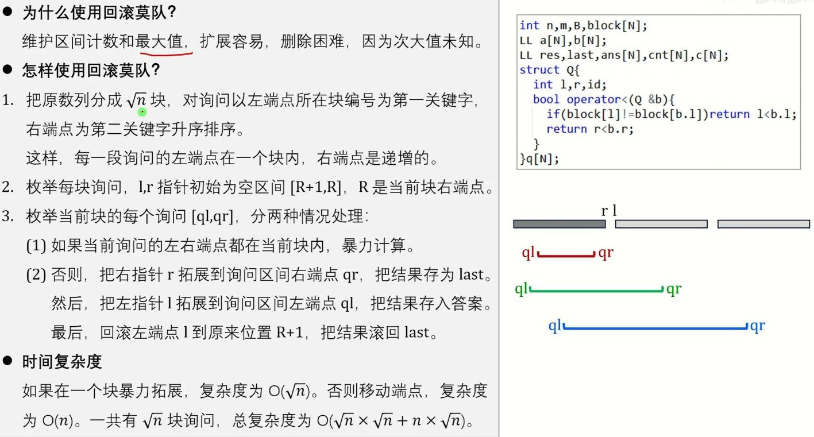

```c++
const int N = 1e5 + 5;

int n, m;
int a[N], ans[N], wz[N];
int block; // 块大小

struct type {
    int l, r, id;
} q[N];

// 只增不删回滚莫队：块内右端点必须递增，不能用奇偶优化
bool cmp(type x, type y) {
    if (wz[x.l] != wz[y.l]) return wz[x.l] < wz[y.l];
    return x.r < y.r;
}

// ===== 以下函数根据题目实现 =====
inline void init() {
    // TODO: 清空数据结构、回滚栈等
}

inline void add(int pos) {
    // TODO: 加入 a[pos]，同时保存被修改前的状态（用于回滚）
}

inline int get_checkpoint() {
    // TODO: 返回当前回滚栈大小 / 版本号
    return 0;
}

inline void rollback(int checkpoint) {
    // TODO: 撤销到 checkpoint 时的状态
}

inline int get_ans() {
    // TODO: 返回当前数据结构对应的答案
    return 0;
}

int brute(int l, int r) {
    // TODO: 暴力计算 [l, r] 的答案（短询问用）
    return 0;
}

void modui() {
    sort(q + 1, q + m + 1, cmp);

    for (int b = 1, qi = 1; b <= wz[n]; b++) {
        int blockR = min(n, b * block); // 当前块右边界

        init();               // 清空数据结构
        int R = blockR;       // 初始右半区间为空

        for (; qi <= m && wz[q[qi].l] == b; qi++) {
            int l = q[qi].l, r = q[qi].r;

            if (r <= blockR) {
                ans[q[qi].id] = brute(l, r);   // 短询问暴力
            } else {
                while (R < r) add(++R);        // 右指针只向右，只加入

                int checkpoint = get_checkpoint(); // 存档

                for (int i = blockR; i >= l; i--)  // 临时加入左半部分
                    add(i);

                ans[q[qi].id] = get_ans();

                rollback(checkpoint);          // 撤销左半部分
            }
        }
    }
}
void solve() {
    block = sqrt(n);          // 也可用 n / sqrt(m) 平衡
    for (int i = 1; i <= n; i++)
        wz[i] = (i - 1) / block + 1;

    modui();
}
```

### 带修莫队

> **解决问题**：莫队处理的不只是静态区间查询，还带单点修改，将时间轴作为第三维
> **时间复杂度**：$O(n^{5/3})$，块大小取 $n^{2/3}$
> **适用场景**：区间查询+单点修改的离线问题（如动态区间不同颜色数）

```c++
int wz[N]; //标记每一个元素属于哪一个块
int T; //标注现在的时间
struct type {
    //用来存储询问
    int l, r, t, id;
} query[N];

int n, m;//n的数据范围，m个询问

bool cmp(type a, type b) {
    return wz[a.l] < wz[b.l] ||
           wz[a.l] == wz[b.l] &&
           ((wz[a.r] < wz[b.r]) ||
            wz[a.r] == wz[b.r] && a.t < b.t);
}

inline void add(int x) {
    //我们可以通过添加两个函数来控制指针L和R的加减
}

inline void del(int x) {
}

inline void addt(int x) {
    //我们可以通过添加两个函数来控制指针L和R的加减
}

inline void delt(int x) {
}

void modui() {
    int L = 1, R = 0; //区间表示为[l,r]左闭右闭区间,这么赋值将初始区间设置为空
    for (int i = 1; i <= m; i++) {
        while (T < query[i].t) {
            addt(++T);
        } // 应用修改
        while (T > query[i].t) {
            delt(T--);
        } // 撤销修改
        while (L > query[i].l) {
            add(--L);
        } // 先扩展
        while (R < query[i].r) {
            add(++R);
        }
        while (L < query[i].l) {
            del(L++);
        } // 后收缩
        while (R > query[i].r) {
            del(R--);
        }
    }
}

void solve() {
    int block = sqrt(n); //用来存每一个块内有多少个元素
    // int block = pow(n,0.67); //待修莫队中,用来存每一个块内有多少个元素
    for (int i = 1; i <= n; i++) {
        wz[i] = (i - 1) / block + 1; //确定每一个点所在的块内，后面的+1是用来确定起始分块从1开始，前面的-1将分块的目标往前移动一格
    }
}
```

### 树上莫队【待补充】

> **解决问题**：莫队扩展到树上，用欧拉序将树上路径转化为区间
> **时间复杂度**：O(n√Q)
> **适用场景**：树上的区间统计问题

---
## 离线分治

### CDQ 分治

> **解决问题**：将动态问题转化为静态问题，或解决偏序问题（三维偏序）
> **时间复杂度**：$O(n \log^2 n)$
> **适用场景**：三维偏序计数、DP 转移优化、将在线修改+查询转化为离线分治

CDQ分治是一种思想而非具体算法（与动态规划类似），最早由IOI2008金牌得主陈丹琦在高中时整理并总结。大致分为三类：解决和点对有关的问题（如三维偏序）、1D动态规划的优化与转移、将动态问题转化为静态问题。

**基本思想**

CDQ 分治是一种**离线分治算法**，常用于解决**偏序问题**（如二维、三维偏序）或**带有时间维度的动态问题**。  
核心思路：**将原问题分解为左右两个子区间，递归处理内部后，再合并并计算左区间对右区间的贡献**。

**偏序问题中的通用框架**

- **第一维：排序消除**（保证左区间 ≤ 右区间）
- **第二维：分治 + 归并排序消除**（在合并时保证第二维有序，便于统计）
- **第三维（如果有）：数据结构维护**（如树状数组 BIT）

---

#### **二维偏序**

> **解决问题**：给定 $n$ 个二元组 $(a_i, b_i)$，对每个 $i$ 统计满足 $a_j \leq a_i,\ b_j \leq b_i$ 的 $j$ 的个数  
>
> **时间复杂度**：$O(n \log n)$
>
> **适用场景**：值域很大,处理带有删除/修改的动态二维偏序

二维偏序值阈小的话，可以使用先排序再使用树状数组等数据结构维护查询的办法，当值阈特别大时，只能使用cdq分治，这里讲解使用cdq分治解决二维偏序问题的方法

下面板子默认计算的是**不包含自身点的非严格偏序**关系个数

```c++
struct point {
    //使用这个结构体去存储点，然后传入solve
    int x, y, val=1;//不传默认val为1
};

struct CDQ2D {
    struct node {
        int x, y;
        int cnt, sumVal, ans;
        vector<int> ids;
    };

    vector<node> sz;
    vector<int> ans;
    void solve(const vector<point> &dl) {
        int n = dl.size();
        vector<int> id(n);
        iota(id.begin(), id.end(), 0);
        sort(id.begin(), id.end(), [&](int i, int j) {
            return cmp({dl[i].x, dl[i].y}, {dl[j].x, dl[j].y}, 0);
        });
        sz.clear();
        for (int i = 0; i < n;) {
            int j = i;
            while (j < n && dl[id[i]].x == dl[id[j]].x && dl[id[i]].y == dl[id[j]].y) j++;
            node t = {dl[id[i]].x, dl[id[i]].y, j - i, 0, 0, {}};
            t.ids.reserve(j - i);
            for (int k = i; k < j; k++) {
                t.ids.push_back(id[k]);
                t.sumVal += dl[id[k]].val;
            }
            // 非严格偏序时，同坐标点彼此可贡献，但不包含自身：
            // 对该组内任一点 i，答案需加上 (组总权值 - 自身权值)
            // 这里先放组总权值，最后回填到每个原点时再减去自身权值
            t.ans = cmp({t.x, t.y}, {t.x, t.y}, 1) ? t.sumVal : 0;
            sz.push_back(t);
            i = j;
        }
        ans.assign(n, 0);
        cdq(0, (int) sz.size() - 1);
        for (auto &t: sz) {
            for (int i: t.ids) {
                ans[i] = t.ans - (cmp({t.x, t.y}, {t.x, t.y}, 1) ? dl[i].val : 0);
            }
        }
    }

private:
    // 【唯一配置函数 所有修改只动这里】
    // dim=0: 初始排序规则；dim=1: 贡献判断 + 归并排序规则
    // b是当前点，a是目标点，统计b点关于其他a点的偏序关系（这里统计的是权值和）
    inline bool cmp(const pair<int, int> &a, const pair<int, int> &b, int dim) const {
        //统计b点左下的点a有多少个（现在是权值和）
        if (dim == 0) {
            if (a.first != b.first) return a.first < b.first;
            return a.second < b.second; //若要严格偏序，此处变为 a.second > b.second
        }
        return a.second <= b.second; //若要严格偏序，此处去掉等号
    }

    // inline bool cmp(const pair<int, int> &a, const pair<int, int> &b, int dim) const {
    //     //统计b点右下的点a有多少个（现在是权值和）
    //     if (dim == 0) {
    //         if (a.first != b.first) return a.first > b.first;
    //         return a.second < b.second; //若要严格偏序，此处变为 a.second > b.second
    //     }
    //     return a.second <= b.second; //若要严格偏序，此处去掉等号
    // }
    //
    // inline bool cmp(const pair<int, int> &a, const pair<int, int> &b, int dim) const {
    //     //统计b点左上的点a有多少个（现在是权值和）
    //     if (dim == 0) {
    //         if (a.first != b.first) return a.first < b.first;
    //         return a.second > b.second; //若要严格偏序，此处变为 a.second < b.second
    //     }
    //     return a.second >= b.second; //若要严格偏序，此处去掉等号
    // }
    //
    // inline bool cmp(const pair<int, int> &a, const pair<int, int> &b, int dim) const {
    //     //统计b点右上的点a有多少个（现在是权值和）
    //     if (dim == 0) {
    //         if (a.first != b.first) return a.first > b.first;
    //         return a.second > b.second; //若要严格偏序，此处变为 a.second < b.second
    //     }
    //     return a.second >= b.second; //若要严格偏序，此处去掉等号
    // }

    void cdq(int l, int r) {
        if (l >= r) return;
        int mid = (l + r) >> 1;
        cdq(l, mid);
        cdq(mid + 1, r);
        int i = l, j = mid + 1, s = 0;
        while (j <= r) {
            while (i <= mid && cmp({sz[i].x, sz[i].y}, {sz[j].x, sz[j].y}, 1))
                s += sz[i++].sumVal;
            sz[j++].ans += s;
        }
        vector<node> t(r - l + 1);
        int p1 = l, p2 = mid + 1, k = 0;
        while (p1 <= mid && p2 <= r)
            t[k++] = cmp({sz[p1].x, sz[p1].y}, {sz[p2].x, sz[p2].y}, 1) ? sz[p1++] : sz[p2++];
        while (p1 <= mid) t[k++] = sz[p1++];
        while (p2 <= r) t[k++] = sz[p2++];
        for (int i = 0; i < k; i++) sz[l + i] = t[i];
    }
};
```

**使用方法:**

```c++
vector<point> dl; //存放点
CDQ2D cdq;
cdq.solve(dl);
vector<int> &ans = cdq.ans;
```

------

#### 三维偏序

> **解决问题**：给定 $n$ 个三元组 $(a_i, b_i, c_i)$，对每个 $i$ 统计满足 $a_j \leq a_i,\ b_j \leq b_i,\ c_j \leq c_i$ 的 $j$ 的个数
> **时间复杂度**：$O(n \log^2 n)$
> **适用场景**：第一维 sort → 第二维 CDQ 归并 → 第三维 BIT（树状数组）

```c++
struct point {
    int x, y, z, val;
};

struct CDQ3D {
    struct node {
        int x, y, z;
        int cnt, sumVal, ans, rk;
        vector<int> ids;
    };

    vector<node> sz;
    vector<int> ans;
    vector<int> bit;

    // 传入每个点的(x, y, z, val)，统计偏序方向上的权值和（不包含自身）
    void solve(const vector<point>& dl) {
        int n = dl.size();
        vector<int> id(n);
        iota(id.begin(), id.end(), 0);
        sort(id.begin(), id.end(), [&](int i, int j) {
            return cmp({dl[i].x, dl[i].y, dl[i].z}, {dl[j].x, dl[j].y, dl[j].z}, 0);
        });

        // 是否非严格（同坐标点是否可互相贡献）
        // 注意：dim=0 是严格排序用，不能用于判断同点自贡献
        bool nonStrictSelf = cmp({0, 0, 0}, {0, 0, 0}, 1) && cmp({0, 0, 0}, {0, 0, 0}, 2);

        sz.clear();
        for (int i = 0; i < n;) {
            int j = i;
            while (j < n && dl[id[i]].x == dl[id[j]].x && dl[id[i]].y == dl[id[j]].y && dl[id[i]].z == dl[id[j]].z) j++;
            node t = {dl[id[i]].x, dl[id[i]].y, dl[id[i]].z, j - i, 0, 0, 0, {}};
            t.ids.reserve(j - i);
            for (int k = i; k < j; k++) {
                t.ids.push_back(id[k]);
                t.sumVal += dl[id[k]].val;
            }
            // 非严格偏序时，同坐标点彼此可贡献，但不包含自身：
            // 对该组内任一点 i，答案需加上(组总权值 - 自身权值)
            // 这里先放组总权值，最后回填到每个原点时再减去自身权值
            t.ans = nonStrictSelf ? t.sumVal : 0;
            sz.push_back(t);
            i = j;
        }

        // z 轴离散化（默认升序，适配 z<= 方向；z>= 方向可直接将 z 取反传入）
        vector<int> zs;
        for (auto& t : sz) zs.push_back(t.z);
        sort(zs.begin(), zs.end());
        zs.erase(unique(zs.begin(), zs.end()), zs.end());
        for (auto& t : sz) {
            t.rk = lower_bound(zs.begin(), zs.end(), t.z) - zs.begin() + 1;
        }

        bit.assign((int)zs.size() + 2, 0);
        ans.assign(n, 0);
        cdq(0, (int)sz.size() - 1);

        for (auto& t : sz) {
            for (int i : t.ids) {
                ans[i] = t.ans - (nonStrictSelf ? dl[i].val : 0);
            }
        }
    }

private:
    // 【唯一配置函数 所有修改只动这里】
    // dim=0: 初始排序规则；dim=1: y维贡献判断 + 归并排序规则；dim=2: z维偏序规则
    // b是当前点，a是目标点，统计b点关于其他a点的偏序关系（这里统计的是权值和）
    inline bool cmp(const array<int, 3>& a, const array<int, 3>& b, int dim) const {
        //统计b点左下方（x<=, y<=, z<=）的点a的权值和
        if (dim == 0) {
            if (a[0] != b[0]) return a[0] < b[0];
            if (a[1] != b[1]) return a[1] < b[1]; //若要严格偏序，此处变为 a[1] > b[1]
            return a[2] < b[2];
        } else if (dim == 1) {
            return a[1] <= b[1]; //若要严格偏序，此处去掉等号
        } else {
            return a[2] <= b[2]; //若要严格偏序，此处去掉等号，同步将下方查询改为 rk - 1
        }
    }

    // inline bool cmp(const array<int, 3>& a, const array<int, 3>& b, int dim) const {
    //     //统计b点右下方（x>=, y<=, z<=）的点a的权值和
    //     if (dim == 0) {
    //         if (a[0] != b[0]) return a[0] > b[0];
    //         if (a[1] != b[1]) return a[1] < b[1]; //若要严格偏序，此处变为 a[1] > b[1]
    //         return a[2] < b[2];
    //     } else if (dim == 1) {
    //         return a[1] <= b[1]; //若要严格偏序，此处去掉等号
    //     } else {
    //         return a[2] <= b[2]; //若要严格偏序，此处去掉等号，同步将下方查询改为 rk - 1
    //     }
    // }
    //
    // inline bool cmp(const array<int, 3>& a, const array<int, 3>& b, int dim) const {
    //     //统计b点左上方（x<=, y>=, z<=）的点a的权值和
    //     if (dim == 0) {
    //         if (a[0] != b[0]) return a[0] < b[0];
    //         if (a[1] != b[1]) return a[1] > b[1]; //若要严格偏序，此处变为 a[1] < b[1]
    //         return a[2] < b[2];
    //     } else if (dim == 1) {
    //         return a[1] >= b[1]; //若要严格偏序，此处去掉等号
    //     } else {
    //         return a[2] <= b[2]; //若要严格偏序，此处去掉等号，同步将下方查询改为 rk - 1
    //     }
    // }
    //
    // inline bool cmp(const array<int, 3>& a, const array<int, 3>& b, int dim) const {
    //     //统计b点右上方（x>=, y>=, z>=）的点a的权值和
    //     // 注意：z维反向可直接将 z 坐标取反传入，无需修改离散化代码
    //     if (dim == 0) {
    //         if (a[0] != b[0]) return a[0] > b[0];
    //         if (a[1] != b[1]) return a[1] > b[1]; //若要严格偏序，此处变为 a[1] < b[1]
    //         return a[2] > b[2];
    //     } else if (dim == 1) {
    //         return a[1] >= b[1]; //若要严格偏序，此处去掉等号
    //     } else {
    //         return a[2] >= b[2]; //若要严格偏序，此处去掉等号，同步将下方查询改为 rk + 1
    //     }
    // }

    inline void bit_add(int pos, int val) {
        for (; pos < (int)bit.size(); pos += pos & -pos) bit[pos] += val;
    }

    inline int bit_query(int pos) {
        int res = 0;
        for (; pos > 0; pos -= pos & -pos) res += bit[pos];
        return res;
    }

    void cdq(int l, int r) {
        if (l >= r) return;
        int mid = (l + r) >> 1;
        cdq(l, mid);
        cdq(mid + 1, r);
        int i = l, j = mid + 1;
        while (j <= r) {
            while (i <= mid && cmp({sz[i].x, sz[i].y, sz[i].z}, {sz[j].x, sz[j].y, sz[j].z}, 1)) {
                bit_add(sz[i].rk, sz[i].sumVal);
                i++;
            }
            sz[j].ans += bit_query(sz[j].rk); // 严格偏序(z<)请改为 sz[j].rk - 1；严格(z>)请改为 sz[j].rk + 1
            j++;
        }
        // 撤销树状数组修改，避免影响其他递归分支
        for (int k = l; k < i; k++) bit_add(sz[k].rk, -sz[k].sumVal);

        vector<node> t(r - l + 1);
        int p1 = l, p2 = mid + 1, k = 0;
        while (p1 <= mid && p2 <= r)
            t[k++] = cmp({sz[p1].x, sz[p1].y, sz[p1].z}, {sz[p2].x, sz[p2].y, sz[p2].z}, 1) ? sz[p1++] : sz[p2++];
        while (p1 <= mid) t[k++] = sz[p1++];
        while (p2 <= r) t[k++] = sz[p2++];
        for (int i = 0; i < k; i++) sz[l + i] = t[i];
    }
};
```

**使用方法:**

```c++
vector<point> dl; //存放点
CDQ3D cdq;
cdq.solve(dl);
vector<int> &ans = cdq.ans;
```

---

### 线段树分治【待补充】

> **解决问题**：处理「边/元素有时效性」的离线技巧。时间轴建线段树→将每条边的存活区间插入线段树节点→DFS 线段树+可撤销并查集
> **时间复杂度**：$O((n+m) \log T \cdot \alpha(n))$
> **适用场景**：动态图连通性（加边+删边，离线）、二分图动态判定

---

### 整体二分【待补充】

> **解决问题**：将多组询问一起二分答案，把询问按答案区间分组递归处理
> **时间复杂度**：$O((n+Q) log^2 n)$
> **适用场景**：多组询问的二分问题（如区间第 k 小），可配合树状数组使用

---

## DLX (Dancing Links)【待补充】

> **解决问题**：精确覆盖问题的高效搜索，用十字链表+舞蹈链实现
> **时间复杂度**：指数级最坏，实践中对大部分精确覆盖问题很快
> **适用场景**：数独求解、精确覆盖问题、重复覆盖问题

---

## K-D Tree【待补充】

> **解决问题**：k 维空间的数据结构，支持正交范围查询和最近邻搜索
> **时间复杂度**：建树 O(n log n)，查询 $O(n^{1-1/k})$
> **适用场景**：二维/三维的空间查询（如矩形内点数）、最近点查询

---

## LCT (Link Cut Tree)【待补充】

> **解决问题**：动态维护森林的连通性，支持加边、删边、查询路径信息（如路径和、路径异或和）
> **时间复杂度**：均摊 O(log n)
> **适用场景**：动态树问题、动态连通性、动态 MST

---

## 全局平衡二叉树【待补充】

> **解决问题**：将树链剖分的线段树替换为全局平衡的二叉搜索树，常数更小
> **时间复杂度**：O(log n)
> **适用场景**：树链剖分的常数优化版

---

# 图论

## 链式前向星

> **解决问题**：用连续边数组存储图，支持快速加边并遍历一个点的所有出边
> **时间复杂度**：加边 $O(1)$，遍历节点 $u$ 为 $O(outdeg(u))$，总遍历 $O(V+E)$
> **适用场景**：边数较大、需要节省邻接表常数，或依赖成对边编号 `i^1` 的图论算法

```c++
int head[N],to[N],nt[N],tot=1;//这里是构建单项边的链式前向星星
void build(int u,int v) {
	to[++tot]=v;
	nt[tot]=head[u];
	head[u]=tot;
}
for(int i=head[u];i;i=nt[i]){//这里是遍历u所连接的所有的边的情况,i被赋值成存储的边的序号

}
//我们采用^1来寻找到另一条边,所以边的存储方式需要从0开始,01为一对,23为一对,初始化所有head=-1代表没有边了,此时for内的结束条件是~i
//或者你的边从2号开始,此时head可以为0,且for内的结束条件为0
```

---

## 拓扑排序

> **解决问题**：对有向无环图 (DAG) 进行线性排序，使得每条有向边 (u,v) 都有 u 在 v 之前，以及围绕拓扑序的各类变体问题
> **时间复杂度**：$O(V+E)$
> **适用场景**：任务调度、DP 的拓扑序、判环、字典序拓扑序、拓扑序方案计数

---

### 拓扑序方案计数

> **解决问题**：统计 DAG 的拓扑序总方案数（#P-complete），通过枚举子集 DP 精确计算  
> **时间复杂度**：$O(n \cdot 2^n)$  
> **适用场景**：n ≤ 22 的 DAG 拓扑序计数、线性扩展计数、第 K 大拓扑序的前置计算

**状态定义**  
$dp[mask]$：点集 $mask$ 的合法拓扑序数量  
**转移（倒推）**  
枚举 $mask$ 中最后一个元素 $v$，要求 $v$ 的所有前驱都已包含在 $mask$ 内：  
$dp[mask] = \sum\limits_{\substack{v \in mask \\ pre[v] \subseteq mask}} dp[mask \setminus \{v\}]$

```c++
int dp[1 << 22]; // 全局自动初始化为 0
int pre[22]; // 前驱掩码

int dag_count(int n, const vector<pair<int, int> > &edges) {
    memset(pre, 0, sizeof pre);
    fill(dp, dp + (1 << n), 0); // 函数可重复调用
    for (auto [u, v]: edges) {
        pre[v] |= (1 << u); //pre里面存储v要加进来之前的前缀
    }
    int full = (1 << n) - 1; //总状态数
    dp[0] = 1;
    for (int mask = 1; mask <= full; ++mask) {
        int val = 0;
        for (int m = mask; m; m ^= (m & -m)) {
            int v = __builtin_ctz(m); //返回后缀0的个数，同时也是最后面1的位置
            int bit = 1 << v;
            if ((pre[v] & mask) == pre[v]) {
                val += dp[mask ^ bit];
            }
        }
        dp[mask] = val;
    }
    return dp[full];
}
```

---

### 树的拓扑序计数

> **解决问题**：对于有根树/森林，利用组合公式 $n! / \prod \text{size}_u$ 直接计算拓扑序方案数  
> **时间复杂度**：$O(n)$（一次遍历求子树大小 + 预处理阶乘与逆元）  
> **适用场景**：树形依赖关系的排列计数（如树形结构的插入顺序、拓扑序唯一性分析）

**公式**  
设 $\text{size}[u]$ 为以 $u$ 为根的子树大小，依赖方向为**父必须在子之前**，则方案数为  
$\displaystyle \text{ans} = \frac{n!}{\prod_{u} \text{size}[u]} \pmod{MOD}$  
若输入边是子→父，反转所有边后计数不变，直接构建父→子的邻接表即可。森林同样适用该公式。

**推导概要**  
根固定在最前，剩余位置为各子树节点保持内部顺序任意交错，等价于多重集排列，连乘后分子分母相消。

**使用说明**：若题目给定的边是子→父，只需在输入时将每条边 `(u, v)` 当作 `(v, u)` 传入函数，或者直接修改遍历部分为 `g[v].push_back(u); ++indeg[u];` 即可。计数结果相同。

---

## 最短路

### Floyd 算法

> **解决问题**：所有点对之间的最短路径
> **时间复杂度**：$O(n^3)$
> **适用场景**：n 较小（≤500）时求多源最短路，或求传递闭包
>
> 注意：Floyd 不能够解决出现负环的最短路（可以通过负环无限制的缩短两点之间的距离）。可以解决出现负边的情况。
> 如果要判断的时候，只需要检测点到自己的距离是正还是负即可。
> Floyd 算法的思想是通过逐步枚举中转点来缩短两点之间的距离。

```c++
void floyed(){
    for(int k=1;k<=n;k++){//枚举k作为中转点
		for(int a=1;a<=n;a++){
			for(int b=1;b<=n;b++){//枚举ab之间的点，用k来缩短ab之间的距离
                if(ab距离>ak距离+bk距离){
                    //使用k作为中转点缩短ab之间距离
                }
        	}
    	}
    }
}
```

### Dijkstra 算法

> **解决问题**：单源最短路径（非负权图）
> **时间复杂度**：O(m log n)（堆优化），$O(n^2)$（稠密图不用堆优化）
> **适用场景**：所有边权均为非负数时的单源最短路
>
> 注意：Dijkstra 算法不能够解决出现了负边的最短路（Dijkstra 运用了贪心的思想，如果出现负边，则会出问题）。
> Dijkstra 算法的思想是，在每个能够到达的点中选择一个最小花费的点固定下来，然后更新经过这个点到达其他点的最短距离。
> 优先选择最小的花费是因为如果我选择一个大的花费，那么之后一定会更大，而不会变小，所以最小的花费是已经固定下来的。

```c++
const int INF = (1LL << 62);
vector<pair<int, int> > ljb[N]; // {to, weight}，边权必须非负
int jl[N];
int n;

void dijkstra(int start) {
    fill(jl + 1, jl + n + 1, INF);
    priority_queue<pair<int, int>, vector<pair<int, int> >,
                   greater<pair<int, int> > > pq;
    jl[start] = 0;
    pq.push({0, start});
    while (!pq.empty()) {
        auto [dis, u] = pq.top();
        pq.pop();
        if (dis != jl[u]) continue;
        for (auto [v, w] : ljb[u]) {
            if (jl[v] > dis + w) {
                jl[v] = dis + w;
                pq.push({jl[v], v});
            }
        }
    }
}
```

### Bellman-Ford 算法

> **解决问题**：单源最短路径，可以处理负权边
> **时间复杂度**：$O(n*m)$ 或 $O(n^3)$
> **适用场景**：图中可能存在负权边时的单源最短路

Bellman-Ford 算法与 Floyd 算法的内容相似，Floyd 是通过选择点来缩短两点之间的距离，而 Bellman-Ford 是通过选择点来缩短边长度。
同样也是解决单源最短路问题，从一个起点除法通向其他点之间的距离的。

```c++
struct edge {
    int u, v, w;
};
vector<edge> edges;
int jl[N];
const int INF = (1LL << 62);

// 返回0表示存在从head可达的负环，返回1表示最短路有效
bool bellmanford(int head) {
    fill(jl + 1, jl + n + 1, INF);
    jl[head] = 0;
    for (int i = 1; i <= n; i++) {
        bool change = false;
        for (auto [u, v, w] : edges) {
            if (jl[u] == INF) continue;
            if (jl[v] > jl[u] + w) {
                jl[v] = jl[u] + w;
                change = true;
                if (i == n) return false;
            }
        }
        if (!change) break;
    }
    return true;
}
```

### SPFA 算法

> **解决问题**：Bellman-Ford 的队列优化版本，均摊复杂度更低
> **时间复杂度**：平均 O(m)，最坏 $O(n*m)$
> **适用场景**：单源最短路,图中可能存在负权边且期望图不特殊时
>
> SPFA 是 Bellman-Ford 的队列优化版本，采用队列进行优化。
> Bellman-Ford 是逐步添加边进行优化，那么我们知道，我们从起始点逐步添加边，是逐步扩展到整个图中去的，我们只用考虑激活点即可。
> SPFA 可以判定从源点可达的负环，但最坏复杂度仍为 $O(nm)$，容易被特殊数据卡掉。

```c++
int jl[N];
int vis[N];//标记当前点是否在队列中
int cnt[N];//建立一个数组，内部存储最短路的边数，如果最短路的边数大于了n，就说明出现了负环
vector<pair<int,int>> ljb[N];//采用邻接表对边进行存储
// ljb[u]存{边权,终点}；返回0表示存在从head可达的负环
bool spfa(int head) {
    memset(jl, 0x3f, sizeof(jl));
    memset(vis, 0, sizeof(vis));
    memset(cnt, 0, sizeof(cnt));
    queue<int> dl;
    dl.push(head);
    jl[head] = 0;
    vis[head] = 1;
    while (!dl.empty()) {
        int dq = dl.front();
        dl.pop();
        vis[dq] = 0;
        for (auto [w, to] : ljb[dq]) {
            if (jl[to] > jl[dq] + w) {
                jl[to] = jl[dq] + w;
                cnt[to] = cnt[dq] + 1;
                if (cnt[to] >= n) return false;
                if (!vis[to]) {
                    dl.push(to);
                    vis[to] = 1;
                }
            }
        }
    }
    return true;
}
```

---

### 差分约束

> **解决问题**：求解形如 $x_j - x_i \le c$ 的不等式组，通过建图跑最短路/最长路实现  
> **时间复杂度**：$O(n \cdot m)$  
> **适用场景**：区间限制、大小关系、前缀和约束等转化为图论约束

**显式约束**：仅涉及单个变量的常量约束，形如 $x_i \le c$、$x_i \ge c$、$x_i = c$

**求最大解（最短路）**

**建图思想**：所有约束写成 $\le$ 形式，跑**最短路**。若出现 **负环** 则无解。

**步骤**

1. 将每个约束写成 $x_j \le x_i + c$ 的标准形式
2. 对应建有向边 $i \xrightarrow{c} j$
3. 设超级源点 $s$（$x_s = 0$），按以下规则建边与初始化：
   - **建边**：严格按表格将所有约束转化为有向边。**禁止为连通性额外添加全局 $s \xrightarrow{0} i$ 边**（这会强制加入 $x_i \le 0$，篡改原问题）。  
   - **初始化**（两种模式）：  
     - **判解/求任意解**：所有 $n+1$ 个节点（含 $s$）初始入队，`dist` 全置 $0$；可处理不连通图且不引入额外约束。  
     - **求最大可行解**：仅 $s$ 入队，`dist[s]=0`，其余置 $+\infty$；最终不可达变量表示其上无界。  
   - **无显式约束时**：可直接对所有变量加 $s \xrightarrow{0} i$，既保证连通又能得到一组 $x_i \le 0$ 的特解，不改变解的存在性。
4. 跑最短路（SPFA/Bellman‑Ford），`dist[i]` 即为 $x_i$ 的最大可能值
5. 存在**负环** $\Rightarrow$ 无解（含源点时 $cnt[v] \ge n+1$，否则 $cnt[v] \ge n$）

| 原始约束            | 变形（$\le$ 形式）                     | 建边                                          | 说明                                   |
| :------------------ | :------------------------------------- | :-------------------------------------------- | :------------------------------------- |
| $x_j - x_i \le c$   | $x_j \le x_i + c$                      | $i \xrightarrow{c} j$                         | 基础形式                               |
| $x_j - x_i \ge c$   | $x_i \le x_j - c$                      | $j \xrightarrow{-c} i$                        | 转为 $\le$                             |
| $x_j - x_i = c$     | $x_j \le x_i + c$ 且 $x_i \le x_j - c$ | $i \xrightarrow{c} j$、$j \xrightarrow{-c} i$ | 拆成两个不等式                         |
| $x_i \ge x_j$       | $x_j \le x_i + 0$                      | $i \xrightarrow{0} j$                         | $x_i - x_j \ge 0$                      |
| $x_i \le x_j$       | $x_i \le x_j + 0$                      | $j \xrightarrow{0} i$                         | $x_i - x_j \le 0$                      |
| $x_i = c$（常量）   | $x_i \le x_s + c$ 且 $x_s \le x_i - c$ | $s \xrightarrow{c} i$、$i \xrightarrow{-c} s$ | 以源点为参考                           |
| $x_i \le c$         | $x_i \le x_s + c$                      | $s \xrightarrow{c} i$                         | 直接上界（$c=0$ 即 $x_i \le 0$）       |
| $x_i \ge c$         | $x_s \le x_i - c$                      | $i \xrightarrow{-c} s$                        | 转为源点不等式（$c=0$ 即 $x_i \ge 0$） |
| $x_i < c$（整数）   | $x_i \le c-1$                          | $s \xrightarrow{c-1} i$                       | 严格小于                               |
| $x_i > c$（整数）   | $x_s \le x_i - (c+1)$                  | $i \xrightarrow{-(c+1)} s$                    | 严格大于                               |
| $x_i > x_j$（整数） | $x_j \le x_i - 1$                      | $i \xrightarrow{-1} j$                        | $x_i - x_j \ge 1$                      |

---

**求最小解（最长路）**

**建图思想**：所有约束写成 $\ge$ 形式，跑**最长路**。若出现 **正环** 则无解。

**步骤**

1. 将每个约束写成 $x_j \ge x_i + c$ 的标准形式
2. 对应建有向边 $i \xrightarrow{c} j$
3. 设超级源点 $s$（$x_s = 0$），按以下规则建边与初始化：
   - **建边**：严格按表格将所有约束转化为有向边。**禁止为连通性额外添加全局 $s \xrightarrow{0} i$ 边**（这会强制加入 $x_i \ge 0$，篡改原问题）。  
   - **初始化**（两种模式）：  
     - **判解/求任意解**：所有 $n+1$ 个节点（含 $s$）初始入队，`dist` 全置 $0$；可处理不连通图且不引入额外约束。  
     - **求最小可行解**：仅 $s$ 入队，`dist[s]=0`，其余置 $-\infty$；最终不可达变量表示其下无界。  
   - **无显式约束时**：可直接对所有变量加 $s \xrightarrow{0} i$，既保证连通又能得到一组 $x_i \ge 0$ 的特解，不改变解的存在性。
4. 跑最长路（SPFA 松弛取大），`dist[i]` 即为 $x_i$ 的最小可能值
5. 存在**正环** $\Rightarrow$ 无解（含源点时 $cnt[v] \ge n+1$，否则 $cnt[v] \ge n$）

| 原始约束            | 变形（$\ge$ 形式）                     | 建边                                          | 说明                                   |
| :------------------ | :------------------------------------- | :-------------------------------------------- | :------------------------------------- |
| $x_j - x_i \ge c$   | $x_j \ge x_i + c$                      | $i \xrightarrow{c} j$                         | 基础形式                               |
| $x_j - x_i \le c$   | $x_i \ge x_j - c$                      | $j \xrightarrow{-c} i$                        | 转为 $\ge$                             |
| $x_j - x_i = c$     | $x_j \ge x_i + c$ 且 $x_i \ge x_j - c$ | $i \xrightarrow{c} j$、$j \xrightarrow{-c} i$ | 拆成两个不等式                         |
| $x_i \ge x_j$       | $x_i \ge x_j + 0$                      | $j \xrightarrow{0} i$                         | 基础形式 $c=0$                         |
| $x_i \le x_j$       | $x_j \ge x_i + 0$                      | $i \xrightarrow{0} j$                         | $x_j - x_i \ge 0$                      |
| $x_i = c$（常量）   | $x_i \ge x_s + c$ 且 $x_s \ge x_i - c$ | $s \xrightarrow{c} i$、$i \xrightarrow{-c} s$ | 以源点为参考                           |
| $x_i \ge c$         | $x_i \ge x_s + c$                      | $s \xrightarrow{c} i$                         | 直接下界（$c=0$ 即 $x_i \ge 0$）       |
| $x_i \le c$         | $x_s \ge x_i - c$                      | $i \xrightarrow{-c} s$                        | 转为源点不等式（$c=0$ 即 $x_i \le 0$） |
| $x_i > c$（整数）   | $x_i \ge c+1$                          | $s \xrightarrow{c+1} i$                       | 严格大于                               |
| $x_i < c$（整数）   | $x_s \ge x_i - (c-1)$                  | $i \xrightarrow{-(c-1)} s$                    | 严格小于                               |
| $x_i > x_j$（整数） | $x_i \ge x_j + 1$                      | $j \xrightarrow{1} i$                         | 直接转化                               |

------

### k 短路【待补充】

> **解决问题**：求从 s 到 t 的第 k 短路径（允许重复经过点）
> **时间复杂度**：$O(k·m log n)$（A\* 配合反向 Dijkstra）
> **适用场景**：需要第 k 短的路径时

---

### 同余最短路【待补充】

> **解决问题**：用最短路求解模意义下的可达性/最小值问题
> **时间复杂度**：O($n·min{a_i}$)
> **适用场景**：「能否凑出某个数」「最小不能凑出的数」等背包可达性问题的图论解法

---

## 最小生成树

### Kruskal 算法

> **解决问题**：求图的最小生成树
> **时间复杂度**：$O(m log m)$
> **适用场景**：稀疏图上求 MST，使用并查集维护连通性

采用并查集的思维方法，运用并查集判断是否在同一个并查集区间内。每次添加边都将两个集合进行合并。
同时也运用了贪心的算法，优先选择最小的边来构建最小生成树。

```c++
vector<pair<int,int> > ljb[N];//采用邻接表来对边进行存储，邻接表的第一维目标点，第二维存长度
int bcj[N];
inline int cx(int dq) {
	return bcj[dq]=(bcj[dq]==dq?dq:cx(bcj[dq]));
}
inline void hb(int u,int v) {
	bcj[cx(u)]=cx(v);
}
int kruskal() {
	for (int i = 1; i <= n; ++i) bcj[i] = i;
	priority_queue<pair<int,pair<int,int> >,vector<pair<int,pair<int,int> > >,greater<pair<int,pair<int,int> > > > dl;
	//优先队列的第一个存长度，第二个pair存起始点和目标点
    for(int i=1; i<=n; i++) {
		for(auto it :ljb[i]) {
			dl.push({it.second,{i,it.first}});//采用优先队列,优先选择最小边加入进最小生成树,来保证能够得到的值是最小的
		}
	}
	int ans=0, cnt=0;
	while(!dl.empty()) {
		auto dq=dl.top();
		dl.pop();
		if(cx(dq.second.first)==cx(dq.second.second)) {
			continue;
		}//如果这两个在同一个集合之内则不进行计算
		hb(dq.second.first,dq.second.second);
		ans+=dq.first;
		++cnt;
	}
	return cnt == n - 1 ? ans : -1; // 不连通时不存在生成树
}
```

### Prim 算法

> **解决问题**：求图的最小生成树
> **时间复杂度**：$O(m log n)$
> **适用场景**：稠密图上求 MST

Prim 算法是用于求出来最小从生成树的算法，其根本思想类似于 Dijkstra 算法，逐步选择离已经构成的最小生成树最近的点加入最小生成树。逐步扩大。运用了贪心的思维。

```c++
const int N = 100005;
vector<pair<int, int>> jb[N]; // C++11 起允许 >>，但注意正确拼写
int jl[N];
bool bj[N];
int n;
bool prim(int head, int &ans) {
    const int INF = (1LL << 62);
    for (int i = 1; i <= n; i++) {
        jl[i] = INF;
        bj[i] = 0;
    }
    priority_queue<pair<int, int>, vector<pair<int, int>>, greater<pair<int, int>>> pq;
    jl[head] = 0;
    pq.push({0, head});
    int cnt = 0;
    ans = 0;
    while (!pq.empty()) {
        auto [w, u] = pq.top(); pq.pop();
        if (bj[u]) continue;
        bj[u] = true;
        cnt++;
        ans += w;
        for (auto &[v, cost] : jb[u]) {
            if (!bj[v] && cost < jl[v]) {
                jl[v] = cost;
                pq.push({cost, v});
            }
        }
    }
    return cnt == n; // 返回0表示图不连通，ans仅在返回1时有效
}
```

### Boruvka 算法【待补充】

> **解决问题**：求图的最小生成树，每次每个连通块选择连向外部的最小边
> **时间复杂度**：$O(m log n)$
> **适用场景**：边数极多但可以通过某些方式快速找到最小边的场景，或并行计算的 MST

---

### 次小生成树

> **解决问题**：求严格次小生成树，或允许与 MST 同权的非严格次小生成树
> **时间复杂度**：$O(m log m+n log n)$
> **适用场景**：无向带权图；需要严格次优解、判断 MST 是否唯一

先 Kruskal 求一棵 MST。对每条非树边 $(u,v,w)$，在 MST 上查询 $u\to v$ 路径的最大边 `mx1` 与严格次大边 `mx2`：

- 非严格次小：删掉 `mx1`，候选为 `mst+w-mx1`；可得到与 MST 同权的另一棵树。
- 严格次小：若 `w>mx1`，仍删 `mx1`；若 `w==mx1`，必须删 `mx2`，否则新树权值不变。

```c++
struct SecondMST {
    struct edge {
        int u, v, w;
        bool used; // 是否被 Kruskal 选入当前 MST
    };

    struct DSU {
        vector<int> fa, siz;

        DSU(int n = 0) {
            init(n);
        }

        void init(int n) {
            fa.resize(n + 1);
            siz.assign(n + 1, 1);
            iota(fa.begin(), fa.end(), 0);
        }

        int find(int x) {
            return fa[x] == x ? x : fa[x] = find(fa[x]);
        }

        bool merge(int x, int y) {
            x = find(x), y = find(y);
            if (x == y) return false;
            if (siz[x] < siz[y]) swap(x, y);
            fa[y] = x;
            siz[x] += siz[y];
            return true;
        }
    };

    int n;
    vector<edge> e;

    SecondMST(int n = 0) : n(n) {
    }

    void init(int _n) {
        n = _n;
        e.clear();
    }

    // 加一条无向边；点编号为 1..n，允许重边。
    void add_edge(int u, int v, int w) {
        e.push_back({u, v, w, false});
    }

    // strict=1：返回严格大于 MST 的最小生成树权值。
    // strict=0：返回除“当前这棵 MST”外的最小生成树权值，可能等于 MST。
    // 不存在生成树或不存在第二棵生成树时返回 -1。
    int solve(bool strict = true) {
        const int NEG_INF = -(1LL << 62);
        vector<int> ord(e.size());
        iota(ord.begin(), ord.end(), 0);
        sort(ord.begin(), ord.end(), [&](int i, int j) {
            return e[i].w < e[j].w;
        });
        for (auto &x : e) x.used = false;

        DSU dsu(n);
        int mst = 0, cnt = 0;
        vector<vector<pair<int, int>>> g(n + 1);
        for (int id : ord) {
            edge &x = e[id];
            if (!dsu.merge(x.u, x.v)) continue;
            x.used = true;
            mst += x.w;
            ++cnt;
            g[x.u].push_back({x.v, x.w});
            g[x.v].push_back({x.u, x.w});
        }
        if (cnt != n - 1) return -1;

        int LOG = 1;
        while ((1LL << LOG) <= n) ++LOG;
        vector<vector<int>> up(LOG, vector<int>(n + 1));
        vector<vector<int>> mx1(LOG, vector<int>(n + 1, NEG_INF));
        vector<vector<int>> mx2(LOG, vector<int>(n + 1, NEG_INF));
        vector<int> dep(n + 1, -1);

        queue<int> q;
        dep[1] = 0;
        q.push(1);
        while (!q.empty()) {
            int u = q.front();
            q.pop();
            for (auto [v, w] : g[u]) {
                if (dep[v] != -1) continue;
                dep[v] = dep[u] + 1;
                up[0][v] = u;
                mx1[0][v] = w;
                q.push(v);
            }
        }
        for (int k = 1; k < LOG; ++k) {
            for (int u = 1; u <= n; ++u) {
                int p = up[k - 1][u];
                up[k][u] = up[k - 1][p];
                int a = NEG_INF, b = NEG_INF;
                auto take = [&](int w) {
                    if (w > a) b = a, a = w;
                    else if (w < a && w > b) b = w; // 只保留严格次大值
                };
                take(mx1[k - 1][u]);
                take(mx2[k - 1][u]);
                take(mx1[k - 1][p]);
                take(mx2[k - 1][p]);
                mx1[k][u] = a;
                mx2[k][u] = b;
            }
        }

        // 返回 MST 上 u-v 路径的 {最大边权, 严格次大边权}。
        auto path_max_two = [&](int u, int v) {
            int a = NEG_INF, b = NEG_INF;
            auto take = [&](int w) {
                if (w > a) b = a, a = w;
                else if (w < a && w > b) b = w;
            };
            if (dep[u] < dep[v]) swap(u, v);
            int dif = dep[u] - dep[v];
            for (int k = LOG - 1; k >= 0; --k) {
                if ((dif >> k) & 1) {
                    take(mx1[k][u]);
                    take(mx2[k][u]);
                    u = up[k][u];
                }
            }
            if (u == v) return pair<int, int>{a, b};
            for (int k = LOG - 1; k >= 0; --k) {
                if (up[k][u] == up[k][v]) continue;
                take(mx1[k][u]);
                take(mx2[k][u]);
                take(mx1[k][v]);
                take(mx2[k][v]);
                u = up[k][u], v = up[k][v];
            }
            take(mx1[0][u]);
            take(mx1[0][v]);
            return pair<int, int>{a, b};
        };

        int ans = (1LL << 62);
        for (const edge &x : e) {
            if (x.used) continue;
            if (x.u == x.v) continue; // 自环不能参与生成树
            auto [best, second] = path_max_two(x.u, x.v);
            if (!strict) {
                ans = min(ans, mst + x.w - best);
            } else if (x.w > best) {
                ans = min(ans, mst + x.w - best);
            } else if (x.w == best && second != NEG_INF) {
                ans = min(ans, mst + x.w - second);
            }
        }
        return ans == (1LL << 62) ? -1 : ans;
    }
};
```

**使用说明**：`SecondMST mst(n);` 后逐条 `mst.add_edge(u,v,w)`；`mst.solve(true)` 求严格次小，`mst.solve(false)` 求允许同权的第二棵树。若 `mst.solve(true) == -1`，表示不存在严格更大的生成树；若非严格结果等于 MST 权值，说明 MST 不唯一。

---

### 最小树形图

> **解决问题**：有向图的最小生成树（以某点为根）
> **时间复杂度**：$O(n·m)$
> **适用场景**：有向图中的最小生成树

```c++
struct minarborescence {
    struct edge {
        int u, v; // 当前图中的节点（0‑based，缩点过程中会变）
        int orig_u, orig_v; // 原始图中的起点和终点（1‑based）
        int id; // 原始边编号
        long long w; // 当前权值
    };

    int n; // 原始节点数（1‑based）
    vector<edge> edges; // 原始边集（内部用 0‑based 存储，orig 保留 1‑based）
    int edge_id = 0;

    minarborescence(int n) : n(n) {
    }

    // 添加有向边 u -> v，权值 w
    void addadge(int u, int v, int w) {
        edges.push_back({u - 1, v - 1, u, v, edge_id++, w});
    }

    /*
     * 计算以 root 为根的最小树形图
     * 返回值：{总权值, 边集}，每条边用 (u, v) 表示，1‑based
     * 如果不存在最小树形图，返回 {-1, {}}
     */
    pair<int, vector<pair<int, int> > > solve(int root) {
        const int INF = 1e18;
        int ans = 0;

        int cur_n = n;
        int cur_root = root - 1; // 内部统一用 0‑based
        vector<edge> cur_edges = edges;

        // chosen_edge[原节点0‑based] = 最终选中的原始边编号
        vector<int> chosen_edge(n, -1);

        while (true) {
            vector<int> in(cur_n, INF);
            vector<int> pre(cur_n, -1);
            vector<int> chosen_id(cur_n, -1); // 当前节点选中的边编号
            vector<int> chosen_orig_v(cur_n, -1); // 该边指向的原始节点（0‑based）

            // 1. 为每个非根节点选最小入边
            for (auto &e: cur_edges) {
                if (e.u == e.v) continue; // 忽略自环
                if (e.v == cur_root) continue; // 根不能有入边
                if (e.w < in[e.v]) {
                    in[e.v] = e.w;
                    pre[e.v] = e.u;
                    chosen_id[e.v] = e.id;
                    chosen_orig_v[e.v] = e.orig_v - 1;
                }
            }

            // 2. 检查是否有非根节点没有入边 -> 无解
            for (int i = 0; i < cur_n; ++i) {
                if (i != cur_root && in[i] == INF) {
                    return {-1, {}};
                }
            }

            // 3. 累加当前所有最小入边权值，并记录原节点的入边选择
            for (int i = 0; i < cur_n; ++i) {
                if (i == cur_root) continue;
                ans += in[i];
                if (chosen_orig_v[i] != -1) {
                    chosen_edge[chosen_orig_v[i]] = chosen_id[i];
                }
            }

            // 4. 找环
            vector<int> id(cur_n, -1), vis(cur_n, -1);
            int cnt = 0; // 缩点后新节点数
            for (int i = 0; i < cur_n; ++i) {
                if (i == cur_root || id[i] != -1) continue;
                int v = i;
                while (vis[v] != i && id[v] == -1 && v != cur_root) {
                    vis[v] = i;
                    v = pre[v];
                }
                if (v != cur_root && id[v] == -1) {
                    // 发现新环，给环内节点统一编号
                    for (int u = pre[v]; u != v; u = pre[u]) {
                        id[u] = cnt;
                    }
                    id[v] = cnt++;
                }
            }
            // 没有环 -> 算法结束
            if (cnt == 0) {
                vector<pair<int, int> > result;
                for (int i = 0; i < n; ++i) {
                    if (i == root - 1) continue; // 根无入边
                    if (chosen_edge[i] == -1) return {-1, {}};
                    // 根据原始边编号找到原始端点
                    for (auto &e: edges) {
                        if (e.id == chosen_edge[i]) {
                            result.push_back({e.orig_u, e.orig_v});
                            break;
                        }
                    }
                }
                return {ans, result};
            }
            // 给不在环内的节点分配新编号
            for (int i = 0; i < cur_n; ++i) {
                if (id[i] == -1) {
                    id[i] = cnt++;
                }
            }
            // 5. 缩点并重建边
            vector<edge> new_edges;
            int new_root = id[cur_root];
            for (auto &e: cur_edges) {
                int u = id[e.u];
                int v = id[e.v];
                if (u == v) continue; // 同一缩点内，忽略
                if (e.v == cur_root) continue; // 根不能有入边
                int nw = e.w - in[e.v];
                new_edges.push_back({u, v, e.orig_u, e.orig_v, e.id, nw});
            }
            cur_edges = move(new_edges);
            cur_n = cnt;
            cur_root = new_root;
        }
    }
};
```

### 最小直径生成树

> **解决问题**：求所有生成树中直径最小的一棵
> **时间复杂度**：$O(n^3+mn\log n)$（Floyd + 枚举每条边上的绝对中心）
> **适用场景**：连通无向图、边权为正，最小化生成树的直径

```c++
struct MinDiameterSpanningTree {
private:
    int n; // 节点数（1‑based）
    vector<vector<pair<int, double> > > g; // 邻接表 {v, w}
    vector<tuple<int, int, double> > edges; // 边集 {u, v, w}
    const double INF = 1e18;
    const double EPS = 1e-9;

public:
    MinDiameterSpanningTree(int n) : n(n), g(n + 1) {
    }

    // 添加无向带权边 u - v，权值 w
    void addadge(int u, int v, double w) {
        edges.emplace_back(u, v, w);
        g[u].emplace_back(v, w);
        g[v].emplace_back(u, w);
    }

    /*
     * 求解最小直径生成树
     * 返回 {最小直径, 树边集 (u,v)}
     * 图不连通时返回 {-1, {}}
     */
    pair<double, vector<pair<int, int> > > solve() {
        // 1. Floyd 求全源最短路
        vector<vector<double> > d(n + 1, vector<double>(n + 1, INF));
        for (int i = 1; i <= n; ++i) d[i][i] = 0;
        for (auto &[u, v, w]: edges) {
            d[u][v] = min(d[u][v], w);
            d[v][u] = min(d[v][u], w);
        }
        for (int k = 1; k <= n; ++k)
            for (int i = 1; i <= n; ++i)
                for (int j = 1; j <= n; ++j)
                    d[i][j] = min(d[i][j], d[i][k] + d[k][j]);

        // 检查连通性
        for (int i = 1; i <= n; ++i)
            if (d[1][i] >= INF / 2) return {-1, {}};
        if (n == 1) return {0, {}};

        // 2. 枚举每条边求绝对中心
        double best_radius = INF;
        int best_u = -1, best_v = -1;
        double best_w = 0, best_x = 0;

        for (auto &[u, v, w]: edges) {
            // 按阈值 c = (d[v][k] + w - d[u][k]) / 2 排序
            vector<pair<double, int> > pts;
            for (int k = 1; k <= n; ++k) {
                double c = (d[v][k] + w - d[u][k]) / 2.0;
                c = max(0.0, min(w, c));
                pts.emplace_back(c, k);
            }
            sort(pts.begin(), pts.end());

            int sz = n;
            vector<double> prefB(sz), sufA(sz);
            for (int i = 0; i < sz; ++i) {
                int node = pts[i].second;
                prefB[i] = d[v][node];
                if (i > 0) prefB[i] = max(prefB[i], prefB[i - 1]);
            }
            for (int i = sz - 1; i >= 0; --i) {
                int node = pts[i].second;
                sufA[i] = d[u][node];
                if (i + 1 < sz) sufA[i] = max(sufA[i], sufA[i + 1]);
            }

            // 区间 [0,第一个阈值] 内函数单调递增，先检查端点u
            double ecc_u = 0;
            for (int k = 1; k <= n; k++) ecc_u = max(ecc_u, d[u][k]);
            if (ecc_u < best_radius - EPS) {
                best_radius = ecc_u;
                best_u = u;
                best_v = v;
                best_w = w;
                best_x = 0;
            }

            // 分组处理相同阈值
            int start = 0;
            while (start < sz) {
                int end = start;
                while (end + 1 < sz && fabs(pts[end + 1].first - pts[start].first) < EPS)
                    ++end;

                // c<=x的点从v走，c>x的点从u走
                double bmax = prefB[end];
                double amax = (end + 1 < sz ? sufA[end + 1] : -INF);
                double l = pts[start].first;
                double r = (end + 1 < sz ? pts[end + 1].first : w);

                double x0;
                if (amax < -INF / 2) {
                    // 所有点都从v走，函数单调递减，取右端点
                    x0 = r;
                } else {
                    // 交点 amax+x = bmax+w-x
                    x0 = (bmax + w - amax) / 2.0;
                    x0 = max(l, min(r, x0));
                }

                double ecc = max(amax + x0, bmax + w - x0);
                if (ecc < best_radius - EPS) {
                    best_radius = ecc;
                    best_u = u;
                    best_v = v;
                    best_w = w;
                    best_x = x0;
                }

                start = end + 1;
            }
        }

        // 3. 根据绝对中心构造生成树
        vector<double> dist(n + 1, INF);
        vector<int> inTree(n + 1, 0);
        vector<pair<int, int> > tree_edges;

        if (fabs(best_x) < EPS) {
            // 中心在顶点 best_u
            inTree[best_u] = 1;
            dist[best_u] = 0;
            for (int i = 1; i <= n; ++i) dist[i] = d[best_u][i];
        } else if (fabs(best_x - best_w) < EPS) {
            // 中心在顶点 best_v
            inTree[best_v] = 1;
            dist[best_v] = 0;
            for (int i = 1; i <= n; ++i) dist[i] = d[best_v][i];
        } else {
            // 中心在边 (best_u, best_v) 内部
            inTree[best_u] = inTree[best_v] = 1;
            dist[best_u] = best_x;
            dist[best_v] = best_w - best_x;
            tree_edges.emplace_back(best_u, best_v);

            for (int i = 1; i <= n; ++i) {
                if (i == best_u || i == best_v) continue;
                dist[i] = min(d[best_u][i] + best_x,
                              d[best_v][i] + best_w - best_x);
            }
        }

        // 按到绝对中心的距离排序，依次加入树
        vector<int> order;
        for (int i = 1; i <= n; ++i)
            if (!inTree[i]) order.push_back(i);
        sort(order.begin(), order.end(), [&](int a, int b) {
            return dist[a] < dist[b];
        });

        for (int node: order) {
            bool ok = false;
            for (auto &[to, w]: g[node]) {
                if (inTree[to] && fabs(dist[to] + w - dist[node]) < EPS) {
                    tree_edges.emplace_back(to, node);
                    inTree[node] = 1;
                    ok = true;
                    break;
                }
            }
            if (!ok) return {-1, {}}; // 理论上不会发生
        }

        if ((int) tree_edges.size() != n - 1) return {-1, {}};
        return {2.0 * best_radius, tree_edges};
    }
};
```

### 斯坦纳树【待补充】

> **解决问题**：给定图中若干关键点，求连接所有关键点的最小代价子图
> **时间复杂度**：$O(n·3^k + m·2^k log m)$，k 为关键点数
> **适用场景**：连接多个指定点的最小代价（如布线问题）

---

### Kruskal 重构树

> **解决问题**：无向图中边权限制下的连通性问题或两点路径最大值最小问题
> **时间复杂度**：$O(m log m)$（排序 + 并查集建树）
> **适用场景**：
>
> - 从某点出发，只经过边权 ≤（或 ≥）某个阈值的边，能到达哪些点
> - 从A到B的所有路径中，某个点（或某条边）最大值的最小是什么

按**边权单调顺序**（从小到大或从大到小）执行 Kruskal 算法，每次合并连通块时新建点权等于边权的内部节点，将两块的根作为其儿子。
最终叶子是原图点，内部节点代表边，祖先点权沿根方向单调不减（或增）。
原图中"**只经过 ≤ 阈值的边能到达的点集**"等价于**树上对应叶子向上跳到满足限制的最浅祖先的子树**内**所有叶子**。
若加点顺序天然单调，可动态维护并查集隐式建树，无需显式构造。适用于可达点集、路径瓶颈、带限制连通块最值等问题。

---

## 连通性

### 有向图

#### 强连通分量 SCC（Tarjan）

> **解决问题**：有向图中求强连通分量，常用于有向图缩点
> **时间复杂度**：$O(V+E)$
> **适用场景**：有向图缩点、2-SAT 的前置、有向图中的环处理

强连通分量内部每个点互达

```c++
struct tarjan {
    int n; //记录总点数
    int xu = 0; //当前的dfs序
    int sccsum = 0; //总的强连通分量个数
    vector<vector<int> > ljb; // 邻接表
    vector<int> id; //每个节点的dfs序
    vector<int> low; //记录每个子节点能够访问的dfs序号最高节点
    vector<int> scc; //每个节点属于哪个强连通分量
    vector<int> vis; //记录每一次搜索内部存在的节点
    vector<vector<int> > sd; //记录每一个缩点后的点内部含有的子图
    stack<int> zhan;

    tarjan(int n) : n(n) {
        ljb.assign(n + 1, vector<int>());
        id.assign(n + 1, 0);
        low.assign(n + 1, 0);
        scc.assign(n + 1, 0);
        vis.assign(n + 1, 0);
        sd.assign(1, vector<int>()); // 占位：让下标从1开始用
    }

    void addedge(int u, int v) {
        ljb[u].push_back(v);
    }

    void dfs(int dq) {
        id[dq] = low[dq] = ++xu;
        vis[dq] = 1;
        zhan.push(dq);

        for (int to: ljb[dq]) {
            if (!id[to]) {
                dfs(to);
                low[dq] = min(low[dq], low[to]);
            } else if (vis[to]) {
                low[dq] = min(low[dq], id[to]); // 必须是id[to]
            }
        }

        if (low[dq] == id[dq]) {
            ++sccsum;
            sd.push_back(vector<int>()); // 新建第 sccsum 个SCC
            while (true) {
                int mb = zhan.top();
                zhan.pop();
                vis[mb] = 0;
                scc[mb] = sccsum;
                sd[sccsum].push_back(mb);
                if (mb == dq) break;
            }
        }
    }

    void solve() {
        for (int i = 1; i <= n; ++i) {
            if (!id[i]) dfs(i);
        }
    }
};
```

**使用示例**

```
tarjan tj(n);
for (int i = 1; i <= m; ++i) {
	int u, v;
    cin >> u >> v;
    tj.addedge(u, v);
}
tj.solve();
```

### 无向图

#### 求割点

> **解决问题**：无向图中删除该点后图不再连通
> **时间复杂度**：$O(V+E)$
> **适用场景**：分析图的脆弱性、点双连通分量的前置

$$
割点是指把连通图中的一个点删除后,剩下的点会被分成两个连通块
$$

有向图和无向图求割点的情况都相似，只是边存几次的问题。
割点的判断条件是对于当前节点，有没有子节点能够通过额外边访问到我的上面来，如果有，则这个点不是割点。如果没有，那么这个点就是割点。
注意，因为头节点没有上面的点，所以应该对头节点进行特判。

```c++
struct gedian {
    int n; // 记录总点数
    int xu = 0; // 当前的dfs序
    int tot = 0; // 边编号（无向边一条边一个编号）
    vector<vector<pair<int,int> > > ljb; // 邻接表: {to, edge_id}
    vector<int> id; // 记录每个节点的dfs序
    vector<int> low; // 记录每个节点，以当前节点为根节点的子树能够通过额外边访问到的最高点（即最小dfs序）
    vector<int> gd; // 用于记录每个点是否是割点

    gedian(int n) : n(n) {
        ljb.assign(n + 1, vector<pair<int,int> >());
        id.assign(n + 1, 0);
        low.assign(n + 1, 0);
        gd.assign(n + 1, 0);
    }

    void addedge(int u, int v) {
        // 无向图：一条无向边正反都加一次
        // 注意：重边/自环也允许，靠边编号区分
        ++tot;
        ljb[u].push_back({v, tot});
        ljb[v].push_back({u, tot});
    }

    void dfs(int dq, int fu) {
        id[dq] = low[dq] = ++xu;
        int ci = 0;
        for (auto [to, eid]: ljb[dq]) {
            if (eid == fu) continue;
            // 这里只跳过“走到当前点的那一条父边”
            // 不能写 if(to == 父节点) continue; 否则重边会误判
            if (!id[to]) {
                ci++;
                dfs(to, eid);
                low[dq] = min(low[dq], low[to]);
                if (fu && low[to] >= id[dq]) {
                    // 如果这个节点不是根节点，而且子节点无法访问到比我这个节点更高的地方，那么我这个地方就是割点
                    // 注意，当多个环共用一个点的时候，割点是重合的，所以不可以在这里统计数量
                    gd[dq] = 1; // 注意这里加入的位置，不要放在下面了，额外边只用来更新low的最小值，而判断割点是dfs边来进行的
                }
            } else {
                // 因为这里是无向图，所以不存在多次访问的情况，一次访问将所有连通块全部访问完，这里是易错点
                // 对已访问点，用其dfs序更新low
                low[dq] = min(low[dq], id[to]);
            }
        }
        if (!fu && ci >= 2) {
            // 如果当前的点是根节点，则判断往下的子节点个数
            gd[dq] = 1;
        }
    }

    void solve() {
        for (int i = 1; i <= n; ++i) {
            if (!id[i]) dfs(i, 0);
        }
    }
};
```

#### 求割边

> **解决问题**：无向图中删除该边后图不再连通
> **时间复杂度**：O(V+E)
> **适用场景**：边双连通分量缩点的前置、桥的检测

$$
割边是指,去除掉一个连通图内部的一条边后,会分开成两个连通块
$$

对于求割边，无向边和有向边的情况都差不多，存边的差异而已。
割边的判断条件是，能不能通过额外回到我这个点，或者我这个点的上方。如果不能回到，则删除这一条边，连通性会发生改变。

```c++
struct gebian {
    int n; //记录总点数
    int xu = 0; //当前的dfs序
    int tot = 0; //无向边编号（每次addedge加1）
    vector<vector<pair<int,int> > > ljb; //邻接表: {to, eid}
    vector<int> id; //每个节点的dfs序
    vector<int> low; //low值
    vector<int> gb; //gb[k]=1表示第k条无向边是割边（桥）
    gebian(int n) : n(n) {
        ljb.assign(n + 1, vector<pair<int,int> >());
        id.assign(n + 1, 0);
        low.assign(n + 1, 0);
        gb.assign(1, 0); //占位，让边编号从1开始
    }

    void addedge(int u, int v) {
        // 无向图：一条边正反都加，使用同一个eid
        ++tot;
        ljb[u].push_back({v, tot});
        ljb[v].push_back({u, tot});
        gb.push_back(0);
    }

    void dfs(int dq, int fu) {
        id[dq] = low[dq] = ++xu;
        for (auto [to, eid]: ljb[dq]) {
            if (eid == fu) continue; // 只跳过“走来的那条父边”
            if (!id[to]) {
                dfs(to, eid);
                low[dq] = min(low[dq], low[to]);
                if (low[to] > id[dq]) {
                    gb[eid] = 1; // 这条无向边是桥
                }
            } else {
                low[dq] = min(low[dq], id[to]);
            }
        }
    }

    void solve() {
        for (int i = 1; i <= n; i++) {
            if (!id[i]) dfs(i, 0);
        }
    }
};
```

#### 点双连通分量 (v-BCC)

> **解决问题**：无向图中删除任意一个点后仍连通的极大子图
> **时间复杂度**：O(V+E)
> **适用场景**：图中与割点相关的连通性分析

$$
点双联通分量满足:删除任何一个点，剩下的图仍然联通
$$

点双连通分量就类似于找个割点，然后将割点分配给下面的连通块。

```c++
struct dianshuang {
    int n;
    int xu = 0; // dfs 序
    int cnt = 0; // 点双连通分量个数
    int tot = 0; // 无向边编号
    vector<vector<pair<int, int> > > ljb;
    vector<int> id, low;
    vector<int> eu, ev; // 每条无向边的端点
    vector<int> zhan; // 边栈
    vector<vector<int> > lt; // 点双结果
    vector<int> vis; // 去重用标记数组
    int stamp = 0; // 时间戳，每次弹栈时 +1
    dianshuang(int n) : n(n) {
        ljb.assign(n + 1, {});
        id.assign(n + 1, 0);
        low.assign(n + 1, 0);
        eu.assign(1, 0);
        ev.assign(1, 0);
        lt.assign(1, {});
        vis.assign(n + 1, 0);
    }

    void addedge(int u, int v) {
        ++tot;
        eu.push_back(u);
        ev.push_back(v);
        if (u == v) {
            // 自环只加一条边，避免邻接表重复，自环不影响点双判定
            ljb[u].push_back({v, tot});
            return;
        }
        ljb[u].push_back({v, tot});
        ljb[v].push_back({u, tot});
    }

    void dfs(int dq, int fu) {
        id[dq] = low[dq] = ++xu;
        int son = 0;
        // 使用传统写法代替 auto [to, eid]，兼容 C++14
        for (auto [to,eid]: ljb[dq]) {
            if (eid == fu) continue; // 跳过父边
            if (!id[to]) {
                son++;
                zhan.push_back(eid);
                dfs(to, eid);
                low[dq] = min(low[dq], low[to]);

                if (low[to] >= id[dq]) {
                    cnt++;
                    lt.push_back(vector<int>());
                    ++stamp; // 新点双，更新时间戳
                    while (true) {
                        int e = zhan.back();
                        zhan.pop_back();
                        int a = eu[e], b = ev[e];

                        // 用时间戳标记去重，代替 unordered_set
                        if (vis[a] != stamp) {
                            vis[a] = stamp;
                            lt[cnt].push_back(a);
                        }
                        if (vis[b] != stamp) {
                            vis[b] = stamp;
                            lt[cnt].push_back(b);
                        }

                        if (e == eid) break;
                    }
                }
            } else if (id[to] < id[dq]) {
                // 返祖边入栈
                zhan.push_back(eid);
                low[dq] = min(low[dq], id[to]);
            }
        }
        if (!fu && !son) {
            // 孤立点特判
            cnt++;
            lt.push_back(vector<int>());
            lt[cnt].push_back(dq);
        }
    }

    void solve() {
        for (int i = 1; i <= n; i++) {
            if (!id[i]) {
                dfs(i, 0);
                zhan.clear(); // 防御性清空
            }
        }
    }
};
```

#### 边双连通分量 (e-BCC)

> **解决问题**：无向图中删除任意一条边后仍连通的极大子图，适用于无向图缩点
> **时间复杂度**：O(V+E)
> **适用场景**：无向图缩点

$$
边双连通分量满足:删除任意一条边,图仍然联通
$$

边双的定义是，再图中，找到一个子图，使得这个子图中，无论删除哪条边，其联通性质不会发生改变。
对于无向图的情况，我们只需要将这一个图的割边给去除，然后剩下的图就是边双。

```c++
struct bianshuang {
    int n;
    vector<int> head, to, nt; // 链式前向星
    vector<int> id, low, gb; // Tarjan 用
    vector<int> vis, gs; // gs 记录每个点所属的边双分量编号
    vector<vector<int> > sd; // sd[1..cnt] 存每个分量的点
    int xu = 0; // dfs 序
    int cnt = 0; // 分量个数
    int tot = 0; // 有向边总数

    bianshuang(int n) : n(n) {
        head.assign(n + 1, 0);
        id.assign(n + 1, 0);
        low.assign(n + 1, 0);
        vis.assign(n + 1, 0);
        gs.assign(n + 1, 0);

        // 下标从 1 开始，放占位
        to.push_back(0);
        nt.push_back(0);
        gb.push_back(0);
        sd.push_back(vector<int>());
    }

    // 添加一条无向边（自动加正反两条有向边）
    inline void build(int u, int v) {
        // 正向边
        to.push_back(v);
        nt.push_back(head[u]);
        head[u] = ++tot;

        // 反向边
        to.push_back(u);
        nt.push_back(head[v]);
        head[v] = ++tot;

        // 无向边编号加一个
        gb.push_back(0);
    }

    // 第一遍 Tarjan 找桥
    void tarjan(int dq, int from) {
        id[dq] = low[dq] = ++xu;

        for (int i = head[dq]; i; i = nt[i]) {
            // 跳过同一条无向边的反向边，同时跳过自环
            if ((i + 1) / 2 == (from + 1) / 2 || to[i] == dq) continue;

            int y = to[i];
            if (!id[y]) {
                tarjan(y, i);
                low[dq] = min(low[dq], low[y]);
                if (low[y] > id[dq]) {
                    gb[(i + 1) / 2] = 1; // 标记桥
                }
            } else {
                low[dq] = min(low[dq], id[y]); // 回边更新
            }
        }
    }

    // 第二遍 DFS 按非桥边收集边双分量，并记录每个点的归属
    void dfs(int dq) {
        vis[dq] = 1;
        gs[dq] = cnt; // 归属当前分量
        sd[cnt].push_back(dq);

        for (int i = head[dq]; i; i = nt[i]) {
            int y = to[i];
            if (gb[(i + 1) / 2] || vis[y]) continue;
            dfs(y);
        }
    }

    // 求解入口
    void solve() {
        for (int i = 1; i <= n; ++i) {
            if (!id[i]) tarjan(i, 0);
        }
        for (int i = 1; i <= n; ++i) {
            if (!vis[i]) {
                cnt++;
                sd.push_back(vector<int>());
                dfs(i);
            }
        }
    }
};
```

### 2-SAT

> **解决问题**：求解形如 $(x_i ∨ x_j)$ 的布尔变量约束组是否有解，并构造解
> **时间复杂度**：O(V+E)
> **适用场景**：布尔变量约束系统，如图的染色问题、逻辑约束

---

2-SAT与拓展域并查集的区别是，拓展域并查集的关系是双向的，而2-SAT的推导关系是单项的。

核心思想为构建有向图，在图上跑tarjan求强连通。判断A与¬A是否在同一个强连通分量内

每个子句 `(a ∨ b)` 都对应 **两条有向边**：

$¬a → b$和$¬b → a$

| 逻辑关系                | 含义                      | 2-SAT 子句                 | 蕴含边（建图）                             |
| ----------------------- | ------------------------- | -------------------------- | ------------------------------------------ |
| **强制 A 为真**         | A 必须 true               | $(A ∨ A)$                  | $¬A → A$                                   |
| **强制 A 为假**         | A 必须 false              | $(¬A ∨ ¬A)$                | $A → ¬A$                                   |
| **A 或 B**              | 至少一个真                | $(A ∨ B)$                  | $¬A → B$, $¬B → A$                         |
| **两者不能同真**        | 至少一个假                | $(¬A ∨ ¬B)$                | $A → ¬B$, $B → ¬A$                         |
| **两者不能同假**        | 至少一个真（同上 A 或 B） | $(A ∨ B)$                  | $¬A → B$, $¬B → A$                         |
| **A 蕴含 B**            | A → B（A 真则 B 必真）    | $(¬A ∨ B)$                 | $A → B$, $¬B → ¬A$                         |
| **A 与 B 等价**         | A ↔ B（同真假）           | $(¬A ∨ B)$且$(A ∨ ¬B)$     | $A→B$, $¬B→¬A$, $B→A$, $¬A→¬B$（双向互推） |
| **A 与 B 异或**         | A XOR B（一真一假）       | $(A ∨ B)$且 $(¬A ∨ ¬B)$    | 四边：$¬A→B$, $¬B→A$, $A→¬B$, $B→¬A$       |
| **如果 A 则 B，否则 C** | (A→B) ∧ (¬A→C)            | $(¬A ∨ B)$和 $(A ∨ C)$     | $A→B$, $¬B→¬A$, $¬A→C$, $¬C→A$             |
| **A 和 B 同时真**       | A ∧ B                     | 拆为强制真：`(A)` 和 `(B)` | $¬A→A$, $¬B→B$                             |
|                         | **A, B, C 中至多一个真**  | 两两不能同真               | $(¬A ∨ ¬B)$,$(¬B ∨ ¬C)$,$(¬A ∨ ¬C)$        |

---

### 支配树【待补充】

> **解决问题**：求有向图中从起点出发，每个节点的必经点（支配者）关系
> **时间复杂度**：$O(m log n)$（Lengauer-Tarjan）
> **适用场景**：必经点分析、DAG 上的支配关系

---

### 圆方树【待补充】

> **解决问题**：将无向图的点双连通分量缩成方点，原图点作为圆点，构建一棵树
> **时间复杂度**：$O(V+E)$
> **适用场景**：无向图中与必经点/路径相关的问题

---

### 仙人掌图【待补充】

> **解决问题**：每条边至多属于一个简单环的无向连通图，常用圆方树或环上 DP 处理
> **时间复杂度**：O(n) 找环 + DP
> **适用场景**：仙人掌图上的最短路/直径/DP、与圆方树配合使用

---

## 欧拉图 / 欧拉回路【待补充】

> **解决问题**：判断图是否存在欧拉回路/欧拉通路（一笔画问题），并构造
> **时间复杂度**：$O(V+E)$
> **适用场景**：一笔画问题、中国邮递员问题

---

## 最小环【待补充】

> **解决问题**：求图中最小的简单环
> **时间复杂度**：Floyd 法 $O(n^3)$，BFS/DFS 法 $O(n·(V+E))$
> **适用场景**：求图中的最小环

---

## 三元环计数【待补充】

> **解决问题**：无向图中数三元环，$O(m\sqrt{m})$ 算法
> **时间复杂度**：$O(m\sqrt{m})$
> **适用场景**：无向图三元环/四元环计数、竞赛图三元环计数、子图计数

---

## 竞赛图【待补充】

> **解决问题**：完全有向图（每对顶点恰有一条有向边）。必有哈密顿路径，可用贪心构造
> **时间复杂度**：$O(n^2)$ 哈密顿路径构造
> **适用场景**：竞赛图上的哈密顿路径判定/构造、Landau 定理判定得分序列

---

## 图匹配

### 二分图

#### 二分图性质

一个无向图是二分图，当且仅当它不含奇环；空图、单点图也属于二分图。

**Kőnig 定理**：二分图中最大匹配数 = 最小点覆盖数。最大独立集 = n - 最大匹配。最小边覆盖 = n - 最大匹配（无孤立点）
**最小点覆盖构造**：从左侧所有未匹配点出发做交替路 DFS，左侧未访问的 + 右侧访问的 = 最小点覆盖

------

##### **离线二分图判定(染色法)**

> **解决问题**：判断一个图是否为二分图
> **时间复杂度**：$O(V+E)$
> **适用场景**：判断图能否二染色、奇环检测

---

#### 二分图最大匹配

##### 匈牙利算法

> **解决问题**：求二分图的最大匹配（最多有多少对匹配）
> **时间复杂度**：$O(n*m)$
> **适用场景**：二分图最大匹配（注意：二分图匹配也可以跑 Dinic 在单位网络上实现）

匈牙利算法的本质是构建出增广路，然后对增广路进行取反，这样子每次构建出一条增广路，都会有一条边加入到匹配边中间去，最后直到无法构建出增广路为止。
增广路是从左侧非匹配点出发，依次经过非匹配边，匹配边，最后回到非匹配点的一条路径。

**点数更少的一侧作为枚举增广的左侧**，能直接降低时间复杂度常数

```c++
struct xyl {
    vector<int> match; // 用来存储右边的点匹配到了哪一个左边的点
    vector<int> vis; // 是用来标记右侧点是否在本轮增广中被访问
    vector<vector<int> > ljb; // 邻接表，存左侧 -> 右侧的边
    int lsz, rsz, cur; // cur 是时间戳

    xyl(int lsize, int rsize) : lsz(lsize), rsz(rsize), cur(0) {
        //传入左侧有多少点，右侧有多少点
        match.assign(rsz + 1, 0);
        vis.assign(rsz + 1, 0);
        ljb.assign(lsz + 1, vector<int>());
    }

    void add(int u, int v) {
        //调用这个函数加一条从左边到右边的边
        ljb[u].push_back(v); // 只加左侧到右侧的有向边
    }

    int init() {
        // 调用这函数跑匈牙利并返回最大匹配数
        fill(match.begin(), match.end(), 0);
        fill(vis.begin(), vis.end(), 0);
        cur = 0;
        int ans = 0;
        for (int i = 1; i <= lsz; ++i) {
            //左侧点编号从1开始
            ++cur;
            if (dfs(i)) {
                ++ans;
            }
        }
        return ans;
    }

private:
    bool dfs(int u) {
        for (int to: ljb[u]) {
            if (vis[to] != cur) {
                // 本轮未访问
                vis[to] = cur;
                if (!match[to] || dfs(match[to])) {
                    match[to] = u;
                    return true;
                }
            }
        }
        return false;
    }
};
```

##### Hopcroft-Karp 算法 (HK)

> **解决问题**：求二分图的最大匹配（最多有多少对匹配）  
> **时间复杂度**：$O(E\sqrt{V})$（$V$ 为顶点数，$E$ 为边数）  
> **适用场景**：大规模二分图最大匹配（$n,m \le 10^5$ 级别），是匈牙利算法在稠密图/大数据时的替代方案。也可用 Dinic 在单位网络上实现相同复杂度，但 HK 实现更轻量。

```c++
struct HK {
    vector<int> matchx, matchy; // matchx[u]=v, matchy[v]=u
    vector<int> dx, dy; // BFS 层次
    vector<vector<int> > ljb; // 邻接表，左侧 -> 右侧
    vector<int> q; // BFS 队列
    int lsz, rsz; // 左侧点数，右侧点数
    HK(int lsize, int rsize) : lsz(lsize), rsz(rsize) {
        //传入左侧点数，右侧点数
        matchx.assign(lsz + 1, 0);
        matchy.assign(rsz + 1, 0);
        dx.assign(lsz + 1, 0);
        dy.assign(rsz + 1, 0);
        ljb.assign(lsz + 1, vector<int>());
    }

    void add(int u, int v) {
        // 添加一条从左边到右边的边，左右侧点需要从1号开始
        ljb[u].push_back(v);
    }

    int init() {
        // 返回最大匹配数
        fill(matchx.begin() + 1, matchx.begin() + lsz + 1, 0);
        fill(matchy.begin() + 1, matchy.begin() + rsz + 1, 0);
        int ans = 0;
        while (bfs()) {
            for (int i = 1; i <= lsz; ++i)
                if (!matchx[i] && dfs(i)) ++ans;
        }
        return ans;
    }

private:
    bool bfs() {
        fill(dx.begin() + 1, dx.begin() + lsz + 1, -1);
        fill(dy.begin() + 1, dy.begin() + rsz + 1, -1);
        q.clear();
        // 所有未匹配的左侧点入队
        for (int i = 1; i <= lsz; ++i)
            if (!matchx[i]) {
                dx[i] = 0;
                q.push_back(i);
            }

        bool found = false;
        for (int i = 0; i < (int) q.size(); ++i) {
            int u = q[i];
            for (int v: ljb[u]) {
                if (dy[v] == -1) {
                    dy[v] = dx[u] + 1;
                    if (matchy[v]) {
                        // 右侧点已匹配，继续扩展左侧
                        dx[matchy[v]] = dy[v] + 1;
                        q.push_back(matchy[v]);
                    } else {
                        found = true; // 找到未匹配的右侧点
                    }
                }
            }
        }
        return found;
    }

    bool dfs(int u) {
        for (int v: ljb[u]) {
            if (dy[v] == dx[u] + 1) {
                dy[v] = -1; // 标记本阶段不再走这条边（替代vis）
                if (!matchy[v] || dfs(matchy[v])) {
                    matchx[u] = v;
                    matchy[v] = u;
                    return true;
                }
            }
        }
        return false;
    }
};
```

------

#### 二分图最大权任意匹配（KM 算法）

> **解决问题**：求允许点不匹配时，二分图匹配的最大权值和
> **时间复杂度**：$O(n^3)$  
> **适用场景**：每条匹配边代表非负收益，允许放弃任意点

KM 算法本身求方阵上的完备匹配。下面代码把矩阵补成方阵，并把虚边、未添加边统一视为权值 `0`，因此返回的是允许不匹配时的最大收益。

**算法思想**：  
在匈牙利算法基础上引入顶标 $lx, ly$，只保留满足 $lx[u]+ly[v]=w(u,v)$ 的“相等子图”。  
每次增广失败时，调整顶标（左侧访问点 $-d$，右侧访问点 $+d$），让新边进入相等子图，直至找到完备匹配。

**使用要点**：

- 构造时传入左右侧真实点数，内部自动补为 $\max(n,m)$ 方阵，并补 0 权边。
- 未显式添加的边也按 0 权虚边处理；`match` 中权值为 0 的配对不能视为原图真实匹配边。
- 负权边会被 0 权虚边替代，不会进入最优收益。该模板不能用于“必须完备匹配”、不可达边限制或最小权完备匹配。
- 最终只统计真实右侧点的匹配权值和（匹配到虚点贡献为 0）。

```c++
struct KM {
    vector<vector<int> > w; // 权值矩阵；未 add 的边权为 0，可表示“不匹配”
    vector<int> lx, ly; // 顶标
    vector<int> match; // match[v] = u，存储右侧点 v 匹配的左侧点
    vector<int> slack; // 松弛量
    vector<bool> visx, visy; // 访问标记
    int n, m, sz; // 原始左右点数，补全后方阵大小 sz = max(n,m)
    KM(int lsz, int rsz) : n(lsz), m(rsz), sz(max(lsz, rsz)) {
        //传入左右侧点数，虚点和虚边内部自动补充
        w.assign(sz + 1, vector<int>(sz + 1, 0));
        lx.assign(sz + 1, 0);
        ly.assign(sz + 1, 0);
        match.assign(sz + 1, 0);
        slack.assign(sz + 1, 0);
        visx.assign(sz + 1, false);
        visy.assign(sz + 1, false);
    }

    void add(int u, int v, int val) {
        // 添加左侧 u -> 右侧 v 的带权边（仅限真实点，重边取最大）
        w[u][v] = max(w[u][v], val);
    }

    int init() {
        //调用该函数进行计算，
        const int INF = 1e18;
        for (int i = 1; i <= sz; ++i) {
            lx[i] = 0;
            ly[i] = 0;
            for (int j = 1; j <= sz; ++j) {
                lx[i] = max(lx[i], w[i][j]);
            }
        }
        fill(match.begin() + 1, match.begin() + sz + 1, 0);
        // 逐个左点增广
        for (int i = 1; i <= sz; ++i) {
            fill(slack.begin() + 1, slack.begin() + sz + 1, INF);
            while (true) {
                fill(visx.begin() + 1, visx.begin() + sz + 1, false);
                fill(visy.begin() + 1, visy.begin() + sz + 1, false);
                if (dfs(i)) break;

                int d = INF;
                for (int j = 1; j <= sz; ++j) {
                    if (!visy[j]) {
                        d = min(d, slack[j]);
                    }
                }

                for (int j = 1; j <= sz; ++j) {
                    if (visx[j]) {
                        lx[j] -= d;
                    }
                    if (visy[j]) {
                        ly[j] += d;
                    }
                    if (!visy[j]) {
                        slack[j] -= d;
                    } // O(n^3) 优化
                }
            }
        }
        // 只统计原始右侧点的匹配权值和（虚点匹配不贡献权值）
        int ans = 0;
        for (int j = 1; j <= m; ++j) {
            if (match[j]) ans += w[match[j]][j];
        }
        return ans;
    }

private:
    bool dfs(int u) {
        visx[u] = true;
        for (int v = 1; v <= sz; ++v) {
            if (visy[v]) continue;
            int delta = lx[u] + ly[v] - w[u][v];
            if (delta == 0) {
                visy[v] = true;
                if (!match[v] || dfs(match[v])) {
                    match[v] = u;
                    return true;
                }
            } else if (delta < slack[v]) {
                slack[v] = delta;
            }
        }
        return false;
    }
};
```

### 一般图最大匹配（带花树）

> **解决问题**：一般图（非二分图）的最大匹配
> **时间复杂度**：$O(n^3)$ 或 $O(n·m·α(n))$
> **适用场景**：非二分图上的匹配问题

给定一个无向图 G=(V,E)。

一个**匹配** M是边集的一个子集，满足：

- 任意两条边不共享同一个端点。

也就是说，匹配中的边两两不相邻。

**最大匹配**就是所有匹配中边数最多的那个。

```c++
/**
 * 一般图最大匹配（带花树算法）
 * 解决问题：无向一般图的最大匹配
 * 时间复杂度：O(n^3)
 * 适用场景：非二分图上的匹配问题
 *
 * 使用方法：
 *   Blossom b(n);               // n 个顶点，编号 1..n
 *   b.addEdge(u, v);            // 添加无向边
 *   int ans = b.solve();        // 返回最大匹配数
 *   // b.match[i] 为 i 的匹配点，0 表示未匹配
 */
struct Blossom {
    int n;
    std::vector<std::vector<int>> g;
    std::vector<int> match;          // match[v] = 与 v 匹配的点，0 表示未匹配

    Blossom(int n) : n(n), g(n + 1), match(n + 1, 0), pre(n + 1),
                     base(n + 1), type(n + 1, -1), vis(n + 1, 0), timestamp(0) {
        for (int i = 1; i <= n; ++i) base[i] = i;
    }

    void addEdge(int u, int v) {
        g[u].push_back(v);
        g[v].push_back(u);
    }

    int solve() {
        int ans = 0;
        for (int i = 1; i <= n; ++i) {
            if (!match[i] && bfs(i)) ++ans;
        }
        return ans;
    }

private:
    std::vector<int> pre;            // 交替树上父节点
    std::vector<int> base;           // 花基（并查集功能）
    std::vector<int> type;           // -1 未访问, 0 S 偶点, 1 T 奇点
    std::vector<int> vis;            // LCA 时间戳标记
    int timestamp;
    std::queue<int> q;

    int lca(int u, int v) {
        ++timestamp;
        while (true) {
            if (u) {
                u = base[u];
                if (vis[u] == timestamp) return u;
                vis[u] = timestamp;
                u = pre[match[u]];
            }
            std::swap(u, v);
        }
    }

    void shrink(int u, int v, int p) {
        while (base[u] != p) {
            pre[u] = v;
            v = match[u];
            if (type[v] == 1) {
                type[v] = 0;
                q.push(v);
            }
            if (base[u] == u) base[u] = p;
            if (base[v] == v) base[v] = p;
            u = pre[v];
        }
    }

    void augment(int v) {
        while (v) {
            int u = pre[v];
            int w = match[u];
            match[v] = u;
            match[u] = v;
            v = w;
        }
    }

    bool bfs(int start) {
        for (int i = 1; i <= n; ++i) {
            base[i] = i;
            type[i] = -1;
            pre[i] = 0;
        }
        while (!q.empty()) q.pop();

        type[start] = 0;
        q.push(start);

        while (!q.empty()) {
            int x = q.front(); q.pop();
            for (int y : g[x]) {
                if (base[x] == base[y]) continue;      // 同一朵花内
                if (match[x] == y) continue;            // 匹配边，不会产生新信息

                if (type[y] == -1) {
                    type[y] = 1;
                    pre[y] = x;
                    if (!match[y]) {
                        augment(y);
                        return true;
                    }
                    type[match[y]] = 0;
                    q.push(match[y]);
                } else if (type[y] == 0 && base[x] != base[y]) {
                    int l = lca(base[x], base[y]);
                    shrink(x, y, l);
                    shrink(y, x, l);
                }
            }
        }
        return false;
    }
};
```

### DAG 最小路径覆盖【待补充】

> **解决问题**：用最少的点不相交路径覆盖 DAG 的所有顶点。拆点建二分图，最小路径覆盖 = n - 最大匹配
> **时间复杂度**：O(V·E)（匈牙利）或 O(E√V)（Dinic 在单位网络上）
> **适用场景**：DAG 上最小链划分（Dilworth 定理：最小链划分 = 最长反链长度）、导弹拦截类问题

---

## 网络流

### 最大流 

#### Edmonds-Karp 增广路算法

> **解决问题**：求网络中的最大流
> **时间复杂度**：$O(n*m^2)$
> **适用场景**：网络流入门算法，适合边数不多时使用
>
> 在解决费用流的时候，我们运用贪心的思考方法，将原本 bfs 找最近路径换成 spfa 找最优路径，我们把反向边看成负数，这样就需要使用到 spfa 了。

```c++
#include <bits/stdc++.h>
using namespace std;
typedef long long Cap;   // 流量类型，改成 int 可提速

class MaxFlow {
public:
    // n: 图中节点总数，编号从 0 到 n-1
    MaxFlow(int n) : n(n), g(n), vis(n), pre_v(n), pre_e(n), flow(n), timer(0) {}

    // 加一条 u->v 容量为 cap 的有向边，同时自动建反向边
    int add_edge(int u, int v, Cap cap) {
        int x = g[u].size(), y = g[v].size();
        if (u == v) ++y;
        g[u].push_back({v, y, cap, cap});   // 正向边
        g[v].push_back({u, x, 0, 0});       // 反向边，初始容量 0
        return x;
    }

    // 计算 s 到 t 的最大流
    // 可多次调用，每次都会自动重置所有边的容量
    Cap max_flow(int s, int t) {
        for (auto &v : g) for (auto &e : v) e.cap = e.init_cap; // 恢复初始容量
        Cap ans = 0;
        while (bfs(s, t)) {
            ans += flow[t];
            for (int v = t; v != s; v = pre_v[v]) {
                Edge &e = g[pre_v[v]][pre_e[v]];
                e.cap -= flow[t];           // 正向边减
                g[v][e.rev].cap += flow[t]; // 反向边加
            }
        }
        return ans;
    }

    // 获取 u 的第 idx 条出边的实际流量（调用 max_flow 后使用）
    // idx使用add_edge的返回值
    Cap get_flow(int u, int idx) {
        return g[u][idx].init_cap - g[u][idx].cap;
    }

private:
    struct Edge {
        int to, rev;     // rev: 反向边在 g[to] 中的下标
        Cap cap, init_cap; // cap: 剩余容量, init_cap: 初始容量（用于重置和求流量）
    };

    int n, timer;                     // timer: BFS 的时间戳标记，避免每次都 memset
    vector<vector<Edge>> g;           // 邻接表存图
    vector<int> vis;                  // vis[x] = timer 表示 x 在本次 BFS 中访问过
    vector<int> pre_v;                // pre_v[x]: 在增广路上 x 的前驱节点
    vector<int> pre_e;                // pre_e[x]: 从前驱节点到 x 用的是哪条边（下标）
    vector<Cap> flow;                // flow[x]: BFS 时从源点到 x 路径上的最小剩余容量

    // BFS 找增广路，如果能到达 t 返回 true，并填写 pre 数组和 flow
    bool bfs(int s, int t) {
        ++timer;
        queue<int> q;
        q.push(s);
        vis[s] = timer;
        flow[s] = numeric_limits<Cap>::max() / 2; // 设一个足够大的数，防止加爆
        while (!q.empty()) {
            int u = q.front(); q.pop();
            for (int i = 0; i < (int)g[u].size(); ++i) {
                Edge &e = g[u][i];
                if (e.cap == 0 || vis[e.to] == timer) continue;
                vis[e.to] = timer;
                pre_v[e.to] = u;
                pre_e[e.to] = i;
                flow[e.to] = min(flow[u], e.cap);
                if (e.to == t) return true;
                q.push(e.to);
            }
        }
        return false;
    }
};
```

1. **建图**  
   `MaxFlow mf(总点数);`  
   `int idx=mf.add_edge(u, v, 容量);`（需要查流量时保存返回值）

2. **跑最大流**  
   `mf.max_flow(源点, 汇点);`  
   可多次跑，每次容量自动复原。

3. **看某条边的流量**（如果题目需要）  
   `mf.get_flow(u, idx);`

要点：
- 节点编号连续（从 0 或 1 都行），总点数 = 最大编号 + 1。
- 要加超级源汇，直接当普通点用，把总点数算对就行。

------

#### Dinic 算法

> **解决问题**：求网络中的最大流，比 EK 更快
> **时间复杂度**：$O(m*n^2)$
> **适用场景**：网络流的主力算法，当前弧优化 + 分层图

```c++
class dinic {
public:
    // n: 节点总数，编号从 0 到 n-1
    dinic(int n) : n(n), g(n) {
    }

    // 添加一条 u->v 容量为 cap 的有向边，自动添加反向边
    int add_edge(int u, int v, int cap) {
        int x = g[u].size(), y = g[v].size();
        if (u == v) ++y;
        g[u].push_back({v, y, cap, cap}); // 正向边
        g[v].push_back({u, x, 0, 0}); // 反向边初始容量 0
        return x;
    }

    // 计算 s 到 t 的最大流，可多次调用，每次自动复原容量
    int max_flow(int s, int t) {
        // 恢复所有边到初始容量
        for (auto &vec: g) {
            for (auto &e: vec) {
                e.cap = e.init_cap;
            }
        }
        int flow = 0;
        while (bfs(s, t)) {
            cur.assign(n, 0); // 当前弧重置
            flow += dfs(s, t, numeric_limits<int>::max());
        }
        return flow;
    }

    // 获取 u 的第 idx 条出边的实际流量（max_flow 后调用）
    int get_flow(int u, int idx) {
        return g[u][idx].init_cap - g[u][idx].cap;
    }

private:
    struct edge {
        int to, rev; // rev: 反向边在 g[to] 中的下标
        int cap, init_cap; // cap: 剩余容量, init_cap: 初始容量
    };

    int n;
    vector<vector<edge> > g;
    vector<int> depth, cur; // depth: 分层深度; cur: 当前弧指针

    // BFS 构建分层图，返回汇点是否可达
    bool bfs(int s, int t) {
        depth.assign(n, -1);
        queue<int> q;
        depth[s] = 0;
        q.push(s);
        while (!q.empty()) {
            int u = q.front();
            q.pop();
            for (const edge &e: g[u]) {
                if (e.cap > 0 && depth[e.to] == -1) {
                    depth[e.to] = depth[u] + 1;
                    q.push(e.to);
                }
            }
        }
        return depth[t] != -1;
    }

    // 多路增广 DFS，返回实际流出的流量总和
    int dfs(int u, int t, int flow) {
        if (u == t || flow == 0) return flow;
        int total = 0;
        for (int &i = cur[u]; i < (int) g[u].size(); ++i) {
            edge &e = g[u][i];
            if (e.cap > 0 && depth[e.to] == depth[u] + 1) {
                int pushed = dfs(e.to, t, min(flow - total, e.cap));
                if (pushed) {
                    e.cap -= pushed;
                    g[e.to][e.rev].cap += pushed;
                    total += pushed;
                    if (total == flow) break; // 当前节点流量已满
                } else {
                    depth[e.to] = 0; // 剪枝：该点无法到达汇点
                }
            }
        }
        return total;
    }
};
```

**使用方法**

```c++
// 1. 建图
dinic mf(/*总点数*/);           // 总点数 = 最大编号 + 1
int idx = mf.add_edge(u, v, cap); // 自动建反向边，返回正向边下标

// 2. 跑最大流
int ans = mf.max_flow(s, t);

// 获取 u 的第 idx 条出边的实际流量（调用 max_flow 后使用）
// 必须使用add_edge返回的idx；邻接表中还混有其他边产生的反向边，不能手算边号。
int f = mf.get_flow(u, idx);
```

### 模型运用

#### 最大流模型

#### 最小割模型

> **解决问题**：最小割 = 最大流（由最大流最小割定理保证）。最小割的割集可以通过残量网络上的 BFS 找到
> **时间复杂度**：与所用最大流算法相同，额外残量图遍历 $O(V+E)$
> **适用场景**：将网络分成两部分的代价最小化

---

#### 最大权闭合子图

> **解决问题**：给定有向图，每个点有权值（可正可负），选一个闭合子图（选了 u 就必须选 u 的所有后继），使权值和最大
> **时间复杂度**：同 Dinic 最大流
> **适用场景**：选课/项目获利问题、正权-负权选择问题。建图：源点→正权点（容量=权值），负权点→汇点（容量=|权值|），原图边容量=INF，答案=正权和-最小割

最大权闭合子图解决：**有向图中选点，要求选了 u，则 u 的所有出边指向的点也必须选**，最大化选中点的权值和。

典型问题：
- 依赖选择：选 A 必须选 B，建边 `A -> B`
- 项目资源：项目收益为正权，资源成本为负权，选项目必须选资源，建边 `项目 -> 资源`

建图：
- $S -> 正权点 i$，容量 $w_i$
- 负权点 i -> T，容量 $-w_i$
- 原图边 u -> v，容量 $INF$（ INF 必须严格大于正权和）
- 答案：$$sum(正权) - mincut(S, T)$$（正权边的和-图上跑的最大流流量）

| 题面说法             | 真正含义        | 建边     |
| :------------------- | :-------------- | :------- |
| 选 A 必须选 B        | A 依赖 B        | `A -> B` |
| B 是 A 的前置        | 选 A 必须先选 B | `A -> B` |
| 选了 A 后 B 也会被选 | A 依赖 B        | `A -> B` |
| A 是 B 的前提        | 选 B 必须先选 A | `B -> A` |

板子核心：
- 用 Dinic 跑最小割，点数 `n + 2`
- 最小割后从 `S` 在残量网络中可达的点，就是选中的闭合子图。

#### 费用流

> **解决问题**：在保证最大流的前提下，最小化/最大化费用
> **时间复杂度**：$\boldsymbol{O(F \cdot E \log V)}$,其中F 为最大流量，V 为节点数，E 为边数
> **适用场景**：带费用的流问题（如最小费用最大流、运输问题）

这份板子在 ICPC 区域赛级别的评测机上，常规题目中可以稳定通过：

- 节点数$V \le 1000$
- 边数 $E \le 5000 \sim 10000$
- 最大流量 $F \le 10^4 \sim 10^5$

```c++
class mincostflow {
public:
    mincostflow(int n) : n(n), g(n), h(n), dist(n), cur(n), vis(n) {
    }

    // 返回这条正向边在 g[u] 中的下标，可用于 get_flow(u, idx)
    int add_edge(int u, int v, int cap, int cost) {
        int ru = (int) g[u].size();
        int rv = (int) g[v].size();
        if (u == v) ++rv; // 自环修正，避免 rev 冲突
        g[u].push_back({v, rv, cap, cap, cost});
        g[v].push_back({u, ru, 0, 0, -cost});
        return ru;
    }

    // 最大流最小费用
    pair<int, int> min_cost_max_flow(int s, int t) {
        return min_cost_flow(s, t, INF_FLOW);
    }

    // 发送 need 单位流的最小费用；若发不满，返回实际流量和其最小费用
    pair<int, int> min_cost_flow(int s, int t, int need) {
        // 恢复初始容量（方便一图多次跑）
        for (auto &vec: g)
            for (auto &e: vec)
                e.cap = e.init_cap;

        // 初始化势能：允许有负边
        spfa_init(s);

        int flow = 0, cost = 0;
        while (flow < need && dijkstra(s, t)) {
            // 势能更新：只更新本轮可达点
            for (int v = 0; v < n; ++v) {
                if (dist[v] < INF) h[v] += dist[v];
            }

            fill(cur.begin(), cur.end(), 0);
            while (flow < need) {
                int pushed = dfs(s, t, need - flow);
                if (!pushed) break;
                flow += pushed;
                cost += pushed * h[t]; // 当前最短路长度
            }
        }
        return {flow, cost};
    }

    // 查询 add_edge(u, v, ...) 返回下标 idx 那条边已送流量
    int get_flow(int u, int idx) const {
        return g[u][idx].init_cap - g[u][idx].cap;
    }

private:
    struct Edge {
        int to, rev;
        int cap, init_cap;
        int cost;
    };

    static constexpr int INF = (1LL << 62);
    static constexpr int INF_FLOW = (1LL << 60);

    int n;
    vector<vector<Edge> > g;
    vector<int> h, dist;
    vector<int> cur;
    vector<char> vis;

    // 初始势能：h[v] = 从 s 到 v 的最短路（可负）
    // 不可达点保持 INF，不要强行置 0（这是很多错解源头）
    void spfa_init(int s) {
        fill(h.begin(), h.end(), INF);
        vector<char> inq(n, 0);
        queue<int> q;

        h[s] = 0;
        q.push(s);
        inq[s] = 1;

        while (!q.empty()) {
            int u = q.front();
            q.pop();
            inq[u] = 0;
            if (h[u] == INF) continue;

            for (auto &e: g[u]) {
                if (e.cap == 0) continue;
                if (h[e.to] > h[u] + e.cost) {
                    h[e.to] = h[u] + e.cost;
                    if (!inq[e.to]) {
                        inq[e.to] = 1;
                        q.push(e.to);
                    }
                }
            }
        }
    }

    // 在 reduced graph 上跑 Dijkstra（要求 reduced cost 非负）
    bool dijkstra(int s, int t) {
        fill(dist.begin(), dist.end(), INF);
        dist[s] = 0;

        priority_queue<pair<int, int>, vector<pair<int, int> >, greater<pair<int, int> > > pq;
        pq.push({0, s});

        while (!pq.empty()) {
            auto [d, u] = pq.top();
            pq.pop();
            if (d != dist[u]) continue;

            for (auto &e: g[u]) {
                if (e.cap == 0) continue;
                if (h[u] == INF || h[e.to] == INF) continue; // 防止 INF 参与运算

                int w = e.cost + h[u] - h[e.to]; // reduced cost
                // 理论上应 >= 0；若有微小负值通常是实现问题，不做 epsilon，整数图应严格非负
                if (w < 0) continue; // 安全保护（可删；留着更稳）

                int nd = d + w;
                if (nd < dist[e.to]) {
                    dist[e.to] = nd;
                    pq.push({nd, e.to});
                }
            }
        }
        return dist[t] < INF;
    }

    // 仅沿 reduced cost = 0 的边增广，做“阻塞流”
    int dfs(int u, int t, int f) {
        if (u == t) return f;
        vis[u] = 1;

        int used = 0;
        for (int &i = cur[u]; i < (int) g[u].size(); ++i) {
            Edge &e = g[u][i];
            if (e.cap == 0) continue;
            if (vis[e.to]) continue;
            if (h[u] == INF || h[e.to] == INF) continue;
            if (e.cost + h[u] - h[e.to] != 0) continue;

            int pushable = min(f - used, e.cap);
            int got = dfs(e.to, t, pushable);
            if (!got) continue;

            e.cap -= got;
            g[e.to][e.rev].cap += got;
            used += got;
            if (used == f) break;
        }
        vis[u] = 0; // 回溯清除
        return used;
    }
};

```

**使用方法**

```c++
// 1. 建图
mincostflow mcf(/*总点数*/);           // 总点数 = 最大节点编号 + 1，需包含源汇、拆点等所有节点
int idx = mcf.add_edge(u, v, cap, cost); // 自动建反向残量边，返回正向边下标
// 双向边：正反各调用一次 add_edge；重边直接多次调用，无需合并，算法自动择优增广

// 2. 跑费用流
// 每次调用跑流函数都会自动重置所有边为初始容量，支持多次独立调用
// ① 最小费用最大流（最常用），返回 pair<实际最大流量, 对应最小总费用>
auto [max_flow, min_cost] = mcf.min_cost_max_flow(s, t);

// ② 指定流量最小费用，求恰好流 need 单位的最小费用
// 若返回流量 < need，说明图中无法达到指定流量
auto [flow, cost] = mcf.min_cost_flow(s, t, need);

// 3. 获取单条边实际流量（跑流完成后使用）
// idx直接使用add_edge的返回值，不能按u的加边次数手算
int f = mcf.get_flow(u, idx);

// 4. 最大费用最大流用法
// 建图时所有边单位费用取反：add_edge(u, v, cap, -cost)
// 调用最小费用最大流后，总费用再取反即为最大费用
// auto [flow, neg_cost] = mcf.min_cost_max_flow(s, t);
// cout << flow << ' ' << -neg_cost << '\n';
```

### 上下界网络流

#### 无源汇上下界可行流

解决问题：判断无源汇网络中是否存在满足所有边流量上下界约束的循环流（所有节点流量守恒） 时间复杂度：$O(m \cdot n^2)$ 适用场景：无明确源汇的流量约束判定、循环流存在性检查

```c++
class BoundCircuitFeasible {
public:
    // n: 图中节点总数，编号从 0 到 n-1
    BoundCircuitFeasible(int n) : n(n), S(n), T(n + 1), g(n + 2), in(n + 2, 0) {}

    // 加一条 u->v 的有向边，流量下界 low，上界 high，自动建反向边
    int add_edge(int u, int v, int low, int high) {
        int idx = g[u].size();
        add_edge_internal(u, v, high - low);
        g[u][idx].low = low;
        in[v] += low;
        in[u] -= low;
        return idx;
    }

    // 求解是否存在可行循环流
    bool solve() {
        int total = 0;
        for (int i = 0; i < n; ++i) {
            if (in[i] > 0) {
                add_edge_internal(S, i, in[i]);
                total += in[i];
            } else if (in[i] < 0) {
                add_edge_internal(i, T, -in[i]);
            }
        }
        int flow = dinic(S, T);
        return flow == total;
    }

    // 获取 u 的第 idx 条出边的实际总流量（含下界，solve 后使用）
    int get_flow(int u, int idx) {
        return g[u][idx].low + (g[u][idx].init_cap - g[u][idx].cap);
    }

private:
    struct Edge {
        int to, rev;
        int cap, init_cap;
        int low;
    };

    static const int INF = numeric_limits<int>::max() / 4;
    int n, S, T;
    vector<vector<Edge>> g;
    vector<int> in;
    vector<int> depth, cur;

    void add_edge_internal(int u, int v, int cap) {
        int x = g[u].size(), y = g[v].size();
        if (u == v) ++y;
        g[u].push_back({v, y, cap, cap, 0});
        g[v].push_back({u, x, 0, 0, 0});
    }

    bool bfs(int s, int t) {
        depth.assign(n + 2, -1);
        queue<int> q;
        depth[s] = 0;
        q.push(s);
        while (!q.empty()) {
            int u = q.front(); q.pop();
            for (const Edge &e : g[u]) {
                if (e.cap > 0 && depth[e.to] == -1) {
                    depth[e.to] = depth[u] + 1;
                    q.push(e.to);
                }
            }
        }
        return depth[t] != -1;
    }

    int dfs(int u, int t, int flow) {
        if (u == t || flow == 0) return flow;
        int total = 0;
        for (int &i = cur[u]; i < (int)g[u].size(); ++i) {
            Edge &e = g[u][i];
            if (e.cap > 0 && depth[e.to] == depth[u] + 1) {
                int pushed = dfs(e.to, t, min(flow - total, e.cap));
                if (pushed) {
                    e.cap -= pushed;
                    g[e.to][e.rev].cap += pushed;
                    total += pushed;
                    if (total == flow) break;
                } else {
                    depth[e.to] = 0;
                }
            }
        }
        return total;
    }

    int dinic(int s, int t) {
        int flow = 0;
        while (bfs(s, t)) {
            cur.assign(n + 2, 0);
            flow += dfs(s, t, INF);
        }
        return flow;
    }
};
```

**使用方法**

```c++
// 1. 建图
BoundCircuitFeasible bf(n);  // n 为原节点总数
bf.add_edge(u, v, low, high);

// 2. 求解
bool ok = bf.solve();
```

------

#### 有源汇上下界可行流

解决问题：判断有源汇网络中是否存在满足所有边流量上下界约束的可行流（流量任意） 时间复杂度：$O(m \cdot n^2)$ 适用场景：带下界约束的流存在性判定

```c++
class BoundFlowFeasible {
public:
    // n: 图中节点总数，编号从 0 到 n-1
    BoundFlowFeasible(int n) : n(n), S(n), T(n + 1), g(n + 2), in(n + 2, 0) {}

    // 加一条 u->v 的有向边，流量下界 low，上界 high，自动建反向边
    int add_edge(int u, int v, int low, int high) {
        int idx = g[u].size();
        add_edge_internal(u, v, high - low);
        g[u][idx].low = low;
        in[v] += low;
        in[u] -= low;
        return idx;
    }

    // 求解 s->t 是否存在可行流
    bool solve(int s, int t) {
        add_edge_internal(t, s, INF);
        int total = 0;
        for (int i = 0; i < n; ++i) {
            if (in[i] > 0) {
                add_edge_internal(S, i, in[i]);
                total += in[i];
            } else if (in[i] < 0) {
                add_edge_internal(i, T, -in[i]);
            }
        }
        int flow = dinic(S, T);
        return flow == total;
    }

    // 获取 u 的第 idx 条出边的实际总流量（含下界，solve 后使用）
    int get_flow(int u, int idx) {
        return g[u][idx].low + (g[u][idx].init_cap - g[u][idx].cap);
    }

private:
    struct Edge {
        int to, rev;
        int cap, init_cap;
        int low;
    };

    static const int INF = numeric_limits<int>::max() / 4;
    int n, S, T;
    vector<vector<Edge>> g;
    vector<int> in;
    vector<int> depth, cur;

    void add_edge_internal(int u, int v, int cap) {
        int x = g[u].size(), y = g[v].size();
        if (u == v) ++y;
        g[u].push_back({v, y, cap, cap, 0});
        g[v].push_back({u, x, 0, 0, 0});
    }

    bool bfs(int s, int t) {
        depth.assign(n + 2, -1);
        queue<int> q;
        depth[s] = 0;
        q.push(s);
        while (!q.empty()) {
            int u = q.front(); q.pop();
            for (const Edge &e : g[u]) {
                if (e.cap > 0 && depth[e.to] == -1) {
                    depth[e.to] = depth[u] + 1;
                    q.push(e.to);
                }
            }
        }
        return depth[t] != -1;
    }

    int dfs(int u, int t, int flow) {
        if (u == t || flow == 0) return flow;
        int total = 0;
        for (int &i = cur[u]; i < (int)g[u].size(); ++i) {
            Edge &e = g[u][i];
            if (e.cap > 0 && depth[e.to] == depth[u] + 1) {
                int pushed = dfs(e.to, t, min(flow - total, e.cap));
                if (pushed) {
                    e.cap -= pushed;
                    g[e.to][e.rev].cap += pushed;
                    total += pushed;
                    if (total == flow) break;
                } else {
                    depth[e.to] = 0;
                }
            }
        }
        return total;
    }

    int dinic(int s, int t) {
        int flow = 0;
        while (bfs(s, t)) {
            cur.assign(n + 2, 0);
            flow += dfs(s, t, INF);
        }
        return flow;
    }
};
```

**使用方法**

```c++
// 1. 建图
BoundFlowFeasible bf(n);
bf.add_edge(u, v, low, high);

// 2. 求解 s 到 t 是否存在可行流
bool ok = bf.solve(s, t);
```

------

#### 有源汇上下界最大流

解决问题：满足所有边流量上下界约束的前提下，求源点到汇点的最大流量 时间复杂度：$O(m \cdot n^2)$ 适用场景：上下界网络流主流场景，带下界的最大流计算

```c++
class BoundMaxFlow {
public:
    // n: 图中节点总数，编号从 0 到 n-1
    BoundMaxFlow(int n) : n(n), S(n), T(n + 1), g(n + 2), in(n + 2, 0) {}

    // 加一条 u->v 的有向边，流量下界 low，上界 high，自动建反向边
    int add_edge(int u, int v, int low, int high) {
        int idx = g[u].size();
        add_edge_internal(u, v, high - low);
        g[u][idx].low = low;
        in[v] += low;
        in[u] -= low;
        return idx;
    }

    // 求解 s->t 的最大流量，无解返回 -1
    int solve(int s, int t) {
        int total = 0;
        for (int i = 0; i < n; ++i) {
            if (in[i] > 0) {
                add_edge_internal(S, i, in[i]);
                total += in[i];
            } else if (in[i] < 0) {
                add_edge_internal(i, T, -in[i]);
            }
        }
        int ts_idx = g[t].size();
        add_edge_internal(t, s, INF);

        int flow1 = dinic(S, T);
        if (flow1 != total) return -1;

        int init_flow = g[t][ts_idx].init_cap - g[t][ts_idx].cap;

        // 移除 t->s 边
        Edge &e = g[t][ts_idx];
        e.cap = 0;
        e.init_cap = 0;
        g[s][e.rev].cap = 0;
        g[s][e.rev].init_cap = 0;

        disable_auxiliary(); // 第二阶段不能再经过超级源/汇的残量边

        int flow2 = dinic(s, t);
        return init_flow + flow2;
    }

    // 获取 u 的第 idx 条出边的实际总流量（含下界，solve 后使用）
    int get_flow(int u, int idx) {
        return g[u][idx].low + (g[u][idx].init_cap - g[u][idx].cap);
    }

private:
    struct Edge {
        int to, rev;
        int cap, init_cap;
        int low;
    };

    static const int INF = numeric_limits<int>::max() / 4;
    int n, S, T;
    vector<vector<Edge>> g;
    vector<int> in;
    vector<int> depth, cur;

    void add_edge_internal(int u, int v, int cap) {
        int x = g[u].size(), y = g[v].size();
        if (u == v) ++y;
        g[u].push_back({v, y, cap, cap, 0});
        g[v].push_back({u, x, 0, 0, 0});
    }

    void disable_auxiliary() {
        for (int u = 0; u < n + 2; ++u) {
            for (auto &e : g[u]) {
                if (u == S || u == T || e.to == S || e.to == T)
                    e.cap = e.init_cap = 0;
            }
        }
    }

    bool bfs(int s, int t) {
        depth.assign(n + 2, -1);
        queue<int> q;
        depth[s] = 0;
        q.push(s);
        while (!q.empty()) {
            int u = q.front(); q.pop();
            for (const Edge &e : g[u]) {
                if (e.cap > 0 && depth[e.to] == -1) {
                    depth[e.to] = depth[u] + 1;
                    q.push(e.to);
                }
            }
        }
        return depth[t] != -1;
    }

    int dfs(int u, int t, int flow) {
        if (u == t || flow == 0) return flow;
        int total = 0;
        for (int &i = cur[u]; i < (int)g[u].size(); ++i) {
            Edge &e = g[u][i];
            if (e.cap > 0 && depth[e.to] == depth[u] + 1) {
                int pushed = dfs(e.to, t, min(flow - total, e.cap));
                if (pushed) {
                    e.cap -= pushed;
                    g[e.to][e.rev].cap += pushed;
                    total += pushed;
                    if (total == flow) break;
                } else {
                    depth[e.to] = 0;
                }
            }
        }
        return total;
    }

    int dinic(int s, int t) {
        int flow = 0;
        while (bfs(s, t)) {
            cur.assign(n + 2, 0);
            flow += dfs(s, t, INF);
        }
        return flow;
    }
};
```

**使用方法**

```c++
// 1. 建图
BoundMaxFlow bf(n);
bf.add_edge(u, v, low, high);

// 2. 求解 s 到 t 的最大流
int ans = bf.solve(s, t);
if (ans == -1) cout << "No Solution\n";
else cout << ans << '\n';
```

------

#### 有源汇上下界最小流

解决问题：满足所有边流量上下界约束且流量值非负的前提下，求源点到汇点的最小流量 时间复杂度：$O(m \cdot n^2)$ 适用场景：带下界约束的最小流计算、最少流量方案判定

```c++
class BoundMinFlow {
public:
    // n: 图中节点总数，编号从 0 到 n-1
    BoundMinFlow(int n) : n(n), S(n), T(n + 1), g(n + 2), in(n + 2, 0) {}

    // 加一条 u->v 的有向边，流量下界 low，上界 high，自动建反向边
    int add_edge(int u, int v, int low, int high) {
        int idx = g[u].size();
        add_edge_internal(u, v, high - low);
        g[u][idx].low = low;
        in[v] += low;
        in[u] -= low;
        return idx;
    }

    // 求解 s->t 的最小流量，无解返回 -1
    int solve(int s, int t) {
        int total = 0;
        for (int i = 0; i < n; ++i) {
            if (in[i] > 0) {
                add_edge_internal(S, i, in[i]);
                total += in[i];
            } else if (in[i] < 0) {
                add_edge_internal(i, T, -in[i]);
            }
        }
        int ts_idx = g[t].size();
        add_edge_internal(t, s, INF);

        int flow1 = dinic(S, T);
        if (flow1 != total) return -1;

        int init_flow = g[t][ts_idx].init_cap - g[t][ts_idx].cap;

        // 移除 t->s 边
        Edge &e = g[t][ts_idx];
        e.cap = 0;
        e.init_cap = 0;
        g[s][e.rev].cap = 0;
        g[s][e.rev].init_cap = 0;

        disable_auxiliary(); // 第二阶段不能再经过超级源/汇的残量边
        // 只允许抵消已有的s->t流，避免得到负的流量值
        int dec_flow = 0;
        while (dec_flow < init_flow && bfs(t, s)) {
            cur.assign(n + 2, 0);
            dec_flow += dfs(t, s, init_flow - dec_flow);
        }
        return init_flow - dec_flow;
    }

    // 获取 u 的第 idx 条出边的实际总流量（含下界，solve 后使用）
    int get_flow(int u, int idx) {
        return g[u][idx].low + (g[u][idx].init_cap - g[u][idx].cap);
    }

private:
    struct Edge {
        int to, rev;
        int cap, init_cap;
        int low;
    };

    static const int INF = numeric_limits<int>::max() / 4;
    int n, S, T;
    vector<vector<Edge>> g;
    vector<int> in;
    vector<int> depth, cur;

    void add_edge_internal(int u, int v, int cap) {
        int x = g[u].size(), y = g[v].size();
        if (u == v) ++y;
        g[u].push_back({v, y, cap, cap, 0});
        g[v].push_back({u, x, 0, 0, 0});
    }

    void disable_auxiliary() {
        for (int u = 0; u < n + 2; ++u) {
            for (auto &e : g[u]) {
                if (u == S || u == T || e.to == S || e.to == T)
                    e.cap = e.init_cap = 0;
            }
        }
    }

    bool bfs(int s, int t) {
        depth.assign(n + 2, -1);
        queue<int> q;
        depth[s] = 0;
        q.push(s);
        while (!q.empty()) {
            int u = q.front(); q.pop();
            for (const Edge &e : g[u]) {
                if (e.cap > 0 && depth[e.to] == -1) {
                    depth[e.to] = depth[u] + 1;
                    q.push(e.to);
                }
            }
        }
        return depth[t] != -1;
    }

    int dfs(int u, int t, int flow) {
        if (u == t || flow == 0) return flow;
        int total = 0;
        for (int &i = cur[u]; i < (int)g[u].size(); ++i) {
            Edge &e = g[u][i];
            if (e.cap > 0 && depth[e.to] == depth[u] + 1) {
                int pushed = dfs(e.to, t, min(flow - total, e.cap));
                if (pushed) {
                    e.cap -= pushed;
                    g[e.to][e.rev].cap += pushed;
                    total += pushed;
                    if (total == flow) break;
                } else {
                    depth[e.to] = 0;
                }
            }
        }
        return total;
    }

    int dinic(int s, int t) {
        int flow = 0;
        while (bfs(s, t)) {
            cur.assign(n + 2, 0);
            flow += dfs(s, t, INF);
        }
        return flow;
    }
};
```

**使用方法**

```c++
// 1. 建图
BoundMinFlow bf(n);
bf.add_edge(u, v, low, high);

// 2. 求解 s 到 t 的最小流
int ans = bf.solve(s, t);
if (ans == -1) cout << "No Solution\n";
else cout << ans << '\n';
```

------

#### 无源汇上下界最小费用可行循环流

> **解决问题**：在所有满足上下界与流量守恒的循环流中，求最小总费用
> **时间复杂度**：可行性为 $O(n^2m)$；费用优化为 $O(Knm)$，其中 $K$ 是负环消去次数
> **适用场景**：带上下界、允许负费用边的最小费用循环流

这一段完全独立，复制整个 C++ 代码块即可使用。先用超级源汇构造任意可行循环流，再在原残量网络中消去所有负环。

```c++
class BoundCostCircuitFeasible {
public:
    // n: 图中节点总数，编号从 0 到 n-1
    BoundCostCircuitFeasible(int n) : n(n), S(n), T(n + 1), g(n + 2), in(n + 2, 0) {}

    // 加一条 u->v 的有向边，要求 0 <= low <= high，单位费用 cost
    // 返回这条正向边在 g[u] 中的下标，可用于 get_flow(u, idx)
    int add_edge(int u, int v, int low, int high, int cost) {
        int idx = add_edge_internal(u, v, high - low, cost);
        g[u][idx].low = low;
        in[v] += low;
        in[u] -= low;
        original.push_back({u, idx});
        return idx;
    }

    // 无源汇可行循环流的最小总费用
    // 每个对象只能调用一次 solve
    pair<bool, int> solve() {
        if (!make_feasible()) return {false, 0};
        cancel_negative_cycles();
        return {true, total_cost()};
    }

    // 查询 add_edge(u, v, ...) 返回下标 idx 那条边的实际总流量（含下界）
    int get_flow(int u, int idx) const {
        const Edge &e = g[u][idx];
        return e.low + e.init_cap - e.cap;
    }

private:
    struct Edge {
        int to, rev;
        int cap, init_cap;
        int cost, low;
    };

    static constexpr int INF = (1LL << 60);
    int n, S, T;
    vector<vector<Edge>> g;
    vector<int> in;
    vector<pair<int, int>> original;
    vector<int> depth, cur;

    int add_edge_internal(int u, int v, int cap, int cost) {
        int x = (int)g[u].size(), y = (int)g[v].size();
        if (u == v) ++y;
        g[u].push_back({v, y, cap, cap, cost, 0});
        g[v].push_back({u, x, 0, 0, -cost, 0});
        return x;
    }

    bool bfs(int s, int t) {
        depth.assign(n + 2, -1);
        queue<int> q;
        depth[s] = 0;
        q.push(s);
        while (!q.empty()) {
            int u = q.front();
            q.pop();
            for (const Edge &e : g[u]) {
                if (e.cap > 0 && depth[e.to] == -1) {
                    depth[e.to] = depth[u] + 1;
                    q.push(e.to);
                }
            }
        }
        return depth[t] != -1;
    }

    int dfs(int u, int t, int flow) {
        if (u == t || flow == 0) return flow;
        int total = 0;
        for (int &i = cur[u]; i < (int)g[u].size(); ++i) {
            Edge &e = g[u][i];
            if (e.cap == 0 || depth[e.to] != depth[u] + 1) continue;
            int pushed = dfs(e.to, t, min(flow - total, e.cap));
            if (!pushed) {
                depth[e.to] = 0;
                continue;
            }
            e.cap -= pushed;
            g[e.to][e.rev].cap += pushed;
            total += pushed;
            if (total == flow) break;
        }
        return total;
    }

    int dinic(int s, int t, int limit = INF) {
        int flow = 0;
        while (flow < limit && bfs(s, t)) {
            cur.assign(n + 2, 0);
            flow += dfs(s, t, limit - flow);
        }
        return flow;
    }

    void disable_edge(int u, int idx) {
        Edge &e = g[u][idx];
        g[e.to][e.rev].cap = 0;
        e.cap = 0;
    }

    void disable_super() {
        for (int u = 0; u < n + 2; ++u) {
            for (Edge &e : g[u]) {
                if (u == S || u == T || e.to == S || e.to == T) e.cap = 0;
            }
        }
    }

    bool make_feasible() {
        int need = 0;
        for (int i = 0; i < n; ++i) {
            if (in[i] > 0) {
                add_edge_internal(S, i, in[i], 0);
                need += in[i];
            } else if (in[i] < 0) {
                add_edge_internal(i, T, -in[i], 0);
            }
        }
        bool ok = (dinic(S, T, need) == need);
        disable_super();
        return ok;
    }

    // 所有点初始距离均为 0，可找出残量网络任意位置的负环
    void cancel_negative_cycles() {
        while (true) {
            vector<int> dist(n, 0), pre_v(n, -1), pre_e(n, -1);
            int x = -1;

            for (int k = 0; k < n; ++k) {
                x = -1;
                for (int u = 0; u < n; ++u) {
                    for (int i = 0; i < (int)g[u].size(); ++i) {
                        Edge &e = g[u][i];
                        if (e.to >= n || e.cap == 0) continue;
                        if (dist[e.to] > dist[u] + e.cost) {
                            dist[e.to] = dist[u] + e.cost;
                            pre_v[e.to] = u;
                            pre_e[e.to] = i;
                            x = e.to;
                        }
                    }
                }
            }

            if (x == -1) return;
            for (int k = 0; k < n; ++k) x = pre_v[x];

            int pushed = INF;
            for (int v = x;; v = pre_v[v]) {
                pushed = min(pushed, g[pre_v[v]][pre_e[v]].cap);
                if (pre_v[v] == x) break;
            }
            for (int v = x;; v = pre_v[v]) {
                Edge &e = g[pre_v[v]][pre_e[v]];
                e.cap -= pushed;
                g[v][e.rev].cap += pushed;
                if (pre_v[v] == x) break;
            }
        }
    }

    int total_cost() const {
        int ans = 0;
        for (auto [u, idx] : original) {
            const Edge &e = g[u][idx];
            ans += (e.low + e.init_cap - e.cap) * e.cost;
        }
        return ans;
    }
};
```

**使用方法**

```c++
// 1. 建图
BoundCostCircuitFeasible bcf(n);
int idx = bcf.add_edge(u, v, low, high, cost);

// 2. 求解
auto [ok, min_cost] = bcf.solve();
if (!ok) cout << "No Solution\n";
else {
    cout << min_cost << '\n';
    int flow_on_edge = bcf.get_flow(u, idx);
}
```

------

#### 有源汇上下界最小费用可行流

> **解决问题**：在所有非负、满足上下界的 s->t 可行流中，求最小总费用
> **时间复杂度**：可行性为 $O(n^2m)$；费用优化为 $O(Knm)$，其中 $K$ 是负环消去次数
> **适用场景**：流量值不预先指定，但需在可行方案中选费用最小者

这一段完全独立，复制整个 C++ 代码块即可使用。构造可行流时临时加入零费用 t->s 边；优化阶段保留它，使负环消去可以连同流量值一起调整。

```c++
class BoundCostFlowFeasible {
public:
    // n: 图中节点总数，编号从 0 到 n-1
    BoundCostFlowFeasible(int n) : n(n), S(n), T(n + 1), g(n + 2), in(n + 2, 0) {}

    // 加一条 u->v 的有向边，要求 0 <= low <= high，单位费用 cost
    // 返回这条正向边在 g[u] 中的下标，可用于 get_flow(u, idx)
    int add_edge(int u, int v, int low, int high, int cost) {
        int idx = add_edge_internal(u, v, high - low, cost);
        g[u][idx].low = low;
        in[v] += low;
        in[u] -= low;
        original.push_back({u, idx});
        return idx;
    }

    // 非负 s->t 流量任意时，求最小总费用的可行流
    // 每个对象只能调用一次 solve
    pair<bool, int> solve(int s, int t) {
        add_edge_internal(t, s, INF, 0);
        if (!make_feasible()) return {false, 0};

        // 保留 t->s 边：负环消去可同时调整可行流量值
        cancel_negative_cycles();
        return {true, total_cost()};
    }

    // 查询 add_edge(u, v, ...) 返回下标 idx 那条边的实际总流量（含下界）
    int get_flow(int u, int idx) const {
        const Edge &e = g[u][idx];
        return e.low + e.init_cap - e.cap;
    }

private:
    struct Edge {
        int to, rev;
        int cap, init_cap;
        int cost, low;
    };

    static constexpr int INF = (1LL << 60);
    int n, S, T;
    vector<vector<Edge>> g;
    vector<int> in;
    vector<pair<int, int>> original;
    vector<int> depth, cur;

    int add_edge_internal(int u, int v, int cap, int cost) {
        int x = (int)g[u].size(), y = (int)g[v].size();
        if (u == v) ++y;
        g[u].push_back({v, y, cap, cap, cost, 0});
        g[v].push_back({u, x, 0, 0, -cost, 0});
        return x;
    }

    bool bfs(int s, int t) {
        depth.assign(n + 2, -1);
        queue<int> q;
        depth[s] = 0;
        q.push(s);
        while (!q.empty()) {
            int u = q.front();
            q.pop();
            for (const Edge &e : g[u]) {
                if (e.cap > 0 && depth[e.to] == -1) {
                    depth[e.to] = depth[u] + 1;
                    q.push(e.to);
                }
            }
        }
        return depth[t] != -1;
    }

    int dfs(int u, int t, int flow) {
        if (u == t || flow == 0) return flow;
        int total = 0;
        for (int &i = cur[u]; i < (int)g[u].size(); ++i) {
            Edge &e = g[u][i];
            if (e.cap == 0 || depth[e.to] != depth[u] + 1) continue;
            int pushed = dfs(e.to, t, min(flow - total, e.cap));
            if (!pushed) {
                depth[e.to] = 0;
                continue;
            }
            e.cap -= pushed;
            g[e.to][e.rev].cap += pushed;
            total += pushed;
            if (total == flow) break;
        }
        return total;
    }

    int dinic(int s, int t, int limit = INF) {
        int flow = 0;
        while (flow < limit && bfs(s, t)) {
            cur.assign(n + 2, 0);
            flow += dfs(s, t, limit - flow);
        }
        return flow;
    }

    void disable_edge(int u, int idx) {
        Edge &e = g[u][idx];
        g[e.to][e.rev].cap = 0;
        e.cap = 0;
    }

    void disable_super() {
        for (int u = 0; u < n + 2; ++u) {
            for (Edge &e : g[u]) {
                if (u == S || u == T || e.to == S || e.to == T) e.cap = 0;
            }
        }
    }

    bool make_feasible() {
        int need = 0;
        for (int i = 0; i < n; ++i) {
            if (in[i] > 0) {
                add_edge_internal(S, i, in[i], 0);
                need += in[i];
            } else if (in[i] < 0) {
                add_edge_internal(i, T, -in[i], 0);
            }
        }
        bool ok = (dinic(S, T, need) == need);
        disable_super();
        return ok;
    }

    // 所有点初始距离均为 0，可找出残量网络任意位置的负环
    void cancel_negative_cycles() {
        while (true) {
            vector<int> dist(n, 0), pre_v(n, -1), pre_e(n, -1);
            int x = -1;

            for (int k = 0; k < n; ++k) {
                x = -1;
                for (int u = 0; u < n; ++u) {
                    for (int i = 0; i < (int)g[u].size(); ++i) {
                        Edge &e = g[u][i];
                        if (e.to >= n || e.cap == 0) continue;
                        if (dist[e.to] > dist[u] + e.cost) {
                            dist[e.to] = dist[u] + e.cost;
                            pre_v[e.to] = u;
                            pre_e[e.to] = i;
                            x = e.to;
                        }
                    }
                }
            }

            if (x == -1) return;
            for (int k = 0; k < n; ++k) x = pre_v[x];

            int pushed = INF;
            for (int v = x;; v = pre_v[v]) {
                pushed = min(pushed, g[pre_v[v]][pre_e[v]].cap);
                if (pre_v[v] == x) break;
            }
            for (int v = x;; v = pre_v[v]) {
                Edge &e = g[pre_v[v]][pre_e[v]];
                e.cap -= pushed;
                g[v][e.rev].cap += pushed;
                if (pre_v[v] == x) break;
            }
        }
    }

    int total_cost() const {
        int ans = 0;
        for (auto [u, idx] : original) {
            const Edge &e = g[u][idx];
            ans += (e.low + e.init_cap - e.cap) * e.cost;
        }
        return ans;
    }
};
```

**使用方法**

```c++
// 1. 建图
BoundCostFlowFeasible bcf(n);
int idx = bcf.add_edge(u, v, low, high, cost);

// 2. 求 s 到 t 的最小费用可行流
auto [ok, min_cost] = bcf.solve(s, t);
if (!ok) cout << "No Solution\n";
else {
    cout << min_cost << '\n';
    int flow_on_edge = bcf.get_flow(u, idx);
}
```

------

#### 有源汇上下界最小费用最大流

> **解决问题**：在满足上下界的前提下，先最大化 s->t 流量，再最小化总费用
> **时间复杂度**：可行性与二次增广均为 $O(n^2m)$；费用优化为 $O(Knm)$
> **适用场景**：带下界的最小费用最大流

这一段完全独立，复制整个 C++ 代码块即可使用。先构造可行流，删除临时 t->s 边后在残量网络从 s 到 t 增广至最大流；最后消去负环来优化费用。

```c++
class BoundCostMaxFlow {
public:
    // n: 图中节点总数，编号从 0 到 n-1
    BoundCostMaxFlow(int n) : n(n), S(n), T(n + 1), g(n + 2), in(n + 2, 0) {}

    // 加一条 u->v 的有向边，要求 0 <= low <= high，单位费用 cost
    // 返回这条正向边在 g[u] 中的下标，可用于 get_flow(u, idx)
    int add_edge(int u, int v, int low, int high, int cost) {
        int idx = add_edge_internal(u, v, high - low, cost);
        g[u][idx].low = low;
        in[v] += low;
        in[u] -= low;
        original.push_back({u, idx});
        return idx;
    }

    // 在所有可行 s->t 流中，先最大化流量，再最小化总费用
    // 无解返回 {-1, -1}；每个对象只能调用一次 solve
    pair<int, int> solve(int s, int t) {
        int ts_idx = add_edge_internal(t, s, INF, 0);
        if (!make_feasible()) return {-1, -1};

        int initial_flow = g[t][ts_idx].init_cap - g[t][ts_idx].cap;
        disable_edge(t, ts_idx);

        int add_flow = dinic(s, t);
        cancel_negative_cycles();
        return {initial_flow + add_flow, total_cost()};
    }

    // 查询 add_edge(u, v, ...) 返回下标 idx 那条边的实际总流量（含下界）
    int get_flow(int u, int idx) const {
        const Edge &e = g[u][idx];
        return e.low + e.init_cap - e.cap;
    }

private:
    struct Edge {
        int to, rev;
        int cap, init_cap;
        int cost, low;
    };

    static constexpr int INF = (1LL << 60);
    int n, S, T;
    vector<vector<Edge>> g;
    vector<int> in;
    vector<pair<int, int>> original;
    vector<int> depth, cur;

    int add_edge_internal(int u, int v, int cap, int cost) {
        int x = (int)g[u].size(), y = (int)g[v].size();
        if (u == v) ++y;
        g[u].push_back({v, y, cap, cap, cost, 0});
        g[v].push_back({u, x, 0, 0, -cost, 0});
        return x;
    }

    bool bfs(int s, int t) {
        depth.assign(n + 2, -1);
        queue<int> q;
        depth[s] = 0;
        q.push(s);
        while (!q.empty()) {
            int u = q.front();
            q.pop();
            for (const Edge &e : g[u]) {
                if (e.cap > 0 && depth[e.to] == -1) {
                    depth[e.to] = depth[u] + 1;
                    q.push(e.to);
                }
            }
        }
        return depth[t] != -1;
    }

    int dfs(int u, int t, int flow) {
        if (u == t || flow == 0) return flow;
        int total = 0;
        for (int &i = cur[u]; i < (int)g[u].size(); ++i) {
            Edge &e = g[u][i];
            if (e.cap == 0 || depth[e.to] != depth[u] + 1) continue;
            int pushed = dfs(e.to, t, min(flow - total, e.cap));
            if (!pushed) {
                depth[e.to] = 0;
                continue;
            }
            e.cap -= pushed;
            g[e.to][e.rev].cap += pushed;
            total += pushed;
            if (total == flow) break;
        }
        return total;
    }

    int dinic(int s, int t, int limit = INF) {
        int flow = 0;
        while (flow < limit && bfs(s, t)) {
            cur.assign(n + 2, 0);
            flow += dfs(s, t, limit - flow);
        }
        return flow;
    }

    void disable_edge(int u, int idx) {
        Edge &e = g[u][idx];
        g[e.to][e.rev].cap = 0;
        e.cap = 0;
    }

    void disable_super() {
        for (int u = 0; u < n + 2; ++u) {
            for (Edge &e : g[u]) {
                if (u == S || u == T || e.to == S || e.to == T) e.cap = 0;
            }
        }
    }

    bool make_feasible() {
        int need = 0;
        for (int i = 0; i < n; ++i) {
            if (in[i] > 0) {
                add_edge_internal(S, i, in[i], 0);
                need += in[i];
            } else if (in[i] < 0) {
                add_edge_internal(i, T, -in[i], 0);
            }
        }
        bool ok = (dinic(S, T, need) == need);
        disable_super();
        return ok;
    }

    // 所有点初始距离均为 0，可找出残量网络任意位置的负环
    void cancel_negative_cycles() {
        while (true) {
            vector<int> dist(n, 0), pre_v(n, -1), pre_e(n, -1);
            int x = -1;

            for (int k = 0; k < n; ++k) {
                x = -1;
                for (int u = 0; u < n; ++u) {
                    for (int i = 0; i < (int)g[u].size(); ++i) {
                        Edge &e = g[u][i];
                        if (e.to >= n || e.cap == 0) continue;
                        if (dist[e.to] > dist[u] + e.cost) {
                            dist[e.to] = dist[u] + e.cost;
                            pre_v[e.to] = u;
                            pre_e[e.to] = i;
                            x = e.to;
                        }
                    }
                }
            }

            if (x == -1) return;
            for (int k = 0; k < n; ++k) x = pre_v[x];

            int pushed = INF;
            for (int v = x;; v = pre_v[v]) {
                pushed = min(pushed, g[pre_v[v]][pre_e[v]].cap);
                if (pre_v[v] == x) break;
            }
            for (int v = x;; v = pre_v[v]) {
                Edge &e = g[pre_v[v]][pre_e[v]];
                e.cap -= pushed;
                g[v][e.rev].cap += pushed;
                if (pre_v[v] == x) break;
            }
        }
    }

    int total_cost() const {
        int ans = 0;
        for (auto [u, idx] : original) {
            const Edge &e = g[u][idx];
            ans += (e.low + e.init_cap - e.cap) * e.cost;
        }
        return ans;
    }
};
```

**使用方法**

```c++
// 1. 建图
BoundCostMaxFlow bcf(n);
int idx = bcf.add_edge(u, v, low, high, cost);

// 2. 求 s 到 t 的最小费用最大流
auto [max_flow, min_cost] = bcf.solve(s, t);
if (max_flow == -1) cout << "No Solution\n";
else {
    cout << max_flow << ' ' << min_cost << '\n';
    int flow_on_edge = bcf.get_flow(u, idx);
}
```

------

#### 有源汇上下界最小费用最小流

> **解决问题**：在所有非负、满足上下界的 s->t 可行流中，先最小化流量，再最小化总费用
> **时间复杂度**：可行性与二次增广均为 $O(n^2m)$；费用优化为 $O(Knm)$
> **适用场景**：带下界的最小费用最小流

这一段完全独立，复制整个 C++ 代码块即可使用。先构造可行流，删除临时 t->s 边后沿残量网络从 t 到 s 尽量抵消已有流量；再消去负环以优化该最小流量下的费用。

```c++
class BoundCostMinFlow {
public:
    // n: 图中节点总数，编号从 0 到 n-1
    BoundCostMinFlow(int n) : n(n), S(n), T(n + 1), g(n + 2), in(n + 2, 0) {}

    // 加一条 u->v 的有向边，要求 0 <= low <= high，单位费用 cost
    // 返回这条正向边在 g[u] 中的下标，可用于 get_flow(u, idx)
    int add_edge(int u, int v, int low, int high, int cost) {
        int idx = add_edge_internal(u, v, high - low, cost);
        g[u][idx].low = low;
        in[v] += low;
        in[u] -= low;
        original.push_back({u, idx});
        return idx;
    }

    // 在所有非负可行 s->t 流中，先最小化流量，再最小化总费用
    // 无解返回 {-1, -1}；每个对象只能调用一次 solve
    pair<int, int> solve(int s, int t) {
        int ts_idx = add_edge_internal(t, s, INF, 0);
        if (!make_feasible()) return {-1, -1};

        int initial_flow = g[t][ts_idx].init_cap - g[t][ts_idx].cap;
        disable_edge(t, ts_idx);

        int decrease = dinic(t, s, initial_flow);
        cancel_negative_cycles();
        return {initial_flow - decrease, total_cost()};
    }

    // 查询 add_edge(u, v, ...) 返回下标 idx 那条边的实际总流量（含下界）
    int get_flow(int u, int idx) const {
        const Edge &e = g[u][idx];
        return e.low + e.init_cap - e.cap;
    }

private:
    struct Edge {
        int to, rev;
        int cap, init_cap;
        int cost, low;
    };

    static constexpr int INF = (1LL << 60);
    int n, S, T;
    vector<vector<Edge>> g;
    vector<int> in;
    vector<pair<int, int>> original;
    vector<int> depth, cur;

    int add_edge_internal(int u, int v, int cap, int cost) {
        int x = (int)g[u].size(), y = (int)g[v].size();
        if (u == v) ++y;
        g[u].push_back({v, y, cap, cap, cost, 0});
        g[v].push_back({u, x, 0, 0, -cost, 0});
        return x;
    }

    bool bfs(int s, int t) {
        depth.assign(n + 2, -1);
        queue<int> q;
        depth[s] = 0;
        q.push(s);
        while (!q.empty()) {
            int u = q.front();
            q.pop();
            for (const Edge &e : g[u]) {
                if (e.cap > 0 && depth[e.to] == -1) {
                    depth[e.to] = depth[u] + 1;
                    q.push(e.to);
                }
            }
        }
        return depth[t] != -1;
    }

    int dfs(int u, int t, int flow) {
        if (u == t || flow == 0) return flow;
        int total = 0;
        for (int &i = cur[u]; i < (int)g[u].size(); ++i) {
            Edge &e = g[u][i];
            if (e.cap == 0 || depth[e.to] != depth[u] + 1) continue;
            int pushed = dfs(e.to, t, min(flow - total, e.cap));
            if (!pushed) {
                depth[e.to] = 0;
                continue;
            }
            e.cap -= pushed;
            g[e.to][e.rev].cap += pushed;
            total += pushed;
            if (total == flow) break;
        }
        return total;
    }

    int dinic(int s, int t, int limit = INF) {
        int flow = 0;
        while (flow < limit && bfs(s, t)) {
            cur.assign(n + 2, 0);
            flow += dfs(s, t, limit - flow);
        }
        return flow;
    }

    void disable_edge(int u, int idx) {
        Edge &e = g[u][idx];
        g[e.to][e.rev].cap = 0;
        e.cap = 0;
    }

    void disable_super() {
        for (int u = 0; u < n + 2; ++u) {
            for (Edge &e : g[u]) {
                if (u == S || u == T || e.to == S || e.to == T) e.cap = 0;
            }
        }
    }

    bool make_feasible() {
        int need = 0;
        for (int i = 0; i < n; ++i) {
            if (in[i] > 0) {
                add_edge_internal(S, i, in[i], 0);
                need += in[i];
            } else if (in[i] < 0) {
                add_edge_internal(i, T, -in[i], 0);
            }
        }
        bool ok = (dinic(S, T, need) == need);
        disable_super();
        return ok;
    }

    // 所有点初始距离均为 0，可找出残量网络任意位置的负环
    void cancel_negative_cycles() {
        while (true) {
            vector<int> dist(n, 0), pre_v(n, -1), pre_e(n, -1);
            int x = -1;

            for (int k = 0; k < n; ++k) {
                x = -1;
                for (int u = 0; u < n; ++u) {
                    for (int i = 0; i < (int)g[u].size(); ++i) {
                        Edge &e = g[u][i];
                        if (e.to >= n || e.cap == 0) continue;
                        if (dist[e.to] > dist[u] + e.cost) {
                            dist[e.to] = dist[u] + e.cost;
                            pre_v[e.to] = u;
                            pre_e[e.to] = i;
                            x = e.to;
                        }
                    }
                }
            }

            if (x == -1) return;
            for (int k = 0; k < n; ++k) x = pre_v[x];

            int pushed = INF;
            for (int v = x;; v = pre_v[v]) {
                pushed = min(pushed, g[pre_v[v]][pre_e[v]].cap);
                if (pre_v[v] == x) break;
            }
            for (int v = x;; v = pre_v[v]) {
                Edge &e = g[pre_v[v]][pre_e[v]];
                e.cap -= pushed;
                g[v][e.rev].cap += pushed;
                if (pre_v[v] == x) break;
            }
        }
    }

    int total_cost() const {
        int ans = 0;
        for (auto [u, idx] : original) {
            const Edge &e = g[u][idx];
            ans += (e.low + e.init_cap - e.cap) * e.cost;
        }
        return ans;
    }
};
```

**使用方法**

```c++
// 1. 建图
BoundCostMinFlow bcf(n);
int idx = bcf.add_edge(u, v, low, high, cost);

// 2. 求 s 到 t 的最小费用最小流
auto [min_flow, min_cost] = bcf.solve(s, t);
if (min_flow == -1) cout << "No Solution\n";
else {
    cout << min_flow << ' ' << min_cost << '\n';
    int flow_on_edge = bcf.get_flow(u, idx);
}
```

------
#### 通用注意事项

1. 节点编号必须连续，原节点从 `0` 到 `n-1`，超级源汇由类内部自动分配为 `n` 和 `n+1`，请勿占用这两个编号。
2. 每个类实例仅调用一次 `solve` 即可，无需手动重置容量。
3. `get_flow(u,idx)` 返回该正向边的**实际总流量**（已包含下界）；`idx` 必须保存对应 `add_edge` 的返回值，不能按加边次数手算。
4. 求最大费用时，将所有边的 `cost` 取反，最终结果再取反即可，与普通费用流用法完全一致。

------

## 树上问题

### 树的直径

> **解决问题**：求树上最远两点间的距离
> **时间复杂度**：O(n)（两次 DFS / 树形 DP）
> **适用场景**：树的直径相关的最长路径问题

**性质**:**对于树上的点，其在树上的最远点，必定为树的直径的两个端点之一**

```c++
vector<int> ljb[N]; //邻接表存边
int mx, ed; //mx记录最大距离，ed记录最远端点

void dfs(int dq, int fu, int dis) { //求最远点
    if (dis > mx) {
        mx = dis;
        ed = dq;
    }
    for (auto to : ljb[dq]) {
        if (to == fu) continue;
        dfs(to, dq, dis + 1);
    }
}

inline int diameter(int root) { //返回直径长度
    mx = -1;
    dfs(root, 0, 0);
    int u = ed;
    mx = -1;
    dfs(u, 0, 0);
    // 此时 mx 为直径长度，ed 为另一个端点
    return mx;
}
```

------

### 树的重心

> **解决问题**：求树的重心——删去后剩余最大子树最小的节点
> **时间复杂度**：O(n)
> **适用场景**：点分治的前置、树的重心相关性质

**重心的性质**

- 重心最多有两个；
- 若重心有两个，它们一定相邻；
- 同构的无根树其重心集合在映射下保持
- 删除重心后，每个连通块的大小都不超过原树大小的一半

```c++
vector<int> ljb[N]; //邻接表存边
int sz[N]; //sz[i]用来记录以i点为根的子树大小
int n; //树的节点总数
int zx[N], cnt; //zx存重心，cnt记录重心个数

void dfs(int dq, int fu) { //求子树大小并判断重心
    sz[dq] = 1;
    int mx = 0; //去掉dq后的最大连通块大小
    for (auto to : ljb[dq]) {
        if (to == fu) continue;
        dfs(to, dq);
        sz[dq] += sz[to];
        mx = max(mx, sz[to]);
    }
    mx = max(mx, n - sz[dq]); //父亲方向那一块
    if (mx <= n / 2) {
        zx[++cnt] = dq;
    }
}
```

------

### 欧拉序

#### 回溯欧拉序

> **解决问题**：在线查询树上任意两点的最近公共祖先（LCA），进而可求路径长度、树上差分等。
> **时间复杂度**：$O(nlogn)$（ST 表）或 O(n)（±1 RMQ）
> **适用场景**：需要快速、在线地回答大量 LCA 询问；树上路径问题的基础构件（如路径最值、次小生成树等）。

**构造方法：**

从根节点开始，进入结点 u 时，把 u 加入序列。

逐一递归子节点，任意子节退出时，都重新把 u 加入序列

**性质:**

**性质 1：LCA 变成区间最小值**

**性质 2：欧拉序列上相邻深度差为 ±1**

------

#### 进出欧拉序

> **解决问题**：把子树转成连续区间，或把根到点路径和转成事件序列前缀和
> **时间复杂度**：构造 $O(n)$，修改与查询复杂度取决于树状数组/线段树
> **适用场景**：子树修改查询、祖先判断、根到点路径信息维护

这里有两种不同的欧拉序写法，不能混用 `out` 的含义。

**写法一：单次进入序，用于子树区间**

- 进入 `u` 时令 `in[u]=++tim`，只把 `u` 放入序列一次；
- 递归完所有儿子后令 `out[u]=tim`，离开时不再增加 `tim`；
- `u` 的子树恰好对应闭区间 `[in[u],out[u]]`；`u` 是 `v` 的祖先当且仅当 `in[u]<=in[v]&&out[v]<=out[u]`。

**写法二：正负进出事件序，用于根到点前缀和**

- 进入 `u` 时加入事件 `+w[u]`，离开 `u` 时加入事件 `-w[u]`，两个位置编号都为正数；
- 扫描到 `u` 的进入位置时，事件前缀和等于根到 `u` 的点权和；
- 单点权值增加 `d` 时，在进入位置加 `d`、离开位置减 `d`，即可用树状数组维护根路径和。

树上路径加法的四点差分 `u、v、lca、fa[lca]` 属于另一套离线树上差分，不等同于上面的进出事件前缀和。

------

### LCA（最近公共祖先）

> **解决问题**：求树上两个节点的最近公共祖先
> **时间复杂度**：倍增 $O(n log n)$预处理 + $O(log n)$查询；Tarjan 离线$O(n+m·α(n))$；RMQ+欧拉序 $O(n log n)$ 预处理 + O(1) 查询
> **适用场景**：树上任意两点间的路径查询、树上差分的前置

| 方法                    | 预处理时间 | 单次查询时间 | 空间       |
| ----------------------- | ---------- | ------------ | ---------- |
| 回溯欧拉序 + ST 表      | O(n log n) | O(1)         | O(n log n) |
| 回溯欧拉序 + ±1 RMQ     | O(n)       | O(1)         | O(n)       |
| 树链剖分 (HLD)          | O(n)       | O(log n)     | O(n)       |
| 倍增法 (Binary Lifting) | O(n log n) | O(log n)     | O(n log n) |

**树链剖分求LCA**

```c++
vector<int> ljb[N]; //邻接表存边
int sz[N]; //sz[i]用来记录以i点为根的子树的大小
int son[N]; //son[i]记录i号节点的重儿子
int head[N]; //记录i所在的重链的最顶点的编号
int ft[N]; //用来记录其父亲的编号
int sd[N]; //sd[i]记录i点的深度

void dfs1(int dq,int fu) {//求出重儿子和深度还有父亲节点
    sz[dq] = 1;
    ft[dq] = fu;
    sd[dq] = sd[fu] + 1;
    for (auto to: ljb[dq]) {
        if (to == ft[dq]) continue;
        dfs1(to, dq);
        sz[dq] += sz[to];
        if (son[dq] == 0 || sz[to] > sz[son[dq]]) {
            son[dq] = to;
        }
    }
}

void dfs2(int dq, int top) {//链剖分求链
    head[dq] = top;
    if (son[dq]) {
        dfs2(son[dq], top);
    }
    for (auto to: ljb[dq]) {
        if (to == ft[dq] || to == son[dq]) continue;
        dfs2(to, to);
    }
}

inline int lca(int u,int v) {//求lca
    while (head[u] != head[v]) {
        if (sd[head[u]] < sd[head[v]]) {
            swap(u, v);
        }
        u = ft[head[u]];
    }
    return sd[u] > sd[v] ? v : u;
}
```

**倍增法求lca**

```c++
int n; //代表总点数
vector<int> ljb[N]; //邻接表存边
int sz[N]; //sz[i]用来记录以i点为根的子树的大小
int sd[N]; //sd[i]记录i点的深度
int st[N][40]; //记录i往上跳2的几次方所在的点
void dfs(int dq,int fu) {
    //调用dfs(root,root)
    sz[dq] = 1;
    sd[dq] = sd[fu] + 1;
    st[dq][0] = fu;
    for (auto to: ljb[dq]) {
        if (to == fu) continue;
        dfs(to, dq);
        sz[dq] += sz[to];
    }
}

void getst() {
    for (int len = 1; len <= 30; len++) {
        for (int i = 1; i <= n; i++) {
            st[i][len] = st[st[i][len - 1]][len - 1];
        }
    }
}

inline int lca(int u,int v) {
    if (sd[u] < sd[v]) swap(u, v); //保持u更下
    for (int i = 30; i >= 0; i--) {
        if (sd[st[u][i]] >= sd[v]) {
            u = st[u][i];
        }
    }
    if (u == v) return u;
    for (int i = 30; i >= 0; i--) {
        if (st[u][i] != st[v][i]) {
            u = st[u][i];
            v = st[v][i];
        }
    }
    return st[u][0];
}
```

**回溯欧拉序 + ST 表求lca**

```c++
struct oulalca {
    int n, root;
    vector<vector<int> > ljb; // 邻接表
    vector<vector<int> > st; // ST表，存欧拉序中深度最小值的下标
    vector<int> dfsid; // 节点在欧拉序中第一次出现的位置
    vector<int> oula; // 欧拉序
    vector<int> sd; // 节点深度

    oulalca(int n, int root) {
        this->n = n;
        this->root = root;
        ljb.assign(n + 1, vector<int>());
        st.assign(2 * n + 10, vector<int>(40));
        dfsid.assign(n + 1, 0);
        sd.assign(n + 1, 0);
    }

    void addadge(int u, int v) {
        // 保留你原来的拼写
        ljb[u].push_back(v);
        ljb[v].push_back(u);
    }

    void dfs(int dq, int fu) {
        dfsid[dq] = oula.size(); // 记录第一次出现的位置
        sd[dq] = sd[fu] + 1; // 维护深度（根深度为1）
        oula.push_back(dq);
        for (auto to: ljb[dq]) {
            if (to == fu) continue;
            dfs(to, dq);
            oula.push_back(dq); // 回溯时再插入一次父节点
        }
    }

    void build() {
        dfs(root, root); // 根的父亲指向自己，安全且不会越界
        int m = oula.size(); // 欧拉序长度 = 2n - 1
        // ST 表初始化：长度为 1 的区间
        for (int i = 0; i < m; ++i) {
            st[i][0] = i;
        }
        // 建立 ST 表
        for (int j = 1; j <= 30; ++j) {
            int step = 1 << (j - 1);
            for (int i = 0; i + (1 << j) - 1 < m; ++i) {
                int a = st[i][j - 1];
                int b = st[i + step][j - 1];
                // 保存深度更小的那个下标
                st[i][j] = (sd[oula[a]] < sd[oula[b]]) ? a : b;
            }
        }
    }

    int lca(int u, int v) {
        int l = dfsid[u], r = dfsid[v];
        if (l > r) std::swap(l, r);
        int len = r - l + 1;
        int k = log2(len); // 直接使用 log2
        int a = st[l][k];
        int b = st[r - (1 << k) + 1][k];
        return sd[oula[a]] < sd[oula[b]] ? oula[a] : oula[b];
    }
};
```

### 树上差分【待补充】

> **解决问题**：O(1) 进行树上路径的加减操作，最后 O(n) 下推统计答案
> **时间复杂度**：O(n)
> **适用场景**：树上路径加减统计、边/点的频次统计

---

### 树链剖分（HLD）

> **解决问题**：将树划分为若干条重链，用线段树维护链上信息，实现路径/子树的快速查询
> **时间复杂度**：O(n) 预处理，$O(log^2 n)$ 路径操作，$O(log n)$ 子树操作
> **适用场景**：树上的路径查询/修改、子树查询/修改

```c++
vector<int> ljb[N]; //邻接表存边
int sz[N]; //sz[i]用来记录以i点为根的子树的大小
int son[N]; //son[i]记录i号节点的重儿子
int head[N]; //记录i所在的重链的最顶点的编号
int ft[N]; //用来记录其父亲的编号
int sd[N]; //sd[i]记录i点的深度

void dfs1(int dq,int fu) {
    sz[dq] = 1;
    ft[dq] = fu;
    sd[dq] = sd[fu] + 1;
    for (auto to: ljb[dq]) {
        if (to == ft[dq]) continue;
        dfs1(to, dq);
        sz[dq] += sz[to];
        if (son[dq] == 0 || sz[to] > sz[son[dq]]) {
            son[dq] = to;
        }
    }
}

void dfs2(int dq, int top) {
    head[dq] = top;
    if (son[dq]) {
        dfs2(son[dq], top);
    }
    for (auto to: ljb[dq]) {
        if (to == ft[dq] || to == son[dq]) continue;
        dfs2(to, to);
    }
}
```

---

### DSU on Tree（树上启发式合并）

> **解决问题**：快速统计每棵子树某些全局信息
> **时间复杂度**：$O(n log n)$
> **适用场景**：典型场景是每个节点有一个状态，问每个子树里有多少种不同的状态（或者满足条件的节点数等）

我们设cnt来存储目前节点的桶。
树上启发式合并按以下的步骤进行遍历：
- 先遍历 u 的轻（非重）儿子，并计算答案，但不保留遍历后它对 cnt 数组的影响；
- 遍历它的重儿子，保留它对 cnt 数组的影响；
- 再次遍历 u 的轻儿子的子树结点，加入这些结点的贡献，以得到 u 的答案。

```c++
const int N = 1e5 + 5;
vector<int> ljb[N];
int col[N]; // 节点权值
int sz[N], son[N];
// ---------- 固定：求重儿子 ----------
void dfs1(int dq, int fu) {
    sz[dq] = 1;
    son[dq] = 0; // ✅ 显式初始化
    for (int to: ljb[dq]) {
        if (to != fu) {
            dfs1(to, dq);
            sz[dq] += sz[to];
            if (sz[to] > sz[son[dq]]) son[dq] = to;
        }
    }
}

// ========== 按题目修改：全局数据 ==========
// 示例：子树众数（出现次数最多的颜色次数）
// int cnt[N];      // 颜色 i 的出现次数
// int freq[N];     // 出现次数为 x 的颜色数
// int cur_ans;     // 当前最大出现次数
// =========================================
// apply 函数：仅处理节点 dq 的单点贡献
// 关键点：val = -1 必须能完全抵消 val = 1
void apply(int dq, int val) {
    // ====== 示例：维护出现次数最大值（可撤销）======
    /*
    int c = col[dq];
    freq[cnt[c]]--;
    if (val == 1) {
        cnt[c]++;
        freq[cnt[c]]++;
        cur_ans = max(cur_ans, cnt[c]);
    } else {
        cnt[c]--;
        freq[cnt[c]]++;
        if (freq[cur_ans] == 0) {
            while (cur_ans > 0 && freq[cur_ans] == 0)
                cur_ans--;
        }
    }
    */
    // ============================================
}

// add 函数：暴力遍历子树，对每个节点调用 apply
void add(int dq, int fu, int val) {
    apply(dq, val);
    for (int to: ljb[dq]) {
        if (to != fu) add(to, dq, val);
    }
}
// ---------- 固定：DSU on Tree 主过程 ----------
int ans[N];
void dfs2(int dq, int fu, bool keep) {
    // 1. 轻儿子，不保留
    for (int to: ljb[dq])
        if (to != fu && to != son[dq])
            dfs2(to, dq, false);

    // 2. 重儿子，保留
    if (son[dq])
        dfs2(son[dq], dq, true);

    // 3. 加入轻儿子
    for (int to: ljb[dq])
        if (to != fu && to != son[dq])
            add(to, dq, 1);

    // 4. 加入自身（单点，不递归）
    apply(dq, 1);

    // 5. 结算答案
    // ans[dq] = cur_ans;

    // 6. 轻儿子清空
    if (!keep)
        add(dq, fu, -1);
}
```

------

### Prufer 序列【待补充】

> **解决问题**：n 个点的有标号无根树与长度为 n-2 的序列（每个元素 ∈[1,n]）一一对应。Cayley 公式 $n^{n-2}$ 棵生成树
> **时间复杂度**：O(n log n) 或 O(n)
> **适用场景**：给定度数限制的树计数、完全图的生成树计数、与矩阵树定理互补

---

### 树同构

> **解决问题**：判断两棵有根树（或无根树）是否同构
> **时间复杂度**：$O(n log n)$ 或 $O(n)$（AHU）
> **适用场景**：树同构判定

#### **无根树**

**判断节点数是否相等**：不相等直接不同构。

**找两棵树的重心**。

**比较重心数量**：若数量不同，直接不同构（因为重心数在同构下不变）。

**对每棵树，分别以每个重心为根，调用有根树 AHU 算法，得到每个根对应的子树结构编号**。

- 如果只有一个重心，得到一个编号；
- 如果有两个重心，得到两个编号（可能有重复，但保留多重性）。

**将编号排序**（因为重心集合是无序的，两个重心地位等价），得到一棵树的“无根树标识向量”。

**比较两棵树的标识向量是否完全相同**，相同则同构，否则不同构。

```
vector<int> ljb[N]; //邻接表存边
int sz[N]; //sz[i]用来记录以i点为根的子树大小
int n; //当前考虑的树的节点总数
int zx[N], cnt; //zx存重心，cnt记录重心个数
int vis[N], tim; //标记数组，tim为时间戳

void dfs1(int dq, int fu) { //求子树大小并判断重心
    sz[dq] = 1;
    int mx = 0;
    for (auto to : ljb[dq]) {
        if (to == fu) continue;
        dfs1(to, dq);
        sz[dq] += sz[to];
        mx = max(mx, sz[to]);
    }
    mx = max(mx, n - sz[dq]);
    if (mx <= n / 2) zx[++cnt] = dq;
}

void collect(int dq, vector<int>& nodes) { //收集连通块所有节点
    vis[dq] = tim;
    nodes.push_back(dq);
    for (auto to : ljb[dq]) {
        if (vis[to] != tim) collect(to, nodes);
    }
}

map<vector<int>, int> mp; //有根树AHU：儿子编号序列 -> 新编号
int id_cnt; //当前已分配的最大编号

int dfs2(int dq, int fu) { //有根树AHU编号
    vector<int> v;
    for (auto to : ljb[dq]) {
        if (to == fu) continue;
        v.push_back(dfs2(to, dq));
    }
    sort(v.begin(), v.end());
    if (!mp.count(v)) mp[v] = ++id_cnt;
    return mp[v];
}

vector<int> get_id(vector<int>& nodes) { //对指定连通块求标识向量
    n = nodes.size();
    cnt = 0;
    dfs1(nodes[0], 0); //找重心
    vector<int> res;
    for (int i = 1; i <= cnt; ++i) {
        res.push_back(dfs2(zx[i], 0));
    }
    sort(res.begin(), res.end());
    return res;
}

bool iso(int u, int v) { //判断u和v所在树是否同构
    ++tim;
    vector<int> nodes_u;
    collect(u, nodes_u);
    ++tim;
    vector<int> nodes_v;
    collect(v, nodes_v);

    if (nodes_u.size() != nodes_v.size()) return false;

    mp.clear();
    id_cnt = 0;

    vector<int> id_u = get_id(nodes_u);
    vector<int> id_v = get_id(nodes_v); //注意不清空mp和id_cnt

    return id_u == id_v;
}
```

读入整个森林后，直接调用 `iso(u, v)` 判断两点所在树是否同构。

#### **有根树**

**AHU** $O(nlogn)$

```c++
vector<int> ljb[N]; // 邻接表存边

map<vector<int>, int> mp; // 子树儿子编号序列 -> 规范编号
int id_cnt;              // 当前分配到的最大编号

int dfs(int u, int fa) {
    vector<int> v;
    for (int to : ljb[u]) {
        if (to == fa) continue;
        v.push_back(dfs(to, u));   // 递归计算儿子编号
    }
    sort(v.begin(), v.end());      // 儿子顺序无关，必须排序
    if (!mp.count(v)) mp[v] = ++id_cnt; // 新结构分配新编号
    return mp[v];
}
bool iso_rooted(int r1, int r2) {
    return dfs(r1, 0) == dfs(r2, 0);
}
```

**树哈希**

```c++
using ull = unsigned long long;
ull dfs(int u, int fa) {
    vector<ull> h;
    for (int to : ljb[u]) {
        if (to == fa) continue;
        h.push_back(dfs(to, u));
    }
    sort(h.begin(), h.end());
    ull res = 1;
    for (ull x : h) res = res * 131 + x;
    return res;
}
bool iso_rooted(int r1, int r2) {
    mp.clear();
    id_cnt = 0;
    return dfs(r1, 0) == dfs(r2, 0);
}
```

### 点分治 

> **解决问题**：在树上通过分治重心来解决路径相关问题
> **时间复杂度**：$O(n log n)$
> **适用场景**：树上路径统计问题（如距离 ≤k 的点对个数）

```c++
vector<int> ljb[N]; // 邻接表存边，无向边双向加
int sz[N];         // 子树大小
bool vis[N];       // 标记该点是否已被分治（相当于从树中删除）
int ans;           // 全局答案，根据题目修改类型/初始值
// 可根据题目额外添加全局统计数组、临时数组等

// 求当前子树的大小
void get_sz(int dq, int fu) {
    sz[dq] = 1;
    for (auto to : ljb[dq]) {
        if (to == fu || vis[to]) continue;
        get_sz(to, dq);
        sz[dq] += sz[to];
    }
}

// 寻找当前子树的重心
void get_rt(int dq, int fu, int tot, int &rt, int &best) {
    int maxp = 0; // 最大子树大小
    for (auto to : ljb[dq]) {
        if (to == fu || vis[to]) continue;
        get_rt(to, dq, tot, rt, best);
        maxp = max(maxp, sz[to]);
    }
    maxp = max(maxp, tot - sz[dq]);
    if (maxp < best) {
        best = maxp;
        rt = dq;
    }
}

// 统计所有经过重心 rt 的合法路径，【此处根据题目核心修改】
void calc(int rt) {
    // 通用流程框架：
    // 1. 初始化全局统计容器（如距离桶、信息数组等）
    // 2. 遍历重心的每个邻接子树：
    //    a. 先收集该子树内所有点到重心的信息，与已有全局统计合并，计算答案
    //    b. 再将该子树的所有信息加入全局统计
    // 3. 最后清空全局统计，避免影响后续分治
    //
    // 例：统计距离 ≤ k 的点对时，这里实现距离的统计与合并逻辑
}

// 点分治主函数
void solve(int dq) {
    get_sz(dq, 0);
    int rt = 0;
    int best = sz[dq] + 1;
    get_rt(dq, 0, sz[dq], rt, best);
    vis[rt] = true;

    calc(rt); // 统计经过当前重心的所有路径

    for (auto to : ljb[rt]) {
        if (vis[to]) continue;
        solve(to); // 递归分治每一棵子树
    }
}

```

### 边分治[待补充]

```c++

```

### 动态树分治（点分树）【待补充】

> **解决问题**：将点分治的分治结构持久化，支持带修改的树上路径查询
> **时间复杂度**：$O(log^2 n)$
> **适用场景**：带修改的树上路径统计问题（如动态修改点权、查询距离 ≤k 的点权和）

---

### 虚树

> **解决问题**：对于每次询问只涉及少量关键点时，构建一棵只包含关键点和它们 LCA 的压缩树
> **时间复杂度**：$O(k log k)$，k 为关键点数
> **适用场景**：多次询问涉及少量关键点（$∑k≤10^5$总关键点数）的树上问题

**单调栈求虚树**

**排序**：将关键点集按 `dfn` 升序排序，去重(关键点集内要去除根节点)。 

**初始化栈维护最右链**：将根节点压入栈内；栈内始终维护当前虚树中从根到最近加入点的路径，节点深度严格递增。 

**遍历排序后的数组依次执行：**   - 求新点 `x` 与栈顶节点的 `lca`。  

当栈中元素数 > 1 且 `lca` 深度小于等于次栈顶节点深度时，弹出栈顶节点，在次栈顶与弹出节点间连边,循环退栈直到条件不满足为止。  

若栈顶不是 `lca`，连边 `lca → 栈顶` 并将栈顶元素替换为 `lca`。  

压入 `x`。

**清空栈收尾**：栈中剩余相邻元素依次连边，构成完整虚树。

---

### 基环树【待补充】

> **解决问题**：n 个点 n 条边的连通图（恰有一个环），或每个点出度为 1 的有向图（functional graph）
> **时间复杂度**：O(n) 找环 + O(n) DP
> **适用场景**：n 点 n 边的图上问题、每个点恰有一条出边的游走问题、基环树直径/最大独立集

---

# 计算几何

## 基础公式

### 三角函数公式

#### 角度转弧度公式

$$
弧度 = 角度 × π / 180\\
注意\sin\cos\tan 这些函数必须传入弧度制
$$

#### 正弦定理

$$
\frac{a}{\sin A} = \frac{b}{\sin B} = \frac{c}{\sin C} = 2R\\
其中R为外接圆半径
$$

#### 余弦定理

$$
\begin{align*}
a^2 &= b^2 + c^2 - 2bc \cdot \cos A \\
b^2 &= a^2 + c^2 - 2ac \cdot \cos B \\
c^2 &= a^2 + b^2 - 2ab \cdot \cos C
\end{align*}
$$

#### 其余公式

$$
\sin(A \pm B) = \sin A \cos B \pm \cos A \sin B\\
\cos(A \pm B) = \cos A \cos B \mp \sin A \sin B\\
\tan(A \pm B) = \dfrac{\tan A \pm \tan B}{1 \mp \tan A \tan B}\\

\sin(2A) = 2 \sin A \cos A\\
\cos(2A) = \cos^2 A - \sin^2 A\\
\tan(2A) = \dfrac{2 \tan A}{1 - \tan^2 A}\\

\sin\left(\dfrac{A}{2}\right) = \pm \sqrt{\dfrac{1 - \cos A}{2}}\\
\cos\left(\dfrac{A}{2}\right) = \pm \sqrt{\dfrac{1 + \cos A}{2}}\\
\tan\left(\dfrac{A}{2}\right) = \dfrac{\sin A}{1 + \cos A} = \dfrac{1 - \cos A}{\sin A}\\


\sin \alpha \cos \beta = \dfrac{\sin(\alpha + \beta) + \sin(\alpha - \beta)}{2}\\

\cos \alpha \sin \beta = \dfrac{\sin(\alpha + \beta) - \sin(\alpha - \beta)}{2}\\

\cos \alpha \cos \beta = \dfrac{\cos(\alpha + \beta) + \cos(\alpha - \beta)}{2}\\

\sin \alpha \sin \beta = -\dfrac{\cos(\alpha + \beta) - \cos(\alpha - \beta)}{2}\\
$$
## 向量运算

### Steinitz 引理

> **解决问题**：重排和为零的有界向量，使所有前缀和仍落在常数倍的有界区域内
> **时间复杂度**：引理本身是存在性结论；具体构造复杂度取决于题目
> **适用场景**：限制向量前缀和范围、压缩搜索区域以及部分向量可达性问题

$$
设  B \subset \mathbb{R}^2  是一个关于原点中心对称的凸集（即若  v \in B  则  -v \in B 。  \\
给定任意有限个向量  v_1, v_2, \dots, v_n ，满足每个  v_i \in B  且总和  \sum_{i=1}^n v_i = \mathbf{0} 。  \\
则存在一个排列  \pi  使得所有前缀和\\
S_k = \sum_{i=1}^k v_{\pi(i)}, \quad k = 1,2,\dots,n\\都落在放大一倍的集合  2B = \{ 2x \mid x \in B \}  中。\\
\\
通俗点来讲,如果给你一堆在二维空间中的向量,并且这些向量都在B这个中心对成的凸多边形的范围内\\
那么我们就能够找到一种方法对这些向量进行拼接,使得每次拼接后都在2B范围内\\
通常用于广搜的时候限定搜索的范围.判断通过某些向量能否到达某个点
$$
### 点乘

> **解决问题**：计算向量夹角、投影、长度以及判断两向量是否垂直
> **时间复杂度**：$O(1)$
> **适用场景**：投影、距离、夹角和几何方向关系计算

$$
\vec{a} \cdot \vec{b} = \|\vec{a}\| \|\vec{b}\| \cos \theta= a_x b_x + a_y b_y \\
     向量的长度:\|\vec{a}\| = \sqrt{\vec{a} \cdot \vec{a}} \\
    向量的夹角:\cos \theta = \frac{\vec{a} \cdot \vec{b}}{\|\vec{a}\| \|\vec{b}\|} \\
     向量的投影:\|\vec{a}\| \cos \theta = \frac{\vec{a} \cdot \vec{b}}{\|\vec{b}\|}\\
     向量垂直:\vec{a} \cdot \vec{b} = 0 \\
\vec{a} \cdot \vec{b} = \vec{b} \cdot \vec{a} \quad \text{(交换律)} \\
\vec{a} \cdot (\vec{b} + \vec{c}) = \vec{a} \cdot \vec{b} + \vec{a} \cdot \vec{c} \quad \text{(分配律)} \\
(\vec{a} \cdot \vec{b}) \cdot \vec{c} \ \text{无定义} \quad \text{(不满足结合律)} \\
$$
### 叉乘

> **解决问题**：判断二维转向和共线关系，并计算平行四边形或三角形面积
> **时间复杂度**：$O(1)$
> **适用场景**：凸包、线段相交、点在直线哪侧、多边形面积等计算几何问题

$$
\vec{a} \times \vec{b} = (a_x b_y - a_y b_x) \hat{k}= \|\vec{a}\|\|\vec{b}\| \sin \theta \hat{k} \\
  \vec{u} \times \vec{v} =
  \begin{vmatrix}
  \mathbf{i} & \mathbf{j} & \mathbf{k} \\
  a & b & c \\
  d & e & f \\
  \end{vmatrix}= (bf - ce)\mathbf{i} - (af - cd)\mathbf{j} + (ae - bd)\mathbf{k}\\
  	二维叉乘结果我们视作一个标量，三维叉乘结果我们视作一个向量
  \\
平行四边形面积:\|\vec{a}\|\|\vec{b}\| |\sin \theta| = \|\vec{a} \times \vec{b}\|\\
 向量平行:\vec{a} \times \vec{b} = \vec{0} \\
 to-left测试:点P在有向直线AB指向方向哪一侧
  \begin{cases}
  \vec{AB} \times \vec{AP} > 0, & P在有向直线AB左侧 \\
  \vec{AB} \times \vec{AP} < 0, & P在有向直线AB右侧 \\
  \vec{AB} \times \vec{AP} = 0, & P在有向直线AB上
  \end{cases}\\
\vec{a} \times (\vec{b} + \vec{c}) = \vec{a} \times \vec{b} + \vec{a} \times \vec{c} \quad \text{(分配律)} \\
(\vec{a} + \vec{b}) \times \vec{c} = \vec{a} \times \vec{c} + \vec{b} \times \vec{c} \quad \text{(分配律)} \\
\vec{a} \times \vec{b} = -\vec{b} \times \vec{a} \quad \text{(反交换律)} \\
(\vec{a} \times \vec{b}) \times \vec{c} \neq \vec{a} \times (\vec{b} \times \vec{c}) \quad \text{(不满足结合律)} \\
$$

### to_left 测试

> **解决问题**：判断点 p 在有向直线 a→b 的左侧、右侧还是线上
> **时间复杂度**：O(1)
> **适用场景**：几何中所有需要判断点与直线方位的问题（凸包、线段相交等的基石）

```c++
int to_left(point a, point b, point p) {
    //判断p点在a->b直线的哪一个方向
    //返回值>0则p在a->b有向直线左侧
    //返回值=0则p在a->b有向直线上
    //返回值<0则p在a->b有向直线右侧
    type ls = (b.x - a.x) * (p.y - a.y) - (b.y - a.y) * (p.x - a.x);
    if (fabs(ls) < EPS) return 0;
    else if (ls < 0) {
        return -1;
    } else {
        return 1;
    }
}
```

### 向量旋转

> **解决问题**：将二维向量绕原点逆时针旋转指定弧度
> **时间复杂度**：$O(1)$
> **适用场景**：几何构造、坐标系旋转、生成方向向量或正多边形顶点

$$
将向量逆时针旋转\theta角的线性变换
\begin{bmatrix}
\cos \theta & -\sin \theta \\
\sin \theta & \cos \theta
\end{bmatrix}
\begin{bmatrix}
a_x \\
a_y
\end{bmatrix}
=
\begin{bmatrix}
\cos \theta \, a_x - \sin \theta \, a_y \\
\sin \theta \, a_x + \cos \theta \, a_y
\end{bmatrix}
$$

### 求两向量之间角度

> **解决问题**：求两个非零二维向量之间的夹角，返回弧度值
> **时间复杂度**：$O(1)$
> **适用场景**：方向差、旋转角和几何夹角计算

```c++
typedef double type; // 使用自定义类型便于修改精度
const double EPS = 1e-9; // 浮点比较精度
struct point {
    type x, y;
    point(type x = 0, type y = 0) : x(x), y(y) {
    }
};
type diancheng(point &a, point &b) {
    return a.x * b.x + a.y * b.y;
}
// 计算向量a和向量b之间的夹角（弧度），范围[0, π]
double jiaodu(point &a, point &b) {
    // 计算点积 (a·b)
    type dj = diancheng(a, b);
    // 计算向量模长
    double moa = sqrt(diancheng(a, a));
    double mob = sqrt(diancheng(b, b));
    // 处理零向量情况
    if (fabs(moa) < EPS || fabs(mob) < EPS) {
        return 0.0; // 零向量与任何向量的夹角定义为0
    }
    // 计算余弦值 (a·b)/(|a||b|)
    double yuxuan = dj / (moa * mob);
    // 处理浮点精度溢出
    if (yuxuan > 1.0) yuxuan = 1.0;
    else if (yuxuan < -1.0) yuxuan = -1.0;
    // 返回夹角（弧度）
    return acos(yuxuan);
}

// 计算有向角度版本（可区分顺逆时针）
double youxiangjiao(point &a, point &b) {
    double angle = jiaodu(a, b);
    // 计算叉积判断方向
    double cross_product = a.x * b.y - a.y * b.x;
    // 如果叉积为负，则角度为负（顺时针）
    return cross_product < 0 ? -angle : angle;
}
```

---

## 线段与直线

### 线段相交

> **解决问题**：判断两条线段是否有交点
> **时间复杂度**：O(1)
> **适用场景**：线段相交判定

跨立实验是运用 to-left 测试来判断两线段有无交集的算法。
判断 A-B 线段是否和 C-D 线段有交集，需要保证 A,B 在 C-D 线段不同侧，且 C,D 在 A-B 线段不同侧。
如果出现三点共线情况和四点共线情况则需要特殊判断（这种时候 to_left 测试不适用于判断情况了）。

```c++
typedef double type; //如果改成double，下面判断是否为0的时候还要加上误差值temp
const double EPS = 1e-9;

struct point {
    //用来记录点的坐标
    type x, y;

    point(type x = 0, type y = 0) : x(x), y(y) {
    }
};

int sgn(type x) {
    //符号函数，判断是正数负数还是0
    if (fabs(x) < EPS) return 0;
    return x > 0 ? 1 : -1;
}

int to_left(point a, point b, point p) {
    //判断p点在a->b直线的哪一个方向
    //返回值>0则p在a->b有向直线左侧
    //返回值=0则p在a->b有向直线上
    //返回值<0则p在a->b有向直线右侧
    return sgn((b.x - a.x) * (p.y - a.y) - (b.y - a.y) * (p.x - a.x));
}

bool dianzaifanweinei(point a, point b, point p) {
    //判断点p是否在线段a,b形成的矩形范围内，结合to_left共线即可判断
    return p.x <= max(a.x, b.x) && p.x >= min(a.x, b.x) && p.y >= min(a.y, b.y) && p.y <= max(a.y, b.y);
}

bool xianduanxiangjiao(point a, point b, point c, point d) {
    //判断线段，a-b是否与c-d相交
    int pd1 = to_left(a, b, c);
    int pd2 = to_left(a, b, d);
    int pd3 = to_left(c, d, a);
    int pd4 = to_left(c, d, b);
    // 检查所有可能的端点在线段上的情况,这里包含了四点共线和三点共线的情况
    if (pd1 == 0 && dianzaifanweinei(a, b, c)) return true;
    if (pd2 == 0 && dianzaifanweinei(a, b, d)) return true;
    if (pd3 == 0 && dianzaifanweinei(c, d, a)) return true;
    if (pd4 == 0 && dianzaifanweinei(c, d, b)) return true;
    //剩下的情况都是严格不共线的情况了，此时进行跨立实验
    // 检查点c,d是否在ab的两侧
    bool flag1 = (pd1 > 0 && pd2 < 0) || (pd1 < 0 && pd2 > 0);
    // 检查点a,b是否在cd的两侧
    bool flag2 = (pd3 > 0 && pd4 < 0) || (pd3 < 0 && pd4 > 0);
    return flag1 && flag2;
}
```

### 点在线段上

> **解决问题**：判断一个点是否在线段上
> **时间复杂度**：O(1)
> **适用场景**：几何判定

```c++
typedef double type;
const double EPS = 1e-9; // 使用合理的浮点误差阈值
struct point {
    double x, y;

    point(type x = 0, type y = 0) : x(x), y(y) {
    }
};
int to_left(point a, point b, point p) {
    type ls = (b.x - a.x) * (p.y - a.y) - (b.y - a.y) * (p.x - a.x);
    if (fabs(ls) < EPS) return 0;
    else if (ls < 0) {
        return -1;
    } else {
        return 1;
    }
}
type diancheng(point a, point b) {
    return a.x * b.x + a.y * b.y;
}
bool isonline(point a, point b, point p) {//如果判断一个自己求出来的有误差的点,那么to_left==0这一步，因为是叉乘,所以误差会比较大，此时可能会出错
    point pa = {a.x - p.x, a.y - p.y};
    point pb = {b.x - p.x, b.y - p.y};
    return to_left(a, b, p) == 0 && diancheng(pa, pb) <= 0; //to_left保证p在线上,点乘保证在两点之间
}
```

### 线段上整点数

> **解决问题**：统计两个格点端点之间的线段上共有多少个整点，包含两端点
> **时间复杂度**：$O(\log\max(|dx|,|dy|))$
> **适用场景**：格点几何、Pick 定理边界点统计和网格路径计数

对于端点为整点 $(x_1, y_1)$ 到 $(x_2, y_2)$的线段，其上的整点数目（**含两端点**）为：
$\text{count} = \gcd(|x_2 - x_1|,\ |y_2 - y_1|) + 1$

**C++ 代码：**
```cpp
int count_lattice_points(int x1, int y1, int x2, int y2) {
    int dx = abs(x2 - x1);
    int dy = abs(y2 - y1);
    // 若两点重合，gcd(0,0) 未定义，直接返回 1
    if (dx == 0 && dy == 0) return 1;
    return gcd(dx, dy) + 1; // gcd 需自行实现或使用 __gcd / std::gcd
}
```

### 点到线段距离

> **解决问题**：求点到线段的最短距离
> **时间复杂度**：O(1)
> **适用场景**：计算几何中的距离问题

```c++
typedef double type;
const double EPS = 1e-9;
struct point {
    type x, y;
    point(type x = 0, type y = 0) : x(x), y(y) {
    }
};
// 点积函数（新增）
type dianji(point a, point b) {
    return a.x * b.x + a.y * b.y;
}
// 叉乘函数（已有）
type chacheng(point a, point b) {
    return a.x * b.y - a.y * b.x;
}
// 向量模长（已有）
type mochang(point a) {
    return sqrt(a.x * a.x + a.y * a.y);
}
// 点到线段的距离（新增）
type point_to_segment(point A, point B, point P) {
    point AB = {B.x - A.x, B.y - A.y};
    point AP = {P.x - A.x, P.y - A.y};
    // 计算AB长度的平方
    type dot2 = dianji(AB, AB);
    // 处理线段退化为点的情况
    if (dot2 < EPS) {
        return mochang(AP);
    }
    // 计算AP在AB上的投影长度
    type dot1 = dianji(AB, AP);
    if (dot1 <= 0.0) {
        // 投影在A点外侧
        return mochang(AP);
    } else if (dot1 >= dot2) {
        // 投影在B点外侧
        point BP = {P.x - B.x, P.y - B.y};
        return mochang(BP);
    } else {
        // 投影在线段AB上
        return fabs(chacheng(AB, AP)) / sqrt(dot2);
    }
}
```

### 直线表示

> **解决问题**：直线的表示方法
> **时间复杂度**：构造与代入均为 $O(1)$
> **适用场景**：所有直线相关运算

我们通常使用一个点+向量来代表直线
$$
(x, y) = \overrightarrow{OP} + \lambda \vec{v}
$$

### 点到直线的距离

> **解决问题**：求点到直线的最短距离
> **时间复杂度**：O(1)
> **适用场景**：直线距离计算

$$
求A到直线(P, \vec{v})的距离(B为A在直线(P, \vec{v})上的投影点)\\
\|\overrightarrow{AB}\|=\|\overrightarrow{PA}\||\sin\theta|=\frac{\|\vec{v}\times\overrightarrow{PA}\|}{\|\vec{v}\|}
$$

```c++
typedef double type; //如果改成double，下面判断是否为0的时候还要加上误差值temp
const double EPS = 1e-9;
struct point {
    //用来记录点的坐标
    type x, y;
    point(type x = 0, type y = 0) : x(x), y(y) {
    }
};
struct line {
    point p, v; //p为远点到直线上某一点的向量(坐标),v为这条直线的方向向量，注意这一个方向向量不可为0
    line(point a, point b) : p(a), v(point(b.x - a.x, b.y - a.y)) {
        //初始化时输入两个点即可自动构造出这条曲线
    }
};
type chacheng(point a, point b) {
    //注意，叉乘的结果可能是负数,下面进行计算的时候需要加上绝对值
    //这里的a,b意思为向量，并非点
    return a.x * b.y - a.y * b.x;
}
type mochang(point a) {
    return sqrt(a.x * a.x + a.y * a.y);
}
type point_to_line(line zhixian, point a) {
    //用来计算点到直线的最短距离
    point pa = {a.x - zhixian.p.x, a.y - zhixian.p.y}; // 从直线点到目标点的向量
    return fabs(chacheng(zhixian.v, pa)) / mochang(zhixian.v);
}
```

### 点在直线上的投影点

> **解决问题**：求点在直线上的投影
> **时间复杂度**：O(1)
> **适用场景**：投影计算

$$
求A在直线(P, \vec{v})上的投影点B \\
 \|\overrightarrow{PB}\| = \|\overrightarrow{PA}\| \cos\theta = \frac{\overrightarrow{PA} \cdot \vec{v}}{\|\vec{v}\|} \\

  \overrightarrow{OB} = \overrightarrow{OP} + \overrightarrow{PB} = \overrightarrow{OP} + \frac{\|\overrightarrow{PB}\|}{\|\vec{v}\|} \vec{v}
   = \overrightarrow{OP} + \frac{\overrightarrow{PA} \cdot \vec{v}}{\|\vec{v}\|\|\vec{v}\|} \vec{v} = \overrightarrow{OP} + \frac{\overrightarrow{PA} \cdot \vec{v}}{\|\vec{v}\|^2} \vec{v}
$$

```c++
typedef double type; // 假设使用double类型
struct point {
    type x, y;
    point(type x = 0, type y = 0) : x(x), y(y) {
    }
};
struct line {
    point p, v; // p为直线上一点，v为方向向量
    line(point a, point b) : p(a), v(point(b.x - a.x, b.y - a.y)) {
        //初始化时输入两个点即可自动构造出这条曲线
    }
};
// 点积函数
type dianji(point a, point b) {
    return a.x * b.x + a.y * b.y;
}
// 向量模长
type mochang(point a) {
    return sqrt(a.x * a.x + a.y * a.y);
}
// 计算投影点B
point touyingdian(line zhixian, point a) {
    point PA = {a.x - zhixian.p.x, a.y - zhixian.p.y};
    type t = dianji(PA, zhixian.v) / dianji(zhixian.v, zhixian.v);
    point B = {zhixian.p.x + t * zhixian.v.x, zhixian.p.y + t * zhixian.v.y};
    return B;
}
```

### 两直线交点

> **解决问题**：求两条直线的交点
> **时间复杂度**：O(1)
> **适用场景**：直线求交

$$
给定两条直线(p_1,\vec{v_1})(p_2,\vec{v_2})，求两条直线交点\\
\alpha为p_1,p_2之间的连线与\vec{v_2}直线的夹角，
\beta为\vec{v_1}与\vec{v_2}之间的夹角
\\
 \begin{cases}
\frac{\|\overrightarrow{P_1Q}\|}{\sin\alpha} = \frac{\|\overrightarrow{P_1P_2}\|}{\sin\beta}\\

\|\overrightarrow{v_2}\times\overrightarrow{P_2P_1}\|=\|\overrightarrow{v_2}\|\|\overrightarrow{P_2P_1}\|\sin\alpha\\
\|\overrightarrow{v_1}\times\overrightarrow{v_2}\|=\|\overrightarrow{v_1}\|\|\overrightarrow{v_2}\|\sin\beta
\\
  \end{cases}\\
\|\overrightarrow{P_1Q}\| = \frac{\|\overrightarrow{v_2} \times \overrightarrow{P_2P_1}\|\|\overrightarrow{v_1}\|}{\|\overrightarrow{v_1} \times \overrightarrow{v_2}\|}\\
\overrightarrow{OQ} = \overrightarrow{OP_1} + \overrightarrow{P_1Q} = \overrightarrow{OP_1} + \frac{\|\overrightarrow{P_1Q}\|}{\|\overrightarrow{v_1}\|}\overrightarrow{v_1}

= \overrightarrow{OP_1} + \frac{\|\overrightarrow{v_2} \times \overrightarrow{P_2P_1}\|}{\|\overrightarrow{v_1} \times \overrightarrow{v_2}\|}\overrightarrow{v_1}
$$

```c++
typedef double type; // 假设使用double类型
const double EPS = 1e-9;
struct point {
    type x, y;
    point(type x = 0, type y = 0) : x(x), y(y) {
    }
};
struct line {
    point p, v; // p为直线上一点，v为方向向量
    line(point a, point b) : p(a), v(point(b.x - a.x, b.y - a.y)) {
        //初始化时输入两个点即可自动构造出这条曲线
    }
};
// 叉乘函数（二维叉乘返回标量）
type chacheng(point a, point b) {
    return a.x * b.y - a.y * b.x;
}
// 向量模长
type mochang(point a) {
    return sqrt(a.x * a.x + a.y * a.y);
}
// 求两直线交点
point zhixianjiaodian(line L1, line L2) {//注意,这里没有考虑两直线重合的情况，根据题目酌情考虑
    point P2P1 = {L1.p.x - L2.p.x, L1.p.y - L2.p.y};
    if (fabs(chacheng(L1.v, L2.v)) < EPS) {
        return {NAN, NAN}; // 返回无效点，代表两直线平行，无交点,注意，不要对nan使用比较运算符,只能用isnan()函数判断，否则会出错
    }
    type bs = chacheng(L2.v, P2P1) / chacheng(L1.v, L2.v);
    return {L1.p.x + bs * L1.v.x, L1.p.y + bs * L1.v.y};
}
```

### 直线与线段交点

> **解决问题**：求直线与线段的交点
> **时间复杂度**：O(1)
> **适用场景**：几何求交
$$
求直线与线段焦点时，我们需要使用到求两直线交点的代码。\\
先利用两次toleft判断直线与线段有无交点，再使用上面代码求线段和直线的交点\\
注意不要吧线段当成直线先求两直线的交点再判断是否在线段上,这样判断是否在线段上的公式toleft判断会出错，导致判断成点不在线上
$$
```c++
typedef double type; // 假设使用double类型
const double EPS = 1e-9;

struct point {
    type x, y;

    point(type x = 0, type y = 0) : x(x), y(y) {
    }
};

int to_left(point a, point b, point p) {
    type ls = (b.x - a.x) * (p.y - a.y) - (b.y - a.y) * (p.x - a.x);
    if (fabs(ls) < EPS) return 0;
    else if (ls < 0) {
        return -1;
    } else {
        return 1;
    }
}

struct line {
    point p, v; // p为直线上一点，v为方向向量
    line(point a, point b) : p(a), v(point(b.x - a.x, b.y - a.y)) {
        //初始化时输入两个点即可自动构造出这条曲线
    }
};

// 叉乘函数（二维叉乘返回标量）
type chacheng(point a, point b) {
    return a.x * b.y - a.y * b.x;
}

// 向量模长
type mochang(point a) {
    return sqrt(a.x * a.x + a.y * a.y);
}

// 求两直线交点
point zhixianjiaodian(line L1, line L2) {//注意,这里没有考虑两直线重合的情况，根据题目酌情考虑
    point P2P1 = {L1.p.x - L2.p.x, L1.p.y - L2.p.y};
    if (fabs(chacheng(L1.v, L2.v)) < EPS) {
        return {NAN, NAN}; // 返回无效点，代表两直线平行，无交点,注意，不要对nan使用比较运算符,只能用isnan()函数判断，否则会出错
    }
    type bs = chacheng(L2.v, P2P1) / chacheng(L1.v, L2.v);
    return {L1.p.x + bs * L1.v.x, L1.p.y + bs * L1.v.y};
}

point xianduanzhixianjiaodian(point a, point b, line dq) {
    //求直线与线段的交点，如果没有交点，返回nan
    point p1 = dq.p;
    point p2(dq.p.x + dq.v.x, dq.p.y + dq.v.y);
    if (to_left(p1, p2, a) * to_left(p1, p2, b) <= 0) {//注意,这里没有考虑线段直线重合的情况，根据题目酌情考虑
        //说明一左一右,线段与直线有焦点
        return zhixianjiaodian(line(a, b), dq);
    } else {
        return point(NAN, NAN);
    }
}
```

---

## 多边形
$$
我们通常用多边形的端点(p_1,p_2,p_3......p_n)来表示多边形
$$
### 多边形面积

> **解决问题**：求多边形面积
> **时间复杂度**：O(n)
> **适用场景**：多边形面积计算
$$
我们选定一个点作为O点(O在图形内或图形外答案都一样)我们把多边形拆分成若干三角形,运用叉乘的结果(可正可负)为面积来求解\\
S=\frac{1}{2}|\sum_{i=0}^{n-1}\overrightarrow{OP_i}\times\overrightarrow{OP_{(i+1)\mod n}}|\\
$$
```c++
typedef double type; // 假设使用double类型
const double EPS = 1e-9;
struct point {
    type x, y;
    point(type x = 0, type y = 0) : x(x), y(y) {
    }
};
// 叉乘函数（二维叉乘返回标量）
type chacheng(point a, point b) {
    return a.x * b.y - a.y * b.x;
}
// 计算多边形面积
type duobianxingmianji(vector<point> &poly) {//注意，这个poly数组内部的点必须先按照顺时针/逆时针排序后才可用
    //poly数组存储多边形的端点
    int n = poly.size();
    if (n < 3) {
        return 0.0;
    }
    type sum = 0.0;
    for (int i = 0; i < n; i++) {
        int j = (i + 1) % n; // 下一个点的索引（循环）
        sum += chacheng(poly[i], poly[j]);
    }
    return fabs(sum) / 2;
}
```

---

### Pick 定理

> **解决问题**：格点多边形面积 S = 内部格点数 + 边界格点数/2 - 1
> **时间复杂度**：已知内部点数和边界点数时代入 $O(1)$；从多边形顶点统计边界点为 $O(n\log C)$
> **适用场景**：格点上的多边形面积与格点计数

**格点:**在坐标系上x和y坐标皆为整数的点

**格点多边形:**如果一个简单多边形(既不自交，也无洞)的所有顶点都是格点，则称为格点多边形

我们设:

- S:多边形面积
- I:严格位于多边形内部的格点数目(内部格点数)
- B:恰好位于多边形边界上的格点数目(边界格点数),顶点也包含在内

**pick定理:**对于任何一个格点简单多边形，满足
$$
S=I+B/2-1
$$

#### 求多边形边界上整点数

> **解决问题**：统计简单格点多边形边界上的不同整点总数
> **时间复杂度**：$O(n\log C)$，$C$ 为坐标差绝对值上界
> **适用场景**：Pick 定理、格点多边形边界计数和网格几何

**结论**：对于简单格点多边形，设边向量为 $(dx_i, dy_i)$，则边界格点总数（含顶点）为：

$$ B = \sum_{i=1}^{n} \gcd(|dx_i|, |dy_i|) $$

**推导要点**：
- 单条线段上的整点数 = $\gcd(|dx|, |dy|) + 1$（含两端点）。
- 所有边直接加和会重复计算每个顶点一次，因此减去 $n$ 个顶点：
  $$B = \sum(\gcd(|dx|,|dy|) + 1) - n = \sum \gcd(|dx|,|dy|)$$

---

### 点在凸多边形内 O(n)

> **解决问题**：判断点是否在凸多边形内
> **时间复杂度**：O(n)
> **适用场景**：凸多边形内点判定
$$
与上面求面积的方法类似\\如果点在内部,其边的旋转方向统一，叉乘的结果的负号相同\\如果点在外部,则会有某些叉乘的结果符号相反\\如果点在边上,则会有某些叉乘的结果等于0\\
$$
```c++
typedef double type; // 假设使用double类型
const double EPS = 1e-9;
struct point {
    type x, y;
    point(type x = 0, type y = 0) : x(x), y(y) {
    }
};
// 叉乘函数（二维叉乘返回标量）
type chacheng(point a, point b) {
    return a.x * b.y - a.y * b.x;
}
int sgn(type x) {
    //符号函数，判断是正数负数还是0
    if (fabs(x) < EPS) return 0;
    return x > 0 ? 1 : -1;
}
// 判断点是否在凸包内
bool dianzaitubaonei(point dq, vector<point> &poly) {
    //注意，这个poly数组内部的点必须先按照顺时针/逆时针排序后才可用
    //poly数组存储多边形的端点
    //根据需要处理退化情况,比如点数少成不了凸包，多点共线
    type pre = 0;
    for (int i = 0, j = poly.size() - 1; i < poly.size(); j = i++) {
        //用来判断点在线上的特殊情况
        type ls = chacheng(point(poly[i].x - dq.x, poly[i].y - dq.y), point(poly[j].x - dq.x, poly[j].y - dq.y));
        if ((sgn(ls) > 0 && sgn(pre) < 0) || (sgn(ls) < 0 && sgn(pre) > 0)) {
            return false; //不满足说明有当前点在外部
        }
        if (sgn(ls) != 0) {
            pre = ls;
        }
    }
    return true;
}
```

### 点在任意多边形内（回转数法）

> **解决问题**：判断点是否在任意多边形内（不限于凸多边形）
> **时间复杂度**：O(n)
> **适用场景**：任意多边形内点判定
$$
从该点向右引出一条射线。边从射线下方严格穿到上方且点在边左侧时，回转数加 1；边从上方穿到下方且点在边右侧时，回转数减 1。\\
纵坐标采用一开一闭的判断处理端点，不需要修改原坐标。回转数非 0 表示在内部。
$$
```c++
typedef double type; //如果改成double，下面判断是否为0的时候还要加上误差值temp
const double EPS = 1e-9;

struct point {
    //用来记录点的坐标
    type x, y;

    point(type x = 0, type y = 0) : x(x), y(y) {
    }
};

int to_left(point a, point b, point p) {
    type ls = (b.x - a.x) * (p.y - a.y) - (b.y - a.y) * (p.x - a.x); //计算叉乘的结果
    if (fabs(ls) < EPS) return 0;
    else if (ls < 0) {
        return -1;
    } else {
        return 1;
    }
}

int sgn(type x) {
    //符号函数，判断是正数负数还是0
    if (fabs(x) < EPS) return 0;
    return x > 0 ? 1 : -1;
}

type diancheng(point a, point b) {
    return a.x * b.x + a.y * b.y;
}

bool isonline(point a, point b, point p) {
    //判断p是否在ab线段上
    point pa = {a.x - p.x, a.y - p.y};
    point pb = {b.x - p.x, b.y - p.y};
    return (to_left(a, b, p) == 0) && (diancheng(pa, pb) <= EPS); //to_left保证p在线上,点乘保证在两点之间
}

int huizhuanshu(point dq, const vector<point> &poly) {
    //返回0表示外部，1表示内部，2表示边界
    int n = poly.size();
    if (!n) return 0;
    int ans = 0;
    for (int i = 0; i < n; i++) {
        point a = poly[i], b = poly[(i + 1) % n];
        if (isonline(a, b, dq)) return 2;
        int k = to_left(a, b, dq);
        if (sgn(a.y - dq.y) <= 0) {
            if (sgn(b.y - dq.y) > 0 && k > 0) ans++;
        } else {
            if (sgn(b.y - dq.y) <= 0 && k < 0) ans--;
        }
    }
    return ans != 0;
}
```

---

## 极角排序

### atan2 排序

> **解决问题**：按极角大小对点排序
> **时间复杂度**：O(n log n)
> **适用场景**：极角排序（常数大，容易超时）
$$
我们可以使用atan2(y,x)公式来返回其对应的极角度\\
其分布规律为\\
\theta逆时针从第一象限到第二象限由0增长到\pi\\
\theta逆时针从第三象限到第四象限由-\pi增长到0\\
\theta \in \left[-\pi, \pi\right]
$$
```c++
struct point {
    //用来记录点的坐标
    type x, y, sita;

    point(type x = 0, type y = 0) : x(x), y(y) {
        sita = atan2(y, x);//常数过大,容易超时
    }
};

bool cmp(point &a, point &b) {
    return a.sita < b.sita;
}
```

### 叉乘排序

> **解决问题**：用叉积判断左右关系，替代 atan2 的极角排序，速度快
> **时间复杂度**：O(n log n)
> **适用场景**：极角排序（比 atan2 快），需要注意原点、极轴、极轴负方向的点需要特判
$$
叉乘能够判断夹角\theta \in \left(0, \pi\right)内的向量的左右关系\\
对于\left(-\pi, \pi\right)内的向量，我们先上下进行分块，块之间按序排序,块之内使用toleft测试进行排序\\
需要注意的是,原点,极轴,极轴负方向的点需要特判
$$

**内置：**

```c++
typedef double type; //如果改成double，下面判断是否为0的时候还要加上误差值temp
const double EPS = 1e-9;

struct point {
    //用来记录点的坐标
    type x, y;
    double sita;

    point(type x = 0, type y = 0) : x(x), y(y) {
        //sita = atan2(y, x);
    }

    static type chacheng(point a, point b) {
        //注意，叉乘的结果可能是负数,下面进行计算的时候需要加上绝对值
        //这里的a,b意思为向量，并非点
        return a.x * b.y - a.y * b.x;
    }

    static type diancheng(point a, point b) {
        return a.x * b.x + a.y * b.y;
    }

    friend bool operator<(const point &a, const point &b) {
        auto bh = [](const point &dq) {
            //我们把整个轴分为五块，分别代表远点，极轴正方向,极轴反方向，极轴以上,极轴以下。
            if (dq.y < -EPS) return 1; //代表极轴下面的的点
            if (dq.y > EPS) return 4; //代表极轴上面的的点
            if (dq.x < -EPS) return 5; //代表极轴相反方向那条线
            if (dq.x > EPS) return 3; //代表极轴方向那条线
            return 2; //代表0点
            //如果我们需要改变排序顺序，则修改对应值即可
        };
        int bha = bh(a), bhb = bh(b); //求出a,b两点对应的编号
        if (bha != bhb) return bha < bhb; //不同块时有限拍块
        auto ls = chacheng(a, b); //同块时内部使用叉乘to_left测试排
        if (abs(ls) <= EPS) return diancheng(a, a) < diancheng(b, b) - EPS; //如果在同一条线上，那么把距离近的放在前面
        return ls > EPS;
        //需要定义友元
    }
};
```

**外放：**

```c++
typedef double type; //如果改成double，下面判断是否为0的时候还要加上误差值temp
const double EPS = 1e-9;

struct point {
    //用来记录点的坐标
    type x, y;
    double sita;

    point(type x = 0, type y = 0) : x(x), y(y) {
       // sita = atan2(y, x);
    }
};

type chacheng(point a, point b) {
    //注意，叉乘的结果可能是负数,下面进行计算的时候需要加上绝对值
    //这里的a,b意思为向量，并非点
    return a.x * b.y - a.y * b.x;
}

type diancheng(point a, point b) {
    return a.x * b.x + a.y * b.y;
}

bool cmp(point &a, point &b) {
    auto bh = [](const point &dq) {
        //我们把整个轴分为五块，分别代表远点，极轴正方向,极轴反方向，极轴以上,极轴以下。
        if (dq.y < -EPS) return 1; //代表极轴下面的的点
        if (dq.y > EPS) return 4; //代表极轴上面的的点
        if (dq.x < -EPS) return 5; //代表极轴相反方向那条线
        if (dq.x > EPS) return 3; //代表极轴方向那条线
        return 2; //代表0点
        //如果我们需要改变排序顺序，则修改对应值即可
    };
    int bha = bh(a), bhb = bh(b); //求出a,b两点对应的编号
    if (bha != bhb) return bha < bhb; //不同块时有限拍块
    auto ls = chacheng(a, b); //同块时内部使用叉乘to_left测试排
    if (abs(ls) <= EPS) return diancheng(a, a) < diancheng(b, b) - EPS; //同一条线上的保证近的先使用
    return ls > EPS;
}
```

### 直线旋转扫平面

> **解决问题**：对于一条分割二维平面的直线，枚举原点围绕该点旋转射线扫一遍
> **时间复杂度**：O(n log n)
> **适用场景**：旋转扫描线类问题

$$
如果出现一条直线分割二维平面的题目时，通常采用枚举其中一点,作为原点，然后围绕这点旋转射线去扫一遍的方法\\
因为正负方向上的直线都需要旋转，难以考虑，所以我们通常把负半轴以下的点中心对称到正半轴以上\\
注意特殊考虑原点,共线点,x正负半轴
$$

## 凸包

### Graham Scan（极角排序求凸包）

> **解决问题**：求点集的凸包
> **时间复杂度**：$O(n log n)$
> **适用场景**：一般情况的凸包求解

$$
我们先对图内各点进行极角排序,然后我们从最下面的点开始,依次将每个点放入栈中,每次放入前，我们判断上一个点是否满足凸包的条件\\
如果是凸包,那么边上不会出现内凹的情况,我们使用toleft测试,测试每一条边的情况即可
$$

```c++
typedef double type; //如果改成double，下面判断是否为0的时候还要加上误差值temp
const double EPS = 1e-9;

struct point {
    //用来记录点的坐标
    type x, y;
    double sita;

    point(type x = 0, type y = 0) : x(x), y(y) {
        // sita = atan2(y, x);
    }
};

type chacheng(point a, point b) {
    //注意，叉乘的结果可能是负数,下面进行计算的时候需要加上绝对值
    //这里的a,b意思为向量，并非点
    return a.x * b.y - a.y * b.x;
}

type diancheng(point a, point b) {
    return a.x * b.x + a.y * b.y;
}

int to_left(point a, point b, point p) {
    type ls = (b.x - a.x) * (p.y - a.y) - (b.y - a.y) * (p.x - a.x);
    if (fabs(ls) < EPS) return 0;
    else if (ls < 0) {
        return -1;
    } else {
        return 1;
    }
}

vector<point> tubao(vector<point> poly) {
    //返回凸包数组
    if (poly.size() <= 2) return poly;
    vector<point> zhan; //我们用数组模拟栈,存储凸包上的每一个点
    point basic = poly[0]; //选择一个基准点
    for (int i = 0; i < poly.size(); i++) {
        if (basic.y > poly[i].y) {
            //选择最下面的点作为基准点
            basic = poly[i];
        } else if (fabs(basic.y - poly[i].y) < EPS && basic.x > poly[i].x) {
            //同一高度的,选择最左侧的
            basic = poly[i];
        }
    }
    sort(poly.begin(), poly.end(), [&](point a, point b) {
        a = point(a.x - basic.x, a.y - basic.y);
        b = point(b.x - basic.x, b.y - basic.y); //将比较的点平移到以basic为基准点进行排序
        auto bh = [](const point &dq) {
            //我们把整个轴分为五块，分别代表远点，极轴正方向,极轴反方向，极轴以上,极轴以下。
            if (dq.y < -EPS) return 2; //代表极轴下面的的点
            if (dq.y > EPS) return 4; //代表极轴上面的的点
            if (dq.x < -EPS) return 5; //代表极轴相反方向那条线
            if (dq.x > EPS) return 3; //代表极轴方向那条线
            return 1; //代表0点, 同时也是基准点
            //如果我们需要改变排序顺序，则修改对应值即可
        };
        int bha = bh(a), bhb = bh(b); //求出a,b两点对应的编号
        if (bha != bhb) return bha < bhb; //不同块时有限拍块
        auto ls = chacheng(a, b); //同块时内部使用叉乘to_left测试排
        if (abs(ls) <= EPS) return diancheng(a, a) < diancheng(b, b) - EPS; //同一条线上的保证近的先使用
        return ls > EPS;
    });
    auto check = [&](vector<point> &ls, point &dq) {
        auto a = ls.back();
        auto b = ls[ls.size() - 2];
        return to_left(b, a, dq) <= 0; //这里三点共线的时候也记录为不加入,如果需要加入，则删除等于号
    };
    for (int i = 0; i < poly.size(); i++) {
        while (zhan.size() > 1 && check(zhan, poly[i])) {
            zhan.pop_back();
        }
        zhan.emplace_back(poly[i]);
    }
    return zhan;
}
```

### Andrew 单调链算法（x 坐标排序求上下凸包）

> **解决问题**：求点集的凸包（比 Graham 更简洁稳定，不需要极角排序）
> **时间复杂度**：O(n log n)
> **适用场景**：更常用的凸包算法

$$
我们先对图内各点进行按x坐标排序,然后我们从最左边的点开始,依次将每个点放入栈中,每次放入前，我们判断上一个点是否满足凸包的条件\\
如果是凸包,那么边上不会出现内凹的情况,我们使用toleft测试,测试每一条边的情况即可(判断点之间旋转的角度是否逆时针)\\
我们正向跑一遍,求出下凸包,再倒着跑一遍,求出上凸包
$$

```c++
typedef double type; //如果改成double，下面判断是否为0的时候还要加上误差值temp
const double EPS = 1e-9;
struct point {
    //用来记录点的坐标
    type x, y;
    double sita;
    point(type x = 0, type y = 0) : x(x), y(y) {
        // sita = atan2(y, x);
    }
};
int to_left(point a, point b, point p) {
    type ls = (b.x - a.x) * (p.y - a.y) - (b.y - a.y) * (p.x - a.x);
    if (fabs(ls) < EPS) return 0;
    else if (ls < 0) {
        return -1;
    } else {
        return 1;
    }
}
type diancheng(point a, point b) {
    return a.x * b.x + a.y * b.y;
}
bool isonline(point a, point b, point p) {
    point pa(a.x - p.x, a.y - p.y);
    point pb(b.x - p.x, b.y - p.y);
    return to_left(a, b, p) == 0 && diancheng(pa, pb) <= EPS;
}
vector<point> tubao(vector<point> poly) { // 返回逆时针凸包；不保留边上的共线点
    sort(poly.begin(), poly.end(), [](const point &a, const point &b) {
        if (fabs(a.x - b.x) > EPS) return a.x < b.x;
        return a.y < b.y;
    });
    poly.erase(unique(poly.begin(), poly.end(), [](const point &a, const point &b) {
        return fabs(a.x - b.x) <= EPS && fabs(a.y - b.y) <= EPS;
    }), poly.end());
    if (poly.size() <= 2) return poly;

    auto cross = [](const point &a, const point &b, const point &c) {
        return (b.x - a.x) * (c.y - a.y) - (b.y - a.y) * (c.x - a.x);
    };
    vector<point> hull;
    for (const point &p : poly) {
        while (hull.size() >= 2 && cross(hull[hull.size() - 2], hull.back(), p) <= EPS)
            hull.pop_back();
        hull.push_back(p);
    }
    int lower = hull.size();
    for (int i = (int)poly.size() - 2; i >= 0; --i) {
        while ((int)hull.size() > lower && cross(hull[hull.size() - 2], hull.back(), poly[i]) <= EPS)
            hull.pop_back();
        hull.push_back(poly[i]);
    }
    hull.pop_back(); // 去掉重复的起点
    return hull;
}
```

---

## 旋转卡壳

> **解决问题**：求凸包直径、凸变形宽、凸边形间最大/最小距离、最小面积外接矩形、最小周长外接矩形等
> **时间复杂度**：O(n)
> **适用场景**：凸包上的最远点对、最远距离问题

$$
对于求凸包直径,凸变形宽,凸边形间最大距离,凸变形间最小距离,最小面积外界矩形,最小周长外接矩形等问题时\\
我们通常会想到使用双指针的做法,但是如果对点之间进行双指针，那么结果就会出错\\
因为凸包上的点不满足单调性的规律(比如一个很瘪的六边形),但是极边满足,点到极边的距离满足三分性\\
我们使用旋转卡壳算法,利用双指针的原理,双指针极边与点。从而求出答案
$$

```c++
typedef double type; // 使用 long long 存储坐标
const double EPS = 1e-9;

struct point {
    type x, y;

    point(type x = 0, type y = 0) : x(x), y(y) {
    }
};
// （旋转卡壳算法）
type xuanzhuankake(vector<point> &hull) {//传入凸包
    /*这里加入特判点数不够的步骤*/
    //上面需要特判点数不够的情况
    auto area = [&](point a, point b, point c) -> type {
    // 计算三角形面积（叉积绝对值）,我们通过等面积法，来找出对锺点
        return abs((b.x - a.x) * (c.y - a.y) - (b.y - a.y) * (c.x - a.x));
    };
    auto next = [&](int dq) {
        //找到下一个指针指向哪
        return (dq + 1) % hull.size();
    };
    int duizhong = 1; //用来记录对锺点
    for (int i = 0, j = next(i); i < hull.size(); j = next(++i)) {//枚举极边,j和i分别代表同一条边的前后两个点
        /*这里加入统计答案的步骤*/
        while (area(hull[i], hull[j], hull[next(duizhong)]) /*根据题目要求更新指针指向*/>= area(hull[i], hull[j], hull[duizhong])) {//这里的判断条件根据题目来判断
            duizhong = next(duizhong);
            /*这里加入统计答案的步骤*/
        }
    }
    return ans;//根据题目需要改变
}
```

------

## Minkowski 和

> **解决问题**：求两凸多边形的 Minkowski 和凸包；判断凸多边形是否相交；求两凸多边形的最远/最近距离  
> **时间复杂度**：输入为有序凸包时 $O(n+m)$  
> **适用场景**：凸多边形合并、碰撞检测、旋转卡壳求距离、动态凸包

**定义**：  
$A \oplus B = \{ a + b \mid a \in A,\ b \in B \}$
若 $A,B$ 为凸多边形，则 $A \oplus B$ 也是凸多边形。

**核心性质**：  
1. **边向量集合**：$A \oplus B$ 的有向边恰好是 $A$ 和 $B$ 所有有向边的并，且按极角排序后首尾相接。  
2. **起点**：若 $A,B$ 的起点均为“最低最左”点，则 $A \oplus B$ 的起点自然也是两个起点之和。  
3. **凸性保持**：两凸集的和仍是凸集，所以可直接利用凸包性质。

**结论**：  

- **凸包和**：将两个已按逆时针排好（首点最低最左）的凸包边向量归并，即得和凸包，边数 $\le n+m$。  
- **相交判定**：凸多边形 $A,B$ 相交 $\iff$ 原点在 Minkowski 差 $A \oplus (-B)$ 的内部（含边界）。  
- **最远距离**：凸多边形 $A,B$ 间最远点对距离 $=$ $A \oplus (-B)$ 上最远点到原点的距离。
- **最近距离**：若 $A,B$ 不相交，最近距离 $=$ 原点到 $A \oplus (-B)$ 边界的最短距离。

**推导思路**：  
凸包的每条边代表一个方向的支持函数极值。两个凸包边方向的并集就是和凸包的边方向集，由于各自有序，归并即可。相交判定则利用了 $A \cap B \neq \emptyset \iff 0 \in A \oplus (-B)$。

**变式与注意**：  

- 输入的凸包必须**首点为最低最左、逆时针**，否则需先旋转。你的 `tubao` 输出天然满足。  
- 若和凸包只用于计算，保留共线点无妨；若用于其他算法（如半平面交），可再压一遍凸包。  
- 退化：某凸包退化为点或线段时，算法仍正确，此时和凸包就是另一个的平移副本。  
- 若题目要求多凸包的 Minkowski 和，可两两合并（分治），复杂度 $O(N\log N)$。  

**典型竞赛应用**：  
1. **求两个凸多边形的最近/最远距离**（建立 $A\oplus(-B)$，求原点到差凸包的最近/最远距离）。
2. **判断两个凸多边形是否相交**（计算差凸包，检查原点包含性）。  
3. **动态维护凸包并支持查询点是否在凸包内**（利用 Minkowski 和合并小凸包）。

```c++
// ========== Minkowski 和（传入凸包，逆时针，不闭合）==========
// 要求：A、B 均为逆时针凸包，且第一个点是 y 最小（并列则 x 最小）的点
// 你的 tubao 函数返回的凸包满足此条件
vector<point> minkowski_sum(vector<point> A, vector<point> B) {
    // 退化处理
    if (A.empty()) return B;
    if (B.empty()) return A;
    
    int n = A.size(), m = B.size();
    
    // 确保第一个点是最左下角（你的凸包已经满足，这里加一层保险）
    int pa = 0, pb = 0;
    for (int i = 1; i < n; i++) {
        if (A[i].y < A[pa].y - EPS || 
            (fabs(A[i].y - A[pa].y) <= EPS && A[i].x < A[pa].x - EPS))
            pa = i;
    }
    for (int i = 1; i < m; i++) {
        if (B[i].y < B[pb].y - EPS || 
            (fabs(B[i].y - B[pb].y) <= EPS && B[i].x < B[pb].x - EPS))
            pb = i;
    }
    // 旋转数组，让最左下角点排在第一位
    rotate(A.begin(), A.begin() + pa, A.end());
    rotate(B.begin(), B.begin() + pb, B.end());
    
    // 末尾补两个点，避免取模
    A.push_back(A[0]);
    A.push_back(A[n == 1 ? 0 : 1]);
    B.push_back(B[0]);
    B.push_back(B[m == 1 ? 0 : 1]);
    
    vector<point> res;
    int i = 0, j = 0;
    while (i < n || j < m) {
        res.emplace_back(A[i].x + B[j].x, A[i].y + B[j].y);
        
        point ea(A[i + 1].x - A[i].x, A[i + 1].y - A[i].y);
        point eb(B[j + 1].x - B[j].x, B[j + 1].y - B[j].y);
        
        type cr = chacheng(ea, eb);
        if (cr > EPS && i < n) {
            i++;
        } else if (cr < -EPS && j < m) {
            j++;
        } else {
            // 共线同向，两边都走（等效于合并）
            if (i < n) i++;
            if (j < m) j++;
        }
    }
    
    // 去除末尾重复点（如果有）
    if (res.size() > 1 && 
        fabs(res.front().x - res.back().x) <= EPS && 
        fabs(res.front().y - res.back().y) <= EPS) {
        res.pop_back();
    }
    
    return res;
}
```

---

## 点在凸多边形内 O(log n) — Graham 版

> **解决问题**：$O(log n)$ 判断点是否在凸多边形内
> **时间复杂度**：$O(log n)$
> **适用场景**：大量询问点是否在凸包内时

$$
我们通过对极坐标排序后的点进行二分,判断目标点在哪一部分扇形内,二分确定扇形之后,使用toleft测试判断
$$

```c++
typedef double type; //如果改成double，下面判断是否为0的时候还要加上误差值temp
const double EPS = 1e-9;
struct point {
    //用来记录点的坐标
    type x, y;
    double sita;

    point(type x = 0, type y = 0) : x(x), y(y) {
        // sita = atan2(y, x);
    }
};
type chacheng(point a, point b) {
    //注意，叉乘的结果可能是负数,下面进行计算的时候需要加上绝对值
    //这里的a,b意思为向量，并非点
    return a.x * b.y - a.y * b.x;
}
type diancheng(point a, point b) {
    return a.x * b.x + a.y * b.y;
}

int to_left(point a, point b, point p) {
    type ls = (b.x - a.x) * (p.y - a.y) - (b.y - a.y) * (p.x - a.x);
    if (fabs(ls) < EPS) return 0;
    else if (ls < 0) {
        return -1;
    } else {
        return 1;
    }
}
bool isonline(point a, point b, point p) {
    point pa = point(a.x - p.x, a.y - p.y);
    point pb = point(b.x - p.x, b.y - p.y);
    return to_left(a, b, p) == 0 && diancheng(pa, pb) <= EPS;
}

bool dianzaitubaonei(point dq, const vector<point> &poly) {
    //poly需要逆时针、无重复点，且不保留共线的中间点；边界算在内部
    int n = poly.size();
    if (n == 0) return false;
    if (n == 1)
        return fabs(dq.x - poly[0].x) <= EPS && fabs(dq.y - poly[0].y) <= EPS;
    if (n == 2) return isonline(poly[0], poly[1], dq);

    int c1 = to_left(poly[0], poly[1], dq);
    int c2 = to_left(poly[0], poly[n - 1], dq);
    if (c1 < 0 || c2 > 0) return false;
    if (c1 == 0) return isonline(poly[0], poly[1], dq);
    if (c2 == 0) return isonline(poly[0], poly[n - 1], dq);

    int l = 1, r = n - 1;
    while (l + 1 < r) {
        int mid = (l + r) >> 1;
        if (to_left(poly[0], poly[mid], dq) >= 0) l = mid;
        else r = mid;
    }
    return to_left(poly[l], poly[r], dq) >= 0;
}
```

## 点在凸多边形内 O(log n) — Andrew 版

> **解决问题**：对 Andrew 凸包进行大量点包含查询，区分内部、边界和外部
> **时间复杂度**：预处理凸包 $O(n log n)$，单次查询 $O(log n)$
> **适用场景**：先用本章的 `tubao` 求凸包，再做大量点查询

本段直接复用本章 Andrew 版的 `point`、`to_left`、`isonline`、`tubao`；`poly` 必须是 `tubao` 的返回值（逆时针、无重复点、边上不保留中间共线点）。

```c++
// 返回 0：外部，1：严格内部，2：边界。
int dianzaitubaonei_andrew(point dq, const vector<point> &poly) {
    int n = poly.size();
    if (n == 0) return 0;
    if (n == 1) {
        return fabs(dq.x - poly[0].x) <= EPS && fabs(dq.y - poly[0].y) <= EPS ? 2 : 0;
    }
    if (n == 2) return isonline(poly[0], poly[1], dq) ? 2 : 0;

    // poly[0] 是 Andrew 凸包的最左点；先判断是否落在首尾两条射线夹角内。
    int c1 = to_left(poly[0], poly[1], dq);
    int c2 = to_left(poly[0], poly[n - 1], dq);
    if (c1 < 0 || c2 > 0) return 0;
    if (c1 == 0) return isonline(poly[0], poly[1], dq) ? 2 : 0;
    if (c2 == 0) return isonline(poly[0], poly[n - 1], dq) ? 2 : 0;

    // 二分 dq 位于以 poly[0] 为顶点的哪一个三角扇形。
    int l = 1, r = n - 1;
    while (l + 1 < r) {
        int mid = (l + r) >> 1;
        if (to_left(poly[0], poly[mid], dq) >= 0) l = mid;
        else r = mid;
    }
    int c = to_left(poly[l], poly[r], dq);
    if (c < 0) return 0;
    if (c == 0) return isonline(poly[l], poly[r], dq) ? 2 : 0;
    return 1;
}
```

**使用说明**：`vector<point> hull=tubao(points);` 后调用 `dianzaitubaonei_andrew(q,hull)`。若题目边界也算内部，判断返回值是否非 `0` 即可。

---

## 扫描线

> **解决问题**：通过扫描线将二维问题转化为一维处理
> **时间复杂度**：$O(n log n)$
> **适用场景**：矩形面积并/周长并、线段交点数、包含问题

```c++
struct scanline {
    // 扫描方向：y 从低到高（从下往上），线段树维护 x 轴覆盖
    // 事件：一条水平边（下边 +1，上边 -1）
    struct event {
        int y;
        int x1, x2;
        int type; // +1 下边界，-1 上边界
        bool operator<(const event &other) const {
            if (y != other.y) return y < other.y;
            return type > other.type; // 同 y 先加后删，避免边界重复
        }
    };

    struct segtree {
        struct node {
            //根据题目修改
            int len; // 当前区间被覆盖的实际 x 长度
            int cover; // 当前区间被完整覆盖的次数
            // 周长并扩展字段：
            // int num;      // 连续覆盖段数
            // bool lc, rc;  // 左右端点是否被覆盖
            node() : len(0), cover(0) {
            }
        };

    private:
        vector<node> tr;
        vector<int> xs; // 离散化后的 x 坐标，下标从 1 开始
        int n; // 基本区间数量 = xs.size() - 2

        void pushup(int dq, int l, int r) {
            //根据题目修改，对应字段的合并逻辑
            if (tr[dq].cover > 0) {
                tr[dq].len = xs[r + 1] - xs[l];
                // 周长并：
                // tr[dq].num = 1;
                // tr[dq].lc = tr[dq].rc = true;
            } else if (l == r) {
                tr[dq].len = 0;
                // 周长并：
                // tr[dq].num = 0;
                // tr[dq].lc = tr[dq].rc = false;
            } else {
                tr[dq].len = tr[dq << 1].len + tr[dq << 1 | 1].len;
                // 周长并：
                // tr[dq].num = tr[dq << 1].num + tr[dq << 1 | 1].num;
                // if (tr[dq << 1].rc && tr[dq << 1 | 1].lc) tr[dq].num--;
                // tr[dq].lc = tr[dq << 1].lc;
                // tr[dq].rc = tr[dq << 1 | 1].rc;
            }
        }

        void build(int l, int r, int dq) {
            tr[dq] = node();
            if (l == r) return;
            int mid = (l + r) >> 1;
            build(l, mid, dq << 1);
            build(mid + 1, r, dq << 1 | 1);
        }

        void xg(int l, int r, int ml, int mr, int dq, int zhi) {
            //不用改
            if (ml <= l && r <= mr) {
                tr[dq].cover += zhi;
                pushup(dq, l, r);
                return;
            }
            int mid = (l + r) >> 1;
            if (ml <= mid) xg(l, mid, ml, mr, dq << 1, zhi);
            if (mr > mid) xg(mid + 1, r, ml, mr, dq << 1 | 1, zhi);
            pushup(dq, l, r);
        }

    public:
        segtree(const vector<int> &x) : xs(x) {
            n = (int) xs.size() - 2;
            tr.assign(4 * n + 5, node());
            if (n > 0) build(1, n, 1);
        }

        void xg(int ml, int mr, int zhi) {
            //不用改
            if (ml > mr) return;
            xg(1, n, ml, mr, 1, zhi);
        }

        int cx() {
            // 查询全局覆盖长度
            if (n == 0) return 0;
            return tr[1].len;
        }
    };

private:
    vector<event> events;
    vector<int> xs; // 原始 x 坐标，用于离散化

public:
    // 添加矩形 (x1, y1, x2, y2)，默认 y1 <= y2（若反了内部交换）
    void add(int x1, int y1, int x2, int y2) {
        //不改
        if (x1 > x2) swap(x1, x2);
        if (y1 > y2) swap(y1, y2);
        events.push_back({y1, x1, x2, 1}); // 下边界 +1
        events.push_back({y2, x1, x2, -1}); // 上边界 -1
        xs.push_back(x1);
        xs.push_back(x2);
    }

    // 计算面积并（修改 pushup 和下面公式可扩展为周长并等）
    int solve() {
        if (events.empty()) return 0;

        // 离散化 x
        sort(xs.begin(), xs.end());
        xs.erase(unique(xs.begin(), xs.end()), xs.end());
        vector<int> x_dis(1, LLONG_MIN); // 加了 0 号占位元素的离散化数组
        for (int v: xs) x_dis.push_back(v);
        xs = x_dis;

        segtree seg(xs);
        sort(events.begin(), events.end());
        //上面为离散化，不需要修改,下面根据题目不同进行修改

        int ans = 0;
        int prey = events[0].y;

        for (auto &e: events) {
            if (e.y > prey) {
                ans += (e.y - prey) * seg.cx(); // 面积并核心
                // 周长并修改：
                // ans += (e.y - prevY) * seg.cx_num() * 2;
                prey = e.y;
            }
            int l = lower_bound(xs.begin() + 1, xs.end(), e.x1) - xs.begin();
            int r = lower_bound(xs.begin() + 1, xs.end(), e.x2) - xs.begin();
            if (l < r) seg.xg(l, r - 1, e.type);
        }

        return ans;
    }
};
```

**扫描线模板改动速查表（y 从低到高扫描，线段树维护 x 轴覆盖）**

| 题型                       | 目标量                     | 事件排序/处理                       | `node` 新增字段                                              | `pushup` 关键逻辑                 | 主循环贡献公式                                               | 额外注意点                             |
| -------------------------- | -------------------------- | ----------------------------------- | ------------------------------------------------------------ | --------------------------------- | ------------------------------------------------------------ | -------------------------------------- |
| **矩形面积并**             | 并集面积                   | 按 `y` 升序；同 `y` 先 `+1` 后 `-1` | 无需新增（已有 `len`, `cover`）                              | 无需修改                          | `ans += (e.y - prey) * seg.cx()`                             | 你的模板当前就是这个，只需打开注释     |
| **矩形面积交**（覆盖≥2次） | 覆盖至少 2 次的面积        | 同上                                | `len1`（覆盖≥1长度）<br>`len2`（覆盖≥2长度）                 | 见下方“面积交 pushup 说明”        | `ans += (e.y - prey) * seg.cx2()`                            | 需新增 `cx2()` 接口(查找覆盖段数>=2的) |
| **矩形覆盖 k 次面积**      | 覆盖至少 k 次的面积        | 同上                                | `len[K+1]`（`len[i]` 表示覆盖≥i的长度）                      | 循环处理，注意 `cover` 与下标关系 | `ans += (e.y - prey) * seg.cx_k()`                           | k 较小时适用，需新增 `cx_k()`          |
| **矩形周长并**             | 并集周长                   | 同上（同 y 先加后删很关键）         | `num`（连续段数）<br>`lc`（左端点是否覆盖）<br>`rc`（右端点是否覆盖） | 见下方“周长并 pushup 说明”        | 横边：`ans += 2 * seg.cx_num() * (e.y - prey)`<br>竖边：每次更新后 `ans += abs(seg.cx() - last_len)` | 竖边贡献必须在 `seg.xg()` 之后计算     |
| **矩形覆盖段数**           | 当前扫描层的连续覆盖段个数 | 同上                                | `num`, `lc`, `rc`（通常也带 `cover`）                        | 同周长并的段数合并                | 可直接查 `seg.cx_num()`                                      | 常作为周长并子问题                     |
| **最大重叠层数**           | 矩形重叠最大深度           | 同上                                | `maxCover`（区间最大覆盖层数）                               | 需要下传 `cover`（普通懒标记）    | 更新后取 `seg.cx_max()` 取最大                               | 与长度无关，维护层数最大值             |
| **天际线问题**             | 轮廓关键点                 | 按 `x` 扫，建筑左右边界事件         | 不用本模板，改用高度多重集/堆                                | 维护当前最大高度                  | 高度变化时记录关键点                                         | 扫描方向变为 x 轴                      |

## 半平面交

> **解决问题**：求若干半平面的交集（凸多边形），常用于判断是否存在交集、求最大内切圆等
> **时间复杂度**：$O(n log n)$
> **适用场景**：半平面组成的凸区域交集、多边形可视角问题

本段复用本章已有的 `point`、`line { point p,v; }` 和 `chacheng`。一条 `line(a,b)` 表示从 `a` 指向 `b` 的有向直线，**保留其左侧**。若结果可能无界，调用者必须自己加入足够大的逆时针外接矩形。

```c++
// 判断 q 是否位于有向直线 l 的左侧或边界上。
bool banpingmianbao(const line &l, const point &q) {
    point w(q.x - l.p.x, q.y - l.p.y);
    return chacheng(l.v, w) >= -EPS;
}

// 两条不平行直线的交点；调用处保证分母不为 0。
point banpingmianjiaodian(const line &a, const line &b) {
    point w(b.p.x - a.p.x, b.p.y - a.p.y);
    type t = chacheng(w, b.v) / chacheng(a.v, b.v);
    return point(a.p.x + a.v.x * t, a.p.y + a.v.y * t);
}

// 返回半平面交形成的凸多边形；空集、线段、点都返回空 vector。
// 若需要保留低维交，需按题意单独处理。
vector<point> banpingmianjiao(vector<line> a) {
    auto half = [&](const line &l) {
        return l.v.y > EPS || (fabs(l.v.y) <= EPS && l.v.x >= -EPS);
    };
    auto parallel = [&](const line &x, const line &y) {
        return fabs(chacheng(x.v, y.v)) <= EPS;
    };

    // 按方向极角排序；同向平行线随后仅保留更严格的一条。
    sort(a.begin(), a.end(), [&](const line &x, const line &y) {
        int hx = half(x), hy = half(y);
        if (hx != hy) return hx > hy;
        type c = chacheng(x.v, y.v);
        if (fabs(c) > EPS) return c > 0;
        return false;
    });
    vector<line> b;
    for (const line &l : a) {
        if (b.empty() || !parallel(b.back(), l)) {
            b.push_back(l);
        } else if (banpingmianbao(b.back(), l.p)) {
            // l 的基点已在旧半平面内，说明 l 更靠左、更严格。
            b.back() = l;
        }
    }

    deque<line> q;
    auto outside = [&](const line &x, const line &y, const line &z) {
        // x,y 的交点不在 z 内，则 y 不可能成为答案边界。
        return !banpingmianbao(z, banpingmianjiaodian(x, y));
    };
    for (const line &l : b) {
        while (q.size() >= 2 && outside(q[q.size() - 2], q.back(), l)) q.pop_back();
        while (q.size() >= 2 && outside(q[0], q[1], l)) q.pop_front();
        q.push_back(l);
    }
    while (q.size() >= 3 && outside(q[q.size() - 2], q.back(), q[0])) q.pop_back();
    while (q.size() >= 3 && outside(q[0], q[1], q.back())) q.pop_front();
    if (q.size() < 3) return {};

    vector<point> ans;
    for (int i = 0; i < (int)q.size(); ++i) {
        ans.push_back(banpingmianjiaodian(q[i], q[(i + 1) % q.size()]));
    }
    return ans;
}
```

**使用说明**：例如约束 `Ax+By+C>=0` 可取方向向量 `(B,-A)`，再找该直线任一点构造 `line`；或直接按边界逆时针顺序写 `line(a,b)`。无界题先加入 `B=1e9` 量级的矩形四边：`(-B,-B)->(B,-B)->(B,B)->(-B,B)->(-B,-B)`，然后 `vector<point> poly=banpingmianjiao(lines);`。

---

## 平面最近点对

> **解决问题**：求平面上 n 个点中距离最近的一对点
> **时间复杂度**：$O(n log n)$（分治法）
> **适用场景**：最近点对查询

本段复用本章 `point` 和 `type`。函数会重排传入数组；返回的是**距离平方**，这样可避免反复开方。

```c++
type pingmianzuijin(vector<point> &a) {
    const type INF = numeric_limits<type>::infinity();
    int n = a.size();
    if (n < 2) return INF;

    auto dis2 = [&](const point &x, const point &y) {
        type dx = x.x - y.x, dy = x.y - y.y;
        return dx * dx + dy * dy;
    };
    sort(a.begin(), a.end(), [](const point &x, const point &y) {
        if (x.x != y.x) return x.x < y.x;
        return x.y < y.y;
    });
    vector<point> tmp(n);

    function<type(int, int)> solve = [&](int l, int r) -> type {
        if (r - l <= 3) {
            type ans = INF;
            for (int i = l; i < r; ++i) {
                for (int j = l; j < i; ++j) ans = min(ans, dis2(a[i], a[j]));
            }
            sort(a.begin() + l, a.begin() + r, [](const point &x, const point &y) {
                return x.y < y.y;
            });
            return ans;
        }

        int mid = (l + r) >> 1;
        type midx = a[mid].x;
        type ans = min(solve(l, mid), solve(mid, r));

        merge(a.begin() + l, a.begin() + mid, a.begin() + mid, a.begin() + r,
              tmp.begin() + l, [](const point &x, const point &y) {
                  return x.y < y.y;
              });
        copy(tmp.begin() + l, tmp.begin() + r, a.begin() + l);

        vector<point> strip;
        strip.reserve(r - l);
        for (int i = l; i < r; ++i) {
            type dx = a[i].x - midx;
            if (dx * dx >= ans) continue;
            // strip 按 y 递增；平面装箱性质保证只需比较前面至多 7 个点。
            for (int j = (int)strip.size() - 1; j >= 0 && (int)strip.size() - j <= 7; --j) {
                type dy = a[i].y - strip[j].y;
                if (dy * dy >= ans) break;
                ans = min(ans, dis2(a[i], strip[j]));
            }
            strip.push_back(a[i]);
        }
        return ans;
    };

    return solve(0, n);
}
```

**使用说明**：`type ans2=pingmianzuijin(points);` 得到最近距离平方，实际距离为 `sqrt(ans2)`。若点数小于 2，返回 `+inf`；如需保留原数组，请传副本。

---

## 最小圆覆盖

> **解决问题**：求覆盖所有点的最小圆
> **时间复杂度**：$O(n)$ 期望（随机增量法）
> **适用场景**：最小覆盖圆

本段复用本章 `point`、`type`、`EPS`。随机增量过程只改传入副本，原点集不会被打乱。

```c++
struct circle {
    point o;
    type r;

    circle(point o = point(), type r = -1) : o(o), r(r) {
    }
};

type yuan_dis2(const point &a, const point &b) {
    type dx = a.x - b.x, dy = a.y - b.y;
    return dx * dx + dy * dy;
}

// 判断点 p 是否在圆 c 内（含边界）。r<0 的圆视作空圆。
bool yuan_neibu(const circle &c, const point &p) {
    return c.r >= 0 && yuan_dis2(c.o, p) <= c.r * c.r + EPS;
}

// 恰好经过两点的最小圆。
circle liangdianyuan(const point &a, const point &b) {
    point o((a.x + b.x) / 2, (a.y + b.y) / 2);
    return circle(o, sqrt(yuan_dis2(o, a)));
}

// 恰好覆盖三点的最小圆；三点共线时退化为覆盖三点的最短直径圆。
circle sandianyuan(const point &a, const point &b, const point &c) {
    type d = 2 * ((b.x - a.x) * (c.y - a.y) - (b.y - a.y) * (c.x - a.x));
    if (fabs(d) <= EPS) {
        circle ans;
        for (circle t : {liangdianyuan(a, b), liangdianyuan(a, c), liangdianyuan(b, c)}) {
            if (yuan_neibu(t, a) && yuan_neibu(t, b) && yuan_neibu(t, c) &&
                (ans.r < 0 || t.r < ans.r)) {
                ans = t;
            }
        }
        return ans;
    }
    type aa = a.x * a.x + a.y * a.y;
    type bb = b.x * b.x + b.y * b.y;
    type cc = c.x * c.x + c.y * c.y;
    point o((aa * (b.y - c.y) + bb * (c.y - a.y) + cc * (a.y - b.y)) / d,
            (aa * (c.x - b.x) + bb * (a.x - c.x) + cc * (b.x - a.x)) / d);
    return circle(o, sqrt(yuan_dis2(o, a)));
}

// 返回覆盖所有点的最小圆；空点集返回 r=-1。
circle zuixiaoyuanfugai(vector<point> a) {
    mt19937_64 rng(chrono::steady_clock::now().time_since_epoch().count());
    shuffle(a.begin(), a.end(), rng);
    circle ans;
    for (int i = 0; i < (int)a.size(); ++i) {
        if (yuan_neibu(ans, a[i])) continue;
        ans = circle(a[i], 0);
        for (int j = 0; j < i; ++j) {
            if (yuan_neibu(ans, a[j])) continue;
            ans = liangdianyuan(a[i], a[j]);
            for (int k = 0; k < j; ++k) {
                if (!yuan_neibu(ans, a[k])) ans = sandianyuan(a[i], a[j], a[k]);
            }
        }
    }
    return ans;
}
```

**使用说明**：`circle c=zuixiaoyuanfugai(points);`，圆心为 `c.o`，半径为 `c.r`。判定某点是否被覆盖可直接调用 `yuan_neibu(c,p)`；空点集时 `c.r==-1`。

---

## 其他

### 平面整体旋转

> **解决问题**：所有点绕原点旋转时，用相对运动思想旋转坐标轴
> **时间复杂度**：$O(n log n)$
> **适用场景**：旋转坐标系类问题

$$
如果出现空间上所有点都要绕原点逆(顺)时针旋转的情况,我们不妨使用相对思想,使得坐标轴绕原点顺(逆)时针旋转\\
我们求出坐标轴需要转到的关键点(投影时相对位置发生改变的点),对这些关键点使用极角序排序,对这些关键点进行分析处理
$$

---

### 曼哈顿距离与切比雪夫距离转换

> **解决问题**：通过坐标变换将曼哈顿距离与切比雪夫距离互相转换
> **时间复杂度**：O(1)
> **适用场景**：距离转换，简化问题（如曼哈顿距离下的最远点对）

$$
切比雪夫距离表达式:
\\
A = (a_1, a_2, \dots, a_n) 和 B = (b_1, b_2, \dots, b_n)
\\
 d_{\infty}(A, B) = \max_{i} \left( |a_i - b_i| \right)
\\
 d_{\text{Chebyshev}} = \max \left( |a_1 - b_1|,\ |a_2 - b_2|,\ \dots,\ |a_n - b_n| \right)
\\
当 A = (x_1, y_1)B = (x_2, y_2)
\\
 d = \max \left( |x_1 - x_2|,\ |y_1 - y_2| \right)
$$

$$
曼哈顿距离表达式：
\\
A = (a_1, a_2, \dots, a_n) 和 B = (b_1, b_2, \dots, b_n)
\\
d(A, B) = \sum_{i=1}^{n} |a_i - b_i|
$$

**所以将每一个点 (x,y) 转化为 (x+y, x-y)，新坐标系下的切比雪夫距离即为原坐标系下的曼哈顿距离。**

**所以将每一个点 (x,y) 转化为 ($\frac{x+y}{2}$, $\frac{x-y}{2}$)，新坐标系下的曼哈顿距离即为原坐标系下的切比雪夫距离。**

### 三角形外接圆

> **解决问题**：求三角形外接圆（中垂线交点）
> **时间复杂度**：O(1)
> **适用场景**：外接圆计算

```c++
//求三角形外接圆（中垂线交点）
struct Point {
    double x, y;
    Point operator+(const Point &p) const {return {x + p.x, y + p.y};}
    Point operator-(const Point &p) const {return {x - p.x, y - p.y};}
    Point operator*(double _k) const {return {x * _k, y * _k};}
    Point operator/(double _k) const {return {x / _k, y / _k};}
    double operator*(const Point &p) const {return y * p.x - x * p.y;} // cross
};
struct Line {Point p, vec;};
struct Circle {Point p;double r;};
const double eps = 1e-9;
double Dist(Point a, Point b) { return hypot(a.x - b.x, a.y - b.y); }

int dcmp(double x, double y = 0) {
      return fabs(x - y) < eps ? 0 : (x < y ? -1 : 1);
}

Point Intersect(const Line &p1, const Line &p2) {
    double k = (p2.p - p1.p) * p2.vec / (p1.vec * p2.vec);
    return p1.p + p1.vec * k;
}

Line MidPerp(const Point &p1, const Point &p2) {
    auto pp = p1 - p2;
    return {(p1 + p2) / 2, {pp.y, -pp.x}};
}

Circle Circum(const Point &p1, const Point &p2, const Point &p3) {//在使用时调用该函数,进行输出
    auto p = Intersect(MidPerp(p1, p2), MidPerp(p2, p3));
    return {p, Dist(p, p1)};
}
```

### 自适应辛普森积分

> **解决问题**：数值计算定积分，适用于被积函数无法直接积分的情况（曲线交面积、旋转体体积）
> **时间复杂度**：O(log((b-a)/eps))
> **适用场景**：两个圆/椭圆的交面积、旋转体体积、不规则图形面积的数值计算

/笔记本嵌入图片/image-20250806181121710.png)

/笔记本嵌入图片/image-20250806181227602.png)

### 三角剖分【待补充】

> **解决问题**：将多边形分解为三角形
> **时间复杂度**：O(n log n) (Delaunay)
> **适用场景**：多边形三角剖分、Delaunay 三角剖分 / Voronoi 图

---

### 三维几何【待补充】

> **解决问题**：三维空间中的向量运算、点/线/面关系
> **时间复杂度**：O(1)
> **适用场景**：三维几何问题（四面体体积、点到平面距离、直线与平面交点）

---

### 反演变换【待补充】

> **解决问题**：通过圆反演将某些几何变换关系简化
> **时间复杂度**：O(1)
> **适用场景**：圆与直线的互化、圆与圆的相切问题
